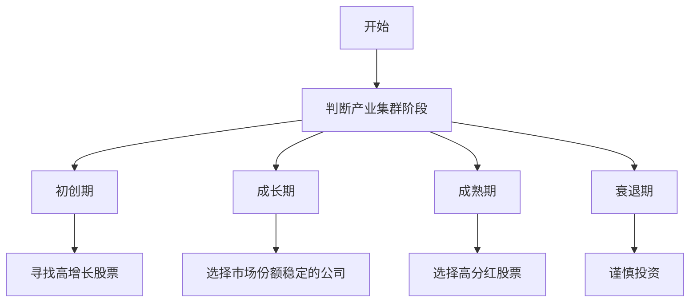
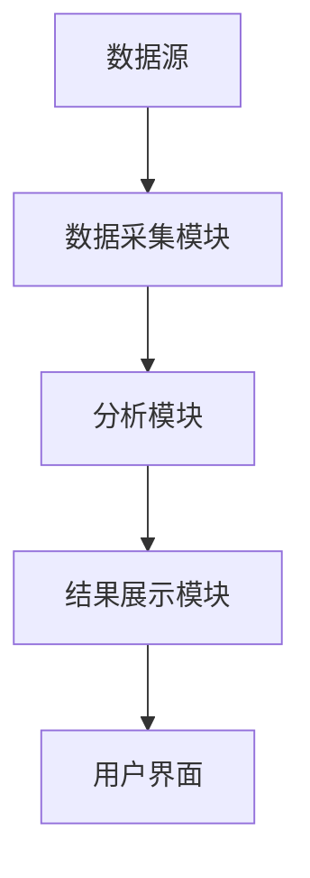
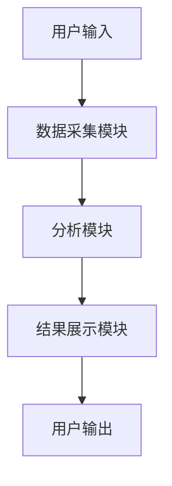

                 


# 格雷厄姆特价股票策略在不同产业集群生命周期的效果

## 关键词：格雷厄姆策略、价值投资、产业集群、生命周期、股票投资

## 摘要：本文探讨了格雷厄姆的价值投资策略在不同产业集群生命周期中的应用效果，通过分析产业集群的生命周期阶段，结合数学模型和算法，提出了一种有效的股票筛选方法，并通过实际案例验证了策略的有效性。

---

## 第一部分：背景介绍

### 第1章：价值投资与格雷厄姆策略概述

#### 1.1 价值投资的基本概念
- 价值投资是一种以基本面分析为基础的投资策略，强调寻找市场价格低于其内在价值的证券。
- 格雷厄姆的投资理念强调安全边际和长期价值，主张以低于内在价值的价格买入优质股票。

#### 1.2 产业集群生命周期的基本概念
- 产业集群是指在特定区域内，相关企业和机构聚集形成的经济现象，具有规模效应和协同效应。
- 产业集群的生命周期分为初创期、成长期、成熟期和衰退期四个阶段，每个阶段的特征和投资策略不同。

#### 1.3 格雷厄姆策略与产业集群的结合
- 产业集群的生命周期影响企业的成长性和盈利能力，适合应用格雷厄姆的低估策略。
- 不同阶段的产业集群适合不同的投资策略，结合生命周期阶段选择合适的股票。

---

## 第二部分：核心概念与联系

### 第2章：价值投资与产业集群的理论基础

#### 2.1 核心概念的原理
- 格雷厄姆策略的核心是寻找市场价格低于内在价值的股票，内在价值计算公式为：
  $$ V = \frac{E}{\sum \text{永续年金}} $$
  其中，E是企业的未来现金流，永续年金是贴现率。

- 产业集群生命周期的阶段特征：
  - 初创期：高风险，高增长潜力。
  - 成长期：增长稳定，企业规模扩大。
  - 成熟期：增长放缓，企业利润稳定。
  - 衰退期：企业盈利能力下降，风险增加。

#### 2.2 核心概念的属性特征对比

| 特性           | 价值投资                     | 产业集群生命周期           |
|----------------|------------------------------|--------------------------|
| 核心目标       | 寻找低估股票                 | 产业集群的发展阶段         |
| 时间跨度       | 长期投资                     | 长期阶段变化              |
| 风险承受能力   | 低风险偏好                   | 高风险在衰退期            |
| 投资策略       | 购买低于内在价值的股票       | 根据阶段选择投资标的      |

#### 2.3 概念框架的构建
- 价值投资与产业集群生命周期的关系模型：
  - 在初创期，适合投资具有高增长潜力的公司。
  - 在成长期，选择市场份额稳定的公司。
  - 在成熟期，选择高分红、低估值的公司。
  - 在衰退期，谨慎选择，避免高风险。

- 模型的数学表达：
  $$ \text{投资价值} = \text{内在价值} \times \text{生命周期阶段调整系数} $$

---

## 第三部分：算法原理讲解

### 第3章：格雷厄姆策略的算法原理

#### 3.1 格雷厄姆策略的核心算法
- 内在价值计算：
  $$ V = \frac{E}{r} $$
  其中，E是未来现金流，r是贴现率。
- 安全边际计算：
  $$ \text{安全边际} = V - P $$
  其中，P是市场价格，安全边际为正时适合买入。

#### 3.2 产业集群生命周期的分析算法
- 初创期判断：
  - 企业收入增长率高，利润波动大。
- 成长期判断：
  - 收入稳定增长，市场份额扩大。
- 成熟期判断：
  - 收入增长放缓，利润稳定。
- 衰退期判断：
  - 收入下降，利润减少。

#### 3.3 算法流程图


---

## 第四部分：系统分析与架构设计

### 第4章：系统架构设计方案

#### 4.1 问题场景介绍
- 问题：如何在不同产业集群阶段应用格雷厄姆策略筛选股票。
- 解决方案：构建一个系统，根据产业集群阶段筛选股票，并计算其内在价值和安全边际。

#### 4.2 系统功能设计
- 数据采集模块：收集企业财务数据和产业集群信息。
- 分析模块：判断产业集群阶段，计算股票内在价值。
- 结果展示模块：显示符合条件的股票列表和投资建议。

#### 4.3 系统架构设计


#### 4.4 系统接口设计
- 数据接口：从数据库获取企业数据。
- 分析接口：判断产业集群阶段，计算价值。

#### 4.5 系统交互流程图


---

## 第五部分：项目实战

### 第5章：项目实战

#### 5.1 环境安装
- 安装Python和必要的库（pandas、numpy、scipy）。
  ```bash
  pip install pandas numpy scipy
  ```

#### 5.2 核心代码实现
- 计算内在价值和安全边际的代码：
  ```python
  import pandas as pd

  def calculate_intrinsic_value(e, r):
      return e / r

  def calculate_margin_of_safety(v, p):
      return v - p

  # 示例数据
  e = 10000000  # 未来现金流
  r = 0.10       # 贴现率
  p = 500000     # 市场价格

  v = calculate_intrinsic_value(e, r)
  mos = calculate_margin_of_safety(v, p)

  print(f"内在价值: {v:.2f}")
  print(f"安全边际: {mos:.2f}")
  ```

#### 5.3 实际案例分析
- 案例：科技产业集群处于成长期，选择市场份额稳定的公司。
- 数据分析：使用财务数据判断公司是否符合安全边际要求。
- 结果展示：筛选出符合条件的股票列表。

#### 5.4 案例总结
- 通过系统筛选，找到具有投资价值的股票。
- 根据产业集群阶段调整投资策略，提高收益。

---

## 第六部分：结论与建议

### 第6章：结论与建议

#### 6.1 研究结论
- 格雷厄姆策略在不同产业集群阶段具有良好的应用效果。
- 通过系统化的方法可以提高投资决策的准确性。

#### 6.2 投资建议
- 根据产业集群阶段选择合适的股票。
- 定期评估企业的财务状况和市场环境。
- 保持长期投资，避免短期波动影响。

#### 6.3 注意事项
- 风险提示：投资有风险，需谨慎决策。
- 数据准确性：确保数据来源可靠。
- 持续学习：关注市场变化和企业动态。

#### 6.4 拓展阅读
- 格雷厄姆《证券分析》
- 产业集群研究相关文献

---

## 总结
本文通过详细分析格雷厄姆策略在不同产业集群生命周期中的应用，结合数学模型和系统设计，为投资者提供了一种有效的股票筛选方法。通过实际案例验证了策略的有效性，为未来的投资决策提供了参考。

