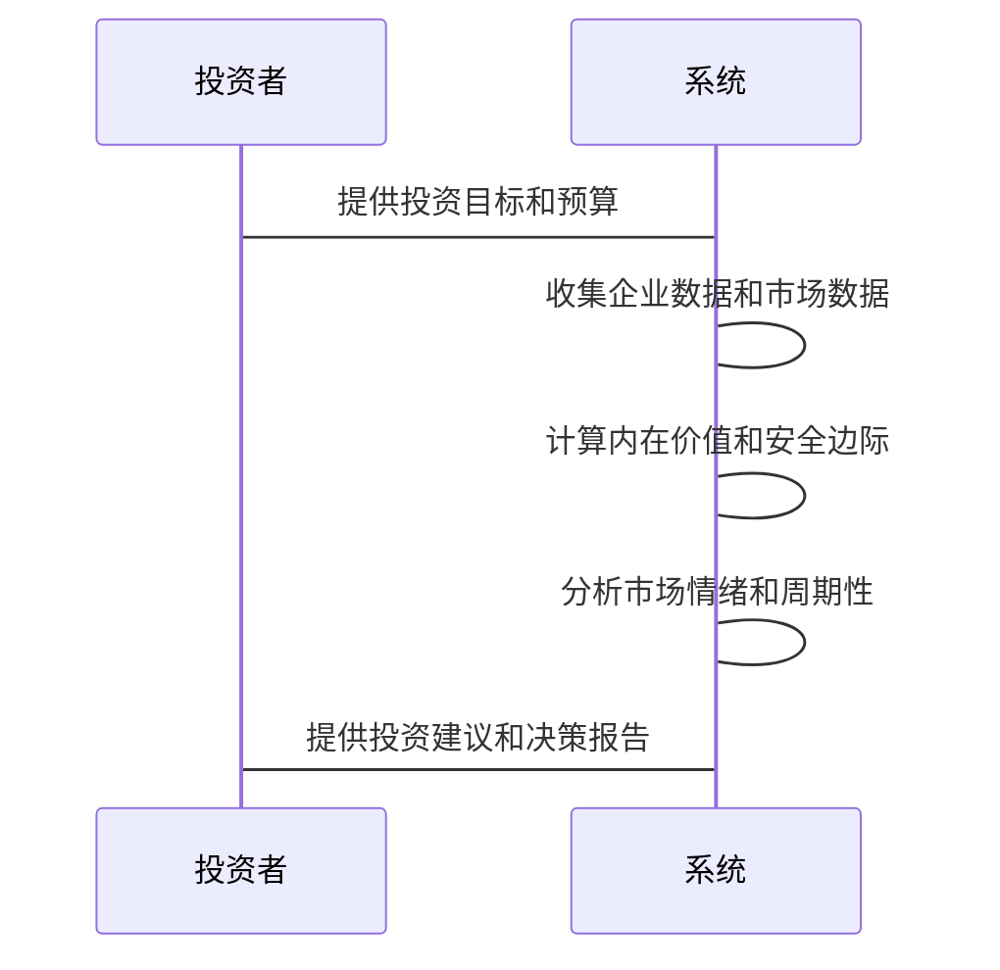

                 


# 格雷厄姆特价股票策略在不同公司文化背景下的适应

## 关键词：格雷厄姆策略、股票投资、公司文化、价值投资、跨文化适应

## 摘要：本文深入分析了格雷厄姆特价股票策略在不同公司文化背景下的适应性。通过介绍格雷厄姆投资理论的核心概念，探讨了不同文化背景下市场特征和投资者行为的差异，结合数学模型和算法原理，分析了格雷厄姆策略在跨文化环境中的适用性和调整方法，最后通过实际案例和项目实战，提供了在不同文化背景下应用格雷厄姆策略的最佳实践。

---

# 第一部分: 格雷厄姆特价股票策略的背景与核心概念

## 第1章: 格雷厄姆投资理论的起源与发展

### 1.1 格雷厄姆的生平与投资理念

本·格雷厄姆（Ben Graham）是价值投资的鼻祖，被誉为“价值投资之父”。他出生于1894年，去世于1976年，是20世纪最著名的投资者和投资思想家之一。格雷厄姆在哥伦比亚大学教授证券分析，培养了包括沃伦·巴菲特在内的众多投资大师。

格雷厄姆的投资理念的核心在于“安全边际”和“内在价值”。他认为，股票不仅仅是一个交易的工具，而是一个企业的所有权证书。投资者应该以低于企业内在价值的价格买入股票，并长期持有，直到其价值被市场充分认识到为止。

### 1.2 特价股票策略的核心思想

格雷厄姆的特价股票策略的核心思想是寻找那些市场价格远低于其内在价值的股票。他认为，市场波动性和投资者情绪会导致股票价格与实际价值出现偏差。通过分析企业的财务状况、盈利能力和未来前景，投资者可以找到那些被市场低估的股票，并从中获利。

格雷厄姆策略的关键在于“防御性投资”，即通过分散投资、严格筛选和安全边际来降低风险，确保投资组合的稳健性。

### 1.3 格雷厄姆策略的核心要素与框架

格雷厄姆策略的核心要素包括以下几个方面：

1. **内在价值**：企业未来现金流的现值，是衡量股票是否被低估的关键指标。
2. **安全边际**：购买价格与内在价值之间的差距，确保在市场波动中具有一定的缓冲空间。
3. **市场情绪**：关注市场周期和投资者情绪，避免盲目跟风。
4. **财务分析**：通过分析企业的财务报表，评估其盈利能力、资产质量和发展潜力。

### 1.4 格雷厄姆策略与传统股票策略的对比

与传统股票策略相比，格雷厄姆策略有以下特点：

- **长期视角**：格雷厄姆强调长期投资，而传统策略可能更注重短期收益。
- **价值导向**：格雷厄姆策略基于内在价值，而传统策略可能更多关注市场趋势和技术分析。
- **防御性**：格雷厄姆策略注重风险控制和安全边际，而传统策略可能更激进。

---

## 第2章: 不同文化背景下的市场特征与投资者行为

### 2.1 不同文化背景下的市场特点

不同文化背景下的市场具有显著差异，这些差异影响了股票投资的策略和效果。以下是几种主要文化背景下的市场特点：

1. **美式市场**：强调流动性、信息透明和市场效率，投资者行为较为理性。
2. **日式市场**：注重企业忠诚和长期投资，投资者行为较为保守。
3. **欧式市场**：强调社会责任和长期价值，投资者行为较为注重可持续发展。
4. **亚洲新兴市场**：市场波动性大，投资者行为较为激进。

### 2.2 不同文化背景下的投资者行为

投资者行为受到文化背景的深刻影响。例如：

- **美式市场**：投资者倾向于短期交易，注重技术分析和市场趋势。
- **日式市场**：投资者倾向于长期持有，注重企业基本面和管理层稳定性。
- **欧式市场**：投资者倾向于价值投资，注重企业社会责任和长期价值。
- **亚洲新兴市场**：投资者倾向于高风险高回报，注重市场波动和政策导向。

### 2.3 文化差异对股票估值的影响

文化差异影响了企业治理、行业特点和企业生命周期，从而对股票估值产生影响。例如：

- 在日式市场，企业忠诚和长期合作关系可能影响企业价值。
- 在欧式市场，企业社会责任和可持续发展可能影响企业的市场形象和估值。

---

## 第3章: 格雷厄姆策略的数学模型与算法原理

### 3.1 格雷厄姆策略的核心公式

格雷厄姆策略的核心公式是内在价值的计算公式：

$$ V = \frac{E}{P} $$

其中，$V$ 是内在价值，$E$ 是企业未来现金流的现值，$P$ 是折现率。

### 3.2 格雷厄姆策略的算法流程

以下是格雷厄姆策略的算法流程：

1. 收集企业的财务数据，包括收入、利润、现金流等。
2. 评估企业的未来现金流，计算其现值。
3. 确定合适的折现率，计算内在价值。
4. 比较市场价格与内在价值，寻找被低估的股票。
5. 考虑市场情绪和周期性，调整投资策略。

### 3.3 算法的实现与优化

以下是一个简单的Python代码示例，用于计算内在价值：

```python
def calculate_intrinsic_value(enterprise_value, discount_rate):
    # 计算未来现金流的现值
    present_value = enterprise_value / (1 + discount_rate)
    return present_value

# 示例数据
enterprise_value = 1000000
discount_rate = 0.05

intrinsic_value = calculate_intrinsic_value(enterprise_value, discount_rate)
print(f"内在价值: ${intrinsic_value:.2f}")
```

### 3.4 格雷厄姆策略的跨文化适应性

在不同文化背景下，格雷厄姆策略需要进行适当的调整。例如：

- 在新兴市场，可能需要更加注重企业的增长潜力和市场扩展能力。
- 在成熟市场，可能需要更加注重企业的盈利稳定性和分红能力。

---

## 第4章: 格雷厄姆策略在不同文化背景下的适应性分析

### 4.1 美式市场的适应性

在美式市场，格雷厄姆策略需要考虑市场的高效性和流动性。投资者需要更加注重企业的内在价值和安全边际，避免被短期市场波动所影响。

### 4.2 日式市场的适应性

在日式市场，格雷厄姆策略需要考虑企业忠诚和长期合作关系。投资者可能需要更加注重企业的管理层稳定性和企业治理结构。

### 4.3 欧式市场的适应性

在欧式市场，格雷厄姆策略需要考虑企业的社会责任和可持续发展。投资者可能需要更加注重企业的环保和社会责任表现。

### 4.4 亚洲新兴市场的适应性

在亚洲新兴市场，格雷厄姆策略需要考虑市场的波动性和政策风险。投资者可能需要更加注重企业的增长潜力和市场扩展能力。

---

## 第5章: 格雷厄姆策略的系统分析与架构设计

### 5.1 系统架构设计

以下是格雷厄姆策略的系统架构设计：

1. 数据采集模块：收集企业的财务数据和市场数据。
2. 财务分析模块：计算企业的内在价值和安全边际。
3. 市场分析模块：分析市场情绪和周期性。
4. 投资决策模块：根据分析结果制定投资策略。

### 5.2 系统交互设计

以下是系统的交互流程图：



---

## 第6章: 项目实战与最佳实践

### 6.1 项目实战

以下是一个Python项目实战的代码示例：

```python
import pandas as pd
import numpy as np

# 数据加载
data = pd.read_csv('stock_data.csv')

# 计算内在价值
def calculate_intrinsic_value(row):
    enterprise_value = row['enterprise_value']
    discount_rate = 0.05
    intrinsic_value = enterprise_value / (1 + discount_rate)
    return intrinsic_value

data['intrinsic_value'] = data.apply(calculate_intrinsic_value, axis=1)

# 找出被低估的股票
data['is_undervalued'] = data['price'] < data['intrinsic_value']

print(data[['price', 'intrinsic_value', 'is_undervalued']])
```

### 6.2 最佳实践

1. 在不同文化背景下，投资者需要根据市场特点调整格雷厄姆策略。
2. 需要结合企业的具体情况进行分析，避免过于依赖单一指标。
3. 要注重风险控制和安全边际，确保投资组合的稳健性。

---

## 第7章: 结论与展望

### 7.1 结论

格雷厄姆特价股票策略在不同文化背景下具有较强的适应性，但需要根据市场特点和投资者行为进行适当的调整。通过结合企业的内在价值和市场情绪，投资者可以更好地把握投资机会，实现长期稳健的投资收益。

### 7.2 未来展望

未来，随着全球化的深入和市场的多样化，格雷厄姆策略在跨文化背景下的应用将更加广泛。投资者需要不断学习和适应新的市场环境，提升自身的投资能力。

---

## 参考文献

1. 本·格雷厄姆. 《证券分析》
2. 巴菲特. 《致股东的信》
3. 纳西姆·尼古拉斯. 《黑天鹅》
4. 约翰·坦皮恩. 《投资中最简单的事》

