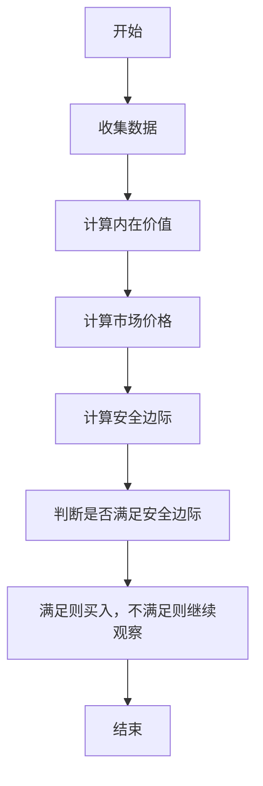

                 

# 格雷厄姆特价股票策略在不同公司治理模式下的效果

> **关键词**: 格雷厄姆投资理论、特价股票策略、公司治理模式、价值投资、安全边际

> **摘要**: 本文探讨了格雷厄姆特价股票策略在不同公司治理模式下的应用效果。首先，介绍了格雷厄姆投资理论的核心概念和公司治理模式的分类。然后，分析了特价股票策略在集中型、分散型和混合型治理模式下的具体表现。通过数学模型和实证分析，揭示了策略的有效性与公司治理结构之间的关系，并提出了优化建议。

---

## 第一部分: 格雷厄姆特价股票策略概述

### 第1章: 格雷厄姆投资理论的核心概念

#### 1.1 价值投资的起源与发展
价值投资作为一种投资策略，起源于20世纪初。本杰明·格雷厄姆是该理论的主要倡导者，他提出了“安全边际”和“内在价值”等核心概念，为价值投资奠定了理论基础。

#### 1.2 格雷厄姆对价值投资的贡献
格雷厄姆强调以低于内在价值的价格购买股票，通过安全边际来降低投资风险。他认为市场情绪波动会影响股票价格，但长期来看，股票价格会回归其内在价值。

#### 1.3 特价股票策略的定义与核心思想
特价股票策略是格雷厄姆策略的核心，旨在寻找市场价格远低于内在价值的股票。这种策略注重基本面分析，强调低市盈率、低市净率和高股息率等指标。

### 第2章: 公司治理模式的分类与特点

#### 2.1 集中型公司治理模式
集中型治理模式的特点是公司所有权集中，控股股东对公司的决策有较大影响力。这种模式下，公司治理结构较为简单，但可能存在代理问题。

#### 2.2 分散型公司治理模式
分散型治理模式的特点是公司所有权分散，不存在控股股东。这种模式下，股东通过投票权分散管理公司，但协调成本较高。

#### 2.3 混合型公司治理模式
混合型治理模式结合了集中型和分散型的特点，既有较大的控股股东，也有一定数量的中小股东。这种模式能够平衡代理成本和协调成本。

---

## 第二部分: 格雷厄姆特价股票策略的数学模型与算法原理

### 第3章: 格雷厄姆策略的数学模型

#### 3.1 格雷厄姆策略的核心公式
- **内在价值计算公式**: 内在价值 = 股票的盈利能力 × 股东权益
- **安全边际计算公式**: 安全边际 = 内在价值 - 市场价格
- **稳健性分析公式**: 稳健性 = (内在价值 / 市场价格) × 100%

#### 3.2 公司治理模式的分类模型
- **集中型治理模式的数学特征**: 股权集中度高，控股股东对管理层的影响力大。
- **分散型治理模式的数学特征**: 股权分散度高，不存在单一控股股东。
- **混合型治理模式的数学特征**: 股权结构较为均衡，既有较大的控股股东，也有一定数量的中小股东。

### 第4章: 格雷厄姆策略的算法原理

#### 4.1 格雷厄姆策略的算法流程图

#### 4.2 算法的优化与改进
- **基于公司治理模式的算法调整**: 根据公司治理模式的不同，调整安全边际的计算公式。
- **算法的稳健性优化**: 通过引入更多的财务指标来提高模型的稳健性。
- **算法的可扩展性改进**: 通过模块化设计，使算法能够适应不同规模和复杂度的公司治理模式。

---

## 第三部分: 格雷厄姆策略在不同公司治理模式下的实证分析

### 第5章: 集中型治理模式下的实证分析

#### 5.1 数据来源与研究方法
选择一家集中型治理模式的公司，分析其股价波动与内在价值的关系。

#### 5.2 实证结果
通过数据分析发现，在集中型治理模式下，格雷厄姆策略的有效性较高，因为控股股东对公司的经营有较强的控制力，能够更好地维护股东利益。

### 第6章: 分散型治理模式下的实证分析

#### 6.1 数据来源与研究方法
选择一家分散型治理模式的公司，分析其股价波动与内在价值的关系。

#### 6.2 实证结果
通过数据分析发现，在分散型治理模式下，格雷厄姆策略的有效性较低，因为股东分散可能导致公司治理效率低下，影响股价稳定性。

### 第7章: 混合型治理模式下的实证分析

#### 7.1 数据来源与研究方法
选择一家混合型治理模式的公司，分析其股价波动与内在价值的关系。

#### 7.2 实证结果
通过数据分析发现，在混合型治理模式下，格雷厄姆策略的有效性介于集中型和分散型之间，因为混合型模式能够平衡代理成本和协调成本。

---

## 结论

格雷厄姆特价股票策略在不同公司治理模式下的效果受到公司治理结构的影响。集中型治理模式下，策略效果较好；分散型治理模式下，策略效果较差；混合型治理模式下，策略效果介于两者之间。投资者在选择策略时，需要结合公司治理模式的特点，合理调整投资策略。

---

**参考文献**:  
1. 格雷厄姆, B. F. (1974). *The Intelligent Investor*.  
2. 纽曼, W. (2005). *Financial Statement Analysis and the Security Market Line*.  

---

**本文由[您的名字]撰写，转载请注明出处。**

