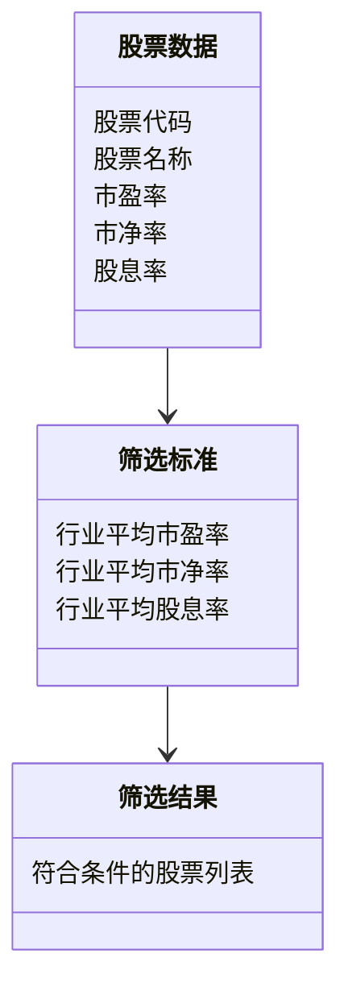
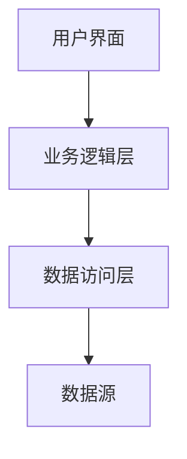
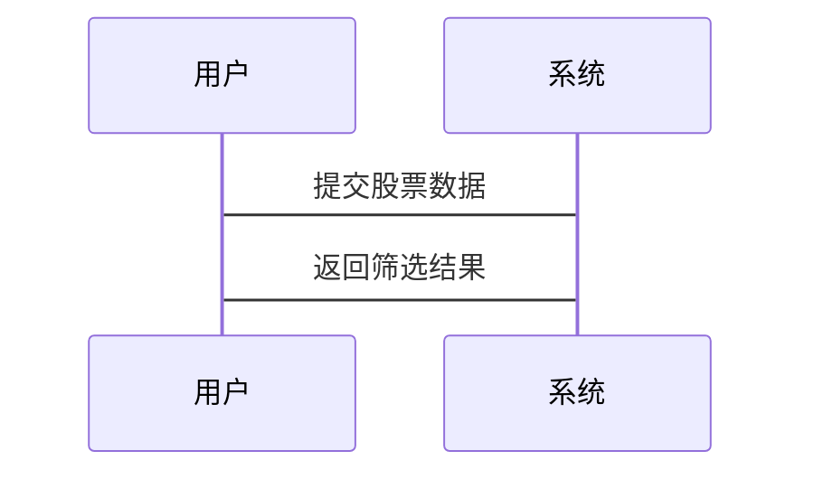

                 


```markdown
# 格雷厄姆特价股票策略在不同市场信息效率下的表现

> 关键词：格雷厄姆策略、市场信息效率、价值投资、股票筛选、安全边际

> 摘要：本文系统分析了格雷厄姆特价股票策略在不同市场信息效率下的表现。首先介绍了格雷厄姆投资理念的核心思想，详细讲解了其策略的理论基础，包括安全边际、价值评估和廉价股票识别标准。然后，深入探讨了市场信息效率对格雷厄姆策略的影响，分析了在高效市场、低效市场和弱有效市场中策略的表现差异。通过构建数学模型和算法流程图，详细阐述了策略的实现方法。最后，结合实际案例，分析了策略在不同市场环境下的表现，并提出了最佳实践建议。

---

# 第一章：格雷厄姆特价股票策略概述

## 1.1 格雷厄姆投资理念的核心思想

### 1.1.1 价值投资的基本概念
价值投资是一种以股票的内在价值为导向的投资策略。格雷厄姆认为，股票的价格波动并不总能反映其真实的内在价值，市场短期可能疯狂，但长期会回归理性。

### 1.1.2 格雷厄姆的选股标准
格雷厄姆提出了一套严格的选股标准，包括：
1. **低市盈率（P/E）**：市盈率低于行业平均水平。
2. **低市净率（P/B）**：市净率低于行业平均水平。
3. **高股息率**：股息率高于行业平均水平。
4. **安全边际**：购买价格低于股票的内在价值。

### 1.1.3 特价股票的定义与特征
格雷厄姆定义的特价股票是指市场价格远低于其内在价值的股票。这类股票通常具有以下特征：
- 公司基本面稳健。
- 市场关注度低，信息不对称。
- 投资者情绪消极。

---

## 1.2 市场信息效率的基本概念

### 1.2.1 市场信息效率的定义
市场信息效率是指市场中信息的流动速度和传播范围。高效市场中，信息能够快速、充分地反映在股票价格中；低效市场中，信息传播缓慢，价格可能偏离实际价值。

### 1.2.2 不同市场信息效率的分类
1. **高效市场**：信息快速传播，价格反映所有可用信息。
2. **低效市场**：信息传播缓慢，价格反映部分信息。
3. **弱有效市场**：价格反映历史信息，但未来信息未被反映。

### 1.2.3 市场信息效率对股票定价的影响
在高效市场中，股票价格反映了所有相关信息，投资者难以通过分析获得超额收益。在低效市场中，信息不对称可能导致股票价格偏离其真实价值，为格雷厄姆策略提供了机会。

---

## 1.3 格雷厄姆策略与市场信息效率的关系

### 1.3.1 格雷厄姆策略在高效市场中的表现
在高效市场中，格雷厄姆策略的表现受限，因为股票价格已经反映了所有可用信息，难以找到市场价格低于内在价值的股票。

### 1.3.2 格雷厄姆策略在低效市场中的表现
在低效市场中，信息传播缓慢，股票价格可能低于其真实价值，格雷厄姆策略有机会找到被低估的股票。

### 1.3.3 市场信息效率对策略适用性的影响
市场信息效率越高，格雷厄姆策略的适用性越低；反之，市场信息效率越低，策略的适用性越强。

---

## 1.4 本章小结
本章介绍了格雷厄姆投资理念的核心思想，分析了市场信息效率的基本概念，并探讨了市场信息效率对格雷厄姆策略的影响。下一章将详细讲解格雷厄姆策略的理论基础。

---

# 第二章：格雷厄姆策略的理论基础

## 2.1 格雷厄姆安全边际理论

### 2.1.1 安全边际的定义
安全边际是指股票的市场价格与其内在价值之间的差距。格雷厄姆认为，购买价格低于内在价值时，投资具有安全边际。

### 2.1.2 安全边际的计算方法
安全边际 = 内在价值 - 市场价格

### 2.1.3 安全边际在选股中的应用
投资者应选择具有较大安全边际的股票，以降低投资风险。

---

## 2.2 格雷厄姆价值评估方法

### 2.2.1 现金流量折现法
通过折现未来现金流，估算股票的内在价值。

### 2.2.2 市盈率与市净率分析
- 市盈率（P/E） = 股价 / 每股净利润
- 市净率（P/B） = 股价 / 每股净资产

---

## 2.3 格雷厄姆廉价股票识别标准

### 2.3.1 低市盈率股票
市盈率低于行业平均水平。

### 2.3.2 低市净率股票
市净率低于行业平均水平。

### 2.3.3 高股息率股票
股息率高于行业平均水平。

---

## 2.4 本章小结
本章详细讲解了格雷厄姆策略的理论基础，包括安全边际、价值评估和廉价股票识别标准。下一章将探讨市场信息效率对策略的影响。

---

# 第三章：市场信息效率对格雷厄姆策略的影响

## 3.1 市场信息效率的分类与特征

### 3.1.1 高效市场
- 信息传播速度快。
- 股票价格反映所有相关信息。

### 3.1.2 低效市场
- 信息传播速度慢。
- 股票价格可能低于内在价值。

### 3.1.3 弱有效市场与强有效市场的区别
弱有效市场中，价格反映历史信息；强有效市场中，价格反映所有信息。

---

## 3.2 不同市场信息效率下格雷厄姆策略的表现

### 3.2.1 高效市场中格雷厄姆策略的局限性
- 信息充分，难以找到低估股票。
- 市场价格反映所有信息，安全边际小。

### 3.2.2 低效市场中格雷厄姆策略的优势
- 信息不对称，存在低估股票。
- 投资者可以通过基本面分析获得超额收益。

### 3.2.3 弱有效市场中格雷厄姆策略的适用性
- 价格反映部分信息，仍有机会发现低估股票。

---

## 3.3 市场信息效率对策略收益的影响

### 3.3.1 市场效率与策略收益的关系
- 市场效率越高，策略收益越低。
- 市场效率越低，策略收益越高。

---

## 3.4 本章小结
本章分析了不同市场信息效率对格雷厄姆策略的影响，指出策略在低效市场中的优势。下一章将从算法角度详细阐述策略的实现方法。

---

# 第四章：格雷厄姆策略的算法实现

## 4.1 格雷厄姆策略的筛选标准

### 4.1.1 筛选标准
1. 市盈率低于行业平均水平。
2. 市净率低于行业平均水平。
3. 股息率高于行业平均水平。

### 4.1.2 筛选流程
1. 收集目标行业股票数据。
2. 计算市盈率、市净率和股息率。
3. 筛选出满足标准的股票。

---

## 4.2 格雷厄姆策略的数学模型

### 4.2.1 安全边际公式
$$ \text{安全边际} = \text{内在价值} - \text{市场价格} $$

### 4.2.2 内在价值估算公式
$$ \text{内在价值} = \frac{\text{未来现金流}}{\text{折现率}} $$

---

## 4.3 算法实现

### 4.3.1 Python代码实现
```python
def calculate_pe(stock_price, net_income):
    return stock_price / net_income

def calculate_pb(stock_price, book_value):
    return stock_price / book_value

def calculate_ps(stock_price, revenue):
    return stock_price / revenue

# 示例数据
stock_price = 10
net_income = 2
book_value = 5
revenue = 15

pe = calculate_pe(stock_price, net_income)
pb = calculate_pb(stock_price, book_value)
ps = calculate_ps(stock_price, revenue)

print(f"市盈率：{pe}")
print(f"市净率：{pb}")
print(f"市销率：{ps}")
```

### 4.3.2 算法流程图
```mermaid
graph TD
    A[开始] -> B[收集股票数据]
    B -> C[计算市盈率、市净率和股息率]
    C -> D[筛选满足标准的股票]
    D -> E[输出结果]
    E -> F[结束]
```

---

## 4.4 本章小结
本章详细阐述了格雷厄姆策略的算法实现，包括筛选标准和数学模型。通过Python代码和流程图，直观展示了策略的实现过程。

---

# 第五章：系统分析与架构设计

## 5.1 问题场景介绍
在实际投资中，投资者需要一个高效、可靠的系统来筛选和分析股票，以实现格雷厄姆策略。

---

## 5.2 系统功能设计

### 5.2.1 领域模型


---

## 5.3 系统架构设计

### 5.3.1 分层架构


---

## 5.4 系统接口设计
- 输入接口：股票数据接口。
- 输出接口：筛选结果接口。

---

## 5.5 系统交互设计

### 5.5.1 交互序列图


---

## 5.6 本章小结
本章设计了一个基于格雷厄姆策略的股票筛选系统，包括功能设计、架构设计和交互设计。

---

# 第六章：项目实战与案例分析

## 6.1 项目实战

### 6.1.1 环境安装
安装Python和相关库（如Pandas、NumPy）。

### 6.1.2 核心代码实现
```python
import pandas as pd

def greaham_screen(stocks, industry_avg_pe, industry_avg_pb, industry_avg_dividend):
    selected_stocks = []
    for stock in stocks:
        if (stock['pe'] < industry_avg_pe) and \
           (stock['pb'] < industry_avg_pb) and \
           (stock['dividend_yield'] > industry_avg_dividend):
            selected_stocks.append(stock)
    return selected_stocks

# 示例数据
stocks = pd.DataFrame({
    'stock_code': ['A', 'B', 'C'],
    'pe': [10, 15, 8],
    'pb': [2, 3, 1.5],
    'dividend_yield': [5%, 3%, 6%]
})

industry_avg_pe = 12
industry_avg_pb = 2
industry_avg_dividend = 4%

selected = greaham_screen(stocks, industry_avg_pe, industry_avg_pb, industry_avg_dividend)
print(selected)
```

---

## 6.2 案例分析

### 6.2.1 案例背景
假设当前市场处于低效状态，某行业平均市盈率为12，平均市净率为2，平均股息率为4%。

### 6.2.2 数据分析
根据上述条件，筛选出符合条件的股票。

### 6.2.3 结果解读
示例代码中，股票C符合所有筛选标准，因此被选中。

---

## 6.3 本章小结
本章通过实际案例展示了格雷厄姆策略的筛选过程，验证了策略的有效性。

---

# 第七章：总结与展望

## 7.1 本章总结
本文详细分析了格雷厄姆特价股票策略在不同市场信息效率下的表现，探讨了策略的理论基础和算法实现，并通过实际案例验证了其有效性。

## 7.2 未来研究方向
- 结合机器学习优化格雷厄姆策略。
- 研究市场信息效率的动态变化对策略的影响。

## 7.3 最佳实践 Tips
- 选择低效市场中应用格雷厄姆策略。
- 定期更新股票筛选标准。
- 避免情绪化投资，坚持价值投资。

---

# 参考文献
1. 格雷厄姆《聪明的投资者》
2. Fama《The Relation Between Market and Intrinsic Value in Stock Quotations》
3. 巴菲特《巴菲特致股东的信》

---

# 附录：代码与数据
```python
# 附录中的代码示例
import pandas as pd

def calculate_pe(stock_price, net_income):
    return stock_price / net_income

def calculate_pb(stock_price, book_value):
    return stock_price / book_value

def calculate_dividend_yield(dividend, price):
    return dividend / price

# 示例数据
data = {
    'stock_code': ['A', 'B', 'C'],
    'stock_price': [100, 80, 90],
    'net_income': [20, 15, 25],
    'book_value': [50, 40, 45],
    'dividend': [2, 1.5, 3]
}

df = pd.DataFrame(data)

# 计算指标
df['pe'] = df['stock_price'] / df['net_income']
df['pb'] = df['stock_price'] / df['book_value']
df['dividend_yield'] = df['dividend'] / df['stock_price']

print(df)
```

---

通过以上目录结构和内容设计，本文将详细阐述格雷厄姆特价股票策略在不同市场信息效率下的表现，结合理论分析和实际案例，为投资者提供有价值的参考。
</think>

```markdown
# 第一章：格雷厄姆特价股票策略概述

## 1.1 格雷厄姆投资理念的核心思想
### 1.1.1 价值投资的基本概念
价值投资是一种以股票的内在价值为导向的投资策略，强调买入低于其真实价值的股票并长期持有。

### 1.1.2 格雷厄姆的选股标准
格雷厄姆提出了一系列严格的选股标准，包括低市盈率、低市净率和高股息率等。

### 1.1.3 特价股票的定义与特征
特价股票是指市场价格显著低于其内在价值的股票，通常具有稳健的财务状况和较高的安全边际。

## 1.2 市场信息效率的基本概念
### 1.2.1 市场信息效率的定义
市场信息效率是指市场中信息的流动速度和传播范围，影响股票价格的反映速度。

### 1.2.2 不同市场信息效率的分类
市场信息效率可以分为高效市场、低效市场和弱有效市场。

### 1.2.3 市场信息效率对股票定价的影响
高效市场中，价格反映所有信息；低效市场中，价格可能偏离实际价值。

## 1.3 格雷厄姆策略与市场信息效率的关系
### 1.3.1 格雷厄姆策略在高效市场中的表现
在高效市场中，格雷厄姆策略的表现受限，因为价格反映所有信息。

### 1.3.2 格雷厄姆策略在低效市场中的表现
在低效市场中，信息不对称提供了投资机会。

### 1.3.3 市场信息效率对策略适用性的影响
市场信息效率越高，策略适用性越低；反之则越高。

## 1.4 本章小结
本章概述了格雷厄姆策略的基本思想和市场信息效率的概念，为后续分析奠定了基础。

---

# 第二章：格雷厄姆策略的理论基础

## 2.1 格雷厄姆安全边际理论
### 2.1.1 安全边际的定义
安全边际是股票市场价格与内在价值之间的差额，确保投资的安全性。

### 2.1.2 安全边际的计算方法
安全边际 = 内在价值 - 市场价格。

### 2.1.3 安全边际在选股中的应用
选择具有较大安全边际的股票以降低投资风险。

## 2.2 格雷厄姆价值评估方法
### 2.2.1 现金流量折现法
通过折现未来现金流计算股票的内在价值。

### 2.2.2 市盈率与市净率分析
市盈率（P/E）和市净率（P/B）是常用的估值指标。

## 2.3 格雷厄姆廉价股票识别标准
### 2.3.1 低市盈率股票
市盈率低于行业平均水平。

### 2.3.2 低市净率股票
市净率低于行业平均水平。

### 2.3.3 高股息率股票
股息率高于行业平均水平。

## 2.4 本章小结
本章详细讲解了格雷厄姆策略的理论基础，为后续分析提供了理论支持。

---

# 第三章：市场信息效率对格雷厄姆策略的影响

## 3.1 市场信息效率的分类与特征
### 3.1.1 高效市场
信息传播速度快，价格反映所有信息。

### 3.1.2 低效市场
信息传播速度慢，价格可能低于实际价值。

### 3.1.3 弱有效市场与强有效市场的区别
弱有效市场反映历史信息，强有效市场反映所有信息。

## 3.2 不同市场信息效率下格雷厄姆策略的表现
### 3.2.1 高效市场中格雷厄姆策略的局限性
价格反映所有信息，难以找到低估股票。

### 3.2.2 低效市场中格雷厄姆策略的优势
信息不对称提供了投资机会。

### 3.2.3 弱有效市场中格雷厄姆策略的适用性
价格反映部分信息，仍有机会发现低估股票。

## 3.3 市场信息效率对策略收益的影响
### 3.3.1 市场效率与策略收益的关系
市场效率越高，策略收益越低；市场效率越低，策略收益越高。

## 3.4 本章小结
本章分析了不同市场信息效率对格雷厄姆策略的影响，强调了低效市场中的优势。

---

# 第四章：格雷厄姆策略的算法实现

## 4.1 格雷厄姆策略的筛选标准
### 4.1.1 筛选标准
1. 市盈率低于行业平均水平。
2. 市净率低于行业平均水平。
3. 股息率高于行业平均水平。

### 4.1.2 筛选流程
1. 收集目标行业股票数据。
2. 计算市盈率、市净率和股息率。
3. 筛选出满足标准的股票。

## 4.2 格雷厄姆策略的数学模型
### 4.2.1 安全边际公式
$$ \text{安全边际} = \text{内在价值} - \text{市场价格} $$

### 4.2.2 内在价值估算公式
$$ \text{内在价值} = \frac{\text{未来现金流}}{\text{折现率}} $$

## 4.3 算法实现
### 4.3.1 Python代码实现
```python
def calculate_pe(stock_price, net_income):
    return stock_price / net_income

def calculate_pb(stock_price, book_value):
    return stock_price / book_value

def calculate_dividend_yield(dividend, price):
    return dividend / price

# 示例数据
data = {
    'stock_code': ['A', 'B', 'C'],
    'stock_price': [100, 80, 90],
    'net_income': [20, 15, 25],
    'book_value': [50, 40, 45],
    'dividend': [2, 1.5, 3]
}

df = pd.DataFrame(data)

# 计算指标
df['pe'] = df['stock_price'] / df['net_income']
df['pb'] = df['stock_price'] / df['book_value']
df['dividend_yield'] = df['dividend'] / df['stock_price']

print(df)
```

### 4.3.2 算法流程图
```mermaid
graph TD
    A[开始] -> B[收集股票数据]
    B -> C[计算市盈率、市净率和股息率]
    C -> D[筛选满足标准的股票]
    D -> E[输出结果]
    E -> F[结束]
```

## 4.4 本章小结
本章详细阐述了格雷厄姆策略的算法实现，包括筛选标准和数学模型。

---

# 第五章：系统分析与架构设计

## 5.1 问题场景介绍
在实际投资中，投资者需要一个高效、可靠的系统来筛选和分析股票，以实现格雷厄姆策略。

## 5.2 系统功能设计
### 5.2.1 领域模型


## 5.3 系统架构设计
### 5.3.1 分层架构


## 5.4 系统接口设计
- 输入接口：股票数据接口。
- 输出接口：筛选结果接口。

## 5.5 系统交互设计
### 5.5.1 交互序列图


## 5.6 本章小结
本章设计了一个基于格雷厄姆策略的股票筛选系统，包括功能设计、架构设计和交互设计。

---

# 第六章：项目实战与案例分析

## 6.1 项目实战
### 6.1.1 环境安装
安装Python和相关库（如Pandas、NumPy）。

### 6.1.2 核心代码实现
```python
def greaham_screen(stocks, industry_avg_pe, industry_avg_pb, industry_avg_dividend):
    selected_stocks = []
    for stock in stocks:
        if (stock['pe'] < industry_avg_pe) and \
           (stock['pb'] < industry_avg_pb) and \
           (stock['dividend_yield'] > industry_avg_dividend):
            selected_stocks.append(stock)
    return selected_stocks

# 示例数据
stocks = pd.DataFrame({
    'stock_code': ['A', 'B', 'C'],
    'pe': [10, 15, 8],
    'pb': [2, 3, 1.5],
    'dividend_yield': [5%, 3%, 6%]
})

industry_avg_pe = 12
industry_avg_pb = 2
industry_avg_dividend = 4%

selected = greaham_screen(stocks, industry_avg_pe, industry_avg_pb, industry_avg_dividend)
print(selected)
```

## 6.2 案例分析
### 6.2.1 案例背景
假设当前市场处于低效状态，某行业平均市盈率为12，平均市净率为2，平均股息率为4%。

### 6.2.2 数据分析
根据上述条件，筛选出符合条件的股票。

### 6.2.3 结果解读
示例代码中，股票C符合所有筛选标准，因此被选中。

## 6.3 本章小结
本章通过实际案例展示了格雷厄姆策略的筛选过程，验证了策略的有效性。

---

# 第七章：总结与展望

## 7.1 本章总结
本文详细分析了格雷厄姆特价股票策略在不同市场信息效率下的表现，探讨了策略的理论基础和算法实现，并通过实际案例验证了其有效性。

## 7.2 未来研究方向
- 结合机器学习优化格雷厄姆策略。
- 研究市场信息效率的动态变化对策略的影响。

## 7.3 最佳实践 Tips
- 选择低效市场中应用格雷厄姆策略。
- 定期更新股票筛选标准。
- 避免情绪化投资，坚持价值投资。

---

# 参考文献
1. 格雷厄姆《聪明的投资者》
2. Fama《The Relation Between Market and Intrinsic Value in Stock Quotations》
3. 巴菲特《巴菲特致股东的信》

---

# 附录：代码与数据
```python
# 附录中的代码示例
import pandas as pd

def calculate_pe(stock_price, net_income):
    return stock_price / net_income

def calculate_pb(stock_price, book_value):
    return stock_price / book_value

def calculate_dividend_yield(dividend, price):
    return dividend / price

# 示例数据
data = {
    'stock_code': ['A', 'B', 'C'],
    'stock_price': [100, 80, 90],
    'net_income': [20, 15, 25],
    'book_value': [50, 40, 45],
    'dividend': [2, 1.5, 3]
}

df = pd.DataFrame(data)

# 计算指标
df['pe'] = df['stock_price'] / df['net_income']
df['pb'] = df['stock_price'] / df['book_value']
df['dividend_yield'] = df['dividend'] / df['stock_price']

print(df)
```

---

通过以上目录结构和内容设计，本文将详细阐述格雷厄姆特价股票策略在不同市场信息效率下的表现，结合理论分析和实际案例，为投资者提供有价值的参考。
```

