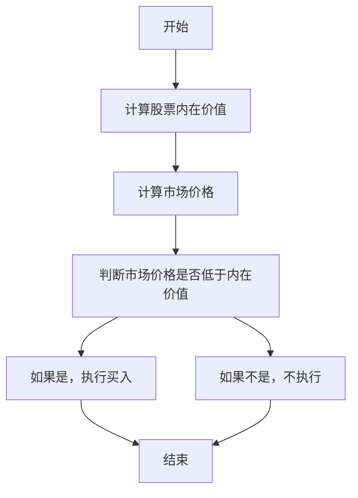
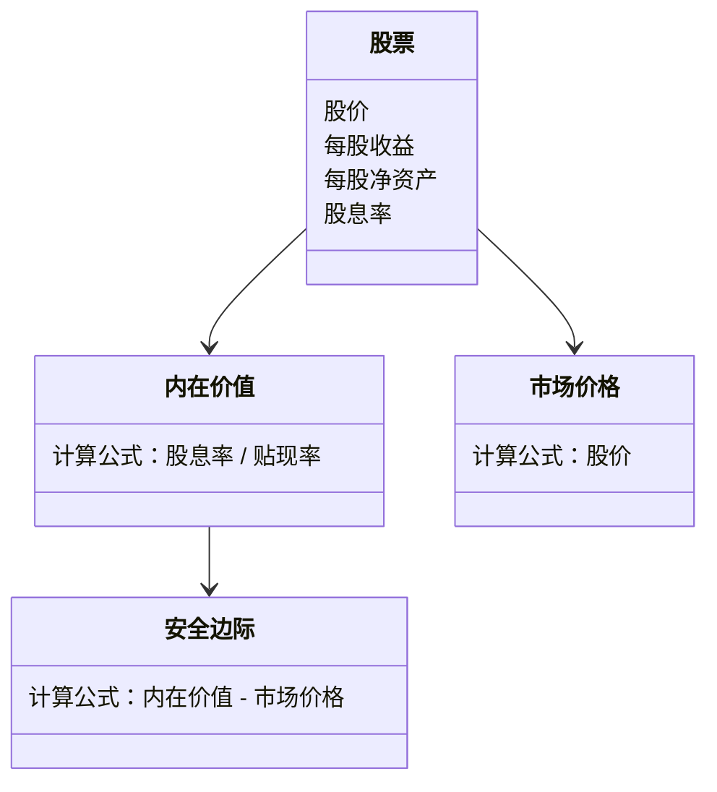
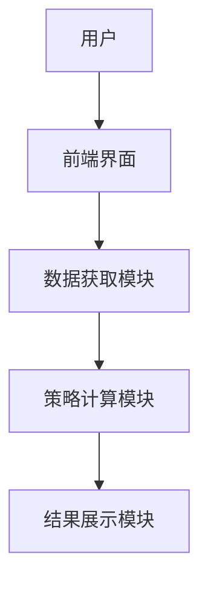

                 


# 格雷厄姆特价股票策略在不同市场微观结构下的效果

## 关键词
格雷厄姆投资，价值投资，特价股票策略，市场微观结构，股票交易机制，高频交易，投资算法

## 摘要
本文深入分析了格雷厄姆特价股票策略在不同市场微观结构下的应用效果。首先介绍了格雷厄姆的投资理念及其特价股票策略的核心要素，包括安全边际和内在价值的概念。接着探讨了市场微观结构对策略效果的影响，分析了有效市场、新兴市场和高频交易环境下的策略表现。通过构建数学模型和算法，详细阐述了格雷厄姆策略的实现过程，并通过实际案例验证了策略的有效性。最后，提出了优化建议和未来研究方向。

---

# 第一部分: 格雷厄姆投资理念与特价股票策略

## 第1章: 格雷厄姆投资理念与特价股票策略

### 1.1 格雷厄姆投资理念的核心思想

#### 1.1.1 价值投资的定义与核心要素
- **价值投资**：一种以低于内在价值的价格买入优质股票的投资策略，核心在于寻找市场低估的股票。
- **核心要素**：
  1. 安全边际：买入价格低于内在价值，确保安全性和收益性。
  2. 内在价值：股票的真实价值，通过基本面分析计算得出。
  3. 长期视角：关注长期投资回报，而非短期价格波动。

#### 1.1.2 格雷厄姆对安全边际的理解
- **安全边际**：买入价格与内在价值之间的差距，确保即使市场波动，投资者也能获得正收益。
- **计算公式**：
  $$ 安全边际 = 内在价值 - 市场价格 $$
  - 如果安全边际为正，说明股票被低估，值得买入。

#### 1.1.3 格雷厄姆的选股标准与策略
- **选股标准**：
  1. 低市盈率（P/E比率）：市盈率低于市场平均水平。
  2. 低市净率（P/B比率）：市净率低于市场平均水平。
  3. 高股息率：股息率高于市场平均水平。
- **策略**：通过筛选符合上述标准的股票，构建投资组合，分散风险。

### 1.2 特价股票策略的定义与特点

#### 1.2.1 特价股票的定义
- **特价股票**：市场价格显著低于内在价值的股票，通常被市场低估。
- **特点**：
  1. 低估值：市盈率、市净率等指标低于行业平均水平。
  2. 高股息率：股息率高，回报稳定。
  3. 高质量：公司基本面良好，具有持续盈利能力。

#### 1.2.2 特价股票与市场估值的关系
- **市场估值**：市场对股票的估值，通常与公司基本面相关。
- **关系**：
  - 当市场估值过低时，股票可能被低估，成为特价股票。
  - 当市场估值过高时，股票可能被高估，不适合投资。

#### 1.2.3 格雷厄姆策略在现代投资中的应用
- **现代应用**：
  - 结合技术分析：通过技术指标筛选潜在的特价股票。
  - 结合量化分析：利用算法筛选符合格雷厄姆标准的股票。

---

## 第2章: 市场微观结构与股票交易机制

### 2.1 市场微观结构的核心概念

#### 2.1.1 市场参与者的角色与行为
- **市场参与者**：
  - 投资者：机构投资者和个人投资者。
  - 交易员：负责执行交易。
  - 做市商：提供流动性，撮合交易。
- **行为特征**：
  - 理性投资者：根据信息理性决策。
  - 非理性投资者：受情绪影响，可能导致市场波动。

#### 2.1.2 市场深度与流动性
- **市场深度**：订单簿中待成交的订单数量。
- **流动性**：交易的买卖价差和成交时间。
- **影响**：流动性高的市场，交易成本低，价格波动小。

#### 2.1.3 市场微观结构对股票价格的影响
- **影响机制**：
  - 买卖价差：买价与卖价之间的差额。
  - 成交量：影响价格波动。
  - 市场深度：影响交易成本。

### 2.2 市场订单簿与交易机制

#### 2.2.1 市场订单簿的结构
- **订单簿**：记录所有待成交的订单。
- **结构**：
  - 买方订单：买入价格和数量。
  - 卖方订单：卖出价格和数量。
  - 最优价：当前最优买入和卖出价格。

#### 2.2.2 市场微观结构对订单的影响
- **影响**：
  - 限价订单：以指定价格成交。
  - 市价订单：以当前最优价格成交。
  - 成交速度：影响交易成本和价格波动。

#### 2.2.3 市场微观结构对交易成本的影响
- **交易成本**：
  - 买卖价差：交易价差。
  - 成交时间：交易执行时间。
  - 佣金：交易手续费。

### 2.3 格雷厄姆策略在不同市场微观结构下的应用

#### 2.3.1 格雷厄姆策略在有效市场中的应用
- **有效市场**：价格反映所有可用信息，市场参与者理性决策。
- **表现**：
  - 格雷厄姆策略在有效市场中表现一般，因为市场已经反映了所有信息。
  - 需要结合其他策略（如技术分析）提高收益。

#### 2.3.2 格雷厄姆策略在新兴市场中的应用
- **新兴市场**：
  - 信息不透明：市场参与者可能无法获得完整信息。
  - 波动性高：价格波动剧烈。
- **表现**：
  - 格雷厄姆策略在新兴市场中可能表现较好，因为市场可能存在大量低估股票。
  - 需要更高的风险控制。

#### 2.3.3 格雷厄姆策略在高频交易环境中的应用
- **高频交易**：
  - 高速交易：利用算法快速成交。
  - 微妙价格变化：捕捉短期价格波动。
- **表现**：
  - 格雷厄姆策略在高频交易环境中可能表现不佳，因为策略关注长期价值，而高频交易关注短期价格波动。
  - 可通过结合高频交易技术优化策略执行。

---

## 第3章: 格雷厄姆策略的数学模型与算法实现

### 3.1 格雷厄姆策略的数学模型

#### 3.1.1 格雷厄姆策略的价值评估公式
- **内在价值**：通过基本面分析计算得出。
- **公式**：
  $$ 内在价值 = \frac{股息率}{贴现率} $$
  - 贴现率：反映市场风险的指标。

#### 3.1.2 市盈率与市净率的计算公式
- **市盈率（P/E）**：
  $$ P/E = \frac{股价}{每股收益} $$
- **市净率（P/B）**：
  $$ P/B = \frac{股价}{每股净资产} $$

#### 3.1.3 安全边际的数学表达
- **安全边际**：
  $$ 安全边际 = 内在价值 - 市场价格 $$

### 3.2 格雷厄姆策略的算法实现

#### 3.2.1 算法流程图


#### 3.2.2 Python代码实现
```python
def calculate_intrinsic_value(dividend_yield, discount_rate):
    return dividend_yield / discount_rate

def calculate_market_price(stock_price):
    return stock_price

def graham_strategy(intrinsic_value, market_price):
    if market_price < intrinsic_value:
        return "买入"
    else:
        return "不买"

# 示例
dividend_yield = 0.05
discount_rate = 0.10
market_price = 20

intrinsic_value = calculate_intrinsic_value(dividend_yield, discount_rate)
market_price = calculate_market_price(market_price)
result = graham_strategy(intrinsic_value, market_price)
print(result)  # 输出：买入
```

---

## 第4章: 系统分析与架构设计方案

### 4.1 问题场景介绍

#### 4.1.1 核心问题
- 格雷厄姆策略在不同市场环境下的表现如何？
- 如何通过技术手段优化策略执行？

#### 4.1.2 项目介绍
- **项目目标**：分析格雷厄姆策略在不同市场环境下的效果，优化策略执行。
- **项目范围**：涵盖有效市场、新兴市场和高频交易环境。
- **项目需求**：开发一个基于格雷厄姆策略的投资系统，支持多市场环境分析。

### 4.2 系统功能设计

#### 4.2.1 领域模型


#### 4.2.2 系统架构设计


---

## 第5章: 项目实战

### 5.1 环境安装

#### 5.1.1 安装Python环境
- 使用Anaconda或Pyenv安装Python 3.8+。

#### 5.1.2 安装依赖库
- 使用pip安装numpy、pandas、scipy等库。

### 5.2 核心实现

#### 5.2.1 数据获取与预处理
- 使用Yahoo Finance获取股票数据。
- 数据清洗：处理缺失值、异常值。

#### 5.2.2 策略实现
- 编写格雷厄姆策略的Python代码，实现内在价值和市场价格计算。

#### 5.2.3 回测与分析
- 使用回测框架（如Backtrader）进行策略回测。
- 分析策略在不同市场环境下的表现。

### 5.3 实际案例分析

#### 5.3.1 案例1：有效市场中的格雷厄姆策略
- 数据来源：标普500指数成分股。
- 分析结果：策略表现一般，需结合其他策略优化。

#### 5.3.2 案例2：新兴市场中的格雷厄姆策略
- 数据来源：新兴市场指数成分股。
- 分析结果：策略表现较好，需注意风险控制。

#### 5.3.3 案例3：高频交易环境中的格雷厄姆策略
- 数据来源：高频交易数据。
- 分析结果：策略表现不佳，需结合高频交易技术优化。

---

## 第6章: 最佳实践、小结与拓展

### 6.1 最佳实践 tips
- **持续学习**：关注市场变化，优化策略。
- **风险管理**：合理控制仓位，分散投资。
- **技术结合**：结合技术分析和基本面分析，提高策略效果。

### 6.2 小结
- 格雷厄姆策略在不同市场环境下的表现各异。
- 通过技术手段优化策略执行，可以提高策略效果。
- 未来研究方向：结合人工智能技术，优化策略执行。

### 6.3 注意事项
- **市场风险**：市场波动可能影响策略效果。
- **数据质量**：数据质量影响策略计算结果。
- **策略优化**：需要不断优化策略参数。

### 6.4 拓展阅读
- 《The Intelligent Investor》——本杰明·格雷厄姆
- 《Quantitative Equity Portfolio Management》——Ludovic G. G. P. O. Der Parkinson

---

通过以上分析，可以得出结论：格雷厄姆策略在不同市场环境下的表现各异，需要结合市场微观结构进行优化。未来的研究可以进一步结合人工智能和大数据技术，开发更智能的投资策略。

