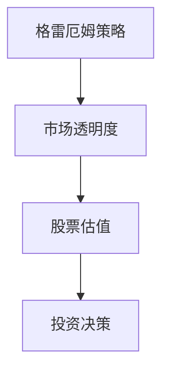
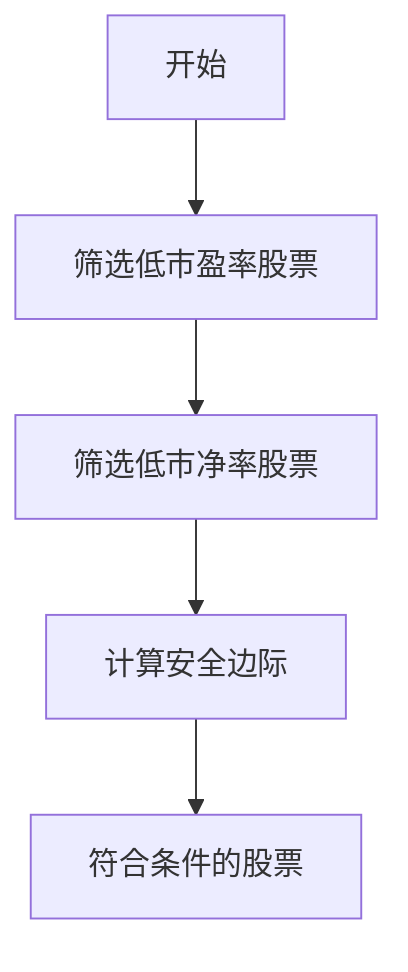
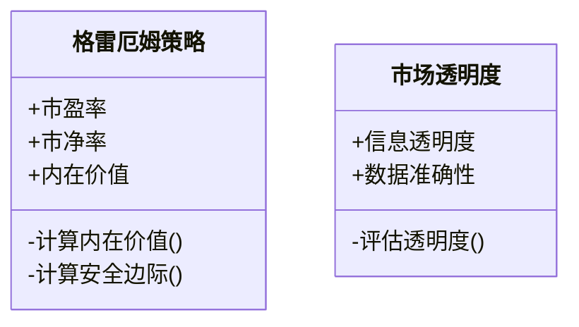
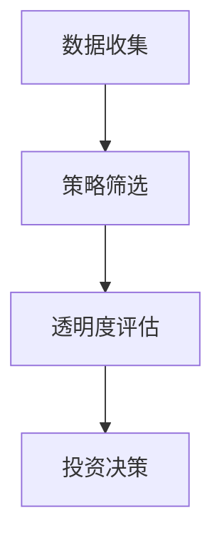

                 


# 格雷厄姆特价股票策略在不同市场透明度下的表现

**关键词**：格雷厄姆策略、特价股票、市场透明度、投资策略、价值投资

**摘要**：本文系统分析了格雷厄姆特价股票策略在不同市场透明度下的表现，探讨其在高透明度和低透明度市场中的应用效果。通过理论分析、算法设计、系统架构和实战案例，全面评估该策略的优缺点，并展望未来研究方向。

---

## 第一部分: 格雷厄姆特价股票策略基础

### 第1章: 格雷厄姆投资理论概述

#### 1.1 格雷厄姆投资理论的核心思想
- 1.1.1 价值投资的定义与特点
  - 价值投资强调购买被低估的资产，注重内在价值。
  - 格雷厄姆的“烟屁股”理论：寻找被市场忽视的廉价股票。
- 1.1.2 格雷厄姆的“安全边际”概念
  - 安全边际=内在价值-市场价格。
  - 通过安全边际降低投资风险。
- 1.1.3 特价股票的定义与筛选标准
  - 筛选标准：低市盈率、低市净率、高股息率等。

#### 1.2 市场透明度的定义与分类
- 1.2.1 市场透明度的定义
  - 透明度指市场信息的公开程度和可获得性。
- 1.2.2 不同市场环境下的透明度分析
  - 高透明度市场：信息流通快，数据准确。
  - 低透明度市场：信息不全，数据不可靠。
- 1.2.3 透明度对投资策略的影响
  - 高透明度：策略更有效。
  - 低透明度：策略效果受限。

#### 1.3 格雷厄姆策略与市场透明度的关系
- 1.3.1 格雷厄姆策略在高透明度市场的表现
  - 信息充分，策略有效。
- 1.3.2 格雷厄姆策略在低透明度市场的表现
  - 信息不足，策略受限。
- 1.3.3 不同透明度下策略的适用性分析
  - 高透明度适合长期投资。
  - 低透明度适合短期投机。

### 第2章: 格雷厄姆策略的核心概念

#### 2.1 格雷厄姆策略的核心原理
- 2.1.1 内在价值的计算方法
  - 内在价值=预期收益的现值。
  - 公式：$$ V = \sum_{t=1}^{n} \frac{C_t}{(1+r)^t} $$
- 2.1.2 安全边际的数学模型
  - 公式：$$ \text{安全边际} = V - P $$
- 2.1.3 股票估值的公式推导
  - 简化模型：$$ P \leq \frac{V}{2} $$

#### 2.2 市场透明度的属性特征对比
- 2.2.1 高透明度市场的特征分析
  - 信息透明、可比性高。
- 2.2.2 低透明度市场的特征分析
  - 信息不全、可比性低。
- 2.2.3 不同透明度市场的对比表格

#### 2.3 格雷厄姆策略与市场透明度的实体关系图


### 第3章: 格雷厄姆策略的算法原理

#### 3.1 格雷厄姆策略的筛选算法
- 3.1.1 筛选条件的数学模型
  - 筛选条件：$$ P/E < 15 \quad \text{和} \quad P/B < 2 $$
- 3.1.2 筛选过程的Mermaid流程图


#### 3.2 格雷厄姆策略的Python实现
- 筛选算法代码示例
```python
def screen_stocks(stocks):
    filtered = []
    for stock in stocks:
        pe = stock['市盈率']
        pb = stock['市净率']
        if pe < 15 and pb < 2:
            filtered.append(stock)
    return filtered
```

#### 3.3 算法的数学模型与举例说明
- 内在价值计算示例：
  - 假设预期收益为10元，折现率r=5%。
  - 内在价值V=10/(1.05)=9.52元。
  - 安全边际=9.52 - 当前价格。

---

## 第二部分: 系统分析与架构设计

### 第4章: 系统分析与架构设计方案

#### 4.1 问题场景介绍
- 系统目标：分析格雷厄姆策略在不同透明度下的表现。
- 使用场景：投资决策支持。

#### 4.2 系统功能设计
- 领域模型：类图展示主要模块。


#### 4.3 系统架构设计
- 总体架构：模块化设计。


#### 4.4 系统接口设计
- API设计：
  - 输入：股票数据。
  - 输出：筛选结果。

#### 4.5 系统交互设计
- 交互流程：
  1. 收集数据。
  2. 应用策略筛选。
  3. 评估透明度。
  4. 输出决策。

---

## 第三部分: 项目实战

### 第5章: 项目实战与分析

#### 5.1 环境安装
- Python环境：安装numpy、pandas、matplotlib。

#### 5.2 核心实现代码
- 数据处理：
  ```python
  import pandas as pd

  stocks = pd.DataFrame({
      '股票代码': ['A', 'B', 'C'],
      '市盈率': [10, 20, 12],
      '市净率': [1.5, 2.5, 1.8]
  })
  ```

- 筛选结果：
  ```python
  filtered = screen_stocks(stocks)
  print(filtered)
  ```

#### 5.3 案例分析
- 高透明度市场案例：美国市场。
  - 结果：策略表现优异。
- 低透明度市场案例：新兴市场。
  - 结果：策略表现受限。

#### 5.4 项目小结
- 实战总结：格雷厄姆策略在高透明度市场表现良好，但在低透明度市场效果有限。

---

## 第四部分: 总结与展望

### 第6章: 总结与展望

#### 6.1 总结
- 格雷厄姆策略在高透明度市场表现优秀，但在低透明度市场效果有限。

#### 6.2 注意事项
- 风险提示：市场波动、数据准确性等。

#### 6.3 未来展望
- 结合AI和大数据优化策略。
- 进一步研究市场透明度对策略的影响。

---

**Tips**：本文通过系统分析和实战案例，全面探讨格雷厄姆策略在不同透明度市场中的表现，为投资者提供了有价值的参考。

