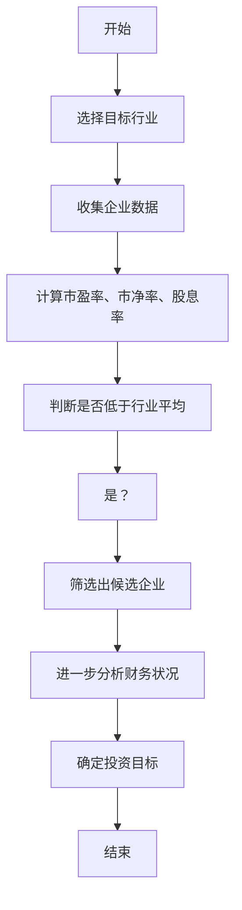
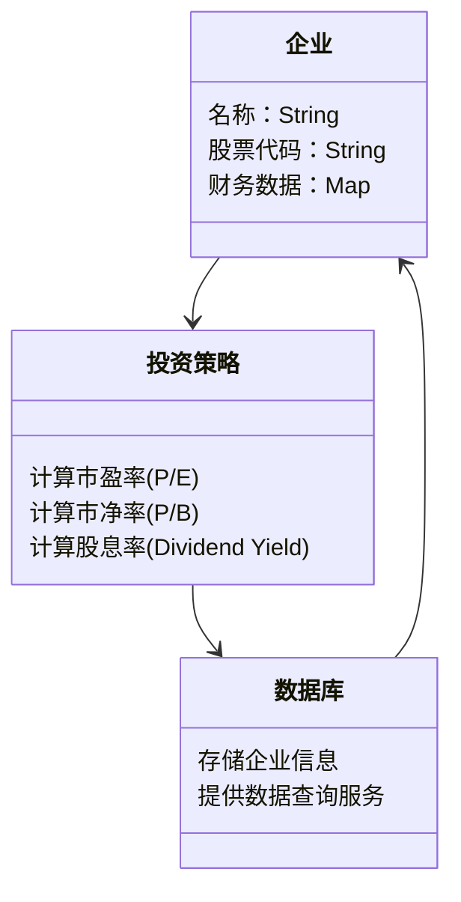

                 


```markdown
# 格雷厄姆特价股票策略在不同数字企业文化生态中的适应

## 关键词：格雷厄姆策略、数字企业、价值投资、特价股票、企业文化生态

## 摘要：本文探讨了格雷厄姆价值投资策略在不同数字企业文化生态中的适应性。通过分析互联网、金融科技和云计算等行业的数字企业，展示了如何将格雷厄姆策略应用于这些企业的价值评估和投资决策。文章详细讲解了策略的数学模型、系统架构以及实际案例，提供了从理论到实践的全面指导。

---

# 第1章: 格雷厄姆投资策略的核心概念

## 1.1 格雷厄姆投资策略的背景与起源

### 1.1.1 价值投资的起源与发展
价值投资由本杰明·格雷厄姆在20世纪初提出，强调以低于内在价值的价格购买优质股票。其核心思想是寻找市场低估的股票，通过长期持有实现收益。

### 1.1.2 格雷厄姆投资策略的核心思想
- 买入被市场低估的股票。
- 以企业基本面分析为基础，重点关注市盈率（P/E）、市净率（P/B）和股息率等指标。
- 重视安全边际，即买入价格与内在价值的差距。

### 1.1.3 特价股票的定义与特征
- 特价股票：市场价格低于内在价值的股票。
- 特征：低市盈率、低市净率、高股息率、财务健康、竞争优势明显。

## 1.2 数字企业文化生态的背景

### 1.2.1 数字化转型对企业的影响
- 数字化转型改变了企业的商业模式和运营方式。
- 数字技术的应用提升了企业的效率和竞争力。

### 1.2.2 不同数字企业的商业模式分析
- 互联网企业：依赖流量和用户粘性。
- 金融科技企业：依托技术创新提供金融服务。
- 云计算与大数据企业：通过数据处理和存储提供服务。

### 1.2.3 数字企业生态系统的构成与特点
- 构成：技术、用户、合作伙伴、政策环境等。
- 特点：快速变化、创新驱动、数据驱动。

---

# 第2章: 格雷厄姆策略与数字企业生态的结合

## 2.1 数字企业生态中的价值评估

### 2.1.1 数字企业的核心竞争力分析
- 技术创新能力：企业的研发投入和技术储备。
- 用户粘性：用户数量和用户粘性。
- 市场地位：市场份额和品牌影响力。

### 2.1.2 财务健康状况的评估指标
- 利润能力：净利润率、毛利率。
- 资产质量：应收账款、存货周转率。
- 偿债能力：资产负债率、流动比率。

### 2.1.3 市场地位与竞争优势的评估
- 市场份额：企业在市场中的占比。
- 竞争优势：技术壁垒、成本优势、品牌优势。

## 2.2 数字企业中的特价股票筛选标准

### 2.2.1 市盈率分析
- 公式：$P/E = \frac{股票价格}{每股收益}$
- 低市盈率（低于行业平均水平）的股票可能被低估。

### 2.2.2 市净率分析
- 公式：$P/B = \frac{股票价格}{每股净资产}$
- 低市净率的股票通常具有较高的安全边际。

### 2.2.3 股息率与股息支付率分析
- 股息率：$ \text{股息率} = \frac{\text{每股股息}}{\text{股票价格}} \times 100\% $
- 高股息率的股票可能具有稳定的收益。

---

# 第3章: 格雷厄姆策略在不同数字企业中的应用案例

## 3.1 互联网企业的策略应用

### 3.1.1 互联网企业的核心业务模式
- 依赖流量和用户粘性，通过广告和增值服务盈利。

### 3.1.2 互联网企业的财务指标分析
- 利润率：广告收入占总收入的比例。
- 用户增长：月活跃用户数（MAU）和日活跃用户数（DAU）。

### 3.1.3 特价股票筛选与投资机会
- 选择低市盈率、高用户粘性的互联网企业。

## 3.2 金融科技企业的策略应用

### 3.2.1 金融科技企业的技术创新
- 区块链、人工智能等技术的应用提升了金融服务的效率。

### 3.2.2 金融科技企业的风险管理
- 通过大数据分析和算法模型评估风险。

### 3.2.3 数字化转型中的投资机会
- 选择具有技术创新和良好风险管理能力的金融科技企业。

## 3.3 云计算与大数据企业的策略应用

### 3.3.1 云计算与大数据企业的市场定位
- 通过提供云服务和数据分析解决方案获取收入。

### 3.3.2 云计算与大数据企业的财务表现
- 高研发投入带来技术创新，但短期内可能亏损。

### 3.3.3 特价股票筛选与投资策略
- 选择低市盈率、高成长性的云计算企业。

---

# 第4章: 格雷厄姆策略的数学模型与算法原理

## 4.1 核心概念与公式

### 4.1.1 市盈率（P/E）公式
$$ P/E = \frac{\text{股票价格}}{\text{每股收益}} $$

### 4.1.2 市净率（P/B）公式
$$ P/B = \frac{\text{股票价格}}{\text{每股净资产}} $$

### 4.1.3 股息率（Dividend Yield）公式
$$ \text{股息率} = \frac{\text{每股股息}}{\text{股票价格}} \times 100\% $$

## 4.2 算法原理与流程图

### 4.2.1 算法流程图


---

# 第5章: 系统分析与架构设计方案

## 5.1 问题场景介绍

### 5.1.1 问题描述
- 如何在不同数字企业中应用格雷厄姆策略筛选特价股票。

### 5.1.2 边界与外延
- 仅考虑公开上市的企业。
- 不考虑宏观经济波动和政策变化。

## 5.2 系统功能设计

### 5.2.1 领域模型类图


## 5.3 系统架构设计

### 5.3.1 系统架构图


---

# 第6章: 项目实战

## 6.1 环境安装与配置

### 6.1.1 安装Python和必要的库
- 使用`pip`安装`pandas`、`numpy`、`matplotlib`等库。

## 6.2 核心实现代码

### 6.2.1 数据采集与预处理
```python
import pandas as pd

# 读取企业数据
df = pd.read_csv('企业数据.csv')
# 计算市盈率
df['P/E'] = df['股价'] / df['每股收益']
# 计算市净率
df['P/B'] = df['股价'] / df['每股净资产']
# 计算股息率
df['股息率'] = (df['每股股息'] / df['股价']) * 100
# 筛选低价股票
cheap_stocks = df[df['P/E'] < df['P/E'].mean()]
```

### 6.2.2 可视化分析
```python
import matplotlib.pyplot as plt

plt.scatter(df['P/E'], df['股价'])
plt.xlabel('P/E')
plt.ylabel('股价')
plt.title('P/E vs 股价')
plt.show()
```

## 6.3 案例分析与结果解读

### 6.3.1 互联网企业案例
- 企业A：P/E = 10，低于行业平均。
- 企业B：P/E = 15，高于行业平均。

### 6.3.2 云计算企业案例
- 企业C：P/B = 2，低于行业平均。
- 企业D：P/B = 3，高于行业平均。

## 6.4 项目小结
- 成功筛选出具有投资价值的数字企业。
- 需要持续监控市场变化和企业基本面。

---

# 第7章: 总结与展望

## 7.1 格雷厄姆策略的应用总结
- 在不同数字企业中，格雷厄姆策略的有效性取决于企业的商业模式和财务状况。
- 数字企业的技术创新和数据驱动特性为策略的应用提供了新的机会。

## 7.2 未来展望
- 结合人工智能和大数据技术，进一步优化投资策略。
- 拓展更多行业和市场的应用。

## 7.3 最佳实践 tips
- 长期投资，避免短期波动。
- 定期更新财务数据和市场分析。
- 保持对新技术和新市场的敏感性。

---

# 结语

通过本文的分析与实践，我们可以看到格雷厄姆策略在数字企业文化生态中的广泛应用和巨大潜力。希望读者能够结合实际情况，灵活运用这些策略，实现稳健的投资收益。
```

