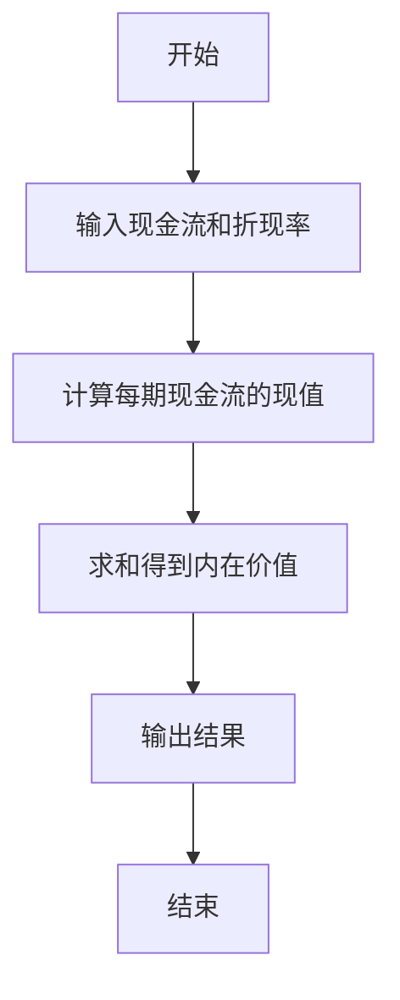
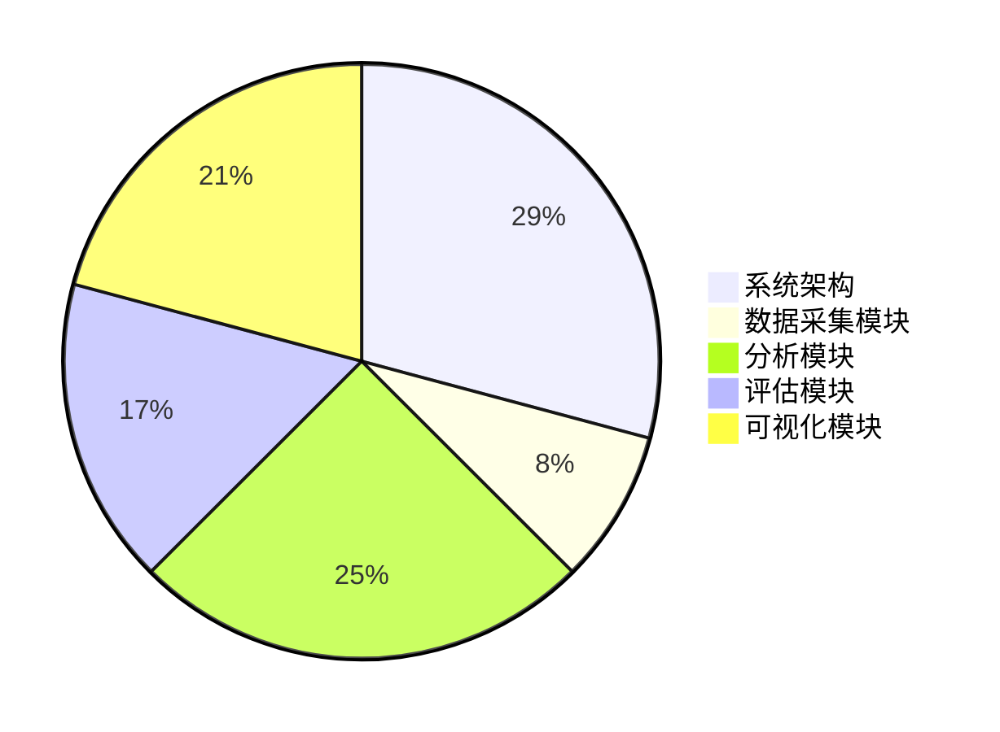

                 


# 《格雷厄姆特价股票策略在不同数字企业文化转型阶段的适应》

---

## 关键词  
- 格雷厄姆投资策略  
- 数字化转型  
- 价值投资  
- 企业转型阶段  
- 投资模型  

---

## 摘要  
本文探讨格雷厄姆价值投资策略在数字企业文化转型不同阶段的适应性。通过分析企业数字化转型的三大阶段（初期、成长期、成熟期），结合格雷厄姆策略的核心原理，提出在不同阶段如何优化投资策略。文章还结合系统架构设计和实际案例，详细阐述了如何通过大数据和人工智能技术优化投资决策，并提供了系统实现的代码和流程图。  

---

# 第一部分: 格雷厄姆特价股票策略与数字企业文化转型的背景

## 第1章: 格雷厄姆投资理论的核心概念  

### 1.1 价值投资的定义与原则  
价值投资是一种以企业内在价值为基础的投资策略，强调以低于内在价值的价格买入优质资产。格雷厄姆提出的“安全边际”概念是其核心，即买入价格与内在价值的差额。  

**核心公式**：  
$$ \text{安全边际} = \text{内在价值} - \text{市场价格} $$  

### 1.2 格雷厄姆策略的数学模型  
格雷厄姆的内在价值模型基于对未来现金流的折现。公式如下：  
$$ \text{内在价值} = \sum_{t=1}^{n} \frac{\text{CF}_t}{(1 + r)^t} $$  
其中，$\text{CF}_t$ 是第 $t$ 年的现金流，$r$ 是折现率。  

### 1.3 数字化转型的定义与目标  
数字化转型是指通过技术手段（如大数据、人工智能、云计算等）对企业业务模式、运营流程和组织结构进行重构，以提升竞争力和效率。  

---

## 第2章: 数字企业文化转型的阶段  

### 2.1 数字化转型的三大阶段  
1. **初期阶段**：企业开始引入数字化工具，优化传统业务流程。  
2. **成长期**：企业通过数字化技术实现业务创新和扩张。  
3. **成熟期**：企业形成稳定的数字化运营模式，并持续优化。  

### 2.2 数字化转型对投资策略的影响  
在企业转型过程中，其财务表现、市场地位和风险敞口都会发生变化。投资者需要根据企业所处的转型阶段，动态调整投资策略。  

---

# 第二部分: 格雷厄姆策略在企业转型中的适应性分析  

## 第3章: 格雷厄姆策略在企业转型中的应用  

### 3.1 不同转型阶段的投资策略  
1. **初期阶段**：重点关注企业的基本面和财务健康度，寻找被低估的传统行业龙头。  
2. **成长期**：关注企业通过数字化技术实现收入增长的潜力，适当提高对高成长性企业的估值权重。  
3. **成熟期**：注重企业的盈利稳定性和现金流表现，寻找估值与内在价值匹配的企业。  

### 3.2 格雷厄姆策略的优化  
通过引入大数据和人工智能技术，对企业的未来现金流进行更精准的预测，优化内在价值模型。  

---

## 第4章: 格雷厄姆策略的数学模型与算法  

### 4.1 内在价值计算的算法流程  


### 4.2 基于Python的算法实现  
```python
def calculate_intrinsic_value(cash_flows, discount_rate):
    intrinsic_value = 0
    for t, cf in enumerate(cash_flows):
        intrinsic_value += cf / (1 + discount_rate) ** t
    return intrinsic_value

# 示例
cash_flows = [100, 150, 200, 250]
discount_rate = 0.1
iv = calculate_intrinsic_value(cash_flows, discount_rate)
print(f"内在价值：{iv}")
```

---

## 第5章: 系统架构与技术实现  

### 5.1 系统架构设计  


### 5.2 系统功能实现  
1. **数据采集模块**：获取企业的财务数据和市场数据。  
2. **分析模块**：基于格雷厄姆模型计算内在价值。  
3. **评估模块**：结合企业转型阶段，调整评估权重。  
4. **可视化模块**：生成投资报告和图表。  

---

## 第6章: 项目实战与案例分析  

### 6.1 环境配置  
```bash
pip install pandas numpy matplotlib
```

### 6.2 核心代码实现  
```python
import pandas as pd
import numpy as np

def calculate_intrinsic_value(cash_flows, discount_rate):
    return np.npv(discount_rate, cash_flows)

# 示例数据
cash_flows = [100, 150, 200, 250]
discount_rate = 0.1

iv = calculate_intrinsic_value(cash_flows, discount_rate)
print(f"计算的内在价值为：{iv}")
```

### 6.3 案例分析  
以某科技公司为例，分析其在数字化转型中的价值变化，并结合代码计算其内在价值。  

---

## 第7章: 最佳实践与小结  

### 7.1 投资策略的注意事项  
1. 在企业转型初期，注重基本面分析。  
2. 在成长期，关注技术创新对企业价值的影响。  
3. 在成熟期，注重企业盈利的稳定性。  

### 7.2 未来展望  
随着人工智能和大数据技术的发展，格雷厄姆策略将更加精准，投资者需要持续学习新技术，优化投资模型。  

---

## 附录: 参考文献与工具  

### 1. 参考文献  
- 格雷厄姆《证券分析》  
- 《企业数字化转型白皮书》  

### 2. 工具推荐  
- Python：数据处理与建模  
- Pandas：数据分析库  
- Matplotlib：数据可视化  

---

以上为完整目录大纲，希望对您有所帮助！

