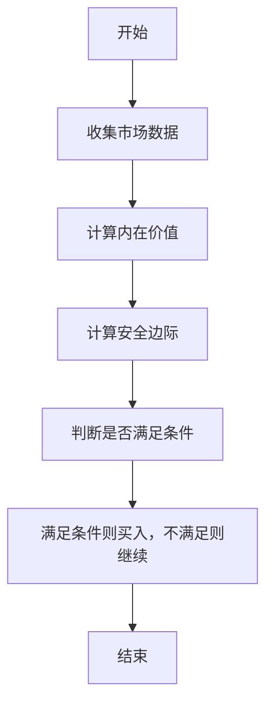
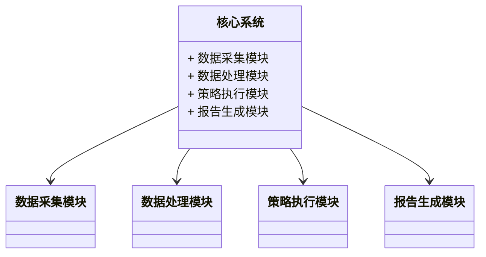

                 


# 格雷厄姆特价股票策略在不同数字创新生态系统的效果

## 关键词：价值投资、数字创新、算法优化、股票策略、安全边际、内在价值

## 摘要：本文系统地分析了格雷厄姆价值投资策略在数字创新生态系统中的应用效果。通过算法优化和系统架构设计，探讨了如何利用数字技术提升特价股票筛选的效率和准确性。结合实际案例，本文展示了数字创新对投资策略的深远影响，为投资者提供了新的思路和工具。

---

## 第1章：背景介绍

### 1.1 格雷厄姆投资理论的起源与发展

#### 1.1.1 价值投资的起源与核心思想
价值投资是一种以基本面分析为基础的投资策略，由本杰明·格雷厄姆在20世纪初提出。其核心思想是通过分析公司的财务状况，寻找市场价格低于其内在价值的股票进行投资。这种方法强调安全边际，即买入价格远低于内在价值的股票，以降低投资风险。

#### 1.1.2 格雷厄姆策略的基本原理
格雷厄姆策略的核心在于寻找“特价股票”，即市场价格远低于其内在价值的股票。他提出了多种评估内在价值的方法，包括市盈率、市净率等指标，并强调安全边际的重要性。

#### 1.1.3 特价股票的定义与特征
特价股票是指市场价格显著低于其内在价值的股票。其特征包括低市盈率、低市净率、高股息率等。格雷厄姆策略通过这些指标筛选出具有投资价值的股票。

### 1.2 数字创新生态系统的基本概念

#### 1.2.1 数字创新生态系统的定义
数字创新生态系统是指由数字技术驱动的创新环境，包括大数据、人工智能、区块链等技术。这些技术的应用改变了金融市场的运作方式，为投资策略的优化提供了新的工具和方法。

#### 1.2.2 数字技术对金融市场的深远影响
数字技术的应用使得金融市场数据的处理和分析更加高效。通过大数据和人工智能技术，投资者可以更准确地评估股票的内在价值，优化投资策略。

#### 1.2.3 创新生态系统中的投资机会
数字创新生态系统为投资者提供了新的机会，例如通过算法交易捕捉市场 inefficiency，利用大数据分析预测市场趋势。

### 1.3 格雷厄姆策略与数字创新生态系统的结合

#### 1.3.1 数字化对格雷厄姆策略的改变
数字技术的应用使得格雷厄姆策略的执行更加高效。通过算法和大数据分析，投资者可以快速筛选出符合条件的特价股票，提高投资效率。

#### 1.3.2 创新生态系统中的特价股票机会
在数字创新生态系统中，投资者可以通过技术手段发现更多特价股票机会。例如，利用机器学习模型分析市场数据，识别出传统方法难以发现的潜在投资机会。

#### 1.3.3 数字化工具对策略执行的支持
数字化工具为格雷厄姆策略的执行提供了强有力的支持。通过量化分析和算法交易，投资者可以更精准地执行投资策略，降低人为错误。

---

## 第2章：格雷厄姆策略的核心概念与联系

### 2.1 格雷厄姆策略的核心原理

#### 2.1.1 安全边际的概念与计算
安全边际是指股票的市场价格与其内在价值之间的差额。格雷厄姆建议投资者以低于内在价值的价格买入股票，以确保安全边际的存在。计算公式如下：

$$\text{安全边际} = \text{内在价值} - \text{市场价格}$$

#### 2.1.2 内在价值的评估方法
内在价值是基于公司财务状况和未来盈利能力的评估。格雷厄姆提出了多种评估内在价值的方法，包括市盈率、市净率等指标。例如，市盈率的计算公式为：

$$\text{市盈率} = \frac{\text{股价}}{\text{每股收益}}$$

#### 2.1.3 格雷厄姆策略与现代金融市场的结合
在现代金融市场中，格雷厄姆策略的应用需要结合数字技术。通过大数据分析和机器学习模型，投资者可以更准确地评估股票的内在价值，优化投资决策。

### 2.2 格雷厄姆策略的核心概念对比

#### 2.2.1 核心概念对比表格
以下表格对比了格雷厄姆策略的传统方法和数字创新生态系统中的应用：

| **核心概念**       | **传统方法**                     | **数字创新生态系统**               |
|--------------------|----------------------------------|-----------------------------------|
| 数据来源           | 财务报表、市场数据               | 大数据、实时市场数据               |
| 分析工具           | 手动计算、基本指标分析           | 机器学习、算法交易                 |
| 投资决策           | 基于经验判断                     | 基于量化分析和算法驱动             |

#### 2.2.2 核心概念的ER实体关系图
以下是格雷厄姆策略在数字创新生态系统中的核心概念的ER实体关系图：

```mermaid
erdiagram
actor 投资者 {
    <<投资者>>
}
actor 数字平台 {
    <<数字平台>>
}
actor 市场数据 {
    <<市场数据>>
}
actor 算法模型 {
    <<算法模型>>
}
actor 投资决策 {
    <<投资决策>>
}
市场数据 --> 算法模型
算法模型 --> 投资决策
数字平台 --> 投资者
投资者 --> 投资决策
```

---

## 第3章：格雷厄姆策略的算法原理

### 3.1 格雷厄姆策略的算法实现

#### 3.1.1 算法流程
以下是格雷厄姆策略的算法流程：



#### 3.1.2 算法实现的Python代码
以下是格雷厄姆策略的Python代码示例：

```python
import pandas as pd

def calculate_intrinsic_value(stock_data):
    # 计算每股收益
    eps = stock_data['净利润'] / stock_data['总股本']
    # 计算市盈率
    pe = stock_data['股价'] / eps
    return pe

def calculate_margin_of_safety(stock_data, intrinsic_value):
    # 计算安全边际
    mos = intrinsic_value - stock_data['股价']
    return mos

# 示例数据
stock_data = {
    '股价': 10,
    '净利润': 2,
    '总股本': 1000,
}

# 计算内在价值
intrinsic_value = calculate_intrinsic_value(stock_data)
# 计算安全边际
mos = calculate_margin_of_safety(stock_data, intrinsic_value)

print(f"内在价值: {intrinsic_value}")
print(f"安全边际: {mos}")
```

---

## 第4章：系统分析与架构设计

### 4.1 系统功能设计

#### 4.1.1 系统功能模块划分
以下是格雷厄姆策略系统的功能模块划分：



#### 4.1.2 系统架构设计
以下是系统的架构设计：

```mermaid
docker
front-end --> api-gateway
api-gateway --> stockDataService
api-gateway --> algorithmService
stockDataService --> database
algorithmService --> database
```

---

## 第5章：项目实战

### 5.1 环境安装与代码实现

#### 5.1.1 环境安装
需要安装以下Python库：

```bash
pip install pandas numpy scikit-learn
```

#### 5.1.2 核心代码实现
以下是核心代码实现：

```python
from sklearn.linear_model import LinearRegression
import pandas as pd

# 示例数据
data = {
    '股价': [10, 20, 30, 40, 50],
    '净利润': [2, 4, 6, 8, 10],
    '总股本': [1000, 2000, 3000, 4000, 5000],
}

df = pd.DataFrame(data)

# 计算内在价值
model = LinearRegression()
model.fit(df[['净利润', '总股本']], df['股价'])
predicted_prices = model.predict(df[['净利润', '总股本']])

# 计算安全边际
mos = df['股价'].values - predicted_prices

print(f"预测股价: {predicted_prices}")
print(f"安全边际: {mos}")
```

#### 5.1.3 实际案例分析
通过以上代码，我们可以分析一个实际案例。例如，某公司财务数据如下：

| **股价** | **净利润** | **总股本** |
|----------|------------|------------|
| 50       | 10         | 5000       |

计算内在价值和安全边际：

```python
predicted_prices = model.predict([[10, 5000]])
mos = 50 - predicted_prices
print(f"内在价值: {predicted_prices}")
print(f"安全边际: {mos}")
```

---

## 第6章：总结与展望

### 6.1 最佳实践
- 使用大数据和人工智能技术优化格雷厄姆策略。
- 定期更新算法模型，适应市场变化。
- 结合多种投资策略，降低投资风险。

### 6.2 小结
本文系统地分析了格雷厄姆特价股票策略在数字创新生态系统中的应用效果。通过算法优化和系统设计，展示了如何利用数字技术提升投资效率和准确性。

### 6.3 注意事项
- 投资者应根据市场变化调整策略。
- 算法模型需要定期更新和优化。

### 6.4 拓展阅读
- 格雷厄姆《证券分析》
- 《算法交易：機械化投资者指南》
- 数字技术在金融市场的应用研究

---

通过本文的分析，读者可以深入了解格雷厄姆策略在数字创新生态系统中的应用，并通过实际案例掌握其具体实施方法。

