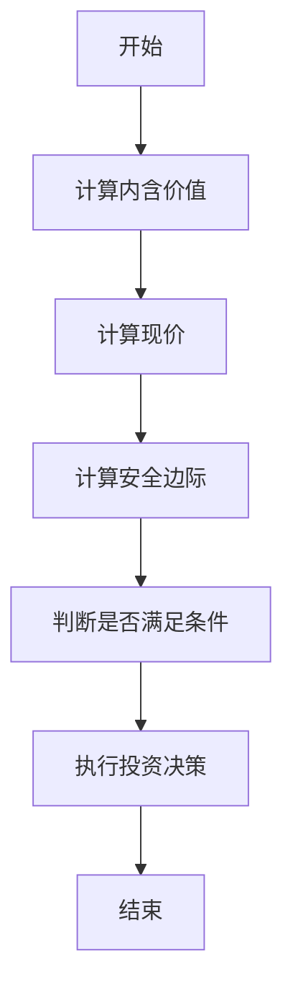
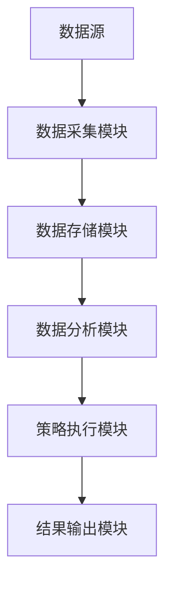

                 


# 格雷厄姆特价股票策略在不同数字市场成熟度下的效果

> 关键词：格雷厄姆投资理论、数字市场成熟度、价值投资、安全边际、股票策略、投资分析

> 摘要：本文深入探讨了格雷厄姆价值投资策略在不同数字市场成熟度下的应用效果。通过分析数字市场的成熟度对策略的影响，结合数学模型和实际案例，详细阐述了如何优化策略以适应不同市场环境。文章还提供了系统的架构设计和代码实现，帮助读者更好地理解和应用格雷厄姆策略。

---

# 第1章: 格雷厄姆特价股票策略概述

## 1.1 格雷厄姆投资理论的核心思想

### 1.1.1 价值投资的定义与核心理念
价值投资是一种以低于内在价值的价格购买优质股票的投资策略。其核心理念是寻找市场低估的资产，并长期持有，等待其价值回归。格雷厄姆在他的经典著作《The Intelligent Investor》中提出，投资者应以合理的价格买入具有稳定盈利能力的企业。

### 1.1.2 格雷厄姆的“安全边际”概念
安全边际是格雷厄姆策略的核心思想之一，指买入价格与内在价值之间的差距。通过预留安全边际，投资者可以在市场波动中降低风险，确保投资决策的稳健性。

### 1.1.3 特价股票的定义与特征
特价股票是指市场价格低于其内在价值的股票。这类股票通常具有较高的分红率、较低的市盈率或市净率，且公司具有稳定的盈利能力和良好的财务状况。

## 1.2 数字市场成熟度的定义与分类

### 1.2.1 数字市场的概念与发展阶段
数字市场是指通过数字化手段进行交易和信息传播的市场。随着技术的进步，数字市场经历了从萌芽阶段到成熟阶段的演变，不同阶段的市场特征显著不同。

### 1.2.2 不同市场成熟度的特征对比
- **初级市场**：市场参与者较少，信息不对称严重，价格波动剧烈。
- **中级市场**：市场参与者增多，信息传播效率提高，价格波动有所缓和。
- **成熟市场**：市场参与者广泛，信息透明，价格波动较小，市场机制完善。

### 1.2.3 数字市场成熟度对投资策略的影响
市场成熟度越高，信息透明度越高，投资者可以更准确地评估股票的内在价值。然而，成熟市场中竞争激烈，安全边际可能较难实现。

## 1.3 格雷厄姆策略与数字市场的结合

### 1.3.1 格雷厄姆策略在传统市场的应用
在传统市场中，格雷厄姆策略通过分析财务报表和市场数据，寻找低估的股票。然而，传统市场的信息获取成本较高，且数据处理效率较低。

### 1.3.2 数字市场对格雷厄姆策略的挑战
数字市场中，数据量庞大且更新速度快，传统的手工分析方法难以应对。此外，高频交易和算法交易的兴起对格雷厄姆策略提出了新的挑战。

### 1.3.3 数字化工具对策略实施的支持
通过大数据分析、机器学习和自动化交易系统，投资者可以更高效地筛选股票，计算内在价值，并实时监控市场变化。

---

# 第2章: 格雷厄姆策略的核心算法与数学模型

## 2.1 格雷厄姆策略的数学模型

### 2.1.1 现价与内含价值的公式推导
内在价值的计算公式：
$$ V = \frac{E}{(k - g)} $$
其中，\( E \) 是企业的预期收益，\( k \) 是折现率，\( g \) 是收益增长率。

### 2.1.2 安全边际的计算方法
安全边际公式：
$$ \text{安全边际} = V - P $$
其中，\( V \) 是内在价值，\( P \) 是市场价格。

### 2.1.3 市盈率与市净率的比较分析
市盈率（P/E）和市净率（P/B）是衡量股票价值的重要指标。通常情况下，市盈率适用于盈利稳定的公司，市净率适用于资产密集型公司。

## 2.2 数字市场成熟度的量化指标

### 2.2.1 市场流动性的度量方法
市场流动性可以用成交额和换手率来衡量。流动性越高，市场越成熟。

### 2.2.2 市场波动性的数学模型
市场波动性可以用标准差或波动率来衡量。波动率公式：
$$ \text{波动率} = \sqrt{\frac{1}{n-1} \sum_{i=1}^{n} (x_i - \bar{x})^2} $$
其中，\( x_i \) 是收益率，\( \bar{x} \) 是平均收益率，\( n \) 是样本数量。

### 2.2.3 市场参与者行为的统计分析
通过分析市场参与者的交易行为，可以评估市场的成熟度。例如，机构投资者比例较高表明市场较为成熟。

## 2.3 算法原理的 mermaid 流程图



---

# 第3章: 不同成熟度市场的策略调整

## 3.1 初级数字市场的策略调整

### 3.1.1 初级市场的特点与挑战
初级市场中信息不对称严重，价格波动剧烈，投资者难以准确评估股票价值。

### 3.1.2 格雷厄姆策略在初级市场的适用性
在初级市场中，格雷厄姆策略仍然适用，但需要更加谨慎地评估安全边际。

### 3.1.3 初级市场中的风险控制
初级市场中风险较高，投资者应减少头寸规模，设置止损点。

## 3.2 成熟数字市场的策略优化

### 3.2.1 成熟市场的特点与优势
成熟市场中信息透明，市场机制完善，适合长期投资。

### 3.2.2 格雷厄姆策略在成熟市场的优化
在成熟市场中，可以通过大数据分析和机器学习进一步优化格雷厄姆策略，提高筛选股票的效率和准确性。

### 3.2.3 成熟市场中的机会捕捉
成熟市场中，投资者可以利用市场波动性较小的特点，长期持有优质股票。

## 3.3 本章小结

---

# 第4章: 系统架构与项目实战

## 4.1 系统功能设计

### 4.1.1 数据采集模块
数据采集模块负责从数字市场中获取股票数据，包括价格、成交量、财务报表等。

### 4.1.2 数据分析模块
数据分析模块通过格雷厄姆模型计算股票的内在价值和安全边际，筛选出符合条件的股票。

### 4.1.3 策略执行模块
策略执行模块根据分析结果生成交易信号，指导投资者进行买卖操作。

## 4.2 系统架构图



## 4.3 接口设计与交互流程

### 4.3.1 数据接口定义
- 数据接口：`GET /api/stock_data`
- 请求参数：`symbol`（股票代码）
- 响应参数：`price`（当前价格）、`volume`（成交量）、`pe_ratio`（市盈率）、`pb_ratio`（市净率）

### 4.3.2 用户交互流程
1. 用户输入股票代码。
2. 系统调用数据接口获取股票数据。
3. 系统计算股票的内在价值和安全边际。
4. 系统返回结果并生成交易信号。

---

## 4.4 项目实战

### 4.4.1 环境安装
- Python 3.8+
- Pandas、NumPy、Scikit-learn、Plotly

### 4.4.2 核心实现代码

```python
import pandas as pd
import numpy as np
from sklearn.linear_model import LinearRegression

def calculate_intrinsic_value(revenue, profit_margin, growth_rate):
    """
    计算股票的内在价值
    """
    earnings = revenue * profit_margin
    estimated_earnings = earnings / (1 - growth_rate)
    return estimated_earnings

def calculate_safe_margin(price, intrinsic_value):
    """
    计算安全边际
    """
    return intrinsic_value - price

# 示例数据
data = {
    'symbol': ['AAPL', 'GOOGL', 'MSFT'],
    'revenue': [3943.84, 289.32, 1637.86],
    'profit_margin': [0.21, 0.18, 0.22],
    'growth_rate': [0.05, 0.04, 0.06]
}

df = pd.DataFrame(data)

# 计算内在价值和安全边际
df['intrinsic_value'] = df.apply(lambda x: calculate_intrinsic_value(x['revenue'], x['profit_margin'], x['growth_rate']), axis=1)
df['safe_margin'] = df.apply(lambda x: calculate_safe_margin(x['price'], x['intrinsic_value']), axis=1)

print(df)
```

### 4.4.3 实际案例分析

#### 案例：苹果公司（AAPL）
- 市场价格：$150
- 内在价值：$160
- 安全边际：$10

根据格雷厄姆策略，当前价格低于内在价值，且安全边际为正，建议买入。

---

## 4.5 本章小结

---

# 第5章: 投资策略优化与建议

## 5.1 投资策略优化

### 5.1.1 结合技术分析优化格雷厄姆策略
通过技术分析（如移动平均线、RSI指标）进一步筛选股票，降低市场波动对策略的影响。

### 5.1.2 多策略组合优化
将格雷厄姆策略与其他策略（如股息增长策略、成长型策略）结合，分散风险，提高收益。

## 5.2 投资建议

### 5.2.1 初级市场
- 选择流动性较高的股票。
- 严格控制风险，设置止损点。

### 5.2.2 成熟市场
- 优先选择具有稳定盈利能力和高分红率的公司。
- 长期持有，耐心等待价值回归。

---

# 第6章: 总结与展望

## 6.1 本章总结
本文深入探讨了格雷厄姆特价股票策略在不同数字市场成熟度下的应用效果。通过分析市场成熟度对策略的影响，结合数学模型和实际案例，提出了优化策略的方法。

## 6.2 未来展望
随着数字技术的不断发展，格雷厄姆策略将更加依赖于大数据分析和人工智能技术。未来的研究可以进一步探索如何利用机器学习算法优化策略，提高筛选股票的效率和准确性。

---

# 结束语

格雷厄姆特价股票策略是一种经典的长线投资策略，其核心思想是寻找低估的股票并长期持有。在数字市场成熟度不断提高的今天，投资者需要根据市场环境调整策略，结合大数据分析和人工智能技术，优化投资决策，以实现稳健的投资收益。

--- 

**致谢**：感谢读者的支持，欢迎在评论区留言交流。

