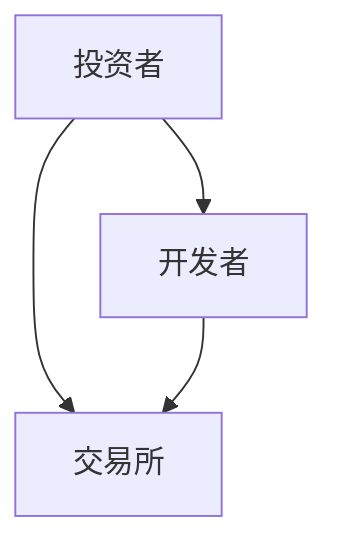
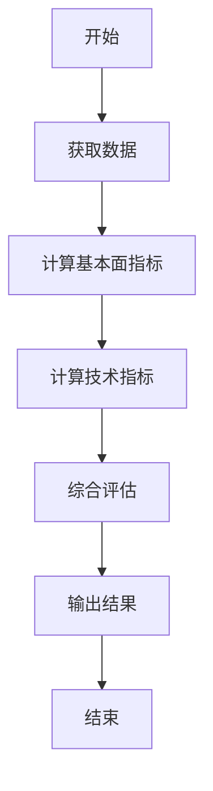

                 

# 格雷厄姆特价股票策略在不同数字货币竞争环境下的调整

## 关键词：格雷厄姆策略，数字货币，价值投资，风险管理，技术分析

## 摘要：本文探讨了将格雷厄姆的经典价值投资策略应用于数字货币市场的可行性与调整方法。通过对数字货币市场的特点分析，结合格雷厄姆策略的核心原则，提出了一套适合数字货币市场的价值评估模型，并通过实际案例验证了该策略的有效性。本文还讨论了策略在不同市场环境下的调整方法，为投资者提供了实用的指导。

---

# 第1章: 格雷厄姆特价股票策略的核心思想

## 1.1 格雷厄姆投资理论的起源与核心概念

### 1.1.1 价值投资的起源与发展
- **背景介绍**：价值投资是由本杰明·格雷厄姆提出的一种投资策略，旨在通过寻找市场价格低于其内在价值的证券来实现长期收益。
- **核心概念**：价值投资的核心在于识别市场低估的资产，重点关注企业的基本面，如盈利能力、财务状况和市场地位。
- **问题背景**：传统股票市场中的价值投资策略是否适用于波动性极高的数字货币市场？

### 1.1.2 格雷厄姆策略的核心原则
- **核心原则**：
  - 价格与价值的分离：市场价格可能偏离其内在价值。
  - 安全边际：购买价格应低于内在价值，以确保安全边际。
  - 长期视角：投资应着眼于长期收益，而非短期波动。
- **属性对比**：
  | 核心原则         | 传统股票市场 | 数字货币市场 |
  |------------------|---------------|---------------|
  | 价格与价值分离   | 较低波动性     | 极高波动性     |
  | 安全边际         | 较容易计算     | 更难计算       |
  | 长期视角         | 适用           | 适用           |

### 1.1.3 特价股票的定义与特征
- **定义**：格雷厄姆将“特价股票”定义为市场价格低于其内在价值的股票。
- **特征**：
  - 公司具有稳定的盈利能力。
  - 市场价格被低估，存在安全边际。
  - 风险较低，回报较高。

## 1.2 格雷厄姆策略在传统股票市场的应用

### 1.2.1 传统股票市场的价值评估方法
- **方法**：通过市盈率、市净率等指标评估股票的内在价值。
- **经典案例**：购买被市场低估的股票，长期持有，最终实现收益。

### 1.2.2 格雷厄姆策略的经典案例分析
- **案例**：以某家传统企业为例，分析其市场价格与内在价值的差异。
- **结论**：格雷厄姆策略在传统市场中表现优异，但需要结合市场环境进行调整。

### 1.2.3 格雷厄姆策略的优缺点
- **优点**：
  - 长期稳定收益。
  - 风险较低。
- **缺点**：
  - 对市场环境变化敏感。
  - 需要较高的市场分析能力。

## 1.3 格雷厄姆策略在数字货币市场的异同

### 1.3.1 数字货币市场的特点与挑战
- **特点**：
  - 高波动性。
  - 去中心化。
  - 缺乏监管。
- **挑战**：
  - 市场价格波动剧烈，难以预测。
  - 缺乏可靠的财务数据。

### 1.3.2 格雷厄姆策略在数字货币市场的适用性
- **适用性分析**：格雷厄姆策略的核心思想在数字货币市场中仍然适用，但需要进行调整以应对市场特点。

### 1.3.3 数字货币市场中的价值评估难点
- **难点**：
  - 市场参与者复杂。
  - 数据不透明。
  - 技术更新迅速。

---

# 第2章: 数字货币市场的竞争环境分析

## 2.1 数字货币市场的基本结构

### 2.1.1 数字货币市场的参与者
- **参与者**：
  - 投资者：机构和个人。
  - 开发者：项目团队。
  - 交易所：交易平台。
- **关系图**：使用 Mermaid 绘制参与者之间的关系图。

### 2.1.2 数字货币市场的交易机制
- **机制**：包括撮合交易、订单簿等。
- **特点**：高频交易、24/7 运行。

### 2.1.3 数字货币市场的波动性特征
- **波动性分析**：使用统计方法分析市场波动性。

## 2.2 数字货币市场的竞争格局

### 2.2.1 主流数字货币的竞争分析
- **主流数字货币**：比特币、以太坊等。
- **竞争分析**：比较不同货币的技术优势和市场地位。

### 2.2.2 数字货币市场的生态体系
- **生态体系**：包括矿池、钱包、交易所等。

### 2.2.3 数字货币市场的未来发展趋势
- **趋势分析**：去中心化、技术创新等。

## 2.3 数字货币市场的风险管理

### 2.3.1 数字货币市场的风险来源
- **市场风险**：价格波动。
- **流动性风险**：交易量不足。
- **操作风险**：交易失误。

### 2.3.2 格雷厄姆策略中的风险管理原则
- **原则**：分散投资、设置止损、长期持有。

### 2.3.3 数字货币市场的风险管理工具
- **工具**：止损订单、对冲策略等。

---

# 第3章: 格雷厄姆策略在数字货币市场中的调整

## 3.1 格雷厄姆策略的核心原则的演变

### 3.1.1 格雷厄姆策略的核心原则回顾
- **回顾**：价格与价值分离、安全边际、长期视角。

### 3.1.2 数字货币市场中的原则调整
- **调整**：
  - 强化安全边际：考虑市场波动性。
  - 增强风险管理：引入技术分析。
  - 适应市场特点：关注技术指标。

### 3.1.3 调整原则的逻辑与依据
- **逻辑**：基于数字货币市场的高波动性和不确定性，调整策略以降低风险。

## 3.2 数字货币市场中的价值评估模型

### 3.2.1 传统价值评估模型的局限性
- **局限性**：
  - 无法应对高波动性。
  - 缺乏适用于数字货币市场的指标。

### 3.2.2 数字货币市场中的价值评估模型
- **模型**：结合基本面和技术面的综合评估模型。

### 3.2.3 模型的数学公式与实现方法
- **数学模型**：
  $$ V = \text{内在价值} = \text{基本面指标} \times \text{技术指标} $$
- **实现方法**：
  使用 Python 编写代码，结合数据源进行计算。

### 3.2.4 算法流程图

## 3.3 格雷厄姆策略与技术分析的结合

### 3.3.1 技术分析在数字货币市场中的作用
- **作用**：通过技术指标预测价格走势。

### 3.3.2 格雷厄姆策略与技术分析的结合点
- **结合点**：在价值评估中引入技术指标。

### 3.3.3 结合方法的具体实现
- **实现**：通过代码实现技术指标的计算和综合评估。

---

# 第4章: 格雷厄姆策略在数字货币市场中的应用案例

## 4.1 比特币市场的应用案例

### 4.1.1 比特币市场的特点与分析
- **特点**：高波动性、去中心化。

### 4.1.2 格雷厄姆策略在比特币市场的具体应用
- **应用**：通过价值评估模型筛选比特币的低价区。

### 4.1.3 案例分析与经验总结
- **总结**：策略在比特币市场中表现良好，但需密切关注市场波动。

## 4.2 以太坊市场的应用案例

### 4.2.1 以太坊市场的特点与分析
- **特点**：技术领先、应用广泛。

### 4.2.2 格雷厄姆策略在以太坊市场的具体应用
- **应用**：结合技术指标和基本面分析选择投资时机。

### 4.2.3 案例分析与经验总结
- **总结**：策略在以太坊市场中表现稳定，但需关注技术创新。

---

# 第5章: 总结与展望

## 5.1 格雷厄姆策略在数字货币市场的调整总结
- **总结**：通过调整策略，成功应对了数字货币市场的高波动性和不确定性。

## 5.2 对未来发展的展望
- **展望**：随着市场的成熟和技术的进步，格雷厄姆策略将进一步优化，为投资者提供更有效的指导。

---

# 结语

通过本文的分析，我们可以看到，格雷厄姆策略在数字货币市场中经过适当的调整，仍然能够为投资者提供有效的指导。未来，随着技术的进步和市场的成熟，这一策略将更加完善，帮助投资者在数字货币市场中实现长期稳定的收益。

