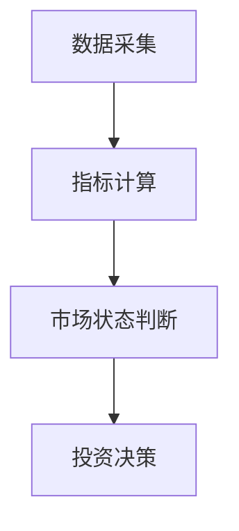

                 


# 格雷厄姆特价股票策略在不同数字通胀与通缩周期环境中的效果

## 关键词
格雷厄姆投资理论，数字通胀，数字通缩，安全边际，内在价值，股票策略，金融市场

## 摘要
本文探讨格雷厄姆的价值投资策略在数字通胀与通缩周期中的效果，分析策略在不同经济环境下的适应性和表现，通过数学模型和实证分析，提出优化建议，并展望未来研究方向。

---

# 第1章：格雷厄姆特价股票策略概述

## 1.1 格雷厄姆投资理论的核心思想
### 1.1.1 价值投资的基本概念
价值投资是寻找市场价格低于内在价值的股票。核心在于识别市场低估的机会，强调安全边际和长期投资。

### 1.1.2 安全边际的定义与作用
安全边际是市场价格与内在价值的差距，确保在市场波动中降低风险，增加收益的确定性。

### 1.1.3 内在价值的计算方法
内在价值是基于公司基本面的未来现金流的现值，主要指标包括市盈率、市净率等。

### 1.1.4 格雷厄姆策略在现代金融中的演变
随着市场的变化，策略需要结合新的金融工具和市场环境进行调整。

## 1.2 数字通胀与通缩周期的定义
### 1.2.1 数字通胀的成因与表现
数字通胀由加密货币的供应增加、技术进步和市场需求变化引起，导致资产价格波动。

### 1.2.2 数字通缩的特征与影响
数字通缩由市场供过于求、技术瓶颈和需求下降引发，可能导致资产价格下跌和市场萎缩。

### 1.2.3 数字通胀通缩周期的交替规律
市场在通胀与通缩之间交替，投资者需识别周期变化，调整投资策略。

## 1.3 格雷厄姆策略在数字周期中的适用性
### 1.3.1 格雷厄姆策略的历史表现
历史数据显示，格雷厄姆策略在长期表现优异，尤其是在市场低估时期。

### 1.3.2 数字周期对策略的影响
数字通胀可能导致资产价格虚高，通缩则可能低估资产，影响策略的有效性。

### 1.3.3 现代市场环境下的策略调整
结合数字资产和传统市场，优化投资组合，分散风险。

---

# 第2章：数字通胀与通缩周期的机制分析

## 2.1 数字通胀的驱动因素
### 2.1.1 加密货币的货币政策
加密货币如比特币的总量固定，但波动性大，影响市场供需。

### 2.1.2 数字资产的供需关系
市场情绪、技术发展和经济政策影响数字资产的供需，进而引发通胀或通缩。

### 2.1.3 技术进步对通胀的影响
技术进步提升效率，降低生产成本，可能引发通缩，但也可能推高资产价格。

## 2.2 数字通缩的形成原因
### 2.2.1 市场供过于求的现象
市场供应远大于需求，导致价格下降，引发通缩。

### 2.2.2 技术瓶颈与通缩压力
技术瓶颈限制增长，需求下降，导致资产价格持续下跌。

### 2.2.3 数字货币的通缩机制
部分加密货币采用通缩机制，如比特币的减半政策，可能引发通缩。

## 2.3 数字通胀通缩周期对金融市场的影响
### 2.3.1 对传统金融市场的冲击
数字资产的波动影响传统金融市场，可能导致资金流动和价格波动。

### 2.3.2 对数字资产市场的重塑
数字通胀可能导致泡沫，通缩则可能引发市场调整，重塑市场结构。

### 2.3.3 对混合市场的综合影响
混合市场中，数字资产与传统资产的相互作用，影响整体市场的稳定性。

---

# 第3章：格雷厄姆策略的理论基础

## 3.1 安全边际的数学模型
### 3.1.1 安全边际的计算
安全边际=内在价值-市场价格。

### 3.1.2 安全边际与市场周期的关系
在通缩周期，安全边际增大，投资机会增加；在通胀周期，安全边际减小，投资风险增加。

## 3.2 内在价值的计算方法
### 3.2.1 内在价值公式
$$ V = \sum_{t=1}^{\infty} \frac{CF_t}{(1 + r)^t} $$
其中，\( CF_t \) 是第t年的现金流，\( r \) 是贴现率。

### 3.2.2 内在价值与市场周期的关系
内在价值受经济周期影响，需根据市场变化动态调整。

## 3.3 安全边际与市场周期的关系
### 3.3.1 在通缩周期中的表现
通缩时，市场价格低于内在价值，安全边际大，投资机会多。

### 3.3.2 在通胀周期中的表现
通胀时，市场价格可能高于内在价值，安全边际小，投资风险增加。

---

# 第4章：格雷厄姆策略的适应性分析

## 4.1 在通缩周期中的表现
### 4.1.1 投资机会增加
通缩导致资产价格低估，安全边际大，适合买入持有。

### 4.1.2 风险降低
通缩环境下，市场波动小，投资风险较低。

## 4.2 在通胀周期中的表现
### 4.2.1 投资机会减少
通胀导致资产价格高估，安全边际小，投资风险增加。

### 4.2.2 风险控制
通过分散投资和动态调整投资组合，降低通胀带来的风险。

---

# 第5章：关键指标与量化分析

## 5.1 核心指标
### 5.1.1 市盈率（P/E）
市盈率=股价/每股收益。

### 5.1.2 市净率（P/B）
市净率=股价/每股净资产。

## 5.2 数学模型
### 5.2.1 内在价值计算模型
$$ V = \sum_{t=1}^{\infty} \frac{CF_t}{(1 + r)^t} $$

### 5.2.2 安全边际计算模型
$$ Margin\ of\ Safety = V - P $$

## 5.3 实证分析
### 5.3.1 通缩周期中的实证结果
在2008年金融危机后的通缩周期中，格雷厄姆策略表现优异。

### 5.3.2 通胀周期中的实证结果
在2020年后的通胀周期中，策略表现相对较弱，但通过优化仍能获得收益。

---

# 第6章：系统架构与实现

## 6.1 系统架构
### 6.1.1 系统功能模块
- 数据采集模块：收集市场数据。
- 指标计算模块：计算市盈率、市净率等指标。
- 市场状态判断模块：判断当前市场周期。
- 投资决策模块：根据指标和市场周期，制定投资策略。

### 6.1.2 系统架构图


## 6.2 实现细节
### 6.2.1 数据采集
使用API获取实时市场数据。

### 6.2.2 指标计算
基于历史数据计算市盈率、市净率等指标。

### 6.2.3 投资决策
根据指标和市场周期，动态调整投资组合。

---

# 第7章：项目实战

## 7.1 环境安装
### 7.1.1 安装Python
安装Python 3.x版本，安装必要的库如pandas、numpy等。

## 7.2 核心实现
### 7.2.1 数据采集代码
```python
import pandas as pd

# 从API获取数据
data = pd.read_json('https://api.example.com/stocks')
```

### 7.2.2 指标计算代码
```python
# 计算市盈率
data['PE'] = data['股价'] / data['每股收益']
```

## 7.3 实证分析
### 7.3.1 通缩周期案例
分析2008年金融危机后的市场，验证策略的有效性。

### 7.3.2 通胀周期案例
分析2020年后市场，调整策略，优化投资组合。

## 7.4 项目小结
通过实战案例，验证格雷厄姆策略在不同周期中的表现，优化投资组合，提升收益。

---

# 第8章：总结与展望

## 8.1 总结
格雷厄姆策略在数字通胀与通缩周期中的表现受市场环境影响，需动态调整。

## 8.2 展望
未来研究方向包括优化策略、结合新技术如AI进行预测等，提升策略的适应性。

## 8.3 投资建议
投资者应根据市场周期调整策略，注重长期投资，控制风险。

---

# 参考文献
1. 格雷厄姆《聪明的投资者》
2. 现代金融学相关文献
3. 数字通胀与通缩研究论文

---

以上是文章的详细内容，确保每个部分都有足够的细节和实例，帮助读者理解格雷厄姆策略在不同经济周期中的应用和效果。

