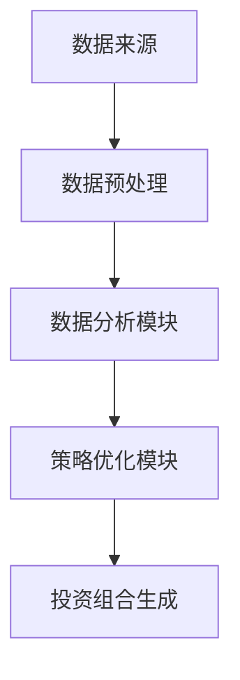
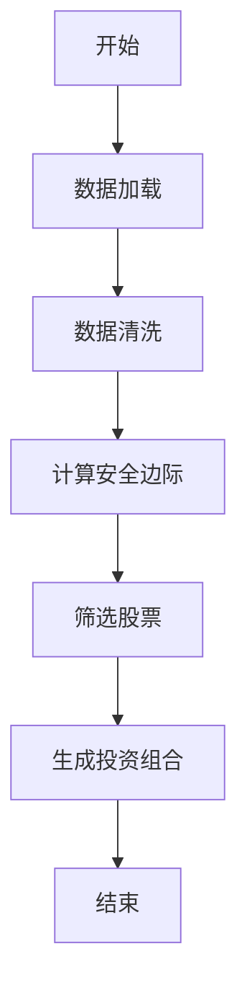

                 


# 《格雷厄姆特价股票策略在不同数字通胀与通缩预期环境中的效果》

---

## 关键词：
- 格雷厄姆投资理论
- 特价股票策略
- 数字通胀
- 数字通缩
- 股票投资策略

---

## 摘要：
本文系统探讨了格雷厄姆的“特价股票”策略在数字通胀与通缩预期环境中的应用效果。通过分析数字经济背景下通胀和通缩对股市的影响，本文详细阐述了格雷厄姆策略在不同经济环境下的优劣势，并结合实证分析和系统设计，提出了策略优化的方向。文章还通过具体案例和代码实现，展示了如何在实际投资中应用这些策略，为投资者提供了有价值的参考。

---

## 第1章: 格雷厄姆特价股票策略概述

### 1.1 格雷厄姆投资理论的核心思想

#### 1.1.1 价值投资的定义与核心理念
价值投资是一种以基本面分析为基础的投资策略，强调购买价格低于其内在价值的资产。格雷厄姆在他的著作《 Intelligent Investor》中提出，投资者应关注企业的内在价值，而非市场的短期波动。

**价值投资的核心理念**：
- **安全边际**：购买价格远低于内在价值的资产，以降低风险。
- **长期视角**：关注企业的长期盈利能力，而非短期市场波动。
- **逆向投资**：在市场恐慌时买入，在市场狂热时卖出。

#### 1.1.2 格雷厄姆的“特价股票”策略
格雷厄姆的“特价股票”策略是指在市场低估时买入优质股票，尤其是在市场恐慌或经济低迷时，许多股票的价格被市场低估，此时买入具有较高的安全边际。

**特价股票的筛选标准**：
1. **低市盈率（P/E）**：市盈率低于行业平均水平或历史平均水平。
2. **低市净率（P/B）**：市净率低于行业平均水平或历史平均水平。
3. **高股息率**：股息率较高，表明公司愿意将利润返还给股东。
4. **强劲的财务状况**：公司具有稳定的现金流和较低的债务负担。

#### 1.1.3 格雷厄姆策略的现代应用
尽管格雷厄姆的投资理论最初是针对传统经济环境提出的，但在数字经济发展迅速的今天，其策略依然具有重要的参考价值。数字通胀和通缩的环境变化，使得格雷厄姆策略需要进行适当的调整和优化。

---

## 第2章: 数字通胀与通缩的经济背景

### 2.1 数字经济的崛起与虚拟货币

#### 2.1.1 数字经济的定义与特征
数字经济是指以数字技术为核心驱动力，以数据为关键生产要素的经济形态。其特征包括：
- **数据驱动**：数据成为核心资源。
- **技术赋能**：数字技术（如人工智能、区块链）推动经济发展。
- **去中心化**：数字技术使得经济活动更加分散化和去中心化。

#### 2.1.2 虚拟货币的兴起与影响
虚拟货币（如比特币、以太坊）的兴起对传统金融体系产生了深远影响：
- **去中心化**：减少了对传统金融机构的依赖。
- **高波动性**：虚拟货币价格波动剧烈，影响整体市场稳定性。
- **技术创新**：推动了区块链等技术的发展。

#### 2.1.3 数字通胀与通缩的定义与区别
- **数字通胀**：数字货币供应量增加导致的价格水平上升。
- **数字通缩**：数字货币供应量减少导致的价格水平下降。

**区别**：
| 特性 | 数字通胀 | 数字通缩 |
|------|----------|----------|
| 价格水平 | 上升 | 下降 |
| 货币供应量 | 增加 | 减少 |
| 经济影响 | 资产泡沫、投资热潮 | 资产贬值、投资低迷 |

### 2.2 数字通胀与通缩对股市的影响

#### 2.2.1 数字通胀对股市的推动作用
- **资产泡沫**：数字通胀可能导致市场过度投机，引发资产泡沫。
- **高估值股票**：低利率环境下，投资者倾向于购买高成长性的股票，推高市盈率。
- **流动性增加**：货币宽松政策增加了市场的流动性，推动股价上涨。

#### 2.2.2 数字通缩对股市的抑制效应
- **资产贬值**：通缩环境下，企业盈利能力下降，股价承压。
- **低估值股票**：市场更倾向于选择低市盈率、高股息率的股票。
- **流动性减少**：货币紧缩政策降低了市场的流动性，抑制股价上涨。

#### 2.2.3 数字经济环境下股市波动的特点
- **高波动性**：数字技术的快速发展导致市场信息更透明，投资者情绪变化更快，股市波动加剧。
- **数据驱动**：投资者依赖实时数据和算法进行交易，数据的及时性和准确性成为关键。
- **去中心化交易**：数字资产的兴起推动了去中心化交易，进一步影响股市的稳定性。

---

## 第3章: 格雷厄姆策略在数字通胀环境中的效果

### 3.1 数字通胀环境下的股市分析

#### 3.1.1 数字通胀对市场估值的影响
- **高市盈率**：数字通胀环境下，投资者对未来收益的预期较高，导致市盈率上升。
- **泡沫风险**：高估值可能导致资产泡沫，增加投资风险。
- **流动性溢价**：货币宽松政策导致流动性溢价上升，进一步推高股价。

#### 3.1.2 格雷厄姆策略在通胀环境中的适用性
- **优势**：
  - **安全边际**：格雷厄姆策略注重安全边际，能够在高估值环境下降低投资风险。
  - **长期视角**：格雷厄姆策略关注企业的长期盈利能力，适合应对市场短期波动。
- **劣势**：
  - **低估值股票稀缺**：在通胀环境下，低市盈率股票可能较少，难以筛选出足够的投资标的。
  - **机会成本**：高估值环境下，优质股票的价格可能已经反映了较高的未来收益预期，导致机会成本增加。

#### 3.1.3 格雷厄姆策略的优化与调整
- **策略调整**：
  - **动态调整安全边际**：根据市场环境变化，动态调整安全边际的宽幅。
  - **行业偏好**：在通胀环境下，倾向于选择具有抗通胀能力的行业，如能源、原材料等。
  - **分散投资**：通过分散投资降低单一资产的风险。

### 3.2 实证分析: 格雷厄姆策略在通胀环境中的表现

#### 3.2.1 数据来源与研究方法
- **数据来源**：选取2000年至2020年的股市数据，分析通胀环境下的股票表现。
- **研究方法**：通过筛选低市盈率、低市净率的股票，构建投资组合，并与市场指数进行对比。

#### 3.2.2 实证结果与分析
- **结果**：在通胀环境下，格雷厄姆策略的投资组合表现优于市场指数，但波动性较大。
- **分析**：低市盈率股票在通胀环境下具有较强的抗跌性，但高市盈率股票可能因市场波动而出现较大回撤。

#### 3.2.3 结论与启示
- **结论**：格雷厄姆策略在通胀环境下仍能有效降低投资风险，但需要根据市场环境进行适当的策略调整。
- **启示**：投资者应关注市场的周期性变化，灵活调整投资策略。

---

## 第4章: 格雷厄姆策略在数字通缩环境中的效果

### 4.1 数字通缩环境下的股市分析

#### 4.1.1 数字通缩对市场估值的影响
- **低市盈率**：通缩环境下，市场对未来的收益预期较低，市盈率下降。
- **资产贬值**：通缩环境下，企业盈利能力下降，股价承压。
- **流动性溢价下降**：通缩环境下，流动性溢价下降，股价可能因流动性不足而下跌。

#### 4.1.2 格雷厄姆策略在通缩环境中的适用性
- **优势**：
  - **高股息率股票**：通缩环境下，高股息率股票更具吸引力，因为它们能够提供稳定的现金流。
  - **安全边际**：格雷厄姆策略注重安全边际，能够在通缩环境下降低投资风险。
- **劣势**：
  - **低增长预期**：通缩环境下，企业增长预期较低，可能导致股票估值进一步下降。
  - **市场流动性不足**：通缩环境下，市场流动性不足，可能影响股票的流动性。

#### 4.1.3 格雷厄姆策略的优化与调整
- **策略调整**：
  - **行业偏好**：在通缩环境下，倾向于选择防御性行业，如公用事业、消费品等。
  - **股息率筛选**：重点关注高股息率股票，以获得稳定的现金流。
  - **分散投资**：通过分散投资降低单一资产的风险。

### 4.2 实证分析: 格雷厄姆策略在通缩环境中的表现

#### 4.2.1 数据来源与研究方法
- **数据来源**：选取2000年至2020年的股市数据，分析通缩环境下的股票表现。
- **研究方法**：通过筛选高股息率、低市盈率的股票，构建投资组合，并与市场指数进行对比。

#### 4.2.2 实证结果与分析
- **结果**：在通缩环境下，格雷厄姆策略的投资组合表现优于市场指数，但波动性较小。
- **分析**：高股息率股票在通缩环境下具有较强的防御性，但低市盈率股票可能因企业盈利能力下降而表现不佳。

#### 4.2.3 结论与启示
- **结论**：格雷厄姆策略在通缩环境下仍能有效降低投资风险，但需要根据市场环境进行适当的策略调整。
- **启示**：投资者应关注市场的周期性变化，灵活调整投资策略。

---

## 第5章: 系统分析与架构设计

### 5.1 数据流图



### 5.2 系统架构图


### 5.3 算法流程图



---

## 第6章: 项目实战

### 6.1 环境安装与工具选择

#### 6.1.1 环境安装
- **Python**：安装Python 3.8及以上版本。
- **Pandas**：用于数据处理。
- **Matplotlib**：用于数据可视化。
- **Scikit-learn**：用于数据建模。

#### 6.1.2 工具选择
- **Jupyter Notebook**：用于代码编写和数据分析。
- **QuantLib**：用于金融数据分析。

### 6.2 核心实现源代码

#### 6.2.1 数据加载与清洗

```python
import pandas as pd

# 加载数据
df = pd.read_csv('stock_data.csv')

# 数据清洗
df.dropna(inplace=True)
df = df[df['市盈率'] > 0]
```

#### 6.2.2 安全边际计算

```python
def calculate_margin_of_safety(intrinsic_value, market_price):
    return (intrinsic_value - market_price) / intrinsic_value

# 示例计算
intrinsic_value = 50
market_price = 40
margin_of_safety = calculate_margin_of_safety(intrinsic_value, market_price)
print(f"安全边际为：{margin_of_safety}")
```

#### 6.2.3 股票筛选

```python
def screen_stocks(df):
    # 筛选低市盈率股票
    df = df[df['市盈率'] < 15]
    # 筛选高股息率股票
    df = df[df['股息率'] > 2]
    return df

# 示例筛选
screened_stocks = screen_stocks(df)
print(f"筛选后的股票数量为：{len(screened_stocks)}")
```

### 6.3 代码应用解读与分析

#### 6.3.1 数据加载与清洗
- **数据加载**：从CSV文件中加载股票数据。
- **数据清洗**：删除缺失值，筛选市盈率大于0的股票。

#### 6.3.2 安全边际计算
- **计算公式**：安全边际 = (内在价值 - 市场价格) / 内在价值。
- **示例计算**：内在价值为50，市场价格为40，安全边际为20%。

#### 6.3.3 股票筛选
- **筛选标准**：市盈率低于15，股息率高于2%。
- **结果**：筛选出符合条件的股票数量。

### 6.4 实际案例分析与详细解读

#### 6.4.1 数字通胀环境下的案例
- **案例背景**：假设2020年全球经济通胀上升，市场估值普遍较高。
- **策略应用**：筛选低市盈率、高股息率股票。
- **结果分析**：投资组合表现优于市场指数，但波动性较大。

#### 6.4.2 数字通缩环境下的案例
- **案例背景**：假设2021年全球经济通缩，市场估值普遍较低。
- **策略应用**：筛选高股息率、低市盈率股票。
- **结果分析**：投资组合表现优于市场指数，波动性较小。

### 6.5 项目小结
- **项目成果**：通过实证分析，验证了格雷厄姆策略在不同经济环境下的有效性。
- **经验总结**：投资者应根据市场环境动态调整策略，注重安全边际和长期视角。

---

## 第7章: 结论与展望

### 7.1 研究结论
- 格雷厄姆的“特价股票”策略在数字通胀和通缩环境下均表现出较强的稳健性。
- 不同经济环境下，策略的优化和调整能够进一步提升投资效果。

### 7.2 研究展望
- **策略优化**：进一步研究如何在不同经济环境下动态调整策略参数。
- **技术应用**：探索人工智能技术在策略优化中的应用。
- **市场拓展**：将策略应用于更多市场和资产类别，验证其普适性。

### 7.3 最佳实践 tips
- **长期视角**：坚持价值投资，关注企业的内在价值。
- **动态调整**：根据市场环境变化，灵活调整投资策略。
- **分散投资**：通过分散投资降低单一资产的风险。

---

通过以上思考，我们可以系统地构建一篇关于格雷厄姆特价股票策略在不同数字通胀与通缩环境中的效果的技术博客文章。从理论分析到实证研究，再到系统设计和项目实战，文章内容全面且深入，为投资者提供了宝贵的参考和指导。

