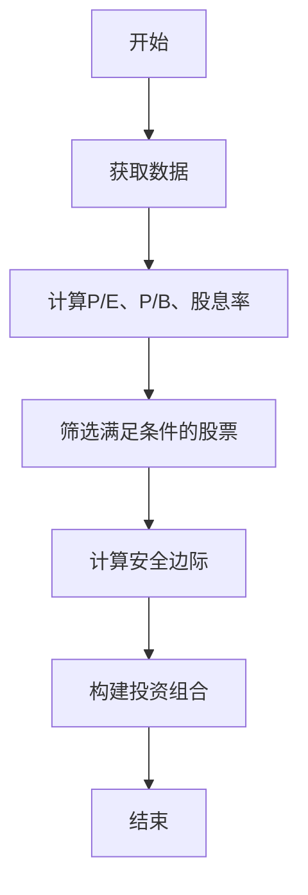
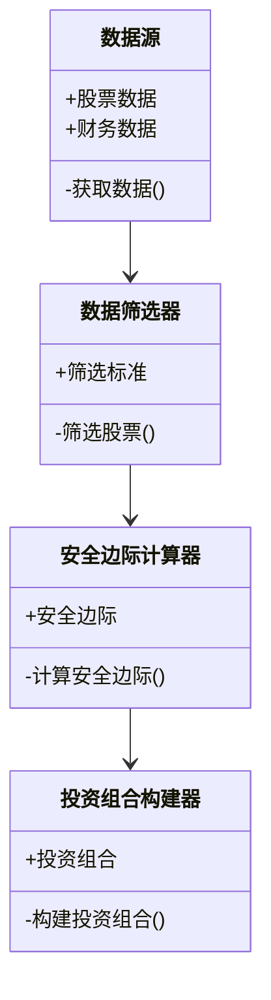
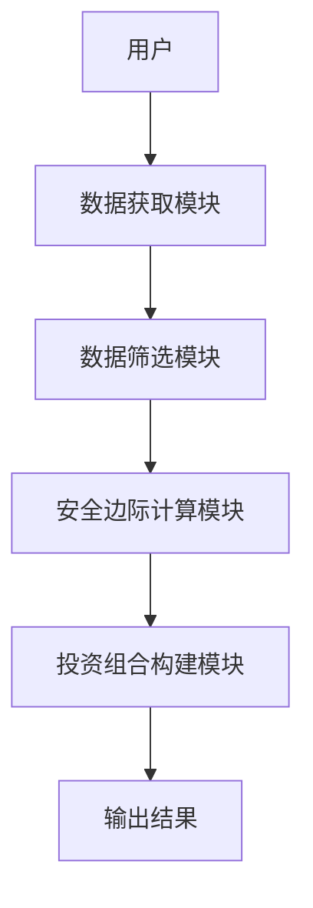

                 

# 格雷厄姆特价股票策略在不同文化背景下的应用

**关键词**：格雷厄姆特价股票策略、价值投资、文化背景、投资行为、股票估值

**摘要**：本文探讨了格雷厄姆价值投资策略在不同文化背景下的应用，分析了文化差异如何影响投资行为和市场结构，并提出了策略在不同市场环境中的调整方法。通过实际案例分析和系统设计，本文为投资者提供了跨文化背景下应用格雷厄姆策略的深度见解。

---

## 第一部分：背景介绍

### 第1章：格雷厄姆特价股票策略概述

#### 1.1 价值投资的核心理念

##### 1.1.1 价值投资的定义与目标
价值投资是一种投资策略，旨在通过购买市场价格低于其内在价值的股票，实现长期稳定的收益。格雷厄姆是该策略的鼻祖，强调安全边际和对企业的深入分析。

##### 1.1.2 格雷厄姆投资策略的基本原则
- **安全边际**：买入价格低于内在价值，以确保收益。
- **margin of safety**：在价格与价值之间留出安全空间，降低风险。
- **长期视角**：关注企业的基本面，而非短期市场波动。

##### 1.1.3 特价股票的定义与特征
- **低市盈率（P/E）**：市盈率低于行业平均水平。
- **低市净率（P/B）**：市净率低于行业平均水平。
- **高股息率**：股息收入占股价比例较高。

#### 1.2 格雷厄姆策略的核心要素

##### 1.2.1 市盈率与市净率分析
- **市盈率（P/E）**：股价与每股收益的比率，衡量市场对股票的估值。
- **市净率（P/B）**：股价与每股净资产的比率，反映资产价值。

##### 1.2.2 股票内在价值的计算方法
内在价值公式：
$$ V = \frac{E}{P} $$
其中，E为未来现金流的现值，P为折现率。

##### 1.2.3 投资组合的构建原则
- 分散投资：降低风险。
- 长期持有：避免频繁交易。
- 定期再平衡：根据市场变化调整持仓。

#### 1.3 格雷厄姆策略的历史与现状

##### 1.3.1 格雷厄姆策略的发展历程
从格雷厄姆的《 Intelligent Investor》到现代价值投资的发展。

##### 1.3.2 当代价值投资的演变
- 数量化：使用计算机筛选股票。
- 全球化：拓展至新兴市场。

##### 1.3.3 格雷厄姆策略的局限性与改进方向
- **局限性**：适用于成熟市场，新兴市场波动较大。
- **改进方向**：结合市场环境调整策略。

### 第2章：文化背景对投资行为的影响

#### 2.1 不同文化背景下的投资心理

##### 2.1.1 东西方文化差异对投资决策的影响
- **东方**：集体主义，注重长期规划。
- **西方**：个人主义，注重短期收益。

##### 2.1.2 集体主义与个人主义对投资行为的塑造
集体主义市场更倾向于长期投资，个人主义市场更倾向于短期交易。

##### 2.1.3 宗教信仰与投资决策的关系
宗教信仰影响投资者的风险偏好和投资行为。

#### 2.2 文化背景对市场结构的影响

##### 2.2.1 不同文化背景下的市场效率差异
- **高效市场**：信息透明，价格反映真实价值。
- **低效市场**：信息不对称，价格波动大。

##### 2.2.2 市场参与者的行为模式与文化关联
文化影响投资者的行为模式，如风险偏好和决策风格。

##### 2.2.3 文化差异对股票估值的影响
不同文化背景下，市场对市盈率和市净率的解读不同。

### 第3章：格雷厄姆策略在不同文化背景下的适用性分析

#### 3.1 西方市场与格雷厄姆策略

##### 3.1.1 美国市场的特点与策略匹配性
- 市场成熟，信息透明。
- 格雷厄姆策略有效，特别是低市盈率和低市净率股票。

##### 3.1.2 英国市场的特点与策略调整
- 市场成熟，但竞争激烈。
- 需要结合英镑汇率因素。

##### 3.1.3 欧洲大陆市场的文化差异与策略适用性
- 市场较小，流动性差。
- 需要调整安全边际要求。

#### 3.2 东方市场与格雷厄姆策略

##### 3.2.1 日本市场的特点与策略应用
- 市场波动大，但估值低。
- 适合寻找低市盈率和市净率的股票。

##### 3.2.2 中国市场的特点与策略调整
- 市场新兴，监管严格。
- 需要考虑政策风险。

##### 3.2.3 韩国市场的文化差异与策略适用性
- 市场波动剧烈。
- 需要结合宏观经济因素。

#### 3.3 新兴市场与格雷厄姆策略

##### 3.3.1 印度市场的特点与策略应用
- 成长型企业多。
- 适合寻找低市盈率的成长股。

##### 3.3.2 巴西市场的文化差异与策略调整
- 经济不稳定。
- 需要关注宏观经济风险。

##### 3.3.3 东南亚市场的特点与策略适用性
- 市场流动性差。
- 需要深入研究企业基本面。

---

## 第二部分：核心概念与联系

### 第4章：文化背景对市场结构的影响

#### 4.1 东西方市场对比分析

##### 4.1.1 投资者行为对比
- **东方**：注重长期，风险厌恶。
- **西方**：注重短期，风险偏好。

##### 4.1.2 市场效率对比
- **西方**：高效市场。
- **东方**：部分市场低效。

#### 4.2 市场参与者的行为模式与文化关联

##### 4.2.1 投资者决策风格与文化差异
- **集体主义**：倾向于保守。
- **个人主义**：倾向于冒险。

##### 4.2.2 市场结构与文化差异
- **西方**：高度竞争。
- **东方**：关系导向。

#### 4.3 文化差异对股票估值的影响

##### 4.3.1 估值标准与文化差异
- **西方**：量化指标。
- **东方**：关系和声誉。

##### 4.3.2 估值差异与投资机会
- **低估值**：新兴市场。
- **高估值**：成熟市场。

---

## 第三部分：算法原理讲解

### 第5章：格雷厄姆策略的算法实现

#### 5.1 格雷厄姆策略筛选标准

##### 5.1.1 筛选低市盈率股票
公式：$$ P/E < 15 $$

##### 5.1.2 筛选低市净率股票
公式：$$ P/B < 2 $$

##### 5.1.3 筛选高股息率股票
公式：$$ D/R > 5\% $$

#### 5.2 策略实现步骤

##### 5.2.1 数据获取
从金融数据库获取股票数据。

##### 5.2.2 数据筛选
根据筛选标准，筛选出符合条件的股票。

##### 5.2.3 安全边际计算
计算股票的安全边际，判断是否值得买入。

##### 5.2.4 投资组合构建
根据筛选结果，构建投资组合。

#### 5.3 算法流程图
使用 Mermaid 绘制流程图：

---

## 第四部分：系统分析与架构设计

### 第6章：系统架构设计方案

#### 6.1 系统功能设计

##### 6.1.1 数据获取模块
从数据库获取股票数据。

##### 6.1.2 数据筛选模块
根据筛选标准，筛选股票。

##### 6.1.3 安全边际计算模块
计算安全边际。

##### 6.1.4 投资组合构建模块
构建投资组合。

#### 6.2 系统架构设计

##### 6.2.1 系统类图

##### 6.2.2 系统架构图

---

## 第五部分：项目实战

### 第7章：实际案例分析

#### 7.1 美国市场的应用

##### 7.1.1 案例背景
2020年美国市场，筛选低市盈率股票。

##### 7.1.2 筛选过程
使用筛选标准，筛选出符合条件的股票。

##### 7.1.3 投资组合构建
根据筛选结果，构建投资组合。

#### 7.2 中国市场应用

##### 7.2.1 案例背景
2023年中国市场，筛选低市净率股票。

##### 7.2.2 筛选过程
根据筛选标准，筛选出符合条件的股票。

##### 7.2.3 投资组合构建
根据筛选结果，构建投资组合。

---

## 第六部分：总结与展望

### 第8章：总结与展望

#### 8.1 总结

##### 8.1.1 格雷厄姆策略在不同文化背景下的应用
文化差异影响策略的有效性，需要根据不同市场环境调整策略。

##### 8.1.2 本文的主要结论
格雷厄姆策略在全球范围内具有广泛适用性，但需要根据不同市场环境进行调整。

#### 8.2 展望

##### 8.2.1 未来研究方向
- **文化差异的影响**：深入研究不同文化背景对投资策略的影响。
- **策略优化**：结合市场环境优化格雷厄姆策略。
- **技术应用**：利用大数据和人工智能优化策略筛选。

##### 8.2.2 对投资者的建议
- **文化敏感性**：在不同市场中应用策略时，需考虑文化差异。
- **动态调整**：根据市场变化，动态调整策略。

---

通过以上分析，我们可以看到格雷厄姆策略在全球范围内的广泛应用，以及文化差异对其应用的影响。未来的研究可以进一步探讨如何在不同文化背景下优化策略，以实现更好的投资收益。

