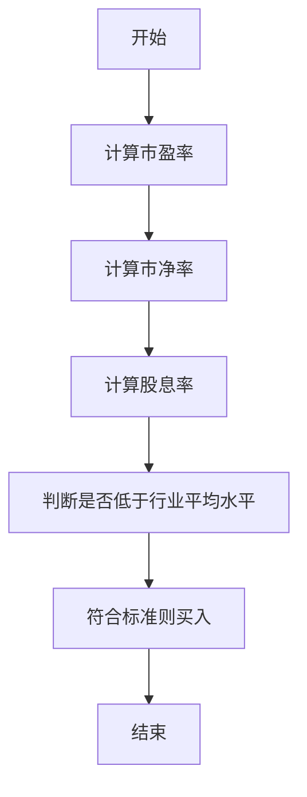
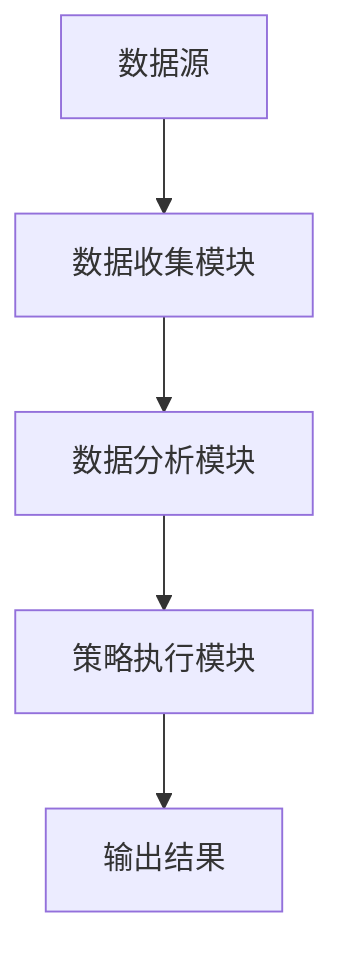
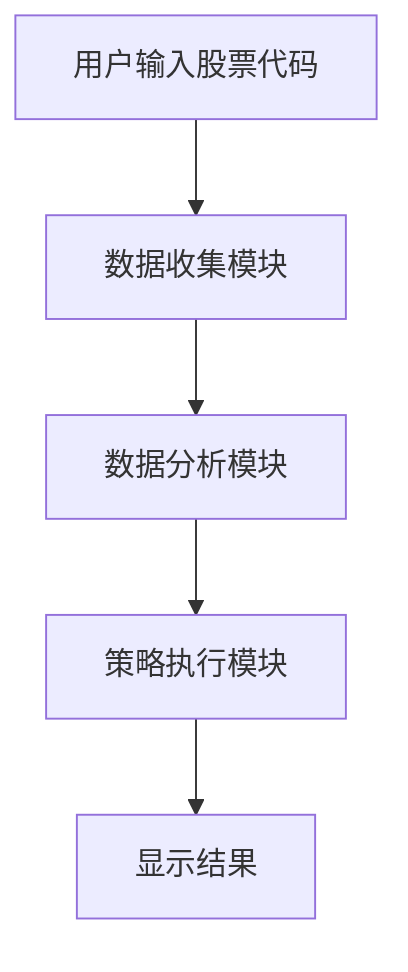

                 


# 格雷厄姆特价股票策略在不同经济体制下的表现

> 关键词：格雷厄姆投资策略、特价股票、经济体制、价值投资、股票分析

> 摘要：本文深入分析了格雷厄姆的价值投资策略在不同经济体制下的表现，探讨了其在牛市、熊市、通货膨胀和通货紧缩等经济环境中的适用性。通过数学模型和实际案例，本文揭示了格雷厄姆策略的核心原理及其在实际投资中的应用。

---

## 第一部分: 格雷厄姆特价股票策略概述

### 第1章: 格雷厄姆特价股票策略的核心概念

#### 1.1 格雷厄姆特价股票策略的起源与背景

格雷厄姆特价股票策略是价值投资理论的重要组成部分，由本杰明·格雷厄姆提出。该策略的核心在于寻找市场价格低于其内在价值的股票，即“特价股票”。这种策略强调长期投资，注重基本面分析，而非短期市场波动。

- **价值投资的起源**：20世纪30年代，格雷厄姆与大卫·多德共同提出了价值投资的理念，认为市场波动往往导致股票价格偏离其内在价值，投资者应寻找这些被低估的股票进行长期投资。

- **核心思想**：格雷厄姆认为，股票价格经常被市场情绪左右，而内在价值可以通过分析公司的财务状况、盈利能力等基本面指标来评估。投资者应寻找市场价格低于内在价值的股票。

- **特价股票的定义与特征**：特价股票是指市场价格低于其账面价值或其他关键指标（如市盈率、市净率）的股票。这类股票通常被认为具有较高的安全边际，即市场价格下跌的空间有限，而上涨的潜力较大。

#### 1.2 格雷厄姆策略的核心指标

格雷厄姆策略依赖于几个关键的财务指标来评估股票的价值。以下是这些指标的详细分析：

- **市盈率（P/E）**：市盈率是股票市场价格与每股收益的比率。格雷厄姆认为，市盈率低于15倍的股票具有投资价值。公式如下：

$$ P/E = \frac{Price}{Earnings} $$

- **市净率（P/B）**：市净率是股票市场价格与每股账面价值的比率。格雷厄姆建议投资者关注市净率低于1.5倍的股票，公式如下：

$$ P/B = \frac{Price}{Book\ Value} $$

- **股息率**：股息率是股票的年股息与股票价格的比率。格雷厄姆认为，股息率高的股票通常具有较高的稳定性，公式如下：

$$ Dividend\ Yield = \frac{Dividend}{Price} $$

#### 1.3 格雷厄姆策略在不同经济周期的表现

格雷厄姆策略在不同经济周期中的表现因市场环境而异。以下是几种主要经济周期下的策略表现：

- **牛市环境**：在牛市中，市场情绪高涨，股票价格往往被高估。格雷厄姆策略在这种环境下表现不佳，因为其核心是寻找被低估的股票，而牛市中低价股票较少。

- **熊市环境**：熊市中，市场情绪低落，股票价格普遍下跌。格雷厄姆策略在这种环境下表现较好，因为许多股票价格低于其内在价值，提供了较好的买入机会。

- **通货膨胀环境**：通货膨胀会导致利率上升，影响企业的盈利能力。格雷厄姆策略在这种环境下需要调整，因为高通胀可能使得市盈率和市净率的评估失效。

- **通货紧缩环境**：通货紧缩会导致企业盈利下降，但股票价格也可能被低估。格雷厄姆策略在这种环境下可能表现较好，因为许多股票价格低于其账面价值。

### 第2章: 格雷厄姆策略的核心原理与数学模型

#### 2.1 格雷厄姆策略的数学模型

格雷厄姆策略通过几个关键的财务指标来评估股票的内在价值。以下是这些指标的详细分析：

- **市盈率模型**：市盈率是股票市场价格与每股收益的比率，公式如下：

$$ P/E = \frac{Price}{Earnings} $$

- **市净率模型**：市净率是股票市场价格与每股账面价值的比率，公式如下：

$$ P/B = \frac{Price}{Book\ Value} $$

- **股息率模型**：股息率是股票的年股息与股票价格的比率，公式如下：

$$ Dividend\ Yield = \frac{Dividend}{Price} $$

#### 2.2 格雷厄姆策略的决策流程

格雷厄姆策略的决策流程是一个系统化的过程，旨在筛选出具有投资价值的股票。以下是决策流程的详细步骤：



#### 2.3 格雷厄姆策略的经济环境适应性分析

格雷厄姆策略在不同经济环境下的表现因市场环境而异。以下是几种主要经济周期下的策略表现：

- **牛市环境**：在牛市中，市场情绪高涨，股票价格往往被高估。格雷厄姆策略在这种环境下表现不佳，因为其核心是寻找被低估的股票，而牛市中低价股票较少。

- **熊市环境**：熊市中，市场情绪低落，股票价格普遍下跌。格雷厄姆策略在这种环境下表现较好，因为许多股票价格低于其内在价值，提供了较好的买入机会。

- **通货膨胀环境**：通货膨胀会导致利率上升，影响企业的盈利能力。格雷厄姆策略在这种环境下需要调整，因为高通胀可能使得市盈率和市净率的评估失效。

- **通货紧缩环境**：通货紧缩会导致企业盈利下降，但股票价格也可能被低估。格雷厄姆策略在这种环境下可能表现较好，因为许多股票价格低于其账面价值。

---

## 第二部分: 格雷厄姆特价股票策略的算法原理

### 第3章: 格雷厄姆策略的算法实现

#### 3.1 格雷厄姆策略的数学模型

格雷厄姆策略的数学模型基于以下几个关键指标：

- **市盈率（P/E）**：$P/E = \frac{Price}{Earnings}$

- **市净率（P/B）**：$P/B = \frac{Price}{Book\ Value}$

- **股息率**：$Dividend\ Yield = \frac{Dividend}{Price}$

#### 3.2 格雷厄姆策略的决策流程

以下是格雷厄姆策略的决策流程的详细步骤：


#### 3.3 格雷厄姆策略的Python实现

以下是格雷厄姆策略的Python实现示例：

```python
import pandas as pd
import yfinance as yf

# 下载股票数据
stock_data = yf.download('AAPL', start='2020-01-01', end='2023-12-31')

# 计算市盈率
stock_data['PE'] = stock_data['Close'] / stock_data['EPS']

# 计算市净率
stock_data['PB'] = stock_data['Close'] / stock_data['Book Value']

# 计算股息率
stock_data['Dividend Yield'] = stock_data['Dividend'] / stock_data['Close']

# 筛选满足格雷厄姆标准的股票
selected_stocks = stock_data[stock_data['PE'] < 15 & stock_data['PB'] < 1.5 & stock_data['Dividend Yield'] > 2]
```

---

## 第三部分: 格雷厄姆策略的系统分析与架构设计

### 第4章: 系统架构设计

#### 4.1 系统功能设计

以下是格雷厄姆策略系统的功能设计：

- **数据收集模块**：收集股票的财务数据，包括市盈率、市净率、股息率等。

- **数据分析模块**：对收集到的数据进行分析，计算各项指标，并判断是否符合格雷厄姆策略的标准。

- **策略执行模块**：根据分析结果，执行买入或卖出操作。

#### 4.2 系统架构设计

以下是格雷厄姆策略系统的架构设计：



#### 4.3 系统接口设计

以下是格雷厄姆策略系统的接口设计：

- **输入接口**：股票代码、时间范围。

- **输出接口**：符合条件的股票列表、买入建议。

#### 4.4 系统交互设计

以下是格雷厄姆策略系统的交互设计：



---

## 第四部分: 格雷厄姆策略的项目实战

### 第5章: 项目实战

#### 5.1 环境安装

以下是项目实战所需的环境安装步骤：

1. 安装Python。

2. 安装Pandas和yfinance库。

#### 5.2 核心代码实现

以下是格雷厄姆策略的Python代码实现：

```python
import pandas as pd
import yfinance as yf

# 下载股票数据
stock_data = yf.download('AAPL', start='2020-01-01', end='2023-12-31')

# 计算市盈率
stock_data['PE'] = stock_data['Close'] / stock_data['EPS']

# 计算市净率
stock_data['PB'] = stock_data['Close'] / stock_data['Book Value']

# 计算股息率
stock_data['Dividend Yield'] = stock_data['Dividend'] / stock_data['Close']

# 筛选满足格雷厄姆标准的股票
selected_stocks = stock_data[stock_data['PE'] < 15 & stock_data['PB'] < 1.5 & stock_data['Dividend Yield'] > 2]
```

#### 5.3 实际案例分析

以下是格雷厄姆策略在实际案例中的应用：

假设当前市场环境下，某股票的市盈率为12，市净率为1.2，股息率为3%。根据格雷厄姆策略的标准，该股票符合投资条件，建议买入。

---

## 第五部分: 总结与展望

### 第6章: 总结与展望

#### 6.1 总结

格雷厄姆特价股票策略是一种基于价值投资理论的股票分析方法，通过寻找市场价格低于其内在价值的股票来实现长期稳定的收益。本文详细分析了格雷厄姆策略的核心原理、数学模型以及在不同经济环境下的表现，并通过实际案例展示了其在投资实践中的应用。

#### 6.2 展望

随着市场环境的变化，格雷厄姆策略需要不断调整和优化。未来的研究可以进一步探讨策略在不同经济体制下的表现，结合现代投资理论和技术分析方法，提升策略的适应性和收益能力。

---

### 附录

#### 附录A: 格雷厄姆策略的优缺点

- **优点**：
  - 长期稳定收益。
  - 低风险投资策略。
  - 适合长期投资者。

- **缺点**：
  - 短期表现不佳。
  - 市场波动影响策略效果。
  - 需要较高的财务分析能力。

#### 附录B: 格雷厄姆策略的注意事项

- **注意市场环境变化**：在不同经济环境下，格雷厄姆策略的表现有所不同，需根据市场环境调整投资策略。

- **关注财务指标**：投资者需密切关注市盈率、市净率和股息率等关键指标，确保投资决策的科学性。

- **分散投资**：为降低风险，投资者应分散投资，避免集中投资于某一只股票。

---

通过以上分析和实践，格雷厄姆特价股票策略在不同经济体制下的表现得到了全面的探讨。希望本文能为投资者提供有价值的参考，帮助他们在复杂的市场环境中做出明智的投资决策。

