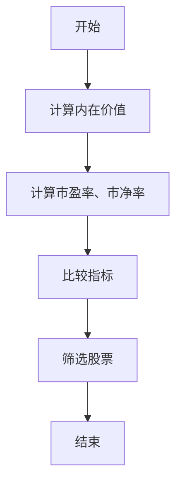
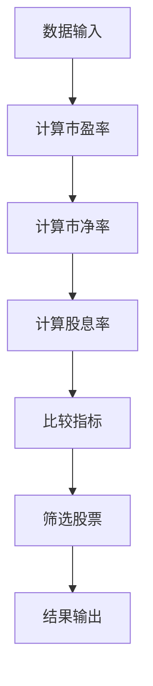

                 


# 格雷厄姆特价股票策略在不同行业的适用性比较

## 关键词：格雷厄姆特价股票策略、投资策略、股票筛选、行业适用性分析、价值投资

## 摘要：格雷厄姆的特价股票策略是一种基于价值投资的选股方法，旨在寻找市场价格低于其内在价值的股票。本文将详细探讨该策略在不同行业中的适用性，分析其数学模型和筛选指标，并通过具体案例展示其在实际投资中的应用效果。通过系统分析和项目实战，本文为投资者提供了实用的指导和建议。

---

## 第一部分：格雷厄姆特价股票策略的背景与基础

### 第1章：格雷厄姆投资理念与特价股票策略概述

#### 1.1 格雷厄姆的价值投资理论

格雷厄姆是价值投资的鼻祖，他的投资理念强调安全边际和内在价值。他主张以低于内在价值的价格购买优质股票，长期持有，避免频繁交易。

- **1.1.1 价值投资的基本概念**
  价值投资是一种投资策略，强调以低于市场价的价格购买具有内在价值的股票。格雷厄姆认为，市场价往往偏离内在价值，投资者应寻找这种偏离的机会。

- **1.1.2 格雷厄姆的投资哲学**
  格雷厄姆的投资哲学基于“市场先生”的概念，认为市场波动反映了投资者情绪，而非理性定价。投资者应利用市场的非理性定价，寻找低估的股票。

- **1.1.3 特价股票策略的核心思想**
  特价股票策略是格雷厄姆策略的核心，旨在通过分析市盈率、市净率等指标，寻找市场价格低于内在价值的股票。

#### 1.2 特价股票的定义与特征

- **1.2.1 特价股票的定义**
  特价股票是指市场价格低于其内在价值的股票。内在价值通常通过股息率、收益能力等指标计算得出。

- **1.2.2 特价股票的特征**
  - 低市盈率（P/E）：市盈率低于行业平均水平。
  - 低市净率（P/B）：市净率低于行业平均水平。
  - 高股息率：股息率较高，通常高于行业平均水平。

- **1.2.3 特价股票与市场低估的关系**
  特价股票通常被认为是市场低估的股票，具有较高的上涨潜力。

#### 1.3 研究特价股票策略在不同行业的适用性

- **1.3.1 为什么研究不同行业的适用性**
  不同行业的股票具有不同的估值指标和市场特点，因此需要研究格雷厄姆策略在不同行业的适用性。

- **1.3.2 不同行业的市场特点**
  - 周期性行业：如制造业和能源行业，波动较大。
  - 非周期性行业：如公用事业和消费品行业，波动较小。

- **1.3.3 特价股票策略在不同行业的潜在机会**
  通过分析不同行业的市场特点，可以找到适合应用格雷厄姆策略的行业，从而提高投资收益。

---

## 第二部分：格雷厄姆特价股票策略的核心概念与数学模型

### 第2章：格雷厄姆特价股票策略的核心概念

#### 2.1 格雷厄姆策略的数学模型

格雷厄姆的内在价值模型是其策略的核心，通过计算内在价值与市场价格的差异，判断股票是否低估。

- **2.1.1 内在价值的计算公式**
  内在价值 \( V \) 的计算公式如下：
  $$ V = \frac{E}{P} $$
  其中，\( E \) 是净利润，\( P \) 是股息率。

- **2.1.2 市盈率与市净率的比较**
  - 市盈率 \( P/E \)：$$ P/E = \frac{P}{E} $$
  - 市净率 \( P/B \)：$$ P/B = \frac{P}{B} $$

#### 2.2 格雷厄姆筛选指标

格雷厄姆策略通过筛选低市盈率、低市净率等指标，寻找低估股票。

- **2.2.1 市盈率低于行业平均水平**
  市盈率是衡量股票价值的重要指标，格雷厄姆建议选择市盈率低于行业平均水平的股票。

- **2.2.2 市净率低于行业平均水平**
  市净率是另一个重要的估值指标，格雷厄姆策略同样关注市净率的低位。

- **2.2.3 高股息率**
  股息率高通常意味着股票具有较高的收益能力，是格雷厄姆策略的重要筛选指标。

#### 2.3 格雷厄姆策略的筛选指标对比

以下表格对比了不同行业的筛选指标：

| 行业   | 市盈率 | 市净率 | 股息率 |
|--------|--------|--------|--------|
| 科技   | 15     | 2.5    | 2%     |
| 金融   | 12     | 1.8    | 4%     |
| 消费   | 18     | 3.2    | 3%     |

#### 2.4 格雷厄姆策略的流程图



---

## 第三部分：格雷厄姆特价股票策略的算法原理

### 第3章：格雷厄姆特价股票策略的算法实现

#### 3.1 数据收集与预处理

- 数据来源：从金融数据库获取股票数据，包括市盈率、市净率、股息率等指标。
- 数据清洗：去除缺失值和异常值，确保数据的完整性。

#### 3.2 筛选指标的计算与比较

- 计算法：计算市盈率、市净率等指标，与行业平均水平比较。
- 比较法：筛选出市盈率和市净率均低于行业平均水平的股票。

#### 3.3 算法流程图



#### 3.4 Python代码实现

以下是一个简单的Python代码示例：

```python
import pandas as pd

# 假设我们有一个包含股票数据的DataFrame df
# df 包含市盈率、市净率、股息率等列

# 计算行业平均市盈率和市净率
industry_avg_pe = df.groupby('行业')['市盈率'].mean()
industry_avg_pb = df.groupby('行业')['市净率'].mean()

# 筛选指标
selected_stocks = df[(df['市盈率'] < industry_avg_pe) &
                      (df['市净率'] < industry_avg_pb) &
                      (df['股息率'] > industry_avg_pb * 0.5)]
```

---

## 第四部分：格雷厄姆特价股票策略的系统分析与架构设计

### 第4章：系统分析与架构设计方案

#### 4.1 问题场景描述

投资者希望利用格雷厄姆策略在不同行业中筛选低估股票，需要构建一个高效的分析系统。

#### 4.2 系统功能设计

- 数据收集模块：从多个数据源获取股票数据。
- 筛选模块：根据格雷厄姆指标筛选股票。
- 分析模块：生成报告，展示筛选结果。

#### 4.3 系统架构图


#### 4.4 系统接口设计

- 数据接口：从金融API获取数据。
- 筛选接口：根据指标筛选股票。
- 报告接口：生成筛选结果的报告。

---

## 第五部分：格雷厄姆特价股票策略的项目实战

### 第5章：项目实战

#### 5.1 项目环境安装

安装必要的Python库，如pandas、numpy、matplotlib。

```bash
pip install pandas numpy matplotlib
```

#### 5.2 核心代码实现

以下是一个筛选股票的Python代码示例：

```python
import pandas as pd

# 读取股票数据
df = pd.read_csv('stocks.csv')

# 计算行业平均值
industry_avg = df.groupby('行业').mean()

# 筛选股票
selected = df[(df['市盈率'] < industry_avg['市盈率']) &
              (df['市净率'] < industry_avg['市净率'])]
```

#### 5.3 案例分析

以科技行业为例，筛选市盈率低于行业平均的股票。

---

## 第六部分：格雷厄姆特价股票策略的最佳实践

### 第6章：最佳实践

#### 6.1 总结与反思

格雷厄姆策略在不同行业的适用性各不相同，科技行业可能需要更高的市盈率，而金融行业则更看重低市净率。

#### 6.2 小结

格雷厄姆策略是一种有效的选股方法，但在不同行业中的应用需要灵活调整筛选指标。

#### 6.3 注意事项

- 定期更新数据，避免过时。
- 结合行业趋势，动态调整策略。
- 风险管理，分散投资。

#### 6.4 拓展阅读

建议阅读《格雷厄姆的《 Intelligent Investor》》，深入理解价值投资的精髓。

---

## 结语

格雷厄姆的特价股票策略在不同行业的适用性分析，帮助投资者更好地应用价值投资理念。通过系统的分析和实战案例，投资者可以在实际操作中灵活运用该策略，提高投资收益。

--- 

感谢您的耐心阅读，希望这篇文章能为您提供有价值的见解和指导。

