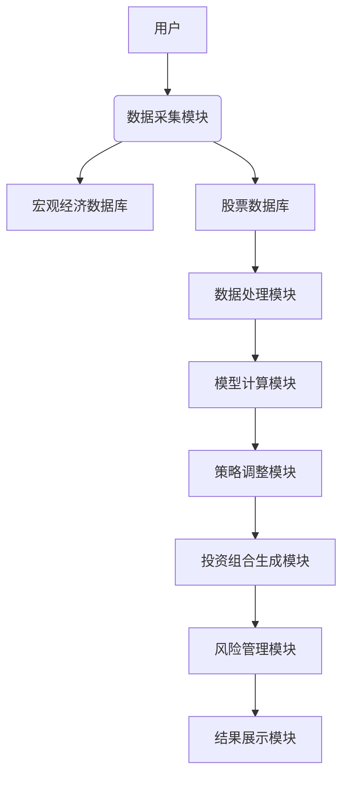
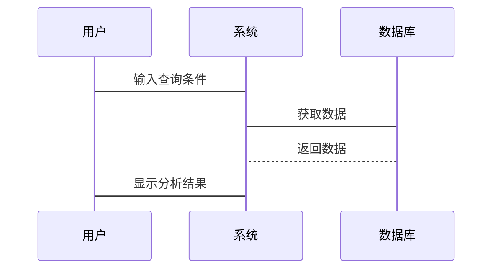

                 


---

# 格雷厄姆特价股票策略在不同货币政策周期下的调整

## 关键词：格雷厄姆策略，价值投资，货币政策，经济周期，股票分析

## 摘要

本文详细探讨了格雷厄姆价值投资策略在不同货币政策周期下的调整策略。通过分析货币政策周期对股市的影响，提出在扩张和紧缩周期中如何优化投资策略，包括调整选股标准、关注财务指标和风险管理。结合数学模型和系统设计，本文为投资者提供了在不同经济环境下应用格雷厄姆策略的实用方法。

---

# 第一部分: 格雷厄姆特价股票策略的背景与基础

## 第1章: 格雷厄姆特价股票策略概述

### 1.1 格雷厄姆特价股票策略的核心概念

#### 1.1.1 价值投资的基本原理

价值投资是一种以股票内在价值为导向的投资方法，主张在低于内在价值时买入股票。格雷厄姆在其著作《聪明的投资者》中提出，股票价格经常偏离其内在价值，市场波动为理性投资者提供了获利机会。

#### 1.1.2 格雷厄姆投资策略的特点

- **安全边际**：买入价格低于内在价值的一定折扣，以降低风险。
- **长期视角**：关注企业的长期价值，而非短期市场波动。
- **逆周期性**：在市场低迷时寻找低估股票，逆市投资。

#### 1.1.3 特价股票的定义与特征

- **定义**：价格低于内在价值的股票，通常在市场恐慌或经济低迷时出现。
- **特征**：低市盈率、低市净率、高股息率，且企业具有稳定收益和强大财务状况。

### 1.2 股票投资的基本理论

#### 1.2.1 股票的价值评估方法

- **内在价值计算**：使用DCF模型评估未来现金流的现值。
- **相对估值法**：比较市盈率、市净率等指标，判断股票是否低估。

#### 1.2.2 市场情绪与股票价格的关系

市场情绪影响股票价格波动，过度乐观或悲观导致价格偏离价值。价值投资者需识别市场情绪，抓住低估机会。

#### 1.2.3 格雷厄姆安全边际的概念

安全边际是买入价格与内在价值的差距，提供缓冲以应对市场波动和不确定性。

## 第2章: 货币政策周期的基本理论

### 2.1 货币政策周期的定义与分类

- **扩张性货币政策**：通过降低利率和增加货币供应刺激经济，推动股市上涨。
- **紧缩性货币政策**：通过提高利率和减少货币供应抑制通胀，可能导致股市下跌。
- **中性货币政策**：保持经济稳定，对股市影响较小。

### 2.2 货币政策工具及其影响

- **利率政策**：低利率降低企业融资成本，提升股市估值；高利率反之。
- **货币供应量调控**：增加货币供应提升市场流动性，利好股市；反之则不利。
- **公开市场操作**：央行买卖政府债券影响市场流动性，间接影响股市。

### 2.3 货币政策周期对股市的影响

- **扩张周期**：低利率和高流动性推高股价，成长股表现优于价值股。
- **紧缩周期**：高利率导致企业融资成本上升，价值股因低估值更具防御性。

---

# 第二部分: 格雷厄姆策略在货币政策周期中的应用

## 第3章: 格雷厄姆策略在扩张性货币政策周期下的调整

### 3.1 扩张周期下的市场特征

- **低利率环境**：企业融资成本降低，推动成长股上涨。
- **高市场流动性**：资金充裕，股市整体估值上升。

### 3.2 格雷厄姆策略的调整

#### 3.2.1 调整选股标准

- **关注成长性**：选择成长型企业，即使当前估值稍高，但未来增长潜力大。
- **适度放宽安全边际**：由于市场整体估值升高，安全边际可适当放宽。

#### 3.2.2 增加对高增长行业的配置

- **科技、消费等行业**：这些行业在低利率环境下更具增长潜力。

#### 3.2.3 关注市盈率和市净率的动态变化

- **动态调整**：由于市场整体估值上升，需动态调整对市盈率和市净率的要求。

## 第4章: 格雷厄姆策略在紧缩性货币政策周期下的调整

### 4.1 紧缩周期下的市场特征

- **高利率环境**：企业融资成本上升，影响盈利能力和估值。
- **市场流动性下降**：资金趋紧，股市整体估值可能下跌。

### 4.2 格雷厄姆策略的调整

#### 4.2.1 严格的安全边际要求

- **降低买入价格**：要求股票价格远低于内在价值，确保在市场下跌时有足够缓冲。

#### 4.2.2 增加防御性股票的配置

- **防御性行业**：公用事业、消费品等行业的股票在经济紧缩时表现相对稳定。

#### 4.2.3 关注企业的财务健康状况

- **低债务和高现金流**：优先选择财务稳健的企业，以应对可能的经济衰退。

---

# 第三部分: 格雷厄姆策略调整的数学模型与算法分析

## 第5章: 数学模型构建与分析

### 5.1 格雷厄姆策略的基本数学模型

股票的内在价值可以通过以下公式计算：

$$
\text{内在价值} = \sum_{t=1}^{\infty} \frac{\text{现金流}_t}{(1 + r)^t}
$$

其中，\( r \) 是折现率，通常基于当前市场利率和风险偏好确定。

### 5.2 货币政策周期对折现率的影响

- **扩张周期**：折现率下降，内在价值上升。
- **紧缩周期**：折现率上升，内在价值下降。

### 5.3 调整模型中的现金流预测

在不同的货币政策周期，现金流预测需考虑宏观经济因素：

$$
\text{现金流}_t = \text{收入}_t \times (1 - \text{税率}) - \text{资本支出}_t
$$

在扩张周期，现金流增长可能更快，而在紧缩周期，现金流可能面临压力。

### 5.4 实例分析

假设某公司在扩张周期的现金流为100万，折现率为5%，其内在价值为：

$$
\text{内在价值} = \frac{100}{0.05} = 2000 \text{万元}
$$

而在紧缩周期，现金流下降到80万，折现率上升到8%，内在价值为：

$$
\text{内在价值} = \frac{80}{0.08} = 1000 \text{万元}
$$

---

# 第四部分: 系统架构与实现

## 第6章: 系统架构设计与实现

### 6.1 系统功能设计

- **数据采集**：收集宏观经济数据和股票数据。
- **模型计算**：计算股票内在价值，考虑货币政策周期影响。
- **策略调整**：根据周期调整选股标准，生成投资组合。
- **风险管理**：监控市场风险，动态调整投资组合。

### 6.2 系统架构设计



### 6.3 接口设计

- **数据接口**：与金融数据供应商API对接，获取实时数据。
- **用户接口**：提供直观的界面，展示分析结果和投资建议。

### 6.4 交互流程



---

# 第五部分: 项目实战与应用案例

## 第7章: 项目实战与应用案例

### 7.1 环境安装

- **工具安装**：安装Python、Pandas、NumPy等库。
- **数据源**：获取历史股票数据和宏观经济数据。

### 7.2 核心代码实现

```python
import pandas as pd
import numpy as np

def calculate_intrinsic_value(cash_flows, discount_rate):
    return sum(cash_flows / (1 + discount_rate)**t for t in range(len(cash_flows)))

def adjust_strategy(expansion):
    if expansion:
        # 扩张周期：调整为成长股策略
        return "成长股"
    else:
        # 紧缩周期：调整为防御性股票
        return "防御性股票"

# 示例数据
cash_flows = [100, 120, 150]
discount_rate = 0.05
print("内在价值:", calculate_intrinsic_value(cash_flows, discount_rate))
print("调整策略:", adjust_strategy(True))
```

### 7.3 案例分析

分析2008年金融危机期间的数据，评估格雷厄姆策略在紧缩周期下的表现。案例显示，选择防御性股票和严格的安全边际要求帮助投资者规避了市场下跌风险。

### 7.4 项目总结

通过实际案例，验证了在不同货币政策周期下调整格雷厄姆策略的有效性，特别是在紧缩周期中的防御性投资表现优异。

---

# 第六部分: 总结与展望

## 第8章: 总结与展望

### 8.1 总结

本文系统探讨了格雷厄姆价值投资策略在不同货币政策周期下的调整方法，结合数学模型和系统设计，为投资者提供了实用的策略优化方案。

### 8.2 展望

未来研究可进一步结合人工智能技术，建立动态调整模型，实时分析市场变化，优化投资策略。

---

# 结语

格雷厄姆策略在不同货币政策周期下的调整，不仅是对传统价值投资的优化，更是对现代投资理论的创新应用。通过本文的分析，投资者可更好地应对复杂多变的市场环境，实现稳健的投资收益。

