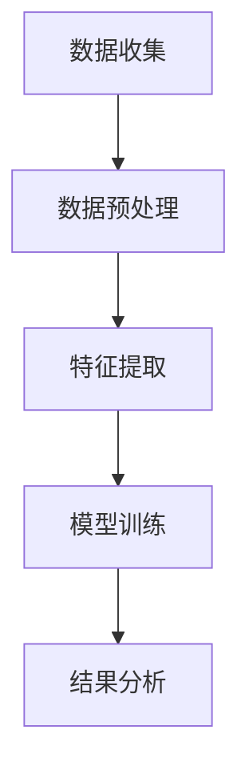
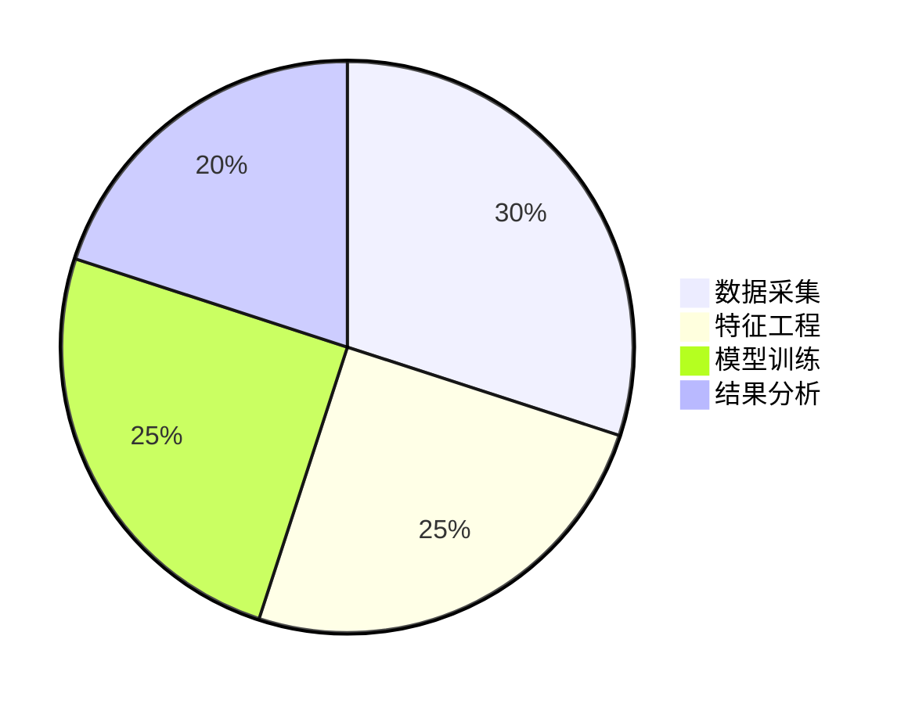
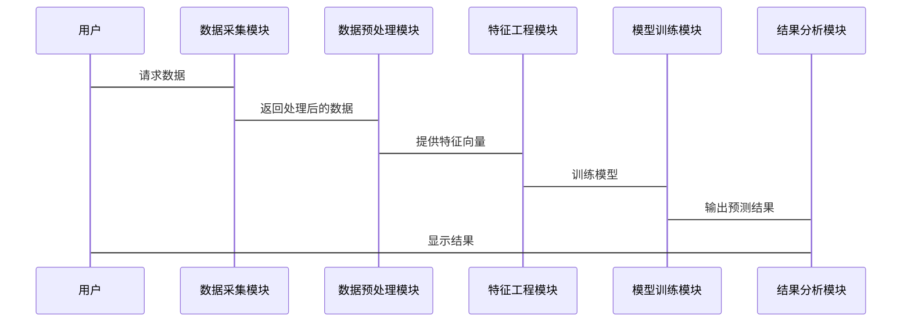

                 


# 格雷厄姆特价股票策略在人工智能产业的应用挑战

> 关键词：价值投资，人工智能，股票分析，大数据，机器学习，算法优化

> 摘要：本文探讨格雷厄姆的价值投资策略在人工智能产业中的应用挑战，分析AI技术如何提升股票分析效率，并介绍结合价值投资的AI系统架构和算法优化。

---

# 第一部分: 格雷厄姆特价股票策略与人工智能产业的结合

## 第1章: 格雷厄姆策略概述

### 1.1 价值投资的基本概念
- **1.1.1 核心理念**：寻找市场低估的股票，长期持有优质企业。
- **1.1.2 投资策略**：关注基本面分析，注重安全边际。

### 1.2 人工智能产业现状
- **1.2.1 技术发展**：从大数据到深度学习的演进。
- **1.2.2 应用领域**：金融领域的智能投顾与风险控制。
- **1.2.3 未来趋势**：AI驱动的自动化投资决策。

### 1.3 结合的必要性
- **1.3.1 价值投资的局限性**：依赖人工分析，效率低下。
- **1.3.2 人工智能的优势**：高效数据处理，精准预测。

---

## 第2章: 格雷厄姆策略在AI产业中的应用挑战

### 2.1 AI企业的估值方法
- **2.1.1 市盈率模型**：评估企业盈利能力。
- **2.1.2 市净率模型**：评估资产价值。

### 2.2 人工智能对股票分析的影响
- **2.2.1 大数据分析**：筛选潜在投资机会。
- **2.2.2 自然语言处理**：解析财务报告。
- **2.2.3 机器学习预测**：模型优化股票价格。

### 2.3 应用中的挑战
- **2.3.1 数据质量**：如何确保数据准确性。
- **2.3.2 模型解释性**：提升算法的可解释性。
- **2.3.3 市场波动性**：应对市场的不确定性。

---

## 第3章: 人工智能驱动的股票分析算法

### 3.1 核心算法介绍
- **3.1.1 线性回归模型**：预测股票价格。
- **3.1.2 支持向量机模型**：分类市场趋势。
- **3.1.3 随机森林模型**：特征重要性分析。

### 3.2 算法实现流程


### 3.3 算法优化
- **3.3.1 超参数调优**：提升模型性能。
- **3.3.2 集成学习**：结合多种算法优势。

---

## 第4章: 数学模型与系统架构

### 4.1 价值评估模型
$$ V = \frac{E}{P/E} $$
其中，\( E \) 为净利润，\( P/E \) 为市盈率。

### 4.2 系统架构设计


### 4.3 系统交互


---

## 第5章: 项目实战

### 5.1 环境搭建
- **工具安装**：Python、Scikit-learn、TensorFlow。

### 5.2 核心代码实现
```python
# 数据预处理
import pandas as pd
data = pd.read_csv('stock_data.csv')
data = data.dropna()

# 特征提取
features = data[['PE', 'PB', 'ROE']]
target = data['Price']

# 模型训练
from sklearn.ensemble import RandomForestRegressor
model = RandomForestRegressor(n_estimators=100)
model.fit(features, target)

# 结果分析
importances = pd.DataFrame({'feature': features.columns, 'importance': model.feature_importances_})
print(importances)
```

### 5.3 案例分析
- **案例选择**：选取AI企业，分析其财务数据。
- **结果解读**：评估模型预测的准确性和稳定性。

---

## 第6章: 总结与展望

### 6.1 总结
- 结合价值投资和人工智能的优势，提升股票分析效率。
- 突出AI技术在数据处理和预测中的作用。

### 6.2 展望
- **技术发展**：深度学习优化模型。
- **数据源扩展**：利用更多数据源提升预测精度。
- **可解释性提升**：改进算法解释性，增强投资者信任。

---

通过以上目录结构，文章系统地探讨了格雷厄姆策略在人工智能产业中的应用，从理论到实践，结合具体案例和技术实现，为读者提供全面的分析和见解。

