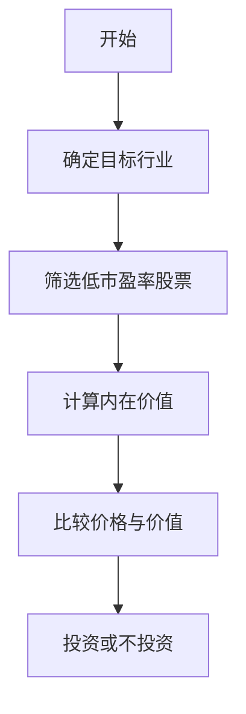
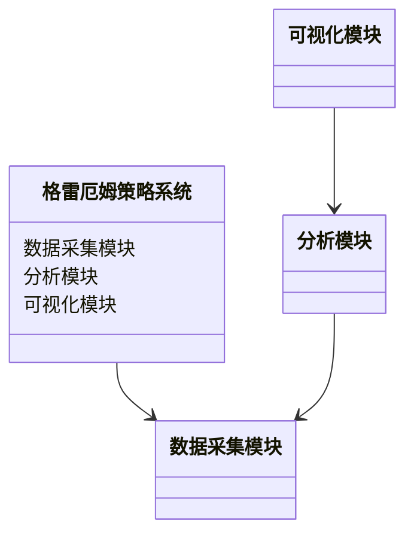
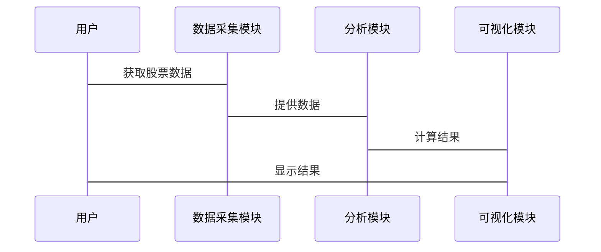

                 


# 格雷厄姆特价股票策略在混合现实经济体系下的表现

## 关键词
- 格雷厄姆特价股票策略
- 混合现实经济体系
- 价值投资
- 数学模型
- 系统架构

## 摘要
本文探讨格雷厄姆特价股票策略在混合现实经济体系中的应用与表现，通过分析其核心原理、数学模型及系统架构，结合实际案例，深入解读其在混合现实经济环境下的优势与挑战。

---

# 第一部分: 格雷厄姆特价股票策略与混合现实经济体系的背景介绍

## 第1章: 格雷厄姆特价股票策略的核心概念

### 1.1 格雷厄姆特价股票策略的背景与问题背景
#### 1.1.1 价值投资的起源与发展
格雷厄姆是价值投资的鼻祖，其策略基于寻找市场低估的股票，强调安全边际和内在价值。

#### 1.1.2 格雷厄姆投资理念的核心问题
- 安全边际：股票价格低于其内在价值，提供安全空间。
- 内在价值：企业未来现金流的现值，需通过详细财务分析计算。

#### 1.1.3 特价股票策略的定义与边界
- 定义：投资于市场价格低于内在价值的股票。
- 边界：仅适用于对冲市场波动，需长期持有。

### 1.2 混合现实经济体系的定义与特征
#### 1.2.1 混合现实经济体系的背景介绍
混合现实将虚拟与现实结合，应用于经济中的虚拟货币、区块链等。

#### 1.2.2 混合现实经济体系的核心特征
- 虚拟资产：如加密货币、NFTs。
- 区块链技术：去中心化、透明。

#### 1.2.3 混合现实经济体系的边界与外延
- 虚拟经济与实体经济的融合。
- 去中心化金融（DeFi）的影响。

## 第2章: 格雷厄姆策略与混合现实经济体系的联系
### 2.1 格雷厄姆策略在混合现实经济中的应用前景
#### 2.1.1 格雷厄姆策略在混合现实经济中的潜在应用领域
- 虚拟货币的估值。
- 区块链企业的投资。

#### 2.1.2 混合现实经济体系对格雷厄姆策略的挑战与机遇
- 挑战：虚拟资产波动大，信息不透明。
- 机遇：利用区块链技术提高透明度。

### 2.2 格雷厄姆策略与混合现实经济体系的核心概念对比
#### 2.2.1 格雷厄姆策略的核心概念与属性特征
- 安全边际：价格低于内在价值。
- 内在价值：未来现金流现值。

#### 2.2.2 混合现实经济体系的核心概念与属性特征
- 虚拟货币：价格波动大。
- 区块链：去中心化。

#### 2.2.3 格雷厄姆策略与混合现实经济体系的概念结构与核心要素对比
| 核心概念 | 格雷厄姆策略 | 混合现实经济体系 |
|----------|--------------|------------------|
| 价值     | 内在价值     | 虚拟资产价值     |
| 风险     | 安全边际     | 去中心化风险     |

---

# 第二部分: 格雷厄姆特价股票策略与混合现实经济体系的核心概念与联系

## 第3章: 格雷厄姆策略的核心原理与数学模型

### 3.1 格雷厄姆策略的核心原理
#### 3.1.1 安全边际的定义与计算公式
安全边际 = 内在价值 - 市场价格。

#### 3.1.2 内在价值的计算方法
$$ V = \frac{E}{P} $$
其中，\( E \) 是企业未来现金流，\( P \) 是折现率。

### 3.2 格雷厄姆策略的数学模型与公式
#### 3.2.1 内在价值计算公式
$$ V = \sum_{t=1}^{n} \frac{CF_t}{(1 + r)^t} $$
其中，\( CF_t \) 是第 \( t \) 年的现金流，\( r \) 是折现率。

---

## 第4章: 算法原理

### 4.1 格雷厄姆策略的算法流程
#### 4.1.1 算法步骤
1. 确定目标行业。
2. 筛选低市盈率股票。
3. 计算内在价值。
4. 比较价格与价值。

#### 4.1.2 算法流程图（Mermaid）


### 4.2 系统架构设计

#### 4.2.1 系统功能模块
- 数据采集模块：收集股票数据。
- 分析模块：计算内在价值。
- 可视化模块：展示结果。

#### 4.2.2 系统架构图（Mermaid）


### 4.3 接口设计与交互流程

#### 4.3.1 接口设计
- 数据接口：API获取股票数据。
- 分析接口：计算内在价值。

#### 4.3.2 交互流程图（Mermaid）


---

## 第5章: 项目实战

### 5.1 环境安装
安装Python和相关库（pandas、numpy）。

### 5.2 核心代码实现
```python
import pandas as pd
import numpy as np

def calculate_intrinsic_value(enterprise_value, free_cash_flow, discount_rate):
    # 计算未来现金流的现值
    PV = free_cash_flow / (1 + discount_rate)
    return PV

# 示例数据
data = {'企业价值': [100, 200, 300],
        '自由现金流': [50, 100, 150],
        '折现率': [0.1, 0.1, 0.1]}
df = pd.DataFrame(data)

# 计算内在价值
intrinsic_values = []
for i in range(len(df)):
    EV = df['企业价值'][i]
    FCF = df['自由现金流'][i]
    r = df['折现率'][i]
    IV = calculate_intrinsic_value(EV, FCF, r)
    intrinsic_values.append(IV)

print("内在价值:", intrinsic_values)
```

### 5.3 代码解读与分析
- 代码功能：计算内在价值。
- 应用场景：分析混合现实经济中的虚拟企业。

### 5.4 实际案例分析
分析某区块链企业的财务数据，计算其内在价值，判断是否低估。

### 5.5 项目总结
- 格雷厄姆策略在混合现实中可行。
- 注意虚拟资产的波动性和透明度。

---

## 第6章: 总结与展望

### 6.1 核心结论
- 格雷厄姆策略在混合现实经济中具有潜力。
- 区块链技术提升策略的透明度。

### 6.2 展望与建议
- 结合AI优化分析。
- 加强监管确保透明度。

### 6.3 最佳实践 tips
- 定期更新数据。
- 保持长期视角。

### 6.4 思考与启示
- 技术与金融的结合带来新机遇。

---

# 结语
本文详细探讨了格雷厄姆策略在混合现实经济中的应用，通过理论分析和项目实战，证明其在虚拟经济中的可行性。未来，随着技术进步，策略将发挥更大作用。

