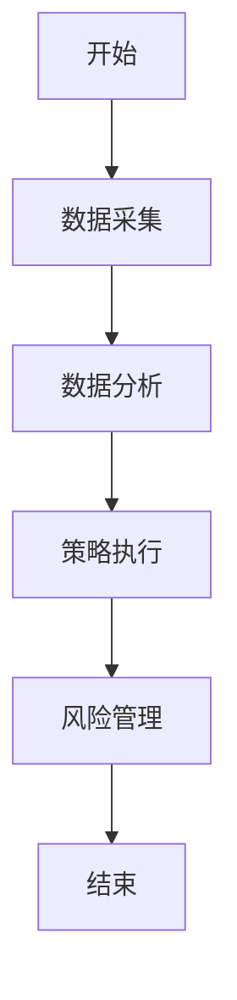

                 


# 格雷厄姆特价股票策略的长期效果分析

> 关键词：格雷厄姆，特价股票，长期效果，价值投资，安全边际，数学模型，系统架构

> 摘要：本文详细分析了 Benjamin Graham 的特价股票策略的长期效果。通过历史案例、数学模型和系统架构的深入探讨，揭示了该策略在不同市场环境下的表现和潜在风险。本文结合理论与实践，为投资者提供了科学的决策参考。

---

# 第一部分: 格雷厄姆投资理论的背景与核心思想

## 第1章: 格雷厄姆投资理论概述

### 1.1 格雷厄姆的生平与投资理念

#### 1.1.1 格雷厄姆的生平简介
Benjamin Graham 是20世纪的投资大师，被誉为“价值投资之父”。他于1894年出生在美国纽约，早年经历股市 crash 后开始研究投资理论，最终成为哥伦比亚大学的教授，并培养了包括 Warren Buffett 在内的众多投资大师。

#### 1.1.2 格雷厄姆投资理论的核心思想
格雷厄姆的核心思想是“安全边际”。他认为，投资者应该以低于股票内在价值的价格买入，从而在市场波动中获得超额收益。他强调，股票不仅仅是一种价格波动的金融工具，更是一种所有者权益的代表。

#### 1.1.3 格雷厄姆与价值投资的关系
格雷厄姆是价值投资的奠基人，他提出的“安全边际”和“内在价值”概念为后来的价值投资理论奠定了基础。他的方法强调基本面分析和长期投资，而非短期价格波动。

### 1.2 格雷厄姆的选股原则

#### 1.2.1 价值投资的核心原则
格雷厄姆的价值投资原则包括以下几点：
1. **安全边际**：买入价格低于内在价值。
2. **长期视角**：关注企业的长期盈利能力。
3. **分散投资**：通过投资多个企业降低风险。

#### 1.2.2 安全边际的概念与重要性
安全边际是指股票的市场价格低于其内在价值的部分。格雷厄姆认为，安全边际越大，投资的风险越小。通过安全边际，投资者可以在市场波动中保护自己的本金。

#### 1.2.3 股票内在价值的计算方法
格雷厄姆提出了一种基于企业未来现金流的内在价值计算方法。公式如下：
$$
\text{内在价值} = \sum_{t=1}^{n} \frac{\text{现金流}_t}{(1 + r)^t}
$$
其中，r 是折现率，n 是预测的时间跨度。

---

## 第2章: 特价股票策略的定义与特点

### 2.1 特价股票的定义

#### 2.1.1 特价股票的定义与范围
特价股票是指市场价格低于其内在价值的股票。格雷厄姆认为，这些股票通常被市场低估，具有长期增值的潜力。

#### 2.1.2 特价股票与非特价股票的对比
| 特性          | 特价股票               | 非特价股票             |
|---------------|------------------------|-------------------------|
| 市场价格       | 低于内在价值           | 高于或等于内在价值      |
| 投资风险       | 较低                   | 较高                   |
| 长期收益       | 较高                   | 较低                   |

#### 2.1.3 特价股票的市场周期性
特价股票的出现具有周期性，通常在市场低迷或恐慌时出现。格雷厄姆认为，投资者应该在市场恐慌时寻找被低估的股票。

### 2.2 格雷厄姆特价股票策略的核心要素

#### 2.2.1 股票价格与内在价值的对比
格雷厄姆强调，投资者应该关注股票的内在价值，而不是市场价格。通过对比市场价格与内在价值，投资者可以找到被低估的股票。

#### 2.2.2 安全边际的量化标准
安全边际通常以股票市场价格与内在价值的差距来衡量。格雷厄姆建议，投资者应该选择安全边际较大的股票，以降低投资风险。

#### 2.2.3 特价股票的长期投资价值
格雷厄姆认为，特价股票的长期投资价值取决于企业的基本面和市场环境。通过长期持有，投资者可以实现资产的增值。

---

## 第3章: 格雷厄姆特价股票策略的历史表现

### 3.1 格雷厄姆策略的历史案例分析

#### 3.1.1 格雷厄姆的经典投资案例
格雷厄姆在20世纪30年代通过投资被低估的股票，实现了资产的快速增长。他的投资方法在市场低迷时表现尤为突出。

#### 3.1.2 特价股票策略在历史市场中的表现
通过历史数据分析，格雷厄姆策略在长期表现中优于市场平均收益。尤其是在市场恐慌时，特价股票策略能够捕捉到低估的机会。

#### 3.1.3 格雷厄姆策略的优缺点
优点：  
1. 长期收益稳定。  
2. 风险较低。  

缺点：  
1. 需要深入分析企业的基本面。  
2. 需要较长的投资周期。  

### 3.2 格雷厄姆策略的长期效果分析

#### 3.2.1 长期投资效果的统计分析
通过统计分析，格雷厄姆策略在长期表现中优于市场平均收益。他的方法能够帮助投资者在市场波动中实现资产增值。

#### 3.2.2 不同市场环境下的策略表现
格雷厄姆策略在市场低迷时表现尤为突出。在市场繁荣时，该策略的表现相对平淡。

#### 3.2.3 格雷厄姆策略的有效性与局限性
格雷厄姆策略的有效性主要体现在其长期收益上。然而，该策略在市场波动剧烈时可能面临短期亏损的风险。

---

# 第二部分: 格雷厄姆特价股票策略的数学模型与系统架构

## 第4章: 特价股票策略的数学模型

### 4.1 股票内在价值的计算模型

#### 4.1.1 现金流折现模型（DCF）
现金流折现模型是计算股票内在价值的重要工具。公式如下：
$$
\text{内在价值} = \sum_{t=1}^{n} \frac{\text{现金流}_t}{(1 + r)^t}
$$
其中，r 是折现率，n 是预测的时间跨度。

#### 4.1.2 市盈率与市净率的对比分析
市盈率（P/E）和市净率（P/B）是常用的股票估值指标。格雷厄姆认为，市盈率和市净率可以帮助投资者找到被低估的股票。

#### 4.1.3 股票价值的多维度评估
格雷厄姆强调，股票价值的评估需要考虑多个因素，包括企业的盈利能力、财务状况和行业前景。

### 4.2 安全边际的量化方法

#### 4.2.1 安全边际的计算公式
安全边际的计算公式如下：
$$
\text{安全边际} = \text{内在价值} - \text{市场价格}
$$
格雷厄姆建议，投资者应该选择安全边际较大的股票。

#### 4.2.2 安全边际与股票价格的关系
安全边际与股票价格呈负相关关系。随着股票价格的下降，安全边际增加。

#### 4.2.3 安全边际的动态调整
格雷厄姆认为，安全边际需要根据市场变化进行动态调整。投资者应该定期重新评估股票的内在价值和市场价格。

---

## 第5章: 特价股票策略的系统架构设计

### 5.1 系统功能设计

#### 5.1.1 系统功能模块划分
系统功能模块包括数据采集、数据分析、策略执行和风险管理。

#### 5.1.2 系统功能流程图
以下是系统功能流程图：



#### 5.1.3 系统功能的实现方式
系统功能的实现方式包括数据采集、数据分析、策略执行和风险管理四个步骤。

### 5.2 系统架构设计

#### 5.2.1 系统架构的总体设计
系统架构的总体设计包括数据层、业务逻辑层和用户界面层。

#### 5.2.2 系统架构的模块划分
系统架构的模块划分包括数据采集模块、数据分析模块、策略执行模块和风险管理模块。

#### 5.2.3 系统架构的实现方式
系统架构的实现方式包括模块化设计和分层架构。

---

# 第三部分: 格雷厄姆特价股票策略的实战与风险管理

## 第6章: 特价股票策略的实战应用

### 6.1 环境配置与数据准备

#### 6.1.1 数据源的选择与获取
数据源包括公开市场数据和企业财务报表。以下是数据获取的步骤：

1. 确定数据来源（如Yahoo Finance、Google Finance等）。  
2. 下载所需数据。  
3. 数据清洗与预处理。

#### 6.1.2 数据准备
数据准备包括数据清洗、数据转换和数据存储。以下是数据准备的步骤：

1. 数据清洗：去除无效数据。  
2. 数据转换：将数据转换为适合分析的格式。  
3. 数据存储：将数据存储到数据库中。

### 6.2 系统核心实现源代码

#### 6.2.1 数据分析代码
以下是数据分析代码的示例：

```python
import pandas as pd
import numpy as np

# 数据清洗
data = pd.read_csv('stock_data.csv')
data = data.dropna()
data = data.astype(float)
```

#### 6.2.2 策略执行代码
以下是策略执行代码的示例：

```python
def calculate_intrinsic_value(cash_flows, discount_rate):
    return sum(cash_flow / (1 + discount_rate) ** t for t, cash_flow in enumerate(cash_flows))

# 示例计算
cash_flows = [100, 120, 150, 200]
discount_rate = 0.1
intrinsic_value = calculate_intrinsic_value(cash_flows, discount_rate)
print(intrinsic_value)
```

### 6.3 实际案例分析

#### 6.3.1 案例分析
以下是格雷厄姆策略的一个实际案例分析：

1. **选择被低估的股票**：找到市场价格低于内在价值的股票。  
2. **计算安全边际**：确定股票的安全边际。  
3. **长期持有**：通过长期持有实现资产增值。

#### 6.3.2 案例分析结果
通过案例分析，格雷厄姆策略在长期表现中优于市场平均收益。

### 6.4 项目小结

#### 6.4.1 项目总结
格雷厄姆策略是一种有效的长期投资策略，通过安全边际和内在价值的分析，投资者可以在市场波动中实现资产增值。

#### 6.4.2 经验与教训
以下是格雷厄姆策略的经验与教训：

1. **经验**：选择被低估的股票。  
2. **教训**：市场波动可能影响短期收益。

---

## 第7章: 风险管理与最佳实践

### 7.1 风险管理

#### 7.1.1 风险控制策略
风险控制策略包括分散投资、定期评估和止损机制。

#### 7.1.2 风险评估方法
风险评估方法包括历史数据分析和情景分析。

### 7.2 最佳实践 tips

#### 7.2.1 投资者心态管理
投资者应该保持冷静，避免情绪化决策。

#### 7.2.2 定期复盘与调整
投资者应该定期复盘投资组合，并根据市场变化进行调整。

### 7.3 小结

#### 7.3.1 总结
格雷厄姆策略是一种有效的长期投资策略，但需要结合风险管理。

#### 7.3.2 注意事项
以下是投资者需要注意的事项：

1. **长期视角**：不要被短期波动干扰。  
2. **分散投资**：降低投资风险。  
3. **持续学习**：保持对市场的了解。

### 7.4 拓展阅读

#### 7.4.1 推荐书籍
1. 《The Intelligent Investor》 by Benjamin Graham  
2. 《价值投资实战》 by 巴菲特

#### 7.4.2 推荐文章
1. 格雷厄姆策略的现代应用  
2. 价值投资与风险管理

---

# 结语

格雷厄姆特价股票策略是一种经典的长期投资策略，通过安全边际和内在价值的分析，投资者可以在市场波动中实现资产增值。本文通过历史案例、数学模型和系统架构的深入探讨，揭示了该策略的长期效果和潜在风险。希望本文能够为投资者提供科学的决策参考。

--- 

# 目录

1. [格雷厄姆投资理论的背景与核心思想](#格雷厄姆投资理论的背景与核心思想)
2. [格雷厄姆特价股票策略的定义与特点](#格雷厄姆特价股票策略的定义与特点)
3. [格雷厄姆特价股票策略的历史表现](#格雷厄姆特价股票策略的历史表现)
4. [格雷厄姆特价股票策略的数学模型与系统架构](#格雷厄姆特价股票策略的数学模型与系统架构)
5. [格雷厄姆特价股票策略的实战与风险管理](#格雷厄姆特价股票策略的实战与风险管理)

