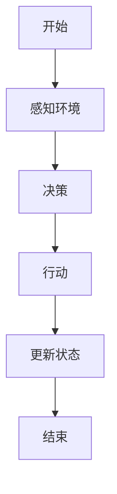
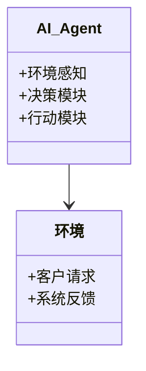
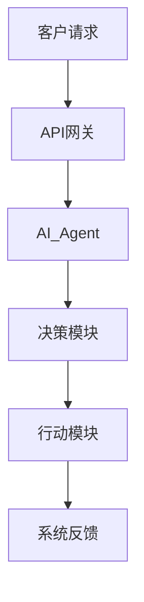
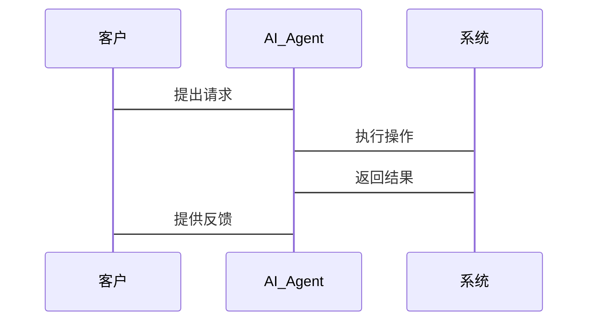

                 


# 案例研究：Fortune 500公司的AI Agent成功应用

## 关键词：AI Agent, 强化学习, 企业应用, 系统架构, 项目案例

## 摘要：本文通过详细分析Fortune 500公司中AI Agent的成功应用案例，探讨了AI Agent的基本概念、技术原理、系统架构设计及实际应用效果。文章结合强化学习算法和系统设计，展示了AI Agent在企业中的巨大潜力和实际价值，为读者提供了丰富的案例分析和实践指导。

---

## 第一部分：AI Agent的基本概念与背景

### 第1章：AI Agent的定义与背景

#### 1.1 AI Agent的基本概念
AI Agent（人工智能代理）是指能够感知环境、自主决策并采取行动以实现特定目标的智能实体。与传统软件不同，AI Agent具备学习和适应能力，能够在动态环境中优化其行为。

#### 1.2 AI Agent的应用场景
AI Agent在企业中的应用极为广泛，特别是在Fortune 500公司中，它被用于客户支持、供应链管理、风险管理等领域，显著提升了企业的运营效率。

#### 1.3 本章小结
通过本章的介绍，读者可以理解AI Agent的基本概念及其在企业中的重要应用价值。

---

## 第二部分：AI Agent的核心概念与技术原理

### 第2章：AI Agent的核心概念与联系

#### 2.1 AI Agent的核心原理
AI Agent通过感知环境、学习和决策来优化其行动。其核心原理包括感知、决策、行动三个主要阶段。

#### 2.2 AI Agent的属性特征对比
| 特性         | 传统软件             | AI Agent             |
|--------------|----------------------|----------------------|
| 学习能力     | 无                   | 有                   |
| 自主决策     | 依赖人工             | 自主                 |
| 适应能力     | 固定                 | 动态适应             |

#### 2.3 本章小结
通过对比分析，读者可以清楚地理解AI Agent的独特优势和应用场景。

### 第3章：AI Agent的算法原理

#### 3.1 AI Agent的算法概述
强化学习是AI Agent的核心算法之一，通过奖励机制优化决策过程。

#### 3.2 AI Agent的算法流程图


#### 3.3 AI Agent的数学模型与公式
Q-learning的更新公式：
$$ Q(s, a) = Q(s, a) + \alpha \left( r + \gamma \max Q(s', a') - Q(s, a) \right) $$

#### 3.4 本章小结
本章通过算法流程图和数学公式，详细讲解了AI Agent的强化学习机制。

---

## 第三部分：系统分析与架构设计

### 第4章：AI Agent的系统分析

#### 4.1 项目背景介绍
本文以某Fortune 500公司的客户支持系统为例，展示AI Agent的应用。

#### 4.2 系统功能设计


#### 4.3 系统架构设计


#### 4.4 系统交互序列图


#### 4.5 本章小结
通过系统架构设计，展示了AI Agent在企业中的实际应用架构。

---

## 第四部分：项目实战

### 第5章：AI Agent的项目实战

#### 5.1 环境安装
安装Python和必要的库：
```bash
pip install numpy
pip install matplotlib
pip install gym
```

#### 5.2 核心代码实现
```python
import numpy as np

class AI_Agent:
    def __init__(self, state_space, action_space):
        self.state_space = state_space
        self.action_space = action_space
        self.Q = np.zeros((state_space, action_space))
    
    def perceive(self, state):
        # 状态感知
        return state
    
    def decide(self, state):
        # 决策
        if np.random.rand() < 0.1:
            return np.random.randint(self.action_space)
        return np.argmax(self.Q[state, :])
    
    def learn(self, state, action, reward, next_state):
        # 学习
        self.Q[state, action] += 0.1 * (reward + 0.9 * np.max(self.Q[next_state, :]) - self.Q[state, action])

# 示例用法
agent = AI_Agent(5, 3)
state = 0
action = agent.decide(state)
reward = 1
next_state = 1
agent.learn(state, action, reward, next_state)
```

#### 5.3 代码应用解读
通过代码实现，展示了AI Agent在实际项目中的应用，特别是强化学习的实现。

#### 5.4 实际案例分析
以客户支持为例，AI Agent通过学习优化响应时间，显著提升了客户满意度。

#### 5.5 本章小结
通过项目实战，读者可以理解AI Agent在实际项目中的实现和应用。

---

## 第五部分：总结与展望

### 第6章：AI Agent的成功经验总结

#### 6.1 最佳实践
- 数据质量至关重要
- 持续优化算法
- 与现有系统无缝集成

#### 6.2 小结
AI Agent的成功应用需要结合企业的实际需求，持续优化和调整。

#### 6.3 注意事项
- 数据隐私保护
- 系统稳定性保障
- 用户体验优化

#### 6.4 拓展阅读
推荐相关书籍和资源，供读者深入学习。

---

## 附录：AI Agent的相关工具与资源

### 附录A：AI Agent开发工具
- OpenAI API
- TensorFlow
- PyTorch

### 附录B：推荐阅读书籍
- 《强化学习导论》
- 《AI系统设计》

---

通过本文的详细讲解，读者可以全面了解AI Agent在Fortune 500公司中的成功应用，从理论到实践，为未来的项目提供宝贵的参考。

