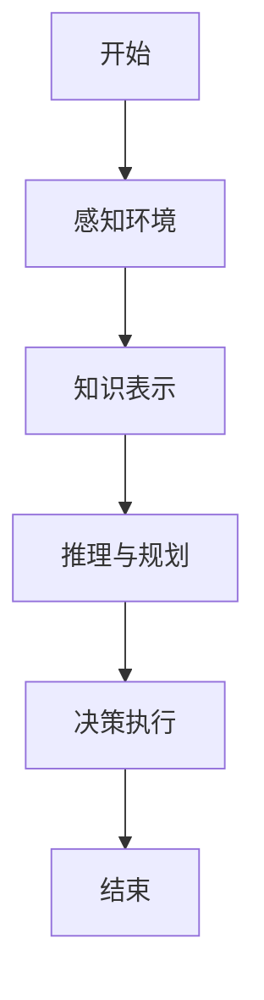
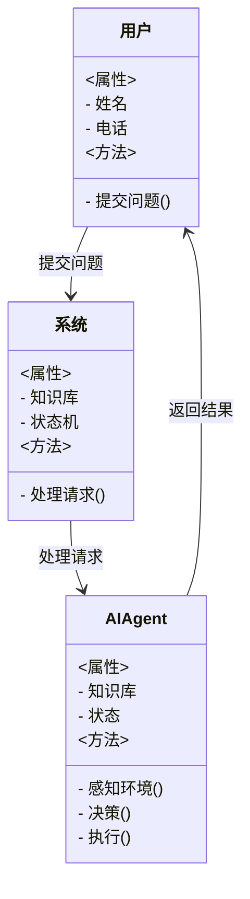
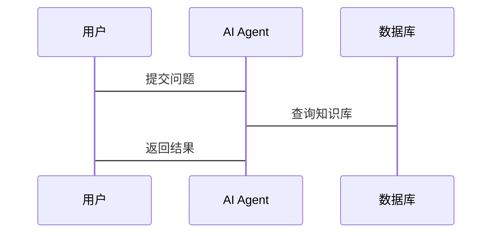

                 


# 案例解析：成功落地的企业级AI Agent项目

## 关键词：
- 企业级AI Agent
- 人工智能
- 算法原理
- 系统架构
- 项目实战
- 项目总结

## 摘要：
本文详细解析了企业级AI Agent项目的成功落地过程。从背景介绍到核心概念，从算法原理到系统架构设计，从项目实战到总结，系统地阐述了企业级AI Agent的核心要素、实现方法和实际应用案例。通过具体案例分析，展示了如何将AI Agent技术应用于企业级项目，提供了宝贵的经验和实践指导。

---

# 第一部分: 企业级AI Agent项目背景与核心概念

## 第1章: AI Agent的基本概念与问题背景

### 1.1 AI Agent的定义与核心要素
#### 1.1.1 AI Agent的定义
AI Agent（人工智能代理）是指能够感知环境、自主决策并执行任务的智能实体。它具备自主性、反应性、目标导向性和社交能力等核心特征。

#### 1.1.2 AI Agent的核心要素
AI Agent的核心要素包括：
1. **感知能力**：通过传感器或其他输入方式感知环境。
2. **决策能力**：基于感知信息进行推理和决策。
3. **执行能力**：通过执行器或其他输出方式执行决策。
4. **学习能力**：通过机器学习算法不断优化自身性能。
5. **社交能力**：与其他AI Agent或人类进行交互和协作。

#### 1.1.3 AI Agent与传统AI的区别
传统的AI主要关注特定任务的解决，而AI Agent强调自主性和动态适应性，能够在复杂环境中独立完成任务。

### 1.2 企业级AI Agent的应用场景
#### 1.2.1 企业级AI Agent的典型场景
- **智能客服**：通过自然语言处理技术为用户提供24/7的智能支持。
- **自动化运维**：通过AI Agent实现系统的自动监控和故障修复。
- **智能推荐**：基于用户行为分析提供个性化的产品推荐。

#### 1.2.2 企业级AI Agent的潜在应用领域
- **金融行业**：智能投资顾问、风险管理。
- **医疗行业**：辅助诊断、患者管理。
- **制造业**：智能制造、供应链优化。

#### 1.2.3 企业级AI Agent的挑战与机遇
- **挑战**：数据隐私、算法复杂性、系统集成难度。
- **机遇**：提升效率、降低成本、创造新价值。

## 第2章: AI Agent的核心概念与联系

### 2.1 AI Agent的核心原理
#### 2.1.1 AI Agent的基本工作原理
AI Agent通过感知环境、分析信息、制定决策并执行操作来实现目标。其核心流程包括信息处理、知识表示、推理与规划、决策执行等步骤。

#### 2.1.2 AI Agent的核心算法
- **基于规则的推理**：通过预定义的规则进行决策。
- **基于知识图谱的推理**：利用知识图谱进行复杂推理。
- **基于机器学习的推理**：通过深度学习模型进行预测和决策。

#### 2.1.3 AI Agent的实现框架
AI Agent的实现框架通常包括感知层、决策层、执行层和学习层，各层协同工作以完成任务。

### 2.2 AI Agent的核心要素对比
#### 2.2.1 AI Agent与传统AI的对比
- 传统AI：专注于解决特定问题，如图像识别、语音识别。
- AI Agent：具备自主性和动态适应性，能够主动完成任务。

#### 2.2.2 不同AI Agent模型的对比
- **基于规则的AI Agent**：简单易懂，但灵活性较差。
- **基于知识图谱的AI Agent**：知识表示能力强，推理复杂。
- **基于机器学习的AI Agent**：学习能力强，但需要大量数据支持。

#### 2.2.3 AI Agent核心要素的对比分析
通过对比分析，可以看出不同AI Agent模型在感知能力、决策能力和学习能力上的优劣，从而选择最适合实际应用的模型。

### 2.3 AI Agent的ER实体关系图
#### 2.3.1 实体关系图的定义
ER实体关系图用于描述系统中的实体及其之间的关系，帮助理解系统的整体架构。

#### 2.3.2 AI Agent的实体关系图展示
```mermaid
er
actor: 用户
agent: AI Agent
environment: 环境
goal: 目标
action: 行动
rule: 规则
knowledge: 知识库
perception: 感知
decision: 决策
```

#### 2.3.3 实体关系图的分析与解释
AI Agent通过感知环境、获取信息，利用知识库和规则进行推理和决策，并执行相应的行动以实现目标。

---

# 第二部分: AI Agent的算法原理与数学模型

## 第3章: AI Agent的核心算法原理

### 3.1 AI Agent的算法概述
#### 3.1.1 AI Agent的主要算法
- **基于规则的算法**：简单直接，适用于规则明确的任务。
- **基于知识图谱的算法**：通过知识推理进行决策。
- **基于机器学习的算法**：利用深度学习模型进行预测和决策。

#### 3.1.2 AI Agent算法的特点
- **自主性**：能够自主决策和执行任务。
- **动态性**：能够适应环境的变化。
- **可扩展性**：能够处理复杂和多样化任务。

#### 3.1.3 AI Agent算法的优缺点
- **优点**：灵活性高、适应性强。
- **缺点**：算法复杂、计算资源消耗大。

### 3.2 AI Agent的算法实现
#### 3.2.1 AI Agent算法的实现步骤
1. **感知环境**：通过传感器或其他输入方式获取环境信息。
2. **知识表示**：将获取的信息转化为知识库中的结构化数据。
3. **推理与规划**：基于知识库进行推理和规划，制定决策。
4. **决策执行**：根据决策结果执行相应的行动。

#### 3.2.2 AI Agent算法的代码实现
```python
class AI-Agent:
    def __init__(self, knowledge_base):
        self.knowledge_base = knowledge_base

    def perceive(self, input_data):
        # 处理输入数据
        pass

    def decide(self, input_data):
        # 基于知识库进行推理和决策
        pass

    def act(self, decision):
        # 执行决策
        pass
```

#### 3.2.3 AI Agent算法的流程图展示


### 3.3 AI Agent的数学模型与公式
#### 3.3.1 AI Agent的核心数学模型
AI Agent的决策过程可以通过数学模型进行描述，例如基于概率论的贝叶斯网络模型。

#### 3.3.2 AI Agent的数学公式推导
$$ P(A|B) = \frac{P(B|A)P(A)}{P(B)} $$
其中，P(A|B)表示在B条件下A发生的概率。

#### 3.3.3 AI Agent数学模型的实际应用案例
通过贝叶斯网络模型，AI Agent可以对环境中的不确定性进行建模和推理，从而做出最优决策。

## 第4章: AI Agent的数学模型与公式

### 4.1 AI Agent的数学模型
#### 4.1.1 AI Agent的数学模型概述
AI Agent的数学模型通常包括概率模型、逻辑模型和强化学习模型等。

#### 4.1.2 AI Agent的数学模型构建
基于强化学习的数学模型：
$$ Q(s, a) = r + \gamma \max_{a'} Q(s', a') $$
其中，s是当前状态，a是当前动作，r是奖励，γ是折扣因子。

#### 4.1.3 AI Agent数学模型的验证与优化
通过实验数据验证模型的准确性，并通过调参优化模型性能。

### 4.2 AI Agent的数学公式
#### 4.2.1 AI Agent的核心公式
$$ V(s) = \max_a \sum_{s'} P(s'|s,a) V(s') $$
其中，V(s)表示状态s的价值函数。

#### 4.2.2 AI Agent公式的推导过程
通过马尔可夫决策过程（MDP）推导强化学习算法的核心公式。

#### 4.2.3 AI Agent公式的实际应用案例
在强化学习中，AI Agent通过不断与环境交互，更新价值函数，以最大化累计奖励。

---

# 第三部分: 企业级AI Agent项目的系统分析与架构设计

## 第5章: 系统分析与架构设计方案

### 5.1 问题场景介绍
#### 5.1.1 项目背景
本案例以智能客服系统为例，展示企业级AI Agent的实际应用。

### 5.2 系统功能设计
#### 5.2.1 领域模型mermaid类图


### 5.3 系统架构设计mermaid架构图
```mermaid
archi
客户 --> 中间件 --> AI Agent
AI Agent --> 数据库
AI Agent --> 知识库
```

### 5.4 系统接口设计
- **输入接口**：接收用户的请求。
- **输出接口**：返回处理结果。
- **内部接口**：AI Agent与知识库、数据库之间的交互。

### 5.5 系统交互mermaid序列图


---

# 第四部分: 企业级AI Agent项目的实战与总结

## 第6章: 项目实战

### 6.1 环境安装
#### 6.1.1 安装Python
```bash
python --version
pip install --upgrade pip
```

#### 6.1.2 安装依赖库
```bash
pip install numpy
pip install scikit-learn
pip install matplotlib
```

### 6.2 系统核心实现源代码
```python
from sklearn.naive_bayes import MultinomialNB
from sklearn.feature_extraction.text import TfidfVectorizer

# 训练模型
model = MultinomialNB()
vectorizer = TfidfVectorizer()

X = vectorizer.fit_transform(train_data)
model.fit(X, train_labels)

# 预测
test_X = vectorizer.transform(test_data)
predicted_labels = model.predict(test_X)
```

### 6.3 代码应用解读与分析
- **训练模型**：使用TF-IDF特征提取和多项式贝叶斯分类器进行训练。
- **预测**：对测试数据进行特征提取，并进行分类预测。

### 6.4 实际案例分析和详细讲解剖析
以智能客服为例，展示如何通过AI Agent实现自动回复用户问题。

### 6.5 项目小结
本项目通过实际案例展示了AI Agent的核心技术和实现过程，为后续项目提供了参考。

## 第7章: 总结与展望

### 7.1 最佳实践 tips
- **数据质量**：确保数据的准确性和完整性。
- **算法选择**：根据具体任务选择合适的算法。
- **系统集成**：确保系统各部分协同工作。

### 7.2 小结
通过本文的详细讲解，读者可以系统地了解企业级AI Agent的核心要素和实现方法。

### 7.3 注意事项
- **数据隐私**：注意保护用户数据隐私。
- **系统性能**：优化系统性能，确保高效运行。

### 7.4 拓展阅读
推荐阅读相关领域的书籍和论文，深入学习AI Agent的技术细节。

---

通过以上目录结构，本文系统地介绍了企业级AI Agent项目的背景、核心概念、算法原理、系统架构设计和实际案例分析，为读者提供了全面的知识和实践指导。

