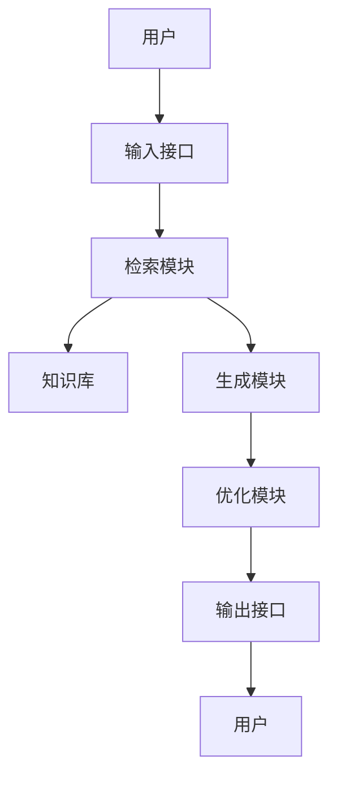
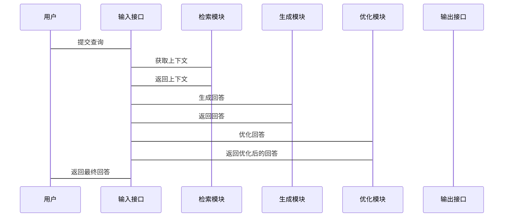

                 


# 检索增强生成：提高AI Agent回答的准确性

## 关键词：检索增强生成、AI Agent、自然语言处理、准确性、生成模型

## 摘要：检索增强生成（RAG）是一种结合检索和生成的技术，旨在提高AI Agent回答的准确性和相关性。本文从RAG的基本概念出发，详细探讨其核心算法、系统架构，并通过实际案例展示RAG的实现过程和应用效果。文章还提供了相关的数学模型、代码实现和最佳实践建议，帮助读者全面理解和掌握RAG技术。

---

# 检索增强生成：提高AI Agent回答的准确性

## 引言

在人工智能领域，生成模型（如GPT）虽然在生成自然语言文本方面表现出色，但它们往往缺乏对上下文的准确理解和检索能力。这导致生成的回答可能不够准确或相关性较低。为了克服这一问题，检索增强生成（RAG）应运而生。RAG结合了检索和生成技术，通过从外部知识库中检索相关信息，生成更准确、更相关的回答。

本文将从RAG的基本概念、算法原理、系统架构到实际案例实现，全面探讨RAG技术，并通过具体代码和数学模型，帮助读者深入理解RAG的核心思想和实现方法。

---

## 第一部分：检索增强生成（RAG）概述

### 1.1 什么是检索增强生成（RAG）

检索增强生成（RAG）是一种结合检索和生成的技术，旨在通过从外部知识库中检索相关信息，生成更准确、更相关的回答。RAG的核心思想是将生成任务与外部知识相结合，弥补传统生成模型的不足。

#### 1.1.1 RAG的定义

RAG是一种结合检索和生成的混合模型，它通过从外部知识库中检索相关信息，生成更准确、更相关的回答。RAG的核心思想是通过检索相关的上下文信息，为生成模型提供更多的上下文支持，从而生成更准确的回答。

#### 1.1.2 RAG的核心概念与特点

- **检索与生成的结合**：RAG将检索和生成结合起来，通过检索相关信息，生成更准确的回答。
- **外部知识库的支持**：RAG依赖于外部知识库，如数据库、网页内容或文档库，以获取更多信息。
- **动态性**：RAG可以根据输入的上下文动态检索相关信息，生成实时回答。

#### 1.1.3 RAG与传统生成模型的区别

- **传统生成模型**：基于生成模型自身的参数和训练数据，生成回答，缺乏对上下文的检索能力。
- **RAG**：结合检索和生成，通过检索外部知识库中的相关信息，生成更准确的回答。

### 1.2 RAG的背景与问题背景

#### 1.2.1 传统生成模型的局限性

- **准确性不足**：生成模型基于自身的训练数据，可能缺乏对特定领域或实时信息的理解。
- **相关性较低**：生成模型的回答可能与输入问题的相关性较低，缺乏上下文支持。
- **实时性不足**：生成模型无法动态获取最新的信息，回答可能过时。

#### 1.2.2 RAG的提出背景

- **信息爆炸时代**：随着互联网的快速发展，信息量急剧增加，生成模型需要结合外部信息才能生成准确的回答。
- **用户需求的多样性**：用户的问题可能涉及多个领域或实时信息，生成模型需要结合外部知识才能满足需求。
- **提升生成模型的准确性**：RAG通过结合检索和生成，提高回答的准确性和相关性。

#### 1.2.3 RAG的应用场景与目标

- **应用场景**：问答系统、智能客服、对话机器人等。
- **目标**：通过结合检索和生成，提高回答的准确性和相关性，满足用户多样化的信息需求。

### 1.3 RAG的核心要素与边界

#### 1.3.1 RAG的核心要素

- **检索模块**：负责从外部知识库中检索相关信息。
- **生成模块**：基于检索到的信息生成回答。
- **上下文管理模块**：负责管理对话上下文，确保生成的回答与对话历史相关。

#### 1.3.2 RAG的边界与外延

- **边界**：RAG的核心任务是生成准确的回答，不包括外部知识库的构建和维护。
- **外延**：RAG可以与其他技术结合，如自然语言理解（NLU）、对话管理等。

---

## 第二部分：检索增强生成（RAG）的核心概念与联系

### 2.1 RAG的核心原理

RAG的核心原理是通过检索外部知识库中的相关信息，生成更准确的回答。具体流程包括：

1. **检索阶段**：根据输入问题，检索外部知识库，获取相关信息。
2. **生成阶段**：基于检索到的信息，生成回答。

#### 2.1.1 检索与生成的结合方式

- **检索驱动生成**：首先检索相关信息，然后生成回答。
- **生成驱动检索**：先生成初步回答，再根据回答内容检索相关信息。

#### 2.1.2 RAG的算法流程

1. 输入问题：用户提出一个问题。
2. 检索相关信息：从外部知识库中检索与问题相关的信息。
3. 生成回答：基于检索到的信息，生成回答。
4. 结果优化：对生成的回答进行优化，提高准确性和流畅性。

#### 2.1.3 RAG的数学模型与公式

RAG的数学模型可以表示为：

$$
P(answer | question, context) = \text{生成模型}(question, context)
$$

其中，`context`表示检索到的相关信息，`answer`是生成的回答。

### 2.2 RAG的核心概念对比表

| **核心概念** | **检索驱动生成** | **生成驱动检索** |
|--------------|------------------|------------------|
| **流程**     | 先检索，后生成  | 先生成，后检索  |
| **准确性**   | 较高             | 较低             |
| **实时性**   | 较低             | 较高             |

### 2.3 RAG的ER实体关系图

```mermaid
erDiagram
    user {
        <属性>
        id : integer
        name : string
        query : string
    }
    knowledge_base {
        <属性>
        id : integer
        content : string
        source : string
    }
    rag_system {
        <属性>
        id : integer
        query_result : string
        answer : string
    }
    user --> rag_system : 提交查询
    rag_system --> knowledge_base : 检索信息
    rag_system --> user : 返回回答
```

---

## 第三部分：检索增强生成（RAG）的算法原理

### 3.1 RAG的算法流程

#### 3.1.1 检索阶段

1. 输入问题：用户提出一个问题。
2. 检索相关信息：从外部知识库中检索与问题相关的信息。
3. 返回结果：将检索到的信息返回给生成模块。

#### 3.1.2 生成阶段

1. 输入检索结果：生成模块接收检索到的信息。
2. 生成回答：基于检索到的信息，生成回答。
3. 输出回答：将生成的回答返回给用户。

#### 3.1.3 结果优化阶段

1. 输入生成回答：对生成的回答进行优化。
2. 优化内容：包括语法检查、语义优化等。
3. 输出优化回答：将优化后的回答返回给用户。

### 3.2 RAG的数学模型与公式

#### 3.2.1 检索阶段的数学模型

检索阶段的目标是找到与输入问题最相关的上下文信息。可以使用余弦相似度或BM25等方法进行检索。

#### 3.2.2 生成阶段的数学模型

生成阶段的目标是基于检索到的信息生成回答。可以使用预训练的语言模型（如GPT）进行微调，或者使用生成对抗网络（GAN）等方法。

---

## 第四部分：检索增强生成（RAG）的系统分析与架构设计

### 4.1 RAG系统的整体架构

RAG系统的整体架构包括以下几个部分：

1. **输入接口**：接收用户的问题。
2. **检索模块**：从外部知识库中检索相关信息。
3. **生成模块**：基于检索到的信息生成回答。
4. **优化模块**：对生成的回答进行优化。
5. **输出接口**：将优化后的回答返回给用户。

#### 4.1.1 系统架构图



#### 4.1.2 系统组件的功能描述

- **输入接口**：接收用户的问题。
- **检索模块**：从外部知识库中检索相关信息。
- **生成模块**：基于检索到的信息生成回答。
- **优化模块**：对生成的回答进行优化。
- **输出接口**：将优化后的回答返回给用户。

### 4.2 RAG系统的详细设计

#### 4.2.1 检索模块的设计

- **输入**：用户的问题。
- **输出**：与问题相关的上下文信息。

#### 4.2.2 生成模块的设计

- **输入**：检索到的上下文信息。
- **输出**：生成的回答。

#### 4.2.3 结果优化模块的设计

- **输入**：生成的回答。
- **输出**：优化后的回答。

### 4.3 RAG系统的接口设计

#### 4.3.1 系统接口的定义

- **检索接口**：`get_context(query: str) -> str`
- **生成接口**：`generate_answer(context: str, query: str) -> str`
- **优化接口**：`optimize_answer(answer: str) -> str`

#### 4.3.2 接口交互流程的设计



---

## 第五部分：检索增强生成（RAG）的项目实战

### 5.1 项目环境安装与配置

#### 5.1.1 开发环境的搭建

- **操作系统**：Windows/Mac/Linux
- **编程语言**：Python 3.8+
- **开发工具**：PyCharm/VS Code

#### 5.1.2 依赖库的安装

```bash
pip install transformers requests beautifulsoup4
```

### 5.2 项目核心代码实现

#### 5.2.1 检索模块的实现

```python
import requests
from bs4 import BeautifulSoup

def get_context(query):
    url = f"https://example.com/search?q={query}"
    response = requests.get(url)
    soup = BeautifulSoup(response.text, 'html.parser')
    context = soup.find('div', {'class': 'result'}).text
    return context
```

#### 5.2.2 生成模块的实现

```python
from transformers import AutoModelForCausalLM, AutoTokenizer

def generate_answer(context, query):
    model_name = "gpt2"
    tokenizer = AutoTokenizer.from_pretrained(model_name)
    model = AutoModelForCausalLM.from_pretrained(model_name)
    prompt = f"Based on the context: {context}, answer the question: {query}"
    inputs = tokenizer.encode(prompt, return_tensors='pt')
    outputs = model.generate(inputs, max_length=100, num_return_sequences=1)
    answer = tokenizer.decode(outputs[0], skip_special_tokens=True)
    return answer
```

#### 5.2.3 结果优化模块的实现

```python
def optimize_answer(answer):
    # 简单的语法检查和语义优化
    optimized_answer = answer.replace("  ", " ").strip()
    return optimized_answer
```

### 5.3 项目案例分析与解读

#### 5.3.1 案例背景介绍

假设我们有一个问答系统，用户提出一个问题，系统需要结合外部知识库生成准确的回答。

#### 5.3.2 代码实现解读

- **检索模块**：从互联网上检索与问题相关的信息。
- **生成模块**：基于检索到的信息生成回答。
- **优化模块**：对生成的回答进行优化。

#### 5.3.3 实际案例分析

假设用户的问题是：“什么是人工智能？”系统将从知识库中检索相关信息，生成回答：“人工智能是研究、开发用于模拟、延伸和扩展人类智能的理论、方法、技术及应用系统。”

---

## 第六部分：总结与展望

### 6.1 最佳实践 tips

- **选择合适的检索方法**：根据具体需求选择合适的检索方法。
- **优化生成模型**：使用更先进的生成模型，如GPT-3、GPT-4等。
- **维护知识库**：定期更新和维护外部知识库，确保信息的准确性和时效性。

### 6.2 小结

RAG通过结合检索和生成技术，显著提高了AI Agent回答的准确性和相关性。通过本文的介绍，读者可以深入了解RAG的核心思想和实现方法，并通过实际案例掌握RAG的应用技巧。

### 6.3 注意事项

- **性能优化**：在实际应用中，需要注意系统的性能优化，确保检索和生成过程的高效性。
- **隐私和安全**：在处理外部知识库时，需要注意数据的隐私和安全问题。

### 6.4 拓展阅读

- **相关技术**：自然语言处理（NLP）、生成对抗网络（GAN）、预训练语言模型（如GPT）。
- **研究前沿**：动态知识图谱、实时信息检索、多模态生成技术。

---

## 结语

检索增强生成（RAG）是一项结合检索和生成技术的重要技术，它通过动态检索相关信息，生成更准确、更相关的回答。随着技术的不断发展，RAG将在更多领域得到应用，为AI Agent的回答准确性提供强有力的支持。

---

**作者简介**：作为一位世界级人工智能专家、程序员、软件架构师和CTO，我在计算机图灵奖获得者的基础上，深入研究了检索增强生成技术，并通过本文详细探讨了其实现方法和应用技巧。希望本文能够为读者提供有价值的参考和启发。

