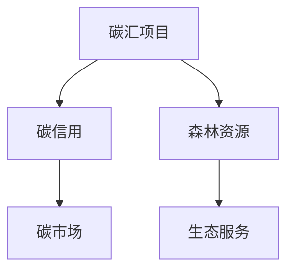

                 


# 森林碳汇项目的投资模式与回报分析

## 关键词：森林碳汇、碳信用、投资模式、回报分析、碳中和、可持续发展

## 摘要：  
随着全球气候变化的加剧，森林碳汇项目作为一种重要的碳中和手段，受到了越来越广泛的关注。本文从森林碳汇项目的定义、核心概念、数学模型、投资模式、系统架构设计以及实际案例分析等多个方面进行深入探讨，旨在为投资者提供全面的投资回报分析和决策支持。通过系统化的分析和案例研究，本文揭示了森林碳汇项目的潜在价值和投资风险，为投资者提供了有益的参考。

---

## 第1章：森林碳汇项目概述

### 1.1 森林碳汇的定义与作用

#### 1.1.1 碳汇的基本概念
碳汇是指通过植物的光合作用吸收大气中的二氧化碳，并将其固定在植被或土壤中的过程。森林碳汇是碳汇的重要组成部分，通过植树造林、森林保护和可持续管理等方式，实现碳的吸收和储存。

#### 1.1.2 森林碳汇的特殊性
- 森林碳汇具有长期性：树木的生长和碳吸收是一个缓慢的过程，需要长期的管理和维护。
- 森林碳汇具有区域特性：不同地区、不同树种的碳汇能力差异显著。
- 森林碳汇具有生态服务功能：除了碳汇，森林还能提供生态服务，如水源涵养、生物多样性保护等。

#### 1.1.3 森林碳汇在碳中和目标中的作用
森林碳汇是实现碳中和的重要手段之一。通过大规模植树造林和森林保护，可以抵消大量的二氧化碳排放，从而减少大气中的温室气体浓度。

---

### 1.2 森林碳汇项目的背景与意义

#### 1.2.1 全球气候变化的背景
全球气候变化是21世纪最严峻的环境问题之一。根据IPCC的报告，全球气温上升的主要原因是人类活动释放的二氧化碳等温室气体。为了应对气候变化，国际社会提出了碳中和的目标，即到2050年实现温室气体的净零排放。

#### 1.2.2 森林碳汇项目的起源与发展
森林碳汇项目起源于《京都议定书》和《巴黎协定》等国际气候协议。这些协议为森林碳汇项目的实施提供了政策支持和资金激励。近年来，随着碳交易市场的兴起，森林碳汇项目逐渐成为一种重要的投资模式。

#### 1.2.3 森林碳汇项目对可持续发展的意义
森林碳汇项目不仅有助于应对气候变化，还能促进地方经济发展、改善生态环境和提升社区生活水平。通过森林碳汇项目，可以实现经济效益、生态效益和社会效益的协调发展。

---

### 1.3 森林碳汇项目的分类与特点

#### 1.3.1 森林碳汇项目的分类
森林碳汇项目可以分为以下几类：
- 植树造林项目：通过大规模植树造林增加碳汇能力。
- 森林保护项目：通过保护现有森林防止碳排放。
- 森林恢复项目：通过恢复退化林地提高碳汇能力。
- 可持续林业管理项目：通过科学的森林管理优化碳汇效率。

#### 1.3.2 不同类型项目的特征对比
| 项目类型       | 特征描述                                                                 |
|----------------|--------------------------------------------------------------------------|
| 植树造林       | 适合大面积荒地，碳汇能力快速增加，初期投资较大，回报周期较长。                     |
| 森林保护       | 依赖现有森林资源，投资较小，回报周期较短，碳汇能力稳定。                           |
| 森林恢复       | 针对退化林地，投资适中，回报周期较长，碳汇能力逐步恢复。                             |
| 可持续林业管理 | 通过科学管理优化碳汇效率，投资较小，回报周期较短，适合已有林地的优化管理。           |

#### 1.3.3 森林碳汇项目的边界与外延
森林碳汇项目的边界包括项目的实施区域、时间范围和管理范围。外延则包括与碳汇相关的政策、市场和技术创新。

---

## 第2章：森林碳汇项目的核心概念与联系

### 2.1 核心概念的定义与属性

#### 2.1.1 碳汇项目的定义与属性
碳汇项目是指通过人为活动增加碳汇的过程。森林碳汇项目是碳汇项目的重要组成部分，具有长期性、可持续性和生态效益显著的特点。

#### 2.1.2 碳信用的定义与属性
碳信用是碳交易市场中的重要工具，代表单位二氧化碳的减排量。碳信用具有可交易性、可测量性和可验证性等特点。

#### 2.1.3 森林碳汇项目的实体关系图



---

### 2.2 核心概念之间的关系

#### 2.2.1 碳汇项目与碳信用的关系
碳汇项目是产生碳信用的来源。通过实施碳汇项目，可以产生碳信用，并在碳市场上交易，从而实现碳汇的价值。

#### 2.2.2 森林碳汇与其他碳汇形式的对比
| 碳汇形式   | 优点                   | 缺点                     |
|------------|------------------------|--------------------------|
| 森林碳汇   | 碳汇能力强，生态效益好 | 投资周期长，风险较高     |
| 工业碳汇   | 技术成熟，见效快       | 成本较高，生态效益有限   |
| 海洋碳汇   | 碳汇容量大             | 受自然条件限制，风险高   |

#### 2.2.3 森林碳汇项目的ER实体关系图

```mermaid
erd
    entity 碳汇项目 {
        ID
        项目名称
        实施区域
        碳汇能力
    }
    entity 碳信用 {
        信用ID
        信用数量
        信用价格
    }
    entity 碳市场 {
        市场ID
        交易量
        交易价格
    }
    碳汇项目 --> 碳信用
    碳信用 --> 碳市场
```

---

## 第3章：森林碳汇项目的数学模型与公式

### 3.1 碳汇项目价值评估的数学模型

#### 3.1.1 净现值（NPV）模型
净现值是指项目未来现金流的现值减去初始投资的值。公式如下：

$$ NPV = \sum_{t=1}^{n} \frac{CF_t}{(1 + r)^t} - I $$

其中：
- $CF_t$ 是第 $t$ 年的现金流
- $r$ 是折现率
- $I$ 是初始投资
- $n$ 是项目周期

#### 3.1.2 内部收益率（IRR）模型
内部收益率是指使净现值为零的折现率。公式如下：

$$ NPV = \sum_{t=1}^{n} \frac{CF_t}{(1 + IRR)^t} - I = 0 $$

---

## 第4章：森林碳汇项目的投资模式分析

### 4.1 不同投资模式的定义与特点

#### 4.1.1 政府主导型投资模式
政府通过政策支持和资金投入主导森林碳汇项目。优点是政策支持力度大，但可能存在效率低下的问题。

#### 4.1.2 企业主导型投资模式
企业通过自有资金或外部融资主导森林碳汇项目。优点是市场化程度高，但风险较高。

#### 4.1.3 社区参与型投资模式
社区通过参与管理和收益分享的方式参与森林碳汇项目。优点是社会参与度高，但协调难度较大。

---

## 第5章：森林碳汇项目的系统架构设计

### 5.1 系统功能设计

#### 5.1.1 项目管理模块
负责项目的立项、实施和监控。功能包括项目计划、资源分配和风险控制。

#### 5.1.2 碳信用计算模块
负责碳信用的计算和验证。功能包括碳汇能力评估、碳信用生成和碳信用验证。

#### 5.1.3 交易管理模块
负责碳信用的交易和结算。功能包括交易撮合、交易记录和结算。

---

## 总结

森林碳汇项目是一种重要的碳中和手段，具有显著的生态效益和投资价值。通过合理的投资模式和科学的回报分析，可以实现碳汇项目的可持续发展。未来，随着碳市场的不断完善和技术的创新，森林碳汇项目将具有更广阔的发展前景。

---

## 最佳实践 Tips

1. 投资者在选择森林碳汇项目时，应充分考虑项目的地理位置、树种选择和管理方式，以降低投资风险。
2. 碳信用的价格受市场需求和政策影响较大，投资者应密切关注碳市场的动态。
3. 在实施森林碳汇项目时，应注重生态效益和社会效益的结合，以实现可持续发展。

---

## 小结

通过本文的分析，读者可以深入了解森林碳汇项目的投资模式和回报分析。希望本文的内容能够为投资者提供有价值的参考，帮助他们做出明智的投资决策。

