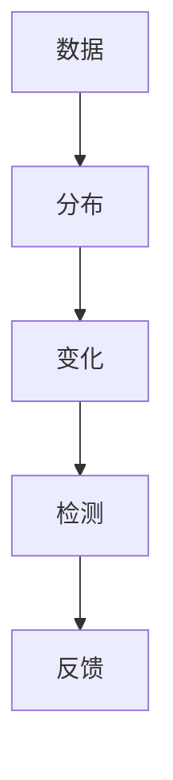
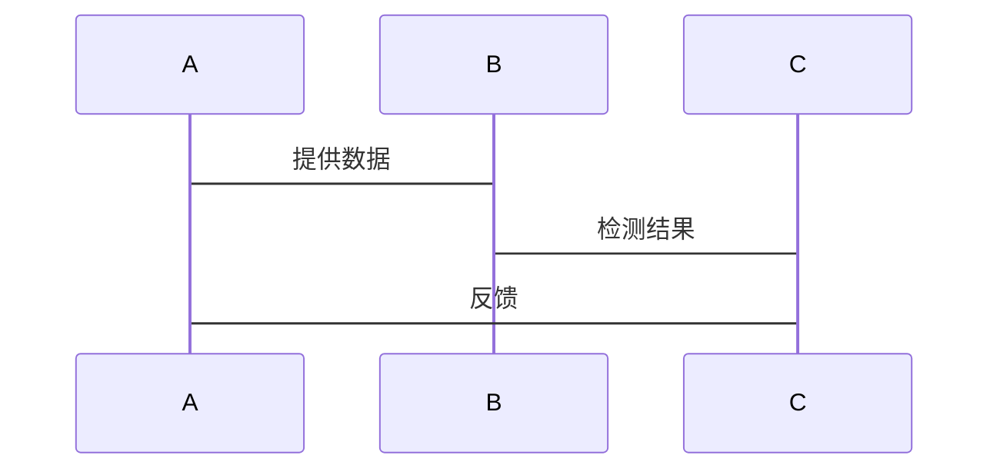

                 


# 概念漂移检测：适应动态变化的环境

## 关键词：概念漂移、数据分布变化、机器学习、模型退化、实时检测、动态环境

## 摘要：  
概念漂移是指在动态环境中，数据分布或目标概念随时间发生变化，导致机器学习模型性能下降的现象。本文从概念漂移的定义、类型、检测方法和应对策略入手，详细探讨了概念漂移的背景、核心概念、检测算法、系统架构设计以及实际应用场景。通过分析不同检测方法的优缺点，结合实际案例，为读者提供了一套完整的概念漂移检测与应对解决方案。

---

## 第1章: 概念漂移的定义与背景

### 1.1 概念漂移的定义  
概念漂移（Concept Drift）是指数据分布或目标概念随时间发生变化，导致模型性能下降的现象。这种变化可能源于数据源的变化、环境变化或目标任务的变化。  

#### 1.1.1 数据分布变化的定义  
数据分布变化是指数据的概率分布随时间发生变化。例如，用户行为变化、市场趋势变化等都会导致数据分布的变化。  

#### 1.1.2 概念漂移的类型  
概念漂移可以分为以下几种类型：  
1. **突然漂移（Sudden Drift）**：数据分布突然发生变化，例如突发事件导致的市场波动。  
2. **渐进漂移（Incremental Drift）**：数据分布逐渐变化，例如用户偏好缓慢转变。  
3. **分布漂移（Distributional Drift）**：数据分布的统计特性发生变化，例如均值、方差的变化。  

#### 1.1.3 概念漂移的背景与问题背景  
在机器学习和数据科学领域，模型的性能会因为概念漂移而下降。例如，在电商领域，用户购买行为的变化可能导致推荐模型的效果变差。  

### 1.2 概念漂移的特征  
概念漂移的特征包括：  
1. 数据分布的变化是渐进或突然的。  
2. 概念漂移可能影响模型的预测能力。  
3. 概念漂移的检测需要实时或近实时的反馈机制。  

#### 1.2.1 数据分布变化的特征  
数据分布的变化可能表现为类别比例的变化、特征分布的变化等。例如，在分类任务中，新类别出现会导致模型无法正确分类。  

#### 1.2.2 概念漂移的度量标准  
概念漂移的度量标准包括：  
- 数据分布的变化程度。  
- 模型性能的变化程度。  

#### 1.2.3 概念漂移的边界与外延  
概念漂移的外延包括数据源的变化、环境变化、目标任务的变化等。  

### 1.3 概念漂移的检测方法  
概念漂移的检测方法包括：  
1. 基于统计的方法。  
2. 基于机器学习的方法。  
3. 基于深度学习的方法。  

#### 1.3.1 基于统计的方法  
基于统计的方法包括滑动窗口法、假设检验等。  

#### 1.3.2 基于机器学习的方法  
基于机器学习的方法包括分类器性能监控、聚类分析等。  

#### 1.3.3 基于深度学习的方法  
基于深度学习的方法包括自编码器、对抗网络等。  

### 1.4 概念漂移的数学模型  
概念漂移的数学模型包括：  
- 数据分布的变化模型。  
- 概念漂移检测的数学公式。  

#### 1.4.1 数据分布变化的数学表达  
数据分布的变化可以用概率密度函数的变化来表示。例如，假设数据分布为$P(X)$，概念漂移后变为$P'(X)$。  

#### 1.4.2 概念漂移检测的数学公式  
概念漂移检测可以通过比较$P(X)$和$P'(X)$来实现。例如，使用KL散度：  
$$D_{KL}(P || P') = \sum P(x) \log \frac{P(x)}{P'(x)}$$  

### 1.5 本章小结  
本章介绍了概念漂移的定义、类型、特征和检测方法，为后续内容奠定了基础。  

---

## 第2章: 概念漂移的核心概念与联系  

### 2.1 概念漂移的核心原理  
概念漂移的核心原理是数据分布的变化导致模型性能下降。  

#### 2.1.1 数据分布变化的原理  
数据分布的变化可能源于数据源的变化、环境变化等。  

#### 2.1.2 概念漂移的检测机制  
概念漂移的检测机制包括实时监控和反馈机制。  

#### 2.1.3 概念漂移的核心要素  
概念漂移的核心要素包括数据分布、检测算法、反馈机制等。  

### 2.2 概念漂移的核心概念对比  
概念漂移的核心概念包括数据分布变化、模型退化等。  

#### 2.2.1 不同类型的概念漂移对比  
| 类型          | 特征              | 示例场景                  |
|---------------|-------------------|--------------------------|
| 突然漂移      | 数据分布突然变化 | 突发公共卫生事件          |
| 渐进漂移      | 数据分布逐渐变化 | 用户偏好缓慢转变          |
| 分布漂移      | 统计特性变化      | 数据均值、方差的变化       |

#### 2.2.2 概念漂移与数据漂移的对比  
概念漂移关注数据分布的变化，而数据漂移更广泛，包括数据质量的变化。  

#### 2.2.3 概念漂移与模型退化的对比  
概念漂移是数据变化导致模型性能下降，而模型退化是模型内部问题导致性能下降。  

### 2.3 概念漂移的ER实体关系图  


### 2.4 本章小结  
本章通过对比和实体关系图，详细分析了概念漂移的核心概念及其联系。  

---

## 第3章: 常见的概念漂移检测算法  

### 3.1 基于统计的方法  

#### 3.1.1 窗口滑动法  
窗口滑动法通过滑动窗口的方式监控数据分布的变化。  

#### 3.1.2 基于分布统计的方法  
基于分布统计的方法通过比较数据分布的统计特性来检测概念漂移。  

#### 3.1.3 统计假设检验法  
统计假设检验法通过假设检验的方法检测数据分布的变化。  

### 3.2 基于机器学习的方法  

#### 3.2.1 基于分类器性能变化的方法  
通过监控分类器性能的变化来检测概念漂移。  

#### 3.2.2 基于聚类的方法  
通过聚类分析检测数据分布的变化。  

#### 3.2.3 基于回归分析的方法  
通过回归分析监控数据分布的变化。  

### 3.3 基于深度学习的方法  

#### 3.3.1 基于自编码器的方法  
自编码器通过重构数据来检测分布变化。  

#### 3.3.2 基于对抗网络的方法  
对抗网络通过生成对抗来检测数据分布的变化。  

#### 3.3.3 基于变分自编码器的方法  
变分自编码器通过重构数据的潜在分布来检测概念漂移。  

### 3.4 算法对比与选择  

#### 3.4.1 不同算法的优缺点对比  
| 算法类型         | 优点                  | 缺点                  |
|------------------|-----------------------|-----------------------|
| 统计方法         | 实现简单               | 对复杂变化敏感性低     |
| 机器学习方法     | 能够捕捉复杂变化       | 实现复杂               |
| 深度学习方法     | 能够捕捉复杂变化       | 计算资源消耗大         |

#### 3.4.2 算法选择的依据  
算法选择的依据包括数据类型、变化类型、计算资源等。  

#### 3.4.3 算法适用场景分析  
统计方法适用于简单变化，机器学习方法适用于复杂变化，深度学习方法适用于高度复杂变化。  

### 3.5 本章小结  
本章详细介绍了常见的概念漂移检测算法，并分析了它们的优缺点和适用场景。  

---

## 第4章: 概念漂移检测的系统架构设计  

### 4.1 系统功能设计  

#### 4.1.1 数据预处理模块  
数据预处理模块包括数据清洗、特征提取等。  

#### 4.1.2 概念漂移检测模块  
概念漂移检测模块包括数据分布监控、模型性能监控等。  

#### 4.1.3 反馈与自适应模块  
反馈与自适应模块包括模型更新、参数调整等。  

### 4.2 系统架构设计  

#### 4.2.1 系统架构图  


#### 4.2.2 系统接口设计  
系统接口包括数据输入接口、检测结果输出接口等。  

#### 4.2.3 系统交互流程图  


### 4.3 本章小结  
本章介绍了概念漂移检测系统的功能设计和架构设计，为后续实现奠定了基础。  

---

## 第5章: 概念漂移检测的项目实战  

### 5.1 项目背景与目标  
项目背景是电商用户行为分析，目标是实时检测用户行为变化。  

### 5.2 项目环境配置  
项目环境包括Python、机器学习库等。  

#### 5.2.1 Python环境配置  
```bash
pip install numpy pandas scikit-learn
```

### 5.3 项目核心实现  

#### 5.3.1 数据预处理代码  
```python
import pandas as pd
from sklearn.preprocessing import StandardScaler

# 加载数据
data = pd.read_csv('data.csv')

# 数据预处理
scaler = StandardScaler()
scaled_data = scaler.fit_transform(data)
```

#### 5.3.2 概念漂移检测代码  
```python
from sklearn.metrics import accuracy_score

# 训练分类器
model = ...  # 初始化分类器

# 监控模型性能
prev_accuracy = accuracy_score(y_true, y_pred)
```

#### 5.3.3 模型更新代码  
```python
# 更新模型
model.partial_fit(new_data, new_labels)
```

### 5.4 项目结果分析  
项目结果包括检测准确率、模型更新频率等。  

### 5.5 项目小结  
本章通过实际案例详细讲解了概念漂移检测的项目实现过程。  

---

## 第6章: 概念漂移检测的最佳实践与总结  

### 6.1 最佳实践  

#### 6.1.1 检测方法选择  
根据数据类型和变化类型选择合适的检测方法。  

#### 6.1.2 模型更新策略  
采用增量学习或重新训练等策略。  

### 6.2 小结与总结  
概念漂移检测是机器学习系统的重要组成部分，需要实时监控和自适应能力。  

### 6.3 注意事项  
- 定期监控数据分布变化。  
- 及时更新模型以应对概念漂移。  

### 6.4 拓展阅读  
- 《机器学习实战》  
- 《深度学习导论》  

### 6.5 本章小结  
本章总结了概念漂移检测的最佳实践，并提出了未来的研究方向。  

---

## 第7章: 未来研究方向  

### 7.1 概念漂移检测的未来趋势  
未来趋势包括在线检测、自适应学习等。  

### 7.2 新型检测方法  
新型检测方法包括基于图神经网络的方法等。  

### 7.3 本章小结  
本章展望了概念漂移检测的未来发展方向。  

---

## 结语  
概念漂移检测是机器学习系统的重要挑战，需要结合实时监控和自适应学习能力。通过本文的详细讲解，读者可以全面了解概念漂移检测的核心概念、算法原理和系统架构设计，并能够在实际项目中灵活应用。  

--- 

# THE END

