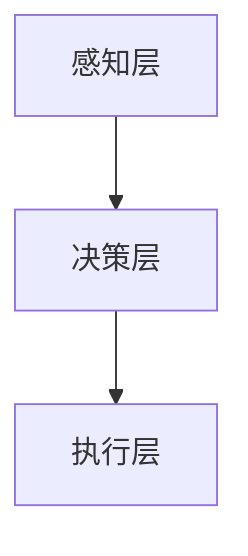

                 


```markdown
# 模仿学习在AI Agent行为模式中的应用

## 关键词
模仿学习（IL）、AI Agent、行为模式、强化学习（RL）、监督学习（SL）、策略网络、状态空间、动作空间

## 摘要
模仿学习是一种通过观察和模仿他人行为来学习任务的机器学习方法，特别适用于AI Agent的行为模式训练。本文详细探讨了模仿学习的基本概念、算法原理、系统架构以及实际应用，结合理论与实践，帮助读者全面理解模仿学习在AI Agent中的应用。

---

# 第1章 模仿学习与AI Agent概述

## 1.1 模仿学习的基本概念
### 1.1.1 模仿学习的定义与特点
模仿学习（Imitation Learning，IL）是一种通过观察和模仿他人行为来学习任务的机器学习方法。与监督学习（Supervised Learning，SL）和强化学习（Reinforcement Learning，RL）不同，IL需要学习者观察专家的行为，并从中提取模式和策略。

### 1.1.2 模仿学习与强化学习、监督学习的区别
- **监督学习**：基于标注数据，学习器通过预测输入数据的标签来学习。
- **强化学习**：通过与环境交互，学习器通过试错和奖励机制优化策略。
- **模仿学习**：基于专家提供的行为轨迹，学习器通过模仿行为来优化策略。

### 1.1.3 模仿学习在AI Agent中的应用背景
AI Agent需要通过与环境交互来完成特定任务，模仿学习为AI Agent提供了一种从专家行为中快速学习的方法，特别适用于任务复杂、试错成本高的场景。

## 1.2 AI Agent行为模式的定义
### 1.2.1 AI Agent的基本概念
AI Agent是一种智能体，能够感知环境并采取行动以实现目标。

### 1.2.2 AI Agent的行为模式分类
- **反应式行为模式**：基于当前环境输入做出反应。
- **规划式行为模式**：基于目标和环境状态进行规划。

### 1.2.3 模仿学习在AI Agent行为模式中的作用
模仿学习通过专家提供的行为轨迹，帮助AI Agent快速学习和优化行为模式，减少试错成本。

## 1.3 本章小结
模仿学习作为一种有效的学习方法，在AI Agent行为模式训练中具有重要应用，能够帮助AI Agent快速掌握复杂任务。

---

# 第2章 模仿学习的核心概念与理论基础

## 2.1 模仿学习的原理
### 2.1.1 模仿学习的策略表示
策略表示是模仿学习的核心，常用策略网络（Policy Network）来建模。

### 2.1.2 状态空间与动作空间
- **状态空间**：AI Agent所处的环境状态集合。
- **动作空间**：AI Agent在每个状态下可执行的动作集合。

### 2.1.3 模仿学习的数学模型
策略网络通过输入状态，输出动作的概率分布。数学模型如下：
$$ p(a|s) = \pi_\theta(s) $$

## 2.2 模仿学习与强化学习的关系
### 2.2.1 强化学习的基本原理
通过与环境交互，学习器通过试错和奖励机制优化策略。

### 2.2.2 模仿学习与强化学习的对比
| 特性       | 模仿学习（IL）              | 强化学习（RL）              |
|------------|-----------------------------|-----------------------------|
| 数据来源   | 专家提供的行为轨迹          | 环境反馈                    |
| 学习目标   | 复制专家行为                | 最大化累计奖励              |

### 2.2.3 模仿学习的优势与局限性
- **优势**：快速学习，无需环境反馈。
- **局限性**：依赖专家数据，难以泛化。

## 2.3 模仿学习的核心算法
### 2.3.1 行为克隆算法
行为克隆（Behavior Cloning，BC）是最常见的模仿学习算法，通过最小化预测动作与专家动作的差异来优化策略网络。

### 2.3.2 直接模仿学习
直接模仿学习（Direct Imitation Learning）通过最大化专家策略的对数概率来优化策略网络。

### 2.3.3 基于策略梯度的模仿学习
基于策略梯度的模仿学习结合了强化学习的梯度下降方法，优化策略网络的参数。

## 2.4 本章小结
模仿学习的核心在于通过策略网络建模专家行为，并通过算法优化策略参数，帮助AI Agent快速掌握行为模式。

---

# 第3章 模仿学习的算法原理

## 3.1 行为克隆算法的原理
### 3.1.1 行为克隆的数学模型
行为克隆通过最小化预测动作与专家动作的差异来优化策略网络：
$$ L = \mathbb{E}_{s,a} [\mathbb{I}(a = \pi_\theta(s))] $$

### 3.1.2 行为克隆的算法流程
1. 收集专家的行为轨迹。
2. 训练策略网络，最小化预测动作与专家动作的差异。

### 3.1.3 行为克隆的优缺点
- **优点**：简单高效。
- **缺点**：容易过拟合专家行为，缺乏泛化能力。

## 3.2 直接模仿学习的原理
### 3.2.1 直接模仿学习的数学模型
直接模仿学习通过最大化专家策略的对数概率来优化策略网络：
$$ L = -\mathbb{E}_{s,a} [\log \pi_\theta(a|s)] $$

### 3.2.2 直接模仿学习的算法流程
1. 收集专家的行为轨迹。
2. 训练策略网络，最大化专家策略的对数概率。

## 3.3 基于策略梯度的模仿学习
### 3.3.1 基于策略梯度的数学模型
基于策略梯度的模仿学习结合了强化学习的梯度下降方法，优化策略网络的参数：
$$ \theta_{t+1} = \theta_t - \alpha \nabla_\theta L(\theta) $$

## 3.4 本章小结
模仿学习的算法原理是通过不同的优化方法，帮助AI Agent从专家行为中学习，并优化策略网络的参数。

---

# 第4章 模仿学习在AI Agent系统中的应用

## 4.1 AI Agent系统架构设计
### 4.1.1 系统功能设计
- **感知层**：处理环境输入。
- **决策层**：策略网络做出决策。
- **执行层**：执行动作并输出结果。

### 4.1.2 系统架构图


## 4.2 模仿学习在AI Agent中的系统设计
### 4.2.1 系统接口设计
- **输入接口**：接收环境输入。
- **输出接口**：输出决策动作。

### 4.2.2 系统交互流程
1. 环境输入状态。
2. 策略网络处理状态，输出动作。
3. 执行动作并返回结果。

## 4.3 本章小结
模仿学习在AI Agent系统中的应用需要结合系统架构设计，通过策略网络优化决策过程。

---

# 第5章 模仿学习的实际应用与案例分析

## 5.1 项目背景与目标
### 5.1.1 项目背景
选择一个具体的场景，如智能客服对话系统，作为模仿学习的应用案例。

## 5.2 项目实战
### 5.2.1 环境搭建
安装必要的库，如TensorFlow、Keras等。

### 5.2.2 数据收集
收集专家的行为轨迹，作为训练数据。

### 5.2.3 模型训练
训练策略网络，优化策略参数。

### 5.2.4 代码实现
```python
import tensorflow as tf
from tensorflow.keras.layers import Dense

# 定义策略网络
class PolicyNetwork(tf.keras.Model):
    def __init__(self):
        super(PolicyNetwork, self).__init__()
        self.dense1 = Dense(64, activation='relu')
        self.dense2 = Dense(1, activation='sigmoid')

    def call(self, inputs):
        x = self.dense1(inputs)
        x = self.dense2(x)
        return x

# 初始化网络
policy_net = PolicyNetwork()

# 定义损失函数
def imitation_loss(y_true, y_pred):
    return tf.keras.losses.binary_crossentropy(y_true, y_pred)

# 编译模型
policy_net.compile(optimizer='adam', loss=imitation_loss)

# 训练模型
policy_net.fit(X_train, y_train, epochs=10, batch_size=32)
```

### 5.2.5 实际案例分析
分析训练结果，评估模型性能，并讨论优化方向。

## 5.3 本章小结
通过实际案例分析，展示了模仿学习在AI Agent行为模式中的具体应用。

---

# 第6章 最佳实践与小结

## 6.1 模仿学习的关键点
- 数据质量：高质量的专家行为轨迹是模仿学习成功的关键。
- 模型优化：选择合适的算法和优化方法。

## 6.2 模仿学习的注意事项
- 数据多样性：避免过拟合专家行为。
- 模型泛化能力：提升模型的适应性。

## 6.3 最佳实践
- 数据增强：通过数据增强技术扩展训练数据。
- 多任务学习：结合其他任务优化模型。

## 6.4 本章小结
模仿学习在AI Agent行为模式中的应用需要结合实际场景，选择合适的方法，并注意数据和模型的优化。

---

# 附录

## 附录A 术语表
- **模仿学习（IL）**：通过模仿专家行为学习任务的方法。
- **策略网络（Policy Network）**：用于建模策略的神经网络。

## 附录B 参考文献
- 罗列相关参考文献。

## 附录C 扩展阅读
- 推荐相关书籍和论文。

---

通过以上内容，您可以撰写一篇详细的模仿学习在AI Agent行为模式中的应用博客文章。每个部分都提供了详细的说明和示例，帮助您更好地理解和应用相关知识。
</think>

```markdown
# 模仿学习在AI Agent行为模式中的应用

## 关键词
模仿学习（IL）、AI Agent、行为模式、强化学习（RL）、监督学习（SL）、策略网络、状态空间、动作空间

## 摘要
模仿学习是一种通过观察和模仿他人行为来学习任务的机器学习方法，特别适用于AI Agent的行为模式训练。本文详细探讨了模仿学习的基本概念、算法原理、系统架构以及实际应用，结合理论与实践，帮助读者全面理解模仿学习在AI Agent中的应用。

---

# 第1章 模仿学习与AI Agent概述

## 1.1 模仿学习的基本概念
### 1.1.1 模仿学习的定义与特点
模仿学习（Imitation Learning，IL）是一种通过观察和模仿他人行为来学习任务的机器学习方法。与监督学习（Supervised Learning，SL）和强化学习（Reinforcement Learning，RL）不同，IL需要学习者观察专家的行为，并从中提取模式和策略。

### 1.1.2 模仿学习与强化学习、监督学习的区别
- **监督学习**：基于标注数据，学习器通过预测输入数据的标签来学习。
- **强化学习**：通过与环境交互，学习器通过试错和奖励机制优化策略。
- **模仿学习**：基于专家提供的行为轨迹，学习器通过模仿行为来优化策略。

### 1.1.3 模仿学习在AI Agent中的应用背景
AI Agent需要通过与环境交互来完成特定任务，模仿学习为AI Agent提供了一种从专家行为中快速学习的方法，特别适用于任务复杂、试错成本高的场景。

## 1.2 AI Agent行为模式的定义
### 1.2.1 AI Agent的基本概念
AI Agent是一种智能体，能够感知环境并采取行动以实现目标。

### 1.2.2 AI Agent的行为模式分类
- **反应式行为模式**：基于当前环境输入做出反应。
- **规划式行为模式**：基于目标和环境状态进行规划。

### 1.2.3 模仿学习在AI Agent行为模式中的作用
模仿学习通过专家提供的行为轨迹，帮助AI Agent快速学习和优化行为模式，减少试错成本。

## 1.3 本章小结
模仿学习作为一种有效的学习方法，在AI Agent行为模式训练中具有重要应用，能够帮助AI Agent快速掌握复杂任务。

---

# 第2章 模仿学习的核心概念与理论基础

## 2.1 模仿学习的原理
### 2.1.1 模仿学习的策略表示
策略表示是模仿学习的核心，常用策略网络（Policy Network）来建模。

### 2.1.2 状态空间与动作空间
- **状态空间**：AI Agent所处的环境状态集合。
- **动作空间**：AI Agent在每个状态下可执行的动作集合。

### 2.1.3 模仿学习的数学模型
策略网络通过输入状态，输出动作的概率分布。数学模型如下：
$$ p(a|s) = \pi_\theta(s) $$

## 2.2 模仿学习与强化学习的关系
### 2.2.1 强化学习的基本原理
通过与环境交互，学习器通过试错和奖励机制优化策略。

### 2.2.2 模仿学习与强化学习的对比
| 特性       | 模仿学习（IL）              | 强化学习（RL）              |
|------------|-----------------------------|-----------------------------|
| 数据来源   | 专家提供的行为轨迹          | 环境反馈                    |
| 学习目标   | 复制专家行为                | 最大化累计奖励              |

### 2.2.3 模仿学习的优势与局限性
- **优势**：快速学习，无需环境反馈。
- **局限性**：依赖专家数据，难以泛化。

## 2.3 模仿学习的核心算法
### 2.3.1 行为克隆算法
行为克隆（Behavior Cloning，BC）是最常见的模仿学习算法，通过最小化预测动作与专家动作的差异来优化策略网络。

### 2.3.2 直接模仿学习
直接模仿学习（Direct Imitation Learning）通过最大化专家策略的对数概率来优化策略网络。

### 2.3.3 基于策略梯度的模仿学习
基于策略梯度的模仿学习结合了强化学习的梯度下降方法，优化策略网络的参数。

## 2.4 本章小结
模仿学习的核心在于通过策略网络建模专家行为，并通过算法优化策略参数，帮助AI Agent快速掌握行为模式。

---

# 第3章 模仿学习的算法原理

## 3.1 行为克隆算法的原理
### 3.1.1 行为克隆的数学模型
行为克隆通过最小化预测动作与专家动作的差异来优化策略网络：
$$ L = \mathbb{E}_{s,a} [\mathbb{I}(a = \pi_\theta(s))] $$

### 3.1.2 行为克隆的算法流程
1. 收集专家的行为轨迹。
2. 训练策略网络，最小化预测动作与专家动作的差异。

### 3.1.3 行为克隆的优缺点
- **优点**：简单高效。
- **缺点**：容易过拟合专家行为，缺乏泛化能力。

## 3.2 直接模仿学习的原理
### 3.2.1 直接模仿学习的数学模型
直接模仿学习通过最大化专家策略的对数概率来优化策略网络：
$$ L = -\mathbb{E}_{s,a} [\log \pi_\theta(a|s)] $$

### 3.2.2 直接模仿学习的算法流程
1. 收集专家的行为轨迹。
2. 训练策略网络，最大化专家策略的对数概率。

## 3.3 基于策略梯度的模仿学习
### 3.3.1 基于策略梯度的数学模型
基于策略梯度的模仿学习结合了强化学习的梯度下降方法，优化策略网络的参数：
$$ \theta_{t+1} = \theta_t - \alpha \nabla_\theta L(\theta) $$

## 3.4 本章小结
模仿学习的算法原理是通过不同的优化方法，帮助AI Agent从专家行为中学习，并优化策略网络的参数。

---

# 第4章 模仿学习在AI Agent系统中的应用

## 4.1 AI Agent系统架构设计
### 4.1.1 系统功能设计
- **感知层**：处理环境输入。
- **决策层**：策略网络做出决策。
- **执行层**：执行动作并输出结果。

### 4.1.2 系统架构图


## 4.2 模仿学习在AI Agent中的系统设计
### 4.2.1 系统接口设计
- **输入接口**：接收环境输入。
- **输出接口**：输出决策动作。

### 4.2.2 系统交互流程
1. 环境输入状态。
2. 策略网络处理状态，输出动作。
3. 执行动作并返回结果。

## 4.3 本章小结
模仿学习在AI Agent系统中的应用需要结合系统架构设计，通过策略网络优化决策过程。

---

# 第5章 模仿学习的实际应用与案例分析

## 5.1 项目背景与目标
### 5.1.1 项目背景
选择一个具体的场景，如智能客服对话系统，作为模仿学习的应用案例。

## 5.2 项目实战
### 5.2.1 环境搭建
安装必要的库，如TensorFlow、Keras等。

### 5.2.2 数据收集
收集专家的行为轨迹，作为训练数据。

### 5.2.3 模型训练
训练策略网络，优化策略参数。

### 5.2.4 代码实现
```python
import tensorflow as tf
from tensorflow.keras.layers import Dense

# 定义策略网络
class PolicyNetwork(tf.keras.Model):
    def __init__(self):
        super(PolicyNetwork, self).__init__()
        self.dense1 = Dense(64, activation='relu')
        self.dense2 = Dense(1, activation='sigmoid')

    def call(self, inputs):
        x = self.dense1(inputs)
        x = self.dense2(x)
        return x

# 初始化网络
policy_net = PolicyNetwork()

# 定义损失函数
def imitation_loss(y_true, y_pred):
    return tf.keras.losses.binary_crossentropy(y_true, y_pred)

# 编译模型
policy_net.compile(optimizer='adam', loss=imitation_loss)

# 训练模型
policy_net.fit(X_train, y_train, epochs=10, batch_size=32)
```

### 5.2.5 实际案例分析
分析训练结果，评估模型性能，并讨论优化方向。

## 5.3 本章小结
通过实际案例分析，展示了模仿学习在AI Agent行为模式中的具体应用。

---

# 第6章 最佳实践与小结

## 6.1 模仿学习的关键点
- 数据质量：高质量的专家行为轨迹是模仿学习成功的关键。
- 模型优化：选择合适的算法和优化方法。

## 6.2 模仿学习的注意事项
- 数据多样性：避免过拟合专家行为。
- 模型泛化能力：提升模型的适应性。

## 6.3 最佳实践
- 数据增强：通过数据增强技术扩展训练数据。
- 多任务学习：结合其他任务优化模型。

## 6.4 本章小结
模仿学习在AI Agent行为模式中的应用需要结合实际场景，选择合适的方法，并注意数据和模型的优化。

---

# 附录

## 附录A 术语表
- **模仿学习（IL）**：通过模仿专家行为学习任务的方法。
- **策略网络（Policy Network）**：用于建模策略的神经网络。

## 附录B 参考文献
- 罗列相关参考文献。

## 附录C 扩展阅读
- 推荐相关书籍和论文。

---

通过以上内容，您可以撰写一篇详细的模仿学习在AI Agent行为模式中的应用博客文章。每个部分都提供了详细的说明和示例，帮助您更好地理解和应用相关知识。
```

