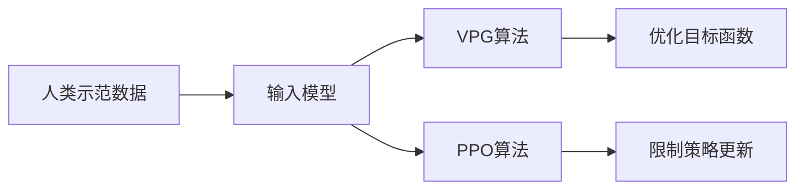

                 


# 模仿学习：从人类示范中学习的AI Agent

> 关键词：模仿学习、AI Agent、强化学习、监督学习、机器人控制

> 摘要：模仿学习是一种基于人类示范的AI学习方法，通过观察和模仿人类行为，帮助AI Agent完成特定任务。本文从基础概念、算法原理、系统架构、项目实战等方面全面解析模仿学习的核心内容，并通过具体案例展示其实际应用。文章旨在为读者提供一个从理论到实践的完整学习路径。

---

## 第1章: 模仿学习概述

### 1.1 模仿学习的定义与背景

模仿学习是一种基于人类示范的AI学习方法，通过观察和模仿人类行为，帮助AI Agent完成特定任务。与监督学习和强化学习不同，模仿学习的核心在于利用人类的“示范”（Demonstration）来引导模型学习目标行为。

#### 1.1.1 什么是模仿学习
模仿学习（Imitation Learning）是机器学习的一个重要分支，旨在通过观察和模仿人类行为，让AI Agent掌握特定任务的执行方法。它的核心思想是：通过收集人类专家的示范数据，训练模型在相似环境中完成类似任务。

#### 1.1.2 模仿学习的应用场景
模仿学习广泛应用于以下场景：
- **机器人控制**：教机器人完成特定动作，如搬运、装配等。
- **自动驾驶**：通过模仿人类驾驶员的驾驶行为，训练自动驾驶模型。
- **语音助手**：通过模仿人类对话方式，提升语音交互的自然性。
- **游戏AI**：让AI通过观察人类玩家的行为，学习游戏技巧。

#### 1.1.3 模仿学习与监督学习、强化学习的区别
- **监督学习**：基于标注数据，直接预测目标结果。
- **强化学习**：通过与环境交互，学习最优策略。
- **模仿学习**：通过观察人类行为，学习目标行为。

### 1.2 模仿学习的核心概念

#### 1.2.1 示范数据的收集与处理
示范数据是模仿学习的核心输入，通常包括：
- **状态（State）**：环境当前的观测。
- **动作（Action）**：人类专家在该状态下采取的动作。
- **奖励（Reward）**：对动作的反馈（可选）。

#### 1.2.2 模仿学习的实现框架
模仿学习的实现通常包括以下几个步骤：
1. 数据收集：收集人类专家的示范数据。
2. 数据预处理：清洗和增强数据。
3. 模型训练：基于示范数据训练AI Agent。
4. 模型部署：将模型应用于实际场景。

#### 1.2.3 模仿学习的评价指标
常用的评价指标包括：
- **准确率（Accuracy）**：模型输出与人类专家动作的匹配程度。
- **成功率（Success Rate）**：在实际环境中完成任务的比例。
- **相似度（Similarity）**：模型行为与人类示范的相似程度。

### 1.3 模仿学习的数学模型

#### 1.3.1 概率分布与条件概率
模仿学习可以通过概率模型描述人类行为。假设人类动作是基于某个概率分布选择的，模型的目标是学习这个概率分布。

$$ P(a|s) = \text{softmax}(w \cdot s) $$

其中，$a$ 是动作，$s$ 是状态，$w$ 是模型参数。

#### 1.3.2 最大似然估计
在模仿学习中，通常使用最大似然估计（MLE）来训练模型。目标是最小化模型输出与人类示范的交叉熵损失。

$$ L = -\sum_{i=1}^{N} \log P(a_i|s_i) $$

#### 1.3.3 贝叶斯推断
基于贝叶斯框架，可以通过先验概率和似然函数更新模型参数。

$$ P(w|D) = \frac{P(D|w)P(w)}{P(D)} $$

其中，$D$ 是示范数据集。

### 1.4 本章小结

---

## 第2章: 模仿学习的核心算法原理

### 2.1 基于策略的模仿学习算法

#### 2.1.1 Value-based Policy Gradient (VPG)
VPG算法通过值函数（Value Function）间接优化策略。其核心思想是通过梯度上升方法最大化目标函数。

$$ J(\theta) = \mathbb{E}_{s,a \sim \rho} [\log \pi_\theta(a|s)] $$

其中，$\pi_\theta$ 是策略函数，$\rho$ 是经验分布。

#### 2.1.2 Policy-based Policy Gradient (PPO)
PPO算法是一种基于策略的强化学习方法，通过限制策略更新的幅度来确保稳定性。

$$ \text{Clip Ratio} = \frac{\pi_{\text{new}}(a|s)}{\pi_{\text{old}}(a|s)} $$

#### 2.1.3 算法原理对比
下图展示了VPG和PPO的对比：



### 2.2 基于行为的模仿学习算法

#### 2.2.1 Q-Learning
Q-Learning是一种基于值函数的方法，通过更新Q值表来学习最优策略。

$$ Q(s, a) = Q(s, a) + \alpha (r + \gamma \max Q(s', a') - Q(s, a)) $$

#### 2.2.2 Deep Q-Networks (DQN)
DQN通过深度神经网络近似Q函数，实现端到端的学习。

$$ y = r + \gamma \max Q(s', a') $$

#### 2.2.3 行为树与状态空间
行为树和状态空间是基于行为模仿学习的重要概念。行为树定义了任务的执行顺序，状态空间描述了环境的观测。

### 2.3 算法实现的数学模型

#### 2.3.1 VPG算法的数学推导
VPG算法的目标函数可以表示为：

$$ J(\theta) = \mathbb{E}_{s,a \sim \rho} [\log \pi_\theta(a|s)] $$

其梯度为：

$$ \nabla J(\theta) = \mathbb{E}_{s,a \sim \rho} [\nabla \log \pi_\theta(a|s)] $$

#### 2.3.2 PPO算法的优化目标
PPO算法的优化目标为：

$$ \max_{\theta} \mathbb{E}_{s,a \sim \rho} [\min( \frac{\pi_\theta(a|s)}{\pi_{\theta_{old}}(a|s)}, 1/\epsilon ) ] $$

其中，$\epsilon$ 是clip参数。

#### 2.3.3 算法的收敛性分析
基于概率比的策略更新方法通常具有较好的收敛性，但具体表现依赖于数据分布和模型结构。

### 2.4 算法实现的代码示例

#### 2.4.1 VPG算法的Python实现
```python
import torch
import torch.nn as nn

class PolicyNetwork(nn.Module):
    def __init__(self, state_dim, action_dim):
        super(PolicyNetwork, self).__init__()
        self.fc1 = nn.Linear(state_dim, 64)
        self.fc2 = nn.Linear(64, action_dim)
        self.softmax = nn.Softmax(dim=1)
    
    def forward(self, x):
        x = torch.relu(self.fc1(x))
        x = self.softmax(self.fc2(x))
        return x

# 示例代码：VPG算法实现
def vpg_algorithm():
    policy = PolicyNetwork(state_dim, action_dim)
    optimizer = torch.optim.Adam(policy.parameters(), lr=1e-4)
    for epoch in epochs:
        for batch in batches:
            # 前向传播
            action_probs = policy(batch.states)
            # 计算损失
            loss = -torch.mean(torch.log(action_probs[batch.actions]))
            # 反向传播
            optimizer.zero_grad()
            loss.backward()
            optimizer.step()
    return policy
```

#### 2.4.2 PPO算法的代码框架
```python
import torch
import torch.nn as nn

class PolicyNetwork(nn.Module):
    def __init__(self, state_dim, action_dim):
        super(PolicyNetwork, self).__init__()
        self.fc1 = nn.Linear(state_dim, 64)
        self.fc2 = nn.Linear(64, action_dim)
        self.softmax = nn.Softmax(dim=1)
    
    def forward(self, x):
        x = torch.relu(self.fc1(x))
        x = self.softmax(self.fc2(x))
        return x

# 示例代码：PPO算法实现
def ppo_algorithm():
    policy = PolicyNetwork(state_dim, action_dim)
    optimizer = torch.optim.Adam(policy.parameters(), lr=1e-4)
    for epoch in epochs:
        for batch in batches:
            # 前向传播
            action_probs = policy(batch.states)
            # 计算损失
            ratio = action_probs / policy_old(batch.states)
            loss = -torch.mean(torch.min(ratio, 1.0/ratio))
            # 反向传播
            optimizer.zero_grad()
            loss.backward()
            optimizer.step()
    return policy
```

#### 2.4.3 算法的超参数调优
- **学习率（Learning Rate）**：建议从1e-4开始调整。
- **批量大小（Batch Size）**：根据数据集大小选择合适值。
- **剪裁比（Clip Ratio）**：通常设置在0.1到0.5之间。

### 2.5 本章小结

---

## 第3章: 模仿学习的系统架构设计

### 3.1 系统功能模块划分

#### 3.1.1 数据采集模块
负责收集人类专家的示范数据，包括状态、动作和奖励。

#### 3.1.2 模型训练模块
基于示范数据训练AI Agent，选择合适的算法并优化模型。

#### 3.1.3 模型部署模块
将训练好的模型部署到实际环境中，进行任务执行。

### 3.2 系统架构设计

#### 3.2.1 分层架构设计
```
+----------------+       +----------------+       +----------------+
| 数据采集模块  |       | 模型训练模块  |       | 模型部署模块  |
+----------------+       +----------------+       +----------------+
```

#### 3.2.2 微服务架构设计
```
+----------------+       +----------------+       +----------------+
| 数据采集服务  |       | 模型训练服务  |       | 模型部署服务  |
+----------------+       +----------------+       +----------------+
```

#### 3.2.3 系统扩展性分析
- 数据采集模块可以扩展支持多模态数据（如图像、语音）。
- 模型训练模块可以支持分布式训练，提升训练效率。

### 3.3 系统接口设计

#### 3.3.1 数据接口
- 输入：状态、动作、奖励。
- 输出：数据存储路径。

#### 3.3.2 模型接口
- 输入：状态。
- 输出：动作。

#### 3.3.3 用户接口
- 输入：用户指令。
- 输出：任务完成状态。

### 3.4 系统交互流程

#### 3.4.1 数据采集流程
```
开始 -> 数据采集 -> 数据预处理 -> 数据存储 -> 结束
```

#### 3.4.2 模型训练流程
```
开始 -> 加载数据 -> 模型训练 -> 模型保存 -> 结束
```

#### 3.4.3 模型部署流程
```
开始 -> 加载模型 -> 执行任务 -> 返回结果 -> 结束
```

### 3.5 本章小结

---

## 第4章: 模仿学习的项目实战

### 4.1 项目背景与目标

#### 4.1.1 项目背景
本项目旨在通过模仿学习训练一个简单的机器人移动模型。

#### 4.1.2 项目目标
- 训练模型在特定环境中完成移动任务。
- 对比不同算法的性能。

### 4.2 环境搭建与数据准备

#### 4.2.1 环境安装
安装必要的库：
```bash
pip install gym torch matplotlib
```

#### 4.2.2 数据集收集
通过模拟人类专家行为，收集机器人在不同状态下的动作数据。

#### 4.2.3 数据预处理
对数据进行归一化处理，并划分训练集和测试集。

### 4.3 模型实现与训练

#### 4.3.1 模型选择
选择VPG算法作为训练模型。

#### 4.3.2 模型训练
使用PyTorch框架训练模型。

#### 4.3.3 模型评估
通过在测试集上验证模型的准确率和成功率。

### 4.4 系统实现与部署

#### 4.4.1 系统实现
将训练好的模型封装为服务，支持实时调用。

#### 4.4.2 系统部署
部署模型到目标环境中，进行任务执行。

#### 4.4.3 系统测试
测试系统的稳定性和性能。

### 4.5 项目总结与优化

#### 4.5.1 项目总结
总结项目成果，分析优缺点。

#### 4.5.2 项目优化
提出优化建议，如改进算法、增强数据多样性。

#### 4.5.3 项目经验
分享项目实施过程中的经验与教训。

### 4.6 本章小结

---

## 第5章: 模仿学习的最佳实践与未来展望

### 5.1 最佳实践

#### 5.1.1 数据质量的重要性
高质量的示范数据是模仿学习成功的关键。

#### 5.1.2 算法选择的策略
根据任务特点选择合适的算法。

#### 5.1.3 模型评估的维度
全面评估模型的准确率、成功率和相似度。

### 5.2 未来展望

#### 5.2.1 模仿学习的潜力
随着AI技术的进步，模仿学习将在更多领域发挥重要作用。

#### 5.2.2 模仿学习的挑战
需要解决数据稀疏性、模型泛化能力等问题。

### 5.3 小结

---

# 附录

## 附录A: 常用工具与库

- **Gym**：OpenAI的强化学习库。
- **PyTorch**：深度学习框架。
- **Matplotlib**：可视化库。

## 附录B: 模仿学习的资源推荐

- **书籍**：《Reinforcement Learning: Theory and Algorithms》
- **论文**：《Imitation Learning via Maximization of Marginal Probability》
- **在线课程**：Coursera上的相关课程。

---

# 结语

模仿学习作为AI领域的重要技术，正在逐步改变我们解决问题的方式。通过本文的系统介绍，读者可以深入了解模仿学习的核心原理和实际应用。希望本文能为读者提供有价值的参考，帮助他们更好地理解和应用模仿学习技术。

