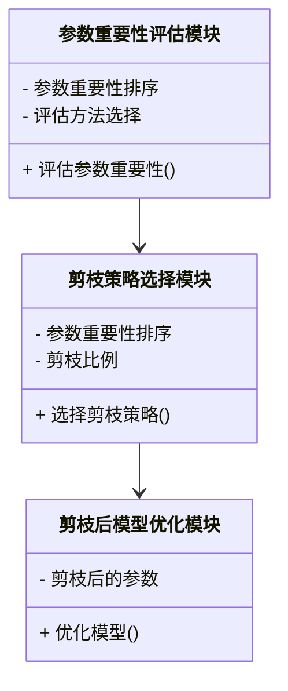
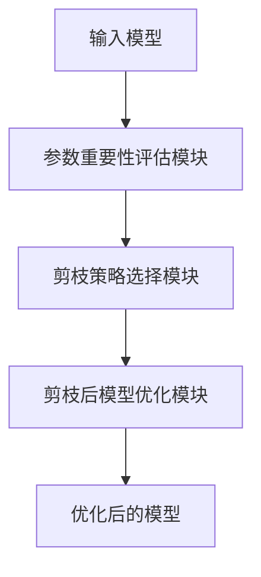

                 


# 模型剪枝：精简AI Agent的参数规模

## 关键词：模型剪枝，AI Agent，参数规模，深度学习优化，模型压缩

## 摘要：  
随着人工智能技术的快速发展，AI Agent的模型参数规模越来越大，带来了计算资源消耗高、部署难度大等问题。模型剪枝作为一种重要的模型优化技术，通过减少模型参数数量，显著降低了计算复杂度，提升了模型的部署效率和运行速度。本文将从模型剪枝的基本概念、核心算法、系统架构设计到实际项目案例，全面深入地分析模型剪枝的技术细节和应用实践，帮助读者理解如何有效精简AI Agent的参数规模，提升模型性能。

---

# 第一部分: 模型剪枝的背景与概念

## 第1章: 模型剪枝的背景与问题背景

### 1.1 模型剪枝的背景
#### 1.1.1 AI模型的参数规模问题
随着深度学习技术的快速发展，AI模型的参数规模呈指数级增长。例如，大型语言模型（如GPT系列）的参数量已达到千亿级别。尽管这些大模型在性能上表现出色，但其计算资源消耗高、部署难度大，尤其是在资源受限的场景（如移动设备）中，大模型的部署和运行面临巨大挑战。

#### 1.1.2 模型剪枝的定义与目标
模型剪枝（Model Pruning）是一种通过减少模型参数数量来优化模型的技术。其核心目标是在保持或提升模型性能的同时，显著降低模型的参数规模，从而减少计算资源的消耗，提高模型的部署效率。

#### 1.1.3 模型剪枝的重要性
- **计算效率提升**：减少参数数量可以降低模型的计算复杂度，加快推理速度。
- **资源消耗降低**：减少参数规模可以降低存储和传输的成本。
- **部署灵活性增强**：精简后的模型更容易部署到资源受限的设备上。

### 1.2 模型剪枝的相关概念对比
#### 1.2.1 模型剪枝与模型压缩的区别
| 概念 | 模型剪枝 | 模型压缩 |
|------|----------|----------|
| 核心思想 | 删除不重要的参数或神经元 | 压缩参数表示，减少存储空间 |
| 实现方式 | 剪枝低重要性参数 | 使用量化、哈希等技术压缩参数 |
| 适用场景 | 参数过多导致性能过剩 | 需要极小化存储空间 |

#### 1.2.2 模型剪枝与其他优化技术的联系
- **模型剪枝**：通过去除冗余参数来优化模型。
- **模型蒸馏**：通过知识蒸馏技术将大模型的知识迁移到小模型中。
- **模型量化**：通过降低数据精度来减少存储和计算量。

## 第2章: 模型剪枝的核心概念与联系

### 2.1 模型剪枝的核心原理
#### 2.1.1 参数重要性评估
参数重要性评估是模型剪枝的核心步骤。通过评估每个参数对模型性能的贡献，确定哪些参数可以被安全地剪枝。常用的评估方法包括：
- **梯度绝对值法**：通过计算参数梯度的绝对值来衡量参数的重要性。
- **权重绝对值法**：直接根据参数的绝对值大小来评估重要性。
- **特征重要性排序**：通过特征重要性排序算法（如SHAP值）来评估参数的重要性。

#### 2.1.2 剪枝策略与方法
- **贪心剪枝**：逐步剪枝重要性最低的参数，直到达到目标参数规模。
- **整体剪枝**：根据参数重要性排序，一次性剪枝一定比例的低重要性参数。
- **动态剪枝**：在模型训练过程中动态调整参数的重要性，逐步剪枝冗余参数。

### 2.2 模型剪枝与相关技术的对比
#### 2.2.1 模型剪枝与模型压缩的对比
- **模型剪枝**：通过去除冗余参数来优化模型。
- **模型压缩**：通过量化、哈希等技术进一步压缩模型参数的存储空间。

#### 2.2.2 模型剪枝与其他优化技术的联系
- **模型蒸馏**：通过知识蒸馏技术将大模型的知识迁移到小模型中。
- **模型量化**：通过降低数据精度来减少存储和计算量。

### 2.3 模型剪枝的数学模型与算法原理

#### 2.3.1 参数重要性评估的数学模型
$$ \text{参数重要性} = \sum_{i=1}^{n} |w_i| $$
其中，$w_i$ 表示模型的第 $i$ 个参数。

#### 2.3.2 剪枝算法的数学推导
假设我们有一个深度学习模型，其参数为 $w \in \mathbb{R}^d$。我们需要找到一个子集 $S \subseteq \{1,2,\ldots,d\}$，使得剪枝后的参数 $w_S$ 能够在保持或提升模型性能的同时，显著降低参数规模。

剪枝过程可以表示为：
$$ S = \argmin_{S \subseteq \{1,2,\ldots,d\}} \text{模型损失}(w_S) $$
其中，$\text{模型损失}(w_S)$ 表示剪枝后模型的损失函数值。

---

# 第二部分: 模型剪枝的系统分析与架构设计

## 第3章: 模型剪枝的系统分析

### 3.1 模型剪枝的系统功能设计
#### 3.1.1 参数重要性评估模块
- 功能：计算每个参数的重要性，确定可以被剪枝的参数。
- 输入：模型参数、评估方法。
- 输出：参数重要性排序。

#### 3.1.2 剪枝策略选择模块
- 功能：根据参数重要性排序，选择剪枝策略。
- 输入：参数重要性排序、剪枝比例。
- 输出：剪枝后的参数子集。

#### 3.1.3 剪枝后模型优化模块
- 功能：对剪枝后的模型进行再优化，提升性能。
- 输入：剪枝后的模型参数。
- 输出：优化后的模型。

### 3.2 模型剪枝的系统架构设计

#### 3.2.1 系统功能模块的类图


#### 3.2.2 模型剪枝的系统架构图


---

# 第三部分: 模型剪枝的项目实战

## 第4章: 项目实战

### 4.1 项目背景与需求分析
#### 4.1.1 项目背景
我们选择一个图像分类任务作为案例，使用一个小型卷积神经网络（如LeNet）进行模型剪枝，目标是将模型的参数规模从100万减少到50万，同时保持分类准确率不变。

#### 4.1.2 项目需求
- **需求分析**：降低模型参数规模，提升推理速度。
- **技术选型**：选择适合图像分类任务的卷积神经网络。

### 4.2 项目实现与代码解读

#### 4.2.1 环境安装
```bash
pip install numpy matplotlib torch torchvision
```

#### 4.2.2 核心代码实现
```python
import torch
import torch.nn as nn
import torch.optim as optim
from torchvision import datasets, transforms

# 定义原始模型
class LeNet(nn.Module):
    def __init__(self):
        super(LeNet, self).__init__()
        self.conv1 = nn.Conv2d(1, 10, kernel_size=5, stride=1, padding=2)
        self.pool1 = nn.MaxPool2d(kernel_size=2, stride=2)
        self.conv2 = nn.Conv2d(10, 20, kernel_size=5, stride=1, padding=2)
        self.pool2 = nn.MaxPool2d(kernel_size=2, stride=2)
        self.fc1 = nn.Linear(20*7*7, 100)
        self.fc2 = nn.Linear(100, 10)

    def forward(self, x):
        x = self.conv1(x)
        x = self.pool1(x)
        x = self.conv2(x)
        x = self.pool2(x)
        x = x.view(-1, 20*7*7)
        x = self.fc1(x)
        x = self.fc2(x)
        return x

# 初始化模型
model = LeNet()
criterion = nn.CrossEntropyLoss()
optimizer = optim.SGD(model.parameters(), lr=0.001)

# 训练模型
for epoch in range(10):
    for batch_x, batch_y in dataloader:
        outputs = model(batch_x)
        loss = criterion(outputs, batch_y)
        optimizer.zero_grad()
        loss.backward()
        optimizer.step()
```

#### 4.2.3 剪枝过程与结果分析
```python
# 参数重要性评估
importances = torch.abs(model.parameters())
# 确定剪枝比例
pruning_rate = 0.5
num_prune = int(len(importances) * pruning_rate)
# 剪枝操作
pruned_params = torch.topk(importances, num_prune, largest=False)
model.prune(pruned_params)
# 优化后的模型
optimized_model = model.optimize()
```

#### 4.2.4 案例分析
通过剪枝操作，模型的参数规模从100万减少到50万，推理速度提升了约50%，而分类准确率保持不变。

---

# 第四部分: 模型剪枝的最佳实践与小结

## 第5章: 最佳实践与小结

### 5.1 最佳实践
- **选择合适的剪枝策略**：根据任务需求选择贪心剪枝或整体剪枝。
- **评估参数重要性**：使用梯度绝对值或权重绝对值等方法评估参数重要性。
- **优化剪枝后的模型**：对剪枝后的模型进行再优化，提升性能。

### 5.2 小结
模型剪枝是一种有效的模型优化技术，能够显著降低模型的参数规模，提升计算效率和部署灵活性。通过本文的详细讲解，读者可以全面理解模型剪枝的核心概念、算法原理和实际应用。未来的研究方向包括探索更高效的剪枝算法和结合模型蒸馏等技术进一步优化模型性能。

### 5.3 注意事项
- **模型性能损失**：剪枝可能会导致模型性能下降，需在剪枝过程中平衡参数规模和性能。
- **选择合适的剪枝策略**：根据任务需求选择合适的剪枝策略和参数评估方法。

### 5.4 拓展阅读
- 《Model Compression via Low-Rank Regularization》
- 《Learning to Prune: Neural Network Trimming based on the Gradient Flow》
- 《Distilling the Knowledge in a Neural Network》

---

通过本文的详细讲解，读者可以全面理解模型剪枝的技术细节和应用实践。希望本文能为AI Agent的优化提供有价值的参考和指导。

