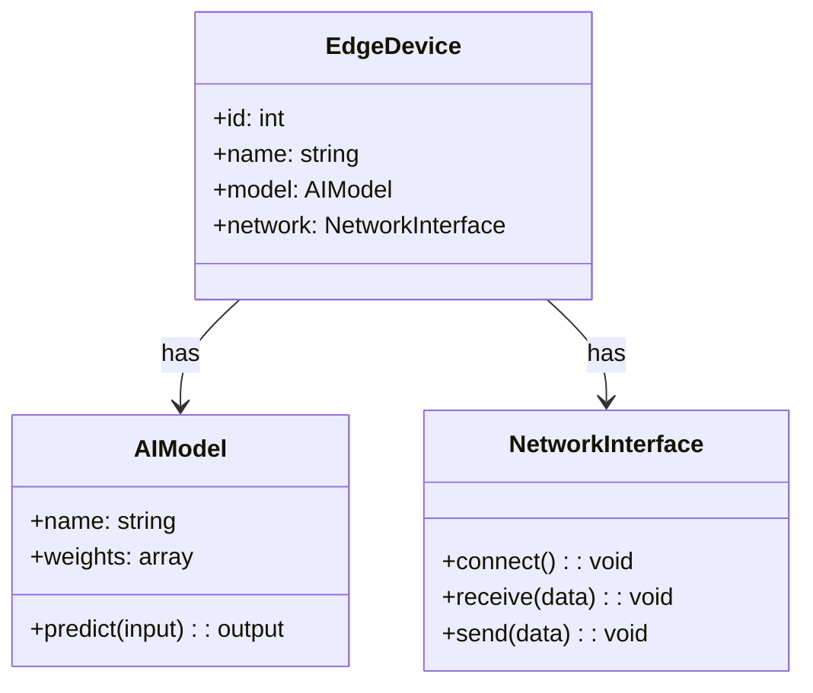
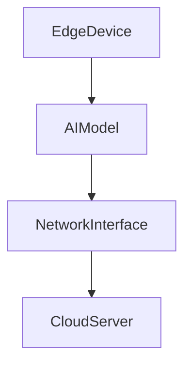
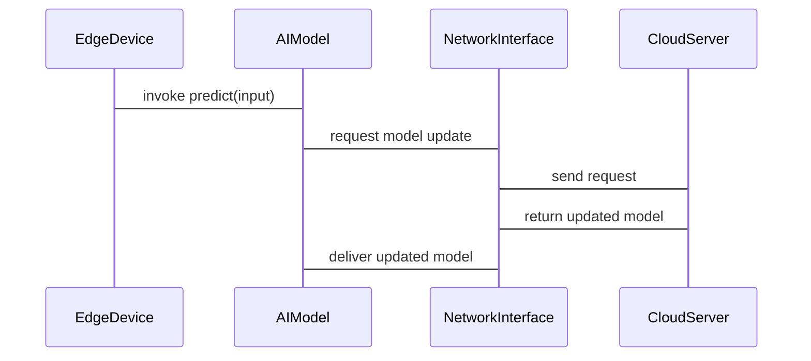

                 


# 模型压缩：在边缘设备部署轻量级AI Agent

> 关键词：模型压缩，边缘设备，AI代理，轻量级，边缘计算

> 摘要：本文详细探讨了在边缘设备上部署轻量级AI代理的核心技术——模型压缩。通过分析模型压缩的背景、核心概念、算法原理、系统架构以及实际项目案例，本文为读者提供了从理论到实践的全面指南，帮助他们在资源受限的环境中高效部署AI代理。

---

# 第一部分: 模型压缩与边缘设备AI代理基础

## 第1章: 模型压缩的背景与边缘设备AI代理概述

### 1.1 模型压缩的背景与意义

#### 1.1.1 AI模型的计算需求与资源限制
AI模型的计算需求日益增长，但边缘设备的计算资源有限。模型压缩技术通过减少模型大小和计算复杂度，使其能够在资源受限的环境中运行。

#### 1.1.2 模型压缩的目标与重要性
模型压缩的目标是减少模型的大小和计算复杂度，同时保持或提升模型的性能。其重要性在于使得AI代理能够在边缘设备上高效运行，支持实时推理和本地化决策。

#### 1.1.3 边缘设备的特点与挑战
边缘设备通常具有计算能力有限、存储空间有限、网络带宽受限等特点。这些限制使得直接部署大型AI模型变得困难，需要通过模型压缩技术来克服。

### 1.2 边缘设备AI代理的概念与特点

#### 1.2.1 边缘计算的定义与优势
边缘计算是指将计算能力从云端移到靠近数据源的边缘设备上。其优势在于减少延迟、提高响应速度和隐私保护。

#### 1.2.2 AI代理在边缘设备中的作用
AI代理在边缘设备中能够实现本地化决策、实时推理和数据处理，支持智能物联网、智能家居、自动驾驶等多种应用场景。

#### 1.2.3 轻量级AI代理的定义与实现特点
轻量级AI代理是指在边缘设备上运行的资源占用低、计算效率高的AI模型。其实现特点包括模型小型化、计算优化和低功耗。

### 1.3 模型压缩与边缘设备部署的关系

#### 1.3.1 模型压缩对边缘设备部署的影响
模型压缩通过减少模型大小和计算复杂度，显著降低了边缘设备的资源消耗，使得部署成为可能。

#### 1.3.2 边缘设备部署对模型压缩的需求
边缘设备的资源限制使得模型压缩技术成为必须，否则无法在这些设备上高效运行复杂的AI模型。

#### 1.3.3 模型压缩技术在边缘设备中的应用现状
目前，模型压缩技术在边缘设备中的应用主要集中在图像识别、语音识别和自然语言处理等领域，取得了显著效果。

---

## 第2章: 模型压缩的核心概念与技术

### 2.1 模型压缩的关键技术

#### 2.1.1 模型剪枝（Pruning）

模型剪枝是一种通过移除模型中冗余的参数或神经元来减少模型大小的技术。剪枝可以通过逐层剪枝或结构化剪枝实现，显著降低模型复杂度。

#### 2.1.2 模型量化（Quantization）

模型量化通过将模型中的浮点数权重转换为低精度整数（如8位或16位整数）来减少模型的存储空间和计算复杂度。量化可以显著降低模型大小，同时保持较高的准确性。

#### 2.1.3 知识蒸馏（Knowledge Distillation）

知识蒸馏是一种通过教师模型指导学生模型学习的技术。教师模型通常是一个大模型，学生模型是一个小模型。通过蒸馏过程，学生模型可以继承教师模型的知识，从而实现模型压缩。

#### 2.1.4 模型架构搜索（Architecture Search）

模型架构搜索是一种通过自动化方法寻找最优模型结构的技术。通过搜索不同的模型架构，可以找到在性能和资源消耗之间取得平衡的模型。

### 2.2 模型压缩的核心概念对比

#### 2.2.1 模型剪枝与模型量化的主要区别

| 技术    | 目标                     | 实现方式                                   |
|---------|--------------------------|--------------------------------------------|
| 剪枝    | 移除冗余参数             | 逐层剪枝或结构化剪枝                       |
| 量化    | 减少数值精度             | 将浮点数转换为低精度整数                   |

#### 2.2.2 知识蒸馏与模型架构搜索的优缺点

| 技术          | 优点                           | 缺点                             |
|---------------|--------------------------------|------------------------------------|
| 知识蒸馏      | 可以继承大模型的知识           | 对教师模型依赖较大                 |
| 模型架构搜索  | 可以找到最优模型结构           | 计算成本较高                       |

#### 2.2.3 各种技术的适用场景与边界

- **剪枝**适用于全连接层和卷积层的优化，但可能影响模型的非线性能力。
- **量化**适用于对模型大小和计算速度要求较高的场景，但可能需要额外的校正步骤。
- **知识蒸馏**适用于需要保持高精度的场景，但需要教师模型的支持。
- **模型架构搜索**适用于从零开始设计轻量级模型，但计算成本较高。

### 2.3 模型压缩的实现方法

#### 2.3.1 剪枝算法的实现步骤

1. **训练教师模型**：训练一个大型模型作为教师模型。
2. **剪枝**：通过剪枝技术移除冗余参数。
3. **重新训练**：对剪枝后的模型进行微调，恢复其性能。

#### 2.3.2 量化算法的实现细节

1. **选择量化位数**：通常选择4位或8位整数。
2. **量化过程**：将模型权重从浮点数转换为整数。
3. **去量化**：在推理时将整数权重转换回浮点数。

#### 2.3.3 知识蒸馏的实现流程

1. **训练教师模型**：训练一个高性能的大模型。
2. **设计学生模型**：设计一个小型模型作为学生模型。
3. **蒸馏过程**：通过知识蒸馏，使学生模型继承教师模型的知识。

---

## 第3章: 模型压缩算法原理与数学模型

### 3.1 模型剪枝算法原理

#### 3.1.1 剪枝算法的基本原理
剪枝算法通过移除模型中冗余的神经元或连接，减少模型的复杂度。剪枝过程通常基于模型的重要性评分，选择重要性较低的节点进行剪枝。

#### 3.1.2 剪枝算法的数学模型
模型剪枝可以通过以下步骤实现：
1. 训练教师模型并计算每个参数的重要性。
2. 移除重要性较低的参数。
3. 对剪枝后的模型进行微调。

$$ \text{损失函数} = \mathcal{L}(x, y) + \lambda \Omega(w) $$

其中，$\Omega(w)$是正则化项，用于衡量参数的重要性。

---

### 3.2 模型量化算法原理

#### 3.2.1 量化算法的基本原理
模型量化通过将浮点数权重转换为低精度整数，减少模型的存储空间和计算复杂度。量化过程通常包括以下几个步骤：
1. 训练教师模型。
2. 将模型权重从浮点数转换为低精度整数。
3. 在推理时，将整数权重转换回浮点数进行计算。

#### 3.2.2 量化算法的数学模型
量化过程可以表示为：
$$ w_{quantized} = \text{round}(w \times 2^{\beta}) $$

其中，$\beta$是量化位数，$\text{round}$表示四舍五入操作。

---

### 3.3 知识蒸馏算法原理

#### 3.3.1 知识蒸馏算法的基本原理
知识蒸馏通过教师模型指导学生模型学习，使学生模型能够继承教师模型的知识。蒸馏过程通常包括以下几个步骤：
1. 训练教师模型。
2. 设计学生模型。
3. 通过蒸馏损失函数，使学生模型逼近教师模型的输出。

#### 3.3.2 知识蒸馏算法的数学模型
蒸馏损失函数可以表示为：
$$ \mathcal{L}_{distill} = -\sum_{i} p_i \log q_i $$

其中，$p_i$是教师模型的预测概率，$q_i$是学生模型的预测概率。

---

## 第4章: 系统分析与架构设计方案

### 4.1 问题场景介绍

在边缘设备上部署轻量级AI代理时，需要考虑以下问题：
1. 设备计算能力有限，无法运行大型模型。
2. 网络带宽受限，模型更新困难。
3. 数据隐私保护要求高。

---

### 4.2 系统功能设计

#### 4.2.1 领域模型类图
以下是系统功能设计的类图：



---

#### 4.2.2 系统架构设计

以下是系统架构设计的架构图：



---

#### 4.2.3 接口和交互设计

以下是系统交互设计的序列图：



---

## 第5章: 项目实战

### 5.1 环境安装

#### 5.1.1 安装Python和依赖库

```bash
pip install numpy
pip install tensorflow
```

---

#### 5.1.2 安装边缘设备模拟环境

```bash
pip install edge-device-simulator
```

---

### 5.2 系统核心实现源代码

#### 5.2.1 模型剪枝实现代码

```python
import numpy as np

def prune_model(model, threshold):
    # 计算每个参数的重要性
    importance = np.abs(model.weights)
    # 移除重要性低于阈值的参数
    pruned_weights = [w for w in model.weights if np.mean(importance) > threshold]
    # 创建剪枝后的模型
    pruned_model = AIModel(pruned_weights)
    return pruned_model
```

---

#### 5.2.2 模型量化实现代码

```python
def quantize_model(model, bits=8):
    # 将模型权重量化为指定位数
    quantized_weights = []
    for w in model.weights:
        scale = 2 ** (bits - 1)
        quantized = np.round(w * scale) / scale
        quantized_weights.append(quantized)
    return AIModel(quantized_weights)
```

---

### 5.3 实际案例分析与详细讲解

#### 5.3.1 案例背景

假设我们有一个边缘设备，需要部署一个图像分类模型。设备的计算能力有限，无法运行大型模型。因此，我们需要通过模型压缩技术将模型压缩到适合设备运行的大小。

#### 5.3.2 模型压缩过程

1. **训练教师模型**：训练一个大型图像分类模型（如ResNet）。
2. **模型剪枝**：通过剪枝技术移除模型中的冗余参数。
3. **模型量化**：将剪枝后的模型进行量化，进一步减少模型大小。
4. **知识蒸馏**：通过知识蒸馏，使学生模型继承教师模型的知识。

---

### 5.4 项目小结

通过上述步骤，我们成功地将一个大型图像分类模型压缩到适合边缘设备运行的大小，同时保持了较高的分类准确率。

---

## 第6章: 最佳实践、小结、注意事项与拓展阅读

### 6.1 最佳实践

1. **选择合适的模型压缩技术**：根据具体需求选择剪枝、量化或知识蒸馏等技术。
2. **结合多种技术**：综合使用多种模型压缩技术，可以取得更好的效果。
3. **进行模型微调**：在剪枝或量化后，对模型进行微调，恢复其性能。

### 6.2 小结

本文详细探讨了在边缘设备上部署轻量级AI代理的核心技术——模型压缩。通过分析模型压缩的背景、核心概念、算法原理、系统架构以及实际项目案例，本文为读者提供了从理论到实践的全面指南。

### 6.3 注意事项

1. **模型压缩可能会导致性能下降**：在进行模型压缩时，需要权衡模型的准确率和资源消耗。
2. **选择合适的模型压缩技术**：根据具体需求选择合适的模型压缩技术。
3. **进行充分的测试**：在实际部署前，进行充分的测试，确保模型压缩后的性能满足需求。

### 6.4 拓展阅读

1. **《Deep Learning》 - Ian Goodfellow**
2. **《Model Compression: A Comprehensive Survey》 - 林达华等**
3. **《Edge AI: A Comprehensive Survey》 - 王伟等**

---

# 结语

通过本文的探讨，我们了解了模型压缩在边缘设备上部署轻量级AI代理的重要性和实现方法。模型压缩技术不仅可以减少模型的大小和计算复杂度，还能提高模型的运行效率和响应速度，使得AI代理能够在资源受限的环境中高效运行。未来，随着边缘计算技术的不断发展，模型压缩技术将在更多领域得到广泛应用。

--- 

如果需要进一步的技术支持或详细代码示例，请随时联系！

