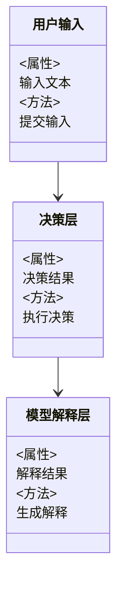
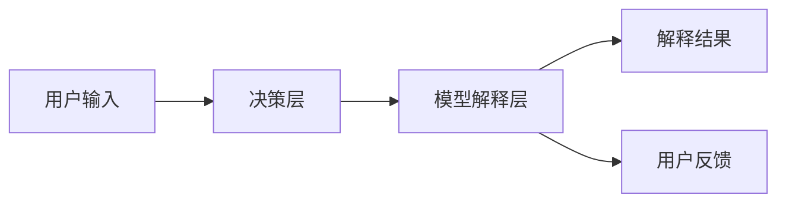
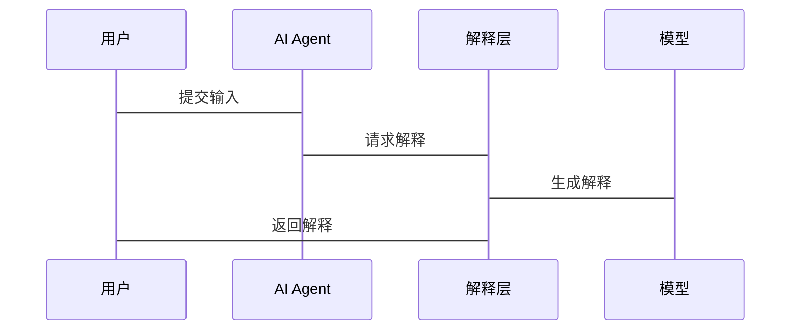

                 


# 模型可解释性技术在AI Agent中的应用

> 关键词：模型可解释性，AI Agent，LIME，SHAP，系统架构，项目实战

> 摘要：模型可解释性是人工智能系统的重要特性，尤其是在AI Agent中，可解释性技术能够帮助我们理解模型的决策过程，增强系统的透明度和可信度。本文将从模型可解释性的基本概念出发，详细探讨其在AI Agent中的应用，包括核心原理、算法实现、系统架构设计以及项目实战等内容，最后总结可解释性技术在实际应用中的重要意义和未来发展方向。

---

# 第1章: 模型可解释性与AI Agent概述

## 1.1 问题背景与挑战

### 1.1.1 问题背景
随着人工智能技术的快速发展，AI Agent（智能体）在各个领域的应用越来越广泛。AI Agent是一种能够感知环境、自主决策并执行任务的智能系统。然而，随着模型复杂性的增加，尤其是在深度学习模型中，模型的“黑箱”特性使得人们难以理解模型的决策过程，这在一定程度上影响了模型的可信度和可用性。

### 1.1.2 核心挑战
- **决策过程不透明**：深度学习模型通常被视为“黑箱”，用户无法直接理解模型的决策依据。
- **用户信任问题**：缺乏可解释性可能导致用户对AI Agent的决策结果产生不信任。
- **合规性与伦理问题**：在某些领域（如医疗、金融），模型的决策需要符合严格的法规和伦理标准，可解释性是必要条件。

### 1.1.3 可解释性的重要性
模型可解释性是提升AI Agent透明度和可信度的关键。通过可解释性技术，用户可以理解模型的决策逻辑，从而更好地验证和信任模型的输出。

---

## 1.2 AI Agent的基本概念

### 1.2.1 AI Agent的定义
AI Agent是一种能够感知环境、自主决策并执行任务的智能实体。它可以是一个软件程序，也可以是一个物理设备，具备以下核心特征：
- **自主性**：能够在没有外部干预的情况下独立运行。
- **反应性**：能够感知环境并实时调整行为。
- **目标导向**：以特定目标为导向，执行任务。

### 1.2.2 AI Agent的分类
AI Agent可以根据不同的标准进行分类：
- **按智能水平**：分为反应式Agent、基于模型的Agent、目标导向的Agent等。
- **按应用领域**：如自动驾驶Agent、推荐系统Agent、对话系统Agent等。

### 1.2.3 AI Agent的核心组件
1. **感知层**：负责感知环境信息，如传感器数据、用户输入等。
2. **决策层**：基于感知信息进行分析和决策，选择最优动作。
3. **执行层**：将决策结果转化为具体动作，执行任务。

---

## 1.3 模型可解释性与AI Agent的关系

### 1.3.1 可解释性对AI Agent的意义
- **提升用户信任**：通过可解释性技术，用户可以理解AI Agent的决策逻辑，从而增强信任。
- **支持调试与优化**：可解释性帮助开发者定位模型的错误或不足，优化模型性能。
- **满足合规要求**：在特定领域，可解释性是模型部署的必要条件。

### 1.3.2 可解释性在AI Agent中的实现路径
1. **模型选择**：选择具有较好可解释性的模型，如线性模型、树模型等。
2. **特征分析**：通过分析特征的重要性，理解模型的决策依据。
3. **可视化技术**：利用可视化工具展示模型的决策过程。
4. **可解释性算法**：引入LIME、SHAP等可解释性算法，生成模型的解释。

---

## 1.4 本章小结
本章介绍了模型可解释性的基本概念、AI Agent的核心特征以及两者之间的关系。模型可解释性是AI Agent的重要特性，能够提升系统的透明度和可信度，支持用户理解和信任模型的决策过程。

---

# 第2章: 可解释性技术的核心原理

## 2.1 可解释性技术的分类与对比

### 2.1.1 透明模型与黑箱模型
- **透明模型**：模型结构简单，决策过程容易理解，如线性回归、决策树等。
- **黑箱模型**：模型结构复杂，决策过程难以解释，如深度神经网络。

### 2.1.2 局部可解释性与全局可解释性
- **局部可解释性**：针对单个预测结果，解释模型的决策过程。
- **全局可解释性**：解释模型在整体数据集上的行为。

### 2.1.3 对比分析
通过对比分析，可以发现不同可解释性技术的特点和适用场景。以下是一个对比表格：

| 特性                | 透明模型           | 黑箱模型           |
|---------------------|---------------------|---------------------|
| 可解释性             | 高                 | 低                 |
| 模型复杂性           | 低                 | 高                 |
| 应用场景             | 需要高解释性的领域 | 需要高精度的领域   |

---

## 2.2 AI Agent中的可解释性技术

### 2.2.1 层次化可解释性模型
层次化可解释性模型通过构建多个层次的解释，从全局到局部，逐步细化模型的决策过程。例如：
- **全局解释**：分析模型的整体行为，如特征重要性。
- **局部解释**：针对具体预测结果，解释模型的决策逻辑。

### 2.2.2 可解释性技术的实体关系图
以下是可解释性技术的实体关系图：


---

## 2.3 本章小结
本章详细探讨了可解释性技术的分类及其在AI Agent中的应用。通过对比分析和实体关系图，我们理解了不同可解释性技术的特点和适用场景，为后续的算法实现奠定了基础。

---

# 第3章: 可解释性技术的算法原理

## 3.1 LIME解释方法

### 3.1.1 LIME算法的原理
LIME（Locally Interpretable Model-agnostic Explanations）是一种基于局部线性模型的解释方法。其核心思想是：对于单个预测结果，通过扰动输入数据，生成多个样本，并使用线性模型拟合这些样本，从而解释模型的决策过程。

### 3.1.2 LIME算法的流程图
以下是LIME算法的流程图：


### 3.1.3 LIME算法的数学模型
LIME算法通过以下公式计算扰动数据的权重：
$$ \text{权重} = \sum_{i=1}^{n} w_i \cdot y_i $$

---

## 3.2 SHAP值解释方法

### 3.2.1 SHAP值的计算原理
SHAP（Shapley Additive exPlanations）是一种基于博弈论的解释方法。其核心思想是：将每个特征的贡献度分配为一个加性解释，确保全局解释的一致性。

### 3.2.2 SHAP值的计算流程
以下是SHAP值的计算流程图：


### 3.2.3 SHAP值的数学公式
SHAP值的计算公式为：
$$ \text{SHAP值} = \phi_i = \sum_{S \subseteq F \setminus \{i\}} \frac{|S|}{2^{n-1}} \cdot (f(S \cup \{i\}) - f(S)) $$

---

## 3.3 本章小结
本章详细介绍了LIME和SHAP两种可解释性算法的原理和实现方法。通过流程图和数学公式的展示，我们理解了这些算法如何帮助我们解释复杂模型的决策过程。

---

# 第4章: AI Agent的系统架构设计

## 4.1 系统功能设计

### 4.1.1 领域模型
以下是AI Agent的领域模型：



### 4.1.2 系统架构图
以下是AI Agent的系统架构图：



---

## 4.2 系统交互设计

### 4.2.1 系统交互序列图
以下是系统的交互序列图：



---

## 4.3 本章小结
本章通过系统架构设计，展示了AI Agent中可解释性技术的实现路径。通过领域模型和系统架构图，我们理解了系统的整体结构和各部分之间的关系。

---

# 第5章: 项目实战——构建可解释的对话系统

## 5.1 环境安装与配置

### 5.1.1 安装Python环境
```bash
python --version
pip install -r requirements.txt
```

### 5.1.2 安装可解释性库
```bash
pip install lime
pip install shap
```

---

## 5.2 核心代码实现

### 5.2.1 模型训练
```python
import numpy as np
from sklearn.datasets import make_classification
from sklearn.ensemble import RandomForestClassifier
from lime.lime_tabular import LimeTabular

# 生成数据
X, y = make_classification(n_samples=1000, n_features=20)
model = RandomForestClassifier().fit(X, y)
```

### 5.2.2 可解释性分析
```python
explainer = LimeTabular(
    model.predict_proba,
    X_train.shape[1],
    feature_names=["f" + str(i) for i in range(X_train.shape[1])]
)
explanation = explainer.explain_instance(X_test[0], y_test[0], top_features=5)
print(explanation.as_list())
```

---

## 5.3 案例分析与总结

### 5.3.1 案例分析
通过上述代码，我们生成了一个可解释的对话系统。对于输入的特定样本，LIME解释器生成了5个最重要的特征及其贡献度，帮助我们理解模型的决策过程。

### 5.3.2 总结
通过项目实战，我们掌握了可解释性技术在实际应用中的实现方法。模型可解释性不仅是提升系统透明度的关键，也是确保用户信任的重要手段。

---

# 第6章: 总结与展望

## 6.1 本章总结
模型可解释性是AI Agent的重要特性，能够帮助我们理解模型的决策过程，增强系统的透明度和可信度。本文从基本概念出发，详细探讨了可解释性技术的核心原理、算法实现、系统架构设计以及项目实战等内容。

## 6.2 未来展望
随着AI技术的不断发展，模型可解释性技术将更加重要。未来的研究方向包括：
- **更高效的解释方法**：开发更高效的算法，降低解释成本。
- **多模态解释**：结合文本、图像等多种模态信息，提供更丰富的解释。
- **动态解释**：实时更新解释结果，适应动态变化的环境。

---

# 结语
模型可解释性技术在AI Agent中的应用是一个复杂的但又至关重要的领域。通过本文的探讨，我们不仅理解了可解释性技术的核心原理，还掌握了其在实际应用中的实现方法。未来，随着技术的不断进步，模型可解释性将为AI Agent的发展注入更多活力，推动人工智能技术的进一步普及和应用。

---

