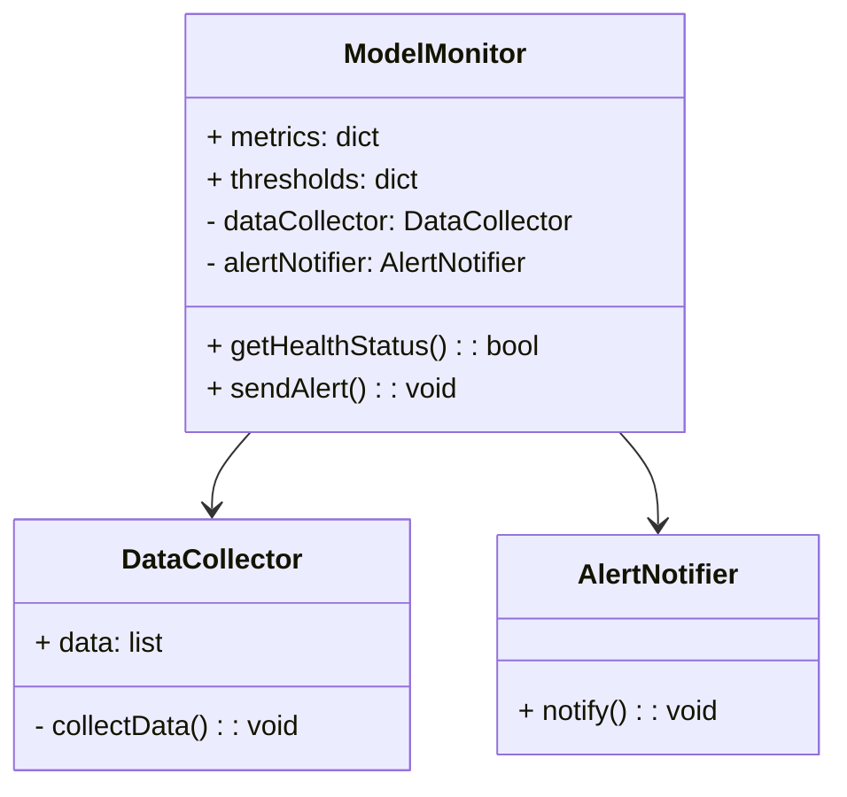
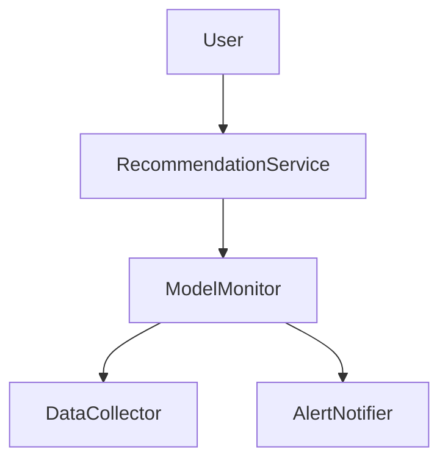
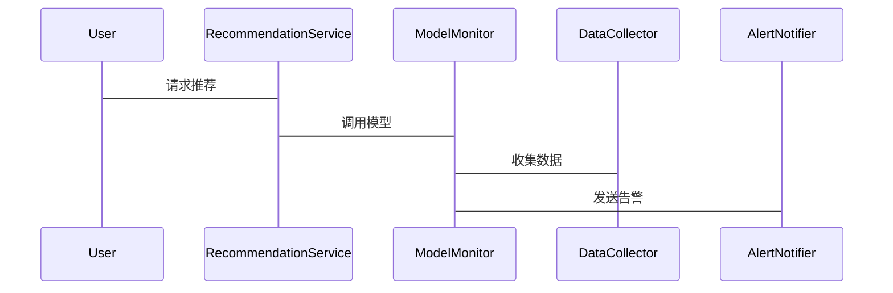

                 


# 模型监控：实时跟踪AI Agent的健康状态

## 关键词：AI Agent，模型监控，实时跟踪，模型健康，性能退化，系统架构，模型治理

## 摘要：  
随着AI Agent在各个领域的广泛应用，模型监控变得至关重要。本文详细探讨了实时跟踪AI Agent健康状态的方法，涵盖了模型监控的核心概念、算法原理、系统架构设计以及实际项目实现。通过分析模型性能退化的原因，结合实时跟踪机制和系统架构设计，提供了具体的实现方案和代码示例。本文还总结了最佳实践和未来的发展方向，为读者提供了全面的指导。

---

## 正文

---

### 第一部分：模型监控基础

#### 第1章：模型监控的背景与问题背景

##### 1.1 问题背景
AI Agent的应用场景日益广泛，从智能客服到自动驾驶，模型的健康状态直接影响系统的稳定性和准确性。然而，模型在实际应用中可能面临数据漂移、概念漂移等问题，导致性能下降。

##### 1.2 问题描述
模型健康状态的定义涉及多个方面，包括准确性、响应时间等。模型性能退化的原因可能包括数据变化、算法过拟合等。监控的目标是实时发现并修复这些问题。

##### 1.3 问题解决
实时跟踪的意义在于快速发现模型问题，减少损失。模型监控的边界包括数据来源、模型类型等，而外延则涉及数据治理和模型优化。

##### 1.4 概念结构与核心要素
模型监控的核心要素包括数据采集、指标计算和告警系统。指标体系涵盖准确性、响应时间等，帮助全面评估模型状态。

---

#### 第2章：模型监控的核心概念与联系

##### 2.1 核心概念原理
模型健康状态的定义是基于多个指标评估模型的表现。模型性能退化的原理涉及数据变化和算法限制。实时跟踪基于流数据处理和统计分析。

##### 2.2 概念属性特征对比
| 概念 | 特征 |
|------|------|
| 健康状态 | 多维性、动态性 |
| 性能退化 | 可预测性、可修复性 |
| 实时跟踪 | 高效性、实时性 |

##### 2.3 ER实体关系图
```mermaid
erd
    章节1
    章节2
    章节3
    章节4
```

---

#### 第3章：模型监控的算法原理

##### 3.1 算法原理概述
监控算法基于统计方法和机器学习，实时分析模型输出。

##### 3.2 模型性能退化分析
退化原因包括数据变化和模型过拟合。解决方法是重新训练或调整参数。

##### 3.3 实时跟踪机制
通过设计特征工程提取关键指标，使用滑动窗口方法高效处理数据。

---

### 第二部分：模型监控的系统架构与实现

#### 第4章：系统架构设计

##### 4.1 问题场景介绍
电商推荐系统中，实时监控模型性能，及时发现并修复问题。

##### 4.2 系统功能设计


##### 4.3 系统架构设计


##### 4.4 系统接口设计
关键接口包括`collectData()`和`sendAlert()`，详细描述参数和返回值。

##### 4.5 系统交互设计


---

#### 第5章：项目实战

##### 5.1 环境安装
依赖库包括`flask`、`pandas`、`scikit-learn`，安装命令为：
```bash
pip install flask pandas scikit-learn
```

##### 5.2 系统核心实现
- 数据采集：从数据库读取用户行为数据。
- 特征工程：提取用户活跃度和偏好特征。
- 模型部署：使用预训练的推荐模型。
- 监控系统：实现`ModelMonitor`类，定期检查模型性能。

##### 5.3 代码应用解读
关键代码片段：
```python
class ModelMonitor:
    def __init__(self, model, data_collector, alert_notifier):
        self.model = model
        self.data_collector = data_collector
        self.alert_notifier = alert_notifier
        self.metrics = {}

    def get_health_status(self):
        # 计算模型指标
        pass

    def send_alert(self, status):
        # 发送告警
        pass
```

##### 5.4 实际案例分析
电商推荐系统中，模型健康状态的实时跟踪确保推荐准确性，减少用户流失。

##### 5.5 项目小结
项目实现了模型监控系统，验证了系统架构的有效性，提供了可扩展的解决方案。

---

### 第三部分：模型监控的高级主题与最佳实践

#### 第6章：高级主题与最佳实践

##### 6.1 模型监控的伦理问题
数据隐私和算法公平性是模型监控中的重要伦理问题。

##### 6.2 模型监控与AIOps的结合
通过日志监控和异常处理，提升模型监控的效率。

##### 6.3 未来趋势展望
未来模型监控将更加智能化，结合联邦学习和自适应算法。

---

### 第四部分：总结与展望

#### 第7章：总结与展望

##### 7.1 总结回顾
本文系统地介绍了模型监控的核心概念、算法和系统架构，提供了实战案例和最佳实践。

##### 7.2 未来展望
模型监控将向智能化、自动化方向发展，成为AI系统稳定运行的关键保障。

---

### 小结

通过本文的详细讲解，读者可以全面理解模型监控的重要性和实现方法，掌握实时跟踪AI Agent健康状态的技术要点，为实际应用提供有力支持。

