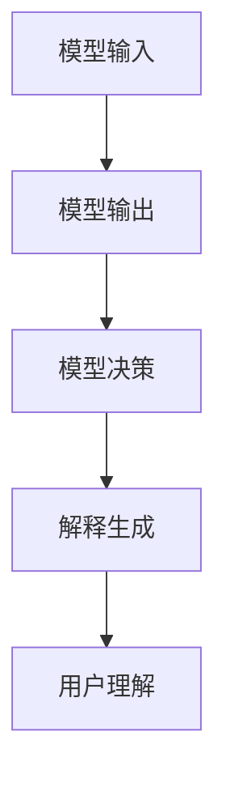
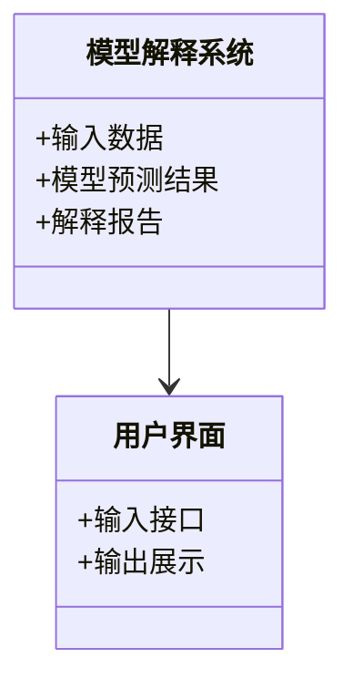
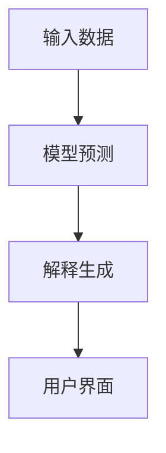
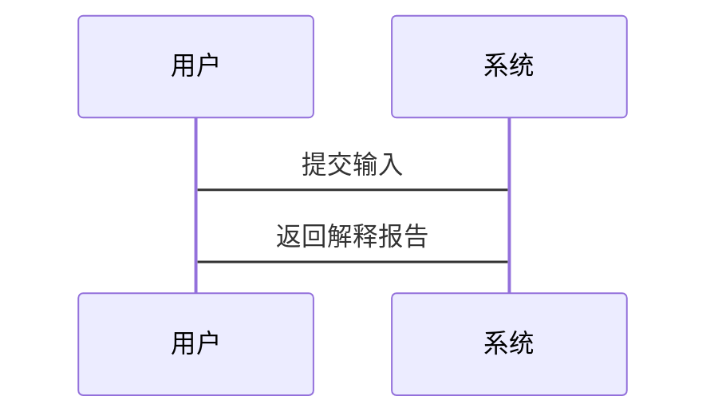

                 


# 模型解释：增加AI Agent的透明度

## 关键词：模型解释，AI Agent，透明度，可解释性，LIME，SHAP

## 摘要：模型解释是增加AI Agent透明度的关键，本文通过详细分析模型解释的核心概念、算法原理、系统架构设计以及项目实战，探讨如何实现AI Agent的透明化，提升其可信度和应用价值。

---

# 第一部分: 模型解释与AI Agent透明度背景

# 第1章: 模型解释与AI Agent透明度概述

## 1.1 问题背景与重要性

### 1.1.1 AI Agent的崛起与挑战
随着AI技术的快速发展，AI Agent在金融、医疗、自动驾驶等领域的应用日益广泛。然而，AI Agent的决策过程往往被视为“黑箱”，缺乏透明度，这不仅影响了用户的信任，还可能导致法律和伦理问题。

### 1.1.2 模型解释的必要性
模型解释是理解AI Agent决策过程的关键。通过解释模型的输出，用户可以验证模型的合理性，发现潜在的偏见或错误，并在必要时进行调整。

### 1.1.3 透明度对AI可信度的影响
透明度是AI技术可信的基础。只有当用户能够理解AI Agent的决策过程时，他们才会更愿意依赖和使用这些系统。

## 1.2 问题描述与目标

### 1.2.1 模型黑箱问题
AI模型的复杂性使得其决策过程难以被人类理解。例如，深度神经网络的决策往往被认为是“黑箱”，缺乏可解释性。

### 1.2.2 解释性AI的目标
解释性AI的目标是通过技术手段揭示AI模型的决策逻辑，使用户能够理解模型的输出。

### 1.2.3 透明度的边界与外延
透明度并非要求模型完全公开其参数，而是需要在保证隐私和安全的前提下，提供足够的解释信息。

## 1.3 核心概念与联系

### 1.3.1 模型解释的核心要素
模型解释需要包括以下要素：
1. **输入与输出的关系**：解释模型输入如何影响输出。
2. **决策逻辑**：揭示模型的决策过程。
3. **解释的可理解性**：确保解释能够被目标用户理解。

### 1.3.2 解释性与可解释性对比表格
| 概念       | 定义                                                                 | 示例                                                                 |
|------------|----------------------------------------------------------------------|----------------------------------------------------------------------|
| 解释性     | 描述模型输出的解释性信息                                         | “如果贷款申请者的信用评分较高，贷款通过率会增加。”                                 |
| 可解释性   | 模型输出的可理解程度                                             | “模型通过分析用户的信用历史、收入水平等因素来决定贷款是否通过。”               |

### 1.3.3 解释性与可解释性的关系图


## 1.4 本章小结

---

# 第二部分: 模型解释的核心概念与原理

# 第2章: 模型解释的核心原理

## 2.1 解释性AI的原理

### 2.1.1 局部可解释性与全局可解释性
- **局部可解释性**：解释模型在特定输入下的决策过程。
- **全局可解释性**：解释模型的整体行为和决策逻辑。

### 2.1.2 解释性方法的分类
解释性方法主要分为两类：
1. **基于模型的方法**：通过分析模型的结构和参数来解释其行为。
2. **基于实例的方法**：通过具体实例的分析来揭示模型的决策逻辑。

### 2.1.3 解释性与模型复杂度的关系
模型复杂度越高，解释性越难。例如，线性回归模型的解释性较强，而深度神经网络的解释性较弱。

## 2.2 模型解释的数学基础

### 2.2.1 解释性度量的数学模型
解释性度量可以通过以下公式进行衡量：
$$ \text{解释性} = \frac{\text{模型预测的准确性}}{\text{解释的复杂性}} $$

### 2.2.2 信息增益的计算公式
信息增益可以用来衡量特征对模型输出的影响程度：
$$ \text{信息增益}(f) = \log\left(\frac{\text{预测准确率}}{\text{随机准确率}}\right) $$

### 2.2.3 解释性评分的公式推导
解释性评分可以通过以下步骤进行计算：
1. 对每个特征进行重要性评分。
2. 根据评分结果生成解释性报告。

## 2.3 解释性与模型可解释性的对比

### 2.3.1 对比分析表格
| 概念       | 定义                                                                 | 示例                                                                 |
|------------|----------------------------------------------------------------------|----------------------------------------------------------------------|
| 解释性     | 描述模型输出的解释性信息                                         | “如果贷款申请者的信用评分较高，贷款通过率会增加。”                                 |
| 可解释性   | 模型输出的可理解程度                                             | “模型通过分析用户的信用历史、收入水平等因素来决定贷款是否通过。”               |

## 2.4 本章小结

---

# 第三部分: 模型解释的算法原理

# 第3章: 模型解释的算法原理

## 3.1 LIME算法原理

### 3.1.1 LIME算法的基本思想
LIME（Local Interpretable Model-agnostic Explanations）是一种用于解释模型预测结果的方法。它通过在局部区域构建线性模型来解释模型的输出。

### 3.1.2 LIME算法的步骤
1. 选择一个待解释的样本。
2. 生成该样本的近邻样本。
3. 对近邻样本进行预测。
4. 使用线性模型拟合这些样本，生成解释。

### 3.1.3 LIME算法的代码实现
```python
import lime
from lime import lime_explanations
import numpy as np

# 示例代码
def lime_explanation(model, X, y):
    explainer = lime_explanations.LimeExplainer()
    explanation = explainer.explain_instance(model, X, y)
    return explanation
```

## 3.2 SHAP算法原理

### 3.2.1 SHAP算法的基本思想
SHAP（SHapley Additive exPlanations）是基于博弈论的解释方法，用于衡量每个特征对模型输出的贡献。

### 3.2.2 SHAP算法的步骤
1. 计算每个特征的Shapley值。
2. 根据Shapley值生成解释。

### 3.2.3 SHAP算法的代码实现
```python
import shap
from sklearn.datasets import shap_toy_data
from sklearn.ensemble import RandomForestClassifier

# 示例代码
def shap_explanation(model, X, y):
    explainer = shap.TreeExplainer(model)
    shap_values = explainer.shap_values(X, y)
    return shap_values
```

## 3.3 本章小结

---

# 第四部分: 模型解释的系统分析与架构设计

# 第4章: 模型解释的系统架构设计

## 4.1 问题场景介绍

### 4.1.1 医疗诊断系统的应用场景
在医疗诊断系统中，模型解释可以帮助医生理解AI的诊断过程。

## 4.2 系统功能设计

### 4.2.1 领域模型设计


### 4.2.2 系统架构设计


## 4.3 系统交互设计

### 4.3.1 系统交互序列图


## 4.4 本章小结

---

# 第五部分: 模型解释的项目实战

# 第5章: 模型解释的项目实战

## 5.1 环境安装

### 5.1.1 安装必要的库
```bash
pip install lime
pip install shap
```

## 5.2 系统核心实现

### 5.2.1 解释性代码实现
```python
import lime
from lime import lime_explanations
import numpy as np

def lime_explanation(model, X, y):
    explainer = lime_explanations.LimeExplainer()
    explanation = explainer.explain_instance(model, X, y)
    return explanation
```

### 5.2.2 可视化代码实现
```python
import matplotlib.pyplot as plt

def visualize_explanation(explanation):
    plt.figure()
    explanation.as_pyplot_figure()
    plt.show()
```

## 5.3 案例分析

### 5.3.1 案例分析与解读
以医疗诊断系统为例，通过解释模型的预测结果，帮助医生理解AI的诊断过程。

## 5.4 本章小结

---

# 第六部分: 最佳实践与总结

# 第6章: 最佳实践与总结

## 6.1 最佳实践

### 6.1.1 选择合适的解释方法
根据具体场景选择适合的解释方法，如LIME适用于局部解释，SHAP适用于全局解释。

### 6.1.2 处理边缘情况
在实际应用中，需要注意模型的边缘情况，避免因解释错误导致的决策失误。

## 6.2 小结

## 6.3 注意事项

## 6.4 拓展阅读

---

# 结语

通过本文的详细讲解，我们深入探讨了模型解释的核心概念、算法原理、系统架构设计以及项目实战。模型解释是增加AI Agent透明度的关键，只有通过有效的解释，才能真正实现AI技术的可信与广泛应用。

