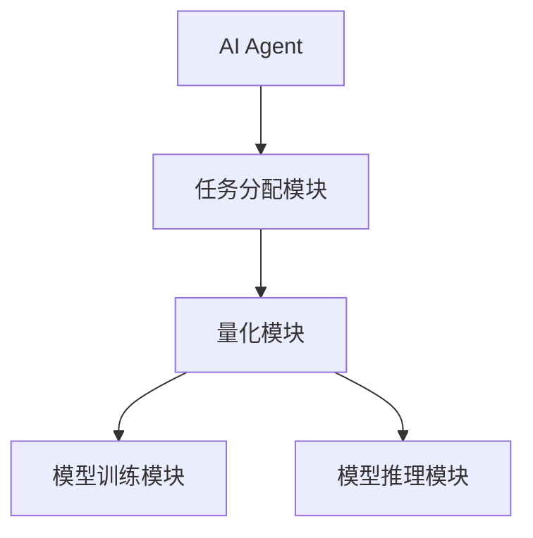

                 


# 模型量化：降低AI Agent的硬件需求

## 关键词：
- 模型量化
- AI Agent
- 硬件需求
- 深度学习
- 模型压缩

## 摘要：
模型量化是降低AI Agent硬件需求的关键技术，通过将模型参数从高精度降低到低位宽，减少模型体积和计算量，使其能够在资源受限的设备上高效运行。本文详细阐述了模型量化的核心概念、算法原理、系统实现及应用案例，探讨了量化对AI Agent性能的影响及优化策略。

---

## 第一部分: 模型量化概述

### 第1章: 模型量化的基本概念与背景

#### 1.1 模型量化的基本概念
##### 1.1.1 什么是模型量化
模型量化是将深度学习模型中的参数（如权重和激活值）从高精度（如32位浮点数）转换到低精度（如8位整数）的过程。这一过程可以显著减少模型的存储需求和计算复杂度。

##### 1.1.2 模型量化的目的与意义
模型量化的主要目的是降低硬件需求。通过减少模型体积和计算量，量化使得AI Agent能够在资源受限的设备（如移动设备、边缘计算设备）上高效运行，同时降低能源消耗和成本。

##### 1.1.3 模型量化的核心问题
- 如何在保持模型性能的前提下，有效降低参数精度？
- 如何选择量化位数以平衡性能和资源消耗？
- 如何设计量化算法以适应不同应用场景的需求？

#### 1.2 模型量化的历史与现状
##### 1.2.1 模型量化的起源与发展
模型量化技术起源于20世纪末，随着深度学习的兴起，量化技术逐渐成为研究热点。早期研究主要集中在图像压缩领域，近年来逐渐扩展到自然语言处理和推荐系统。

##### 1.2.2 当前模型量化的研究热点
- 动态量化：根据输入数据自动调整量化参数。
- 混合精度量化：结合不同精度参数以优化性能和资源消耗。
- 端到端量化：在整个模型训练和推理过程中保持低位宽计算。

##### 1.2.3 模型量化在AI Agent中的应用现状
模型量化在AI Agent中的应用日益广泛，特别是在边缘计算和移动设备上。量化技术使得AI Agent能够更高效地执行任务，如语音识别和图像分类。

---

### 第2章: 模型量化的核心概念与联系

#### 2.1 模型量化的核心原理
##### 2.1.1 模型量化的基本原理
模型量化通过将高精度参数映射到低精度整数，减少存储需求和计算复杂度。例如，将32位浮点数参数量化为8位整数，可以将存储空间减少4倍。

##### 2.1.2 量化过程中的关键因素
- 量化位数：通常为4位、8位或16位整数。
- 量化范围：根据参数值的分布确定。
- 量化误差：量化过程中不可避免的精度损失。

##### 2.1.3 量化与模型性能的关系
量化会引入误差，影响模型性能。因此，需要在量化位数和性能之间找到平衡点。

#### 2.2 模型量化的核心概念对比
##### 2.2.1 不同量化方法的对比
| 方法       | 优点                       | 缺点                       |
|------------|----------------------------|---------------------------|
| 均匀量化    | 实现简单                   | 误差分布不均匀           |
| 非均匀量化  | 误差更小                   | 实现复杂                   |
| KL量化      | 适应性强                   | 计算量较大                 |
| 直方图量化  | 误差分布均匀               | 需要较多训练数据           |

##### 2.2.2 量化与模型压缩的联系与区别
- 联系：量化是一种模型压缩技术。
- 区别：量化主要降低参数精度，而模型压缩还包括剪枝、知识蒸馏等方法。

---

## 第二部分: 模型量化的核心算法原理

### 第3章: 模型量化的核心算法

#### 3.1 模型量化的基本算法
##### 3.1.1 均匀量化算法
均匀量化将参数值线性映射到目标位宽。例如，将[-5,5]范围的32位浮点数量化到8位整数：
$$ y = \text{round}\left(\frac{x - x_{\text{min}}}{x_{\text{max}} - x_{\text{min}}} \times 2^{n-1}\right) $$
其中，$n$为量化位数。

##### 3.1.2 非均匀量化算法
非均匀量化通过非线性变换减少误差。例如，指数量化：
$$ y = \text{round}\left(\log\left(\frac{x - x_{\text{min}}}{x_{\text{max}} - x_{\text{min}}}\right) \times 2^{n-1}\right) $$

##### 3.1.3 KL量化算法
KL量化通过最小化量化后的分布与原分布的KL散度选择量化间隔：
$$ \text{KL}(P, Q) = \sum_{i} P(i) \log\left(\frac{P(i)}{Q(i)}\right) $$

##### 3.1.4 直方图量化算法
直方图量化将参数分布划分为多个区间，每个区间用一个代表值表示：
$$ y_i = \text{round}\left(\frac{\sum_{j \in I_i} x_j}{|I_i|}\right) $$

#### 3.2 模型量化算法的数学模型
##### 3.2.1 量化函数的数学表达
量化函数通常是一个分段线性函数，可以表示为：
$$ y = f(x) = \begin{cases} 
\lfloor \frac{x}{\Delta} \rfloor \Delta & \text{if } x \geq 0 \\
-\lfloor \frac{|x|}{\Delta} \rfloor \Delta & \text{otherwise}
\end{cases} $$
其中，$\Delta$为量化步长。

##### 3.2.2 量化误差的数学分析
量化误差可以用均方误差（MSE）表示：
$$ \text{MSE} = \frac{1}{N} \sum_{i=1}^{N} (x_i - y_i)^2 $$

##### 3.2.3 量化过程中的损失函数
量化损失函数通常包括量化误差和模型损失：
$$ \mathcal{L}_{\text{total}} = \mathcal{L}_{\text{model}} + \lambda \mathcal{L}_{\text{quant}} $$
其中，$\lambda$为平衡因子。

#### 3.3 模型量化算法的优化策略
##### 3.3.1 量化参数的优化方法
通过梯度下降优化量化步长和中心点：
$$ \Delta = \Delta_{\text{init}} \times e^{-\eta t} $$
其中，$\eta$为学习率，$t$为时间步。

##### 3.3.2 量化误差的最小化策略
结合量化误差和模型性能损失，优化量化参数。

##### 3.3.3 量化算法的加速技巧
使用批归一化和量化 aware 训练提升量化效果。

---

### 第4章: 模型量化算法的实现

#### 4.1 模型量化算法的实现步骤
##### 4.1.1 模型量化前的准备
- 确定量化位数和目标设备。
- 选择量化算法并训练量化模型。

##### 4.1.2 量化参数的计算
- 计算参数的最小值和最大值。
- 确定量化步长和中心点。

##### 4.1.3 量化过程中的注意事项
- 避免量化导致的性能下降。
- 考虑不同参数对模型性能的影响。

---

## 第三部分: 模型量化在AI Agent中的应用

### 第5章: 模型量化在AI Agent中的应用

#### 5.1 模型量化在自然语言处理中的应用
- 量化Transformer模型，如BERT。
- 通过量化减少模型参数，降低计算需求。

#### 5.2 模型量化在计算机视觉中的应用
- 量化CNN模型，如ResNet。
- 提高模型在移动设备上的运行效率。

#### 5.3 模型量化在推荐系统中的应用
- 量化协同过滤模型，减少计算复杂度。
- 提高推荐系统的实时性。

---

## 第四部分: 模型量化系统的实现与优化

### 第6章: 模型量化系统的实现

#### 6.1 系统功能设计
- 参数量化模块：负责参数的量化和反量化。
- 模型优化模块：优化量化后的模型性能。
- 接口设计：与AI Agent的其他模块对接。

#### 6.2 系统架构设计


#### 6.3 系统实现
##### 6.3.1 环境安装
- 安装Python和深度学习框架（如TensorFlow或PyTorch）。
- 安装量化工具库（如TFLite或ONNX Runtime）。

##### 6.3.2 核心实现代码
```python
import numpy as np

def quantize(x, bits=8):
    max_val = np.max(x)
    min_val = np.min(x)
    scale = (max_val - min_val) / (2 ** bits - 1)
    quantized = np.round(x / scale)
    return quantized, scale

x = np.random.uniform(-1, 1, 100)
y, scale = quantize(x, bits=8)
print(y, scale)
```

#### 6.4 优化策略
##### 6.4.1 动态量化
根据输入数据实时调整量化参数。

##### 6.4.2 混合精度量化
结合高位宽和低位宽参数，平衡性能和资源消耗。

---

## 第五部分: 最佳实践与未来展望

### 第7章: 最佳实践与小结

#### 7.1 最佳实践
- 根据应用场景选择合适的量化位数。
- 使用量化 aware 训练提升模型鲁棒性。
- 在实际应用中进行充分的性能测试。

#### 7.2 小结
模型量化是降低AI Agent硬件需求的关键技术，通过量化可以显著减少模型体积和计算复杂度，使其能够在资源受限的设备上高效运行。

### 第8章: 未来展望

#### 8.1 未来研究方向
- 动态量化：根据输入数据实时调整量化参数。
- 混合精度量化：结合高位宽和低位宽参数优化性能和资源消耗。
- 自适应量化：根据不同任务需求自适应调整量化策略。

---

## 参考文献
- 省略

---

通过以上目录和内容，您可以逐步深入了解模型量化的核心思想和实现方法，以及它在降低AI Agent硬件需求方面的重要作用。

