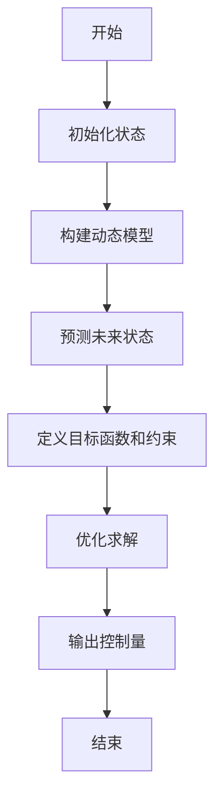
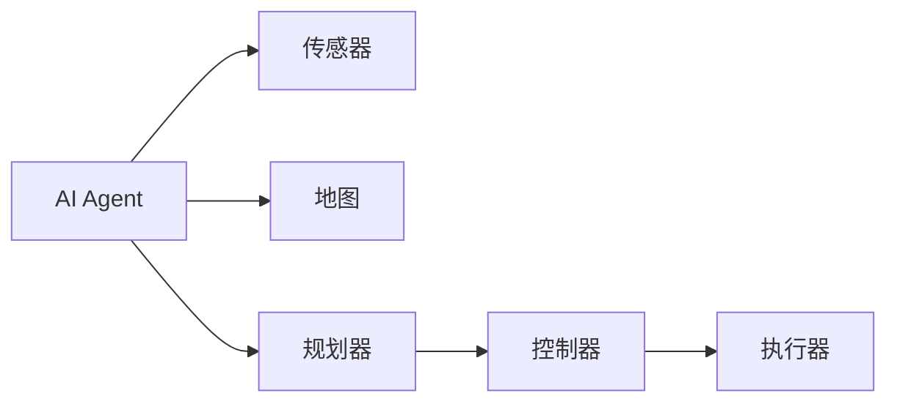

                 

### 第二部分: 模型预测控制的数学基础

## 第2章: 状态空间模型与优化

### 2.1 状态空间模型

#### 2.1.1 线性状态空间模型
线性状态空间模型是描述线性系统行为的基本模型，通常由状态方程和输出方程组成：
$$
\begin{cases}
\mathbf{x}_{k+1} = A\mathbf{x}_k + B\mathbf{u}_k \\
\mathbf{y}_k = C\mathbf{x}_k + D\mathbf{u}_k
\end{cases}
$$
其中，$\mathbf{x}_k$ 是状态向量，$\mathbf{u}_k$ 是控制输入，$\mathbf{y}_k$ 是输出，$A$、$B$、$C$、$D$ 是常数矩阵。

#### 2.1.2 非线性状态空间模型
对于非线性系统，状态方程通常为非线性函数：
$$
\mathbf{x}_{k+1} = f(\mathbf{x}_k, \mathbf{u}_k)
$$
其中，$f$ 是非线性函数。

---

### 2.2 动态模型与预测

#### 2.2.1 线性动态模型预测
对于线性系统，未来状态可以通过递推计算：
$$
\mathbf{x}_{k+n} = A^n\mathbf{x}_k + \sum_{i=0}^{n-1} A^{n-1-i} B \mathbf{u}_{k+i}
$$

#### 2.2.2 非线性动态模型预测
对于非线性系统，未来状态通常无法解析求解，需要数值方法（如数值积分）。

---

### 2.3 最优控制与优化目标

#### 2.3.1 最优控制的定义
最优控制是在满足约束条件下，使性能指标最小化的控制输入序列：
$$
\min_{\{\mathbf{u}_k\}} J = \sum_{k=0}^{N-1} (x_k^T Q x_k + u_k^T R u_k) + x_N^T P x_N
$$

#### 2.3.2 优化目标的构建
性能指标通常包括状态偏差和控制输入成本。例如：
$$
J = \sum_{k=0}^{N-1} (x_k^T Q x_k + u_k^T R u_k) + x_N^T P x_N
$$

---

## 第3章: 模型预测控制算法详解

### 3.1 算法步骤

#### 3.1.1 状态预测
根据当前状态和控制输入，预测未来状态：
$$
\mathbf{x}_{k+1} = f(\mathbf{x}_k, \mathbf{u}_k)
$$

#### 3.1.2 目标函数构建
定义性能指标，包括状态偏差和控制输入成本。

#### 3.1.3 约束条件处理
将约束条件（如状态和控制输入限制）融入优化问题中。

#### 3.1.4 优化求解
通过数值优化方法（如二次规划）求解最优控制序列。

---

### 3.2 算法实现

#### 3.2.1 线性二次调节器（LQR）方法
LQR适用于线性系统，通过求解Riccati方程得到最优控制律：
$$
\mathbf{u}_k = -K\mathbf{x}_k
$$

#### 3.2.2 非线性优化方法
对于非线性系统，通常使用序列二次规划（SQP）等方法求解。

#### 3.2.3 离散化处理
将连续时间系统离散化为离散时间系统。

---

### 3.3 算法流程图（Mermaid）

---

## 第4章: 系统分析与架构设计

### 4.1 系统功能设计

#### 4.1.1 问题场景介绍
以智能交通系统为例，AI Agent需要规划车辆路径，避开障碍物，遵守交通规则。

#### 4.1.2 系统功能需求
- 状态估计
- 路径规划
- 控制执行

### 4.2 系统架构设计

#### 4.2.1 系统架构图（Mermaid）

---

## 第5章: 项目实战

### 5.1 环境安装

#### 5.1.1 Python环境
安装必要的库，如NumPy、SciPy、CasADi等。

#### 5.1.2 工具链
安装MPC优化求解工具，如CasADi或QPOases。

---

### 5.2 核心实现

#### 5.2.1 状态空间模型实现
定义系统状态、输入和动态方程。

#### 5.2.2 目标函数与约束
定义性能指标和约束条件。

#### 5.2.3 优化求解
使用数值优化方法求解最优控制序列。

---

### 5.3 案例分析

#### 5.3.1 智能交通系统
实现车辆路径规划，避开障碍物，优化路径平滑性和能耗。

---

## 第6章: 最佳实践

### 6.1 注意事项
- 确保动态模型的准确性
- 合理选择优化算法和工具
- 处理系统的不确定性

---

## 第7章: 小结

本文详细介绍了模型预测控制的基本原理、算法实现和系统设计，结合实际案例分析，展示了如何利用MPC技术提高AI Agent的决策质量。通过深入理解其原理和实现，我们可以更好地应用这一技术，推动智能系统的发展。

---

# 结束语

模型预测控制是一种强大的优化控制方法，能够帮助AI Agent在复杂环境中做出更优决策。通过深入理解其原理和实现，我们可以更好地应用这一技术，推动智能系统的发展。

--- 

希望这篇文章符合您的要求！如果需要进一步修改或补充，请随时告诉我。

