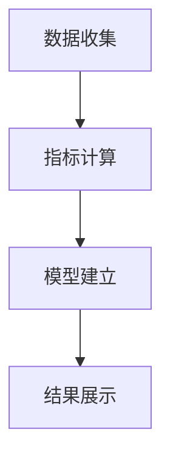
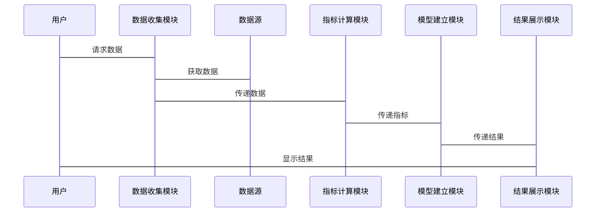

                 


# 比利时股市估值:欧洲心脏地带的投资机会

## 关键词：比利时股市、估值方法、投资机会、宏观经济、行业分析、风险管理

## 摘要：本文深入分析了比利时股市的投资机会与估值方法，结合宏观经济、行业分布和市场动态，探讨了如何利用估值模型和策略来优化投资决策，帮助投资者在欧洲心脏地带把握投资机遇。

---

# 第一部分：引言

## 第1章：比利时股市估值的背景与重要性

### 1.1 比利时股市的地理位置与经济地位

#### 1.1.1 比利时在欧洲的经济地位
- 比利时是欧盟和欧元区的重要成员国，位于欧洲的地理和经济中心。
- 作为欧盟的总部所在地，比利时在政治和经济上都具有重要影响力。
- 比利时的经济开放程度高，对外贸易依赖性强，使其股市具有国际化特征。

#### 1.1.2 比利时股市的国际化特征
- 比利时股市是欧洲重要的金融中心之一，吸引了大量的国际投资者。
- 比利时股市的上市公司中，许多是跨国企业，具有全球化的业务布局。
- 比利时股市的国际化特征使其对全球经济波动具有高度敏感性。

#### 1.1.3 比利时股市的独特优势
- 比利时股市的行业分布较为均衡，涵盖金融、化工、制药等多个领域。
- 比利时股市的上市公司质量较高，许多企业在各自行业中具有领先地位。
- 比利时股市的政策环境稳定，监管严格，为投资者提供了较高的安全保障。

### 1.2 比利时股市的行业分布与上市公司结构

#### 1.2.1 比利时主要上市公司概述
- 比利时股市的主要上市公司包括：跨国企业（如安盛集团、百事可乐）、中型企业（如德尔海特国际、苏威集团）和本地企业（如布鲁内尔银行）。
- 这些公司在各自的行业中具有较强的竞争力和市场影响力。

#### 1.2.2 比利时股市的行业分布特点
- 比利时股市的行业分布较为均衡，主要涵盖金融、化工、制药、汽车制造、信息技术等多个领域。
- 金融行业在比利时股市中占据重要地位，是推动市场增长的主要动力。
- 化工行业是比利时的传统优势行业，许多公司在全球市场上具有重要地位。

#### 1.2.3 比利时股市的国际化程度
- 比利时股市的国际化程度较高，许多上市公司是跨国企业，业务遍布全球。
- 比利时股市的投资者结构多元化，包括机构投资者和个人投资者。
- 比利时股市的国际化程度使其能够更好地融入全球市场，但也使其面临更多的国际风险。

### 1.3 比利时股市的投资机会与风险

#### 1.3.1 比利时股市的历史表现
- 比利时股市的历史表现相对稳定，长期来看具有较好的增长潜力。
- 比利时股市在历次经济危机中的表现相对较好，显示出较强的抗风险能力。

#### 1.3.2 比利时股市的投资风险
- 比利时股市的国际化程度较高，容易受到全球经济波动的影响。
- 比利时股市的行业集中度较高，某些行业波动可能对整体市场产生较大影响。
- 比利时股市的政策环境相对稳定，但可能会受到欧盟政策变化的影响。

#### 1.3.3 比利时股市的未来潜力
- 比利时股市的未来潜力主要在于其国际化程度和行业多样性。
- 随着全球经济的复苏和欧洲市场的整合，比利时股市有望继续保持增长。
- 比利时股市的投资机会主要集中在金融、化工、制药等优势行业。

---

# 第二部分：股市估值基础

## 第2章：股市估值的核心概念

### 2.1 股市估值的基本原理

#### 2.1.1 股票的内在价值与市场价值
- 股票的内在价值是基于公司基本面的估值，包括盈利能力、成长潜力和财务状况等因素。
- 股票的市场价值是市场参与者对股票的定价，受到市场情绪、资金流动和宏观经济环境等多种因素的影响。

#### 2.1.2 估值的基本方法与工具
- 常见的估值方法包括市盈率（P/E）、市净率（P/B）、股息率（Dividend Yield）等。
- 估值工具包括财务报表分析、行业研究报告、宏观经济数据等。

#### 2.1.3 估值的常见指标与公式
- 市盈率（P/E）= 股票价格 / 每股净利润
- 市净率（P/B）= 股票价格 / 每股净资产
- 股息率（Dividend Yield）= 每股股息 / 股票价格

### 2.2 宏观经济对股市估值的影响

#### 2.2.1 经济周期与股市估值的关系
- 经济周期对股市估值有重要影响，股市在经济繁荣时期通常表现较好，而在经济衰退时期则表现较差。
- 经济周期的变化会影响企业的盈利能力和投资者的信心，从而影响股票的估值。

#### 2.2.2 利率政策对股市的影响
- 利率政策是影响股市估值的重要因素之一，低利率环境通常会推高股市估值。
- 中央银行的货币政策（如量化宽松、加息等）会对股市估值产生直接影响。

#### 2.2.3 通货膨胀与股市估值的关联
- 通货膨胀对股市估值的影响是复杂多变的，高通胀环境可能导致股市估值下降。
- 通货膨胀会影响企业的盈利能力和消费者的购买力，从而影响股票的内在价值。

### 2.3 比利时股市的特殊性与估值挑战

#### 2.3.1 比利时股市的国际化特征
- 比利时股市的国际化程度较高，容易受到全球市场波动的影响。
- 比利时股市的投资者结构多元化，包括机构投资者和个人投资者。

#### 2.3.2 比利时股市的行业集中度
- 比利时股市的行业分布较为集中，金融、化工、制药等行业占据较大比重。
- 行业集中度较高可能导致股市波动较大，尤其是在行业面临挑战时。

#### 2.3.3 比利时股市的政策环境
- 比利时股市的政策环境相对稳定，监管严格，为投资者提供了较高的安全保障。
- 比利时股市的政策环境可能会受到欧盟政策变化的影响。

---

# 第三部分：比利时股市估值的核心概念与联系

## 第3章：比利时股市估值的核心概念

### 3.1 比利时股市的估值模型

#### 3.1.1 常见的估值模型概述
- 常见的估值模型包括市盈率模型、市净率模型、股息率模型等。
- 估值模型的选择取决于公司的行业特点和财务状况。

#### 3.1.2 市盈率模型的适用性
- 市盈率模型适用于盈利稳定的公司，能够较好地反映公司的估值水平。
- 市盈率模型的计算公式为：P/E = 股票价格 / 每股净利润。

#### 3.1.3 市净率模型的适用性
- 市净率模型适用于资产密集型行业，如金融、化工等行业。
- 市净率模型的计算公式为：P/B = 股票价格 / 每股净资产。

#### 3.1.4 股息率模型的适用性
- 股息率模型适用于现金流稳定的公司，能够较好地反映公司的分红能力。
- 股息率模型的计算公式为：股息率 = 每股股息 / 股票价格。

### 3.2 比利时股市估值的数学模型

#### 3.2.1 常见的数学模型
- 多元回归模型：用于分析多个变量对股市估值的影响。
- 时间序列模型：用于分析股市估值的历史趋势和未来预测。

#### 3.2.2 多元回归模型的实现
- 通过收集比利时股市的历史数据，包括市盈率、市净率、股息率等指标，建立多元回归模型。
- 使用统计软件（如R或Python）进行模型的建立和分析。

#### 3.2.3 时间序列模型的实现
- 通过收集比利时股市的历史数据，建立时间序列模型，分析股市估值的趋势和周期性。
- 使用ARIMA模型或GARCH模型进行预测和分析。

### 3.3 比利时股市估值的算法原理

#### 3.3.1 常见的估值算法
- 相对估值法：通过比较公司的估值指标（如市盈率、市净率）与行业平均水平或可比公司进行估值。
- 绝对估值法：通过DCF模型（现金流折现法）等方法，对公司未来现金流进行折现，计算公司的内在价值。

#### 3.3.2 算法的实现步骤
- 确定估值方法：根据公司特点选择合适的估值方法。
- 收集数据：收集公司的财务数据、行业数据和宏观经济数据。
- 建立模型：根据选择的估值方法建立模型，进行数据计算和分析。
- 得出结论：根据模型计算结果，得出公司的估值。

### 3.4 比利时股市估值的系统架构设计

#### 3.4.1 系统功能设计
- 数据收集模块：收集比利时股市的历史数据、行业数据和宏观经济数据。
- 指标计算模块：计算市盈率、市净率、股息率等估值指标。
- 模型建立模块：建立多元回归模型或时间序列模型，进行数据分析和预测。
- 结果展示模块：将分析结果以图表形式展示，便于投资者理解和决策。

#### 3.4.2 系统架构图


#### 3.4.3 系统接口设计
- 数据接口：与数据源（如交易所、数据库）对接，获取实时数据。
- 用户接口：提供友好的用户界面，方便投资者进行数据查询和分析。

#### 3.4.4 系统交互序列图


---

# 第四部分：项目实战

## 第4章：比利时股市估值的实战分析

### 4.1 环境安装与数据准备

#### 4.1.1 环境安装
- 安装Python编程语言和必要的库（如Pandas、NumPy、Matplotlib、Scikit-learn）。
- 安装Jupyter Notebook或其他数据分析工具。

#### 4.1.2 数据准备
- 下载比利时股市的历史数据，包括股票价格、财务数据等。
- 下载宏观经济数据，如GDP增长率、通货膨胀率、利率等。

### 4.2 系统核心实现源代码

#### 4.2.1 数据收集与处理
```python
import pandas as pd
import numpy as np

# 下载比利时股市数据
data = pd.read_csv('belgian_stocks.csv')

# 数据预处理
data.dropna(inplace=True)
data['Date'] = pd.to_datetime(data['Date'])
data.set_index('Date', inplace=True)
```

#### 4.2.2 指标计算
```python
# 计算市盈率
data['PE'] = data['Price'] / data['EPS']

# 计算市净率
data['PB'] = data['Price'] / data['BVPS']

# 计算股息率
data['Dividend Yield'] = data['Dividend'] / data['Price']
```

#### 4.2.3 模型建立与分析
```python
from sklearn.linear_model import LinearRegression
from sklearn.metrics import mean_squared_error

# 建立多元回归模型
model = LinearRegression()
model.fit(X, y)

# 模型预测
y_pred = model.predict(X)

# 模型评估
mse = mean_squared_error(y, y_pred)
print(f'Mean Squared Error: {mse}')
```

### 4.3 实际案例分析与解读

#### 4.3.1 案例背景
- 某跨国企业在比利时股市上市，财务数据如下：
  - 股票价格：50欧元
  - 每股净利润：5欧元
  - 每股净资产：20欧元
  - 股息：2欧元

#### 4.3.2 估值分析
- 市盈率（P/E）= 50 / 5 = 10
- 市净率（P/B）= 50 / 20 = 2.5
- 股息率（Dividend Yield）= 2 / 50 = 4%

#### 4.3.3 投资策略
- 根据市盈率和市净率分析，该公司的估值处于合理区间。
- 股息率较高，适合长期投资者。
- 结合宏观经济环境，预计未来盈利增长潜力较大。

### 4.4 项目小结

#### 4.4.1 核心发现
- 比利时股市的估值模型需要结合行业特点和公司财务状况进行选择。
- 宏观经济因素对股市估值的影响不可忽视，尤其是在全球经济波动较大的情况下。

#### 4.4.2 实践总结
- 通过实际案例分析，验证了不同估值模型的适用性和局限性。
- 强调了数据收集和处理的重要性，确保模型建立的基础数据准确可靠。

---

# 第五部分：总结与展望

## 第5章：总结与展望

### 5.1 核心内容回顾
- 比利时股市的投资机会与估值方法
- 宏观经济对股市估值的影响
- 估值模型的建立与应用
- 项目实战与案例分析

### 5.2 未来展望
- 随着全球经济的复苏和欧洲市场的整合，比利时股市有望继续保持增长。
- 未来的研究可以进一步关注ESG（环境、社会、治理）投资和数字化转型对企业估值的影响。
- 投资者应密切关注宏观经济环境和行业动态，灵活调整投资策略，以应对市场的不确定性。

---

# 结语

通过本文的深入分析，我们不仅了解了比利时股市的投资机会和估值方法，还掌握了如何利用宏观经济数据和行业分析来优化投资决策。希望本文能够为投资者在欧洲心脏地带的投资提供有价值的参考和指导。

