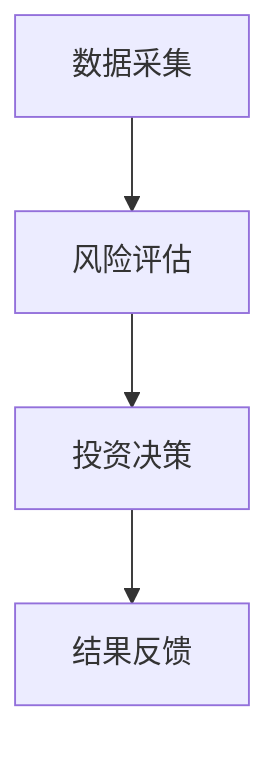

                 


# 气候变化对投资决策的长期影响

> **关键词**：气候变化、投资决策、长期影响、环境风险、政策风险、绿色金融、资产定价

> **摘要**：  
气候变化作为全球性的重大挑战，正在深刻影响着投资决策的各个方面。本文从气候变化的基本概念出发，分析其对投资决策的核心影响，包括环境风险、政策风险、资产定价等关键领域。通过构建数学模型和系统架构，探讨气候变化对不同类型资产的长期影响，并提供实际案例分析和最佳投资策略建议。本文旨在为投资者提供科学的决策依据，帮助其在气候变化背景下实现可持续投资。

---

## 第一部分: 气候变化对投资决策的背景与核心概念

### 第1章: 气候变化的背景与问题描述

#### 1.1 气候变化的背景与现状
- **1.1.1 气候变化的基本概念**  
  气候变化是指全球气候系统在长时间尺度上的显著变化，主要表现为温度升高、极端天气事件增多、海平面上升等。这些变化对全球经济、生态系统和社会稳定构成重大威胁。

- **1.1.2 当前气候变化的主要驱动因素**  
  气候变化的主要驱动因素包括温室气体排放（如CO2、CH4）、森林砍伐、工业活动和能源消耗等。人类活动是导致气候变化的最主要因素。

- **1.1.3 气候变化对全球经济与社会的影响**  
  气候变化导致的极端天气事件（如洪水、干旱、飓风）对基础设施、农业和能源系统造成巨大破坏。此外，气候变化还加剧了资源短缺和人口迁移问题，进一步影响社会稳定。

#### 1.2 投资决策的长期影响分析
- **1.2.1 投资决策的基本概念**  
  投资决策是指投资者在一定时间内，为了实现资产增值或收益最大化，选择将资金投入不同资产的行为。投资决策的核心在于对风险和收益的权衡。

- **1.2.2 长期投资与气候变化的关系**  
  长期投资需要考虑资产的长期表现，而气候变化对资产的物理风险（如自然灾害对基础设施的影响）和转型风险（如政策变化对传统能源行业的冲击）构成了双重挑战。

- **1.2.3 气候变化对投资决策的复杂性**  
  气候变化的不确定性使得投资者难以准确预测其对资产价格的影响。此外，不同资产类别对气候变化的敏感性差异也增加了投资决策的复杂性。

#### 1.3 气候变化与投资决策的核心问题
- **1.3.1 气候风险的定义与分类**  
  气候风险包括物理风险（如自然灾害对资产的破坏）、转移风险（如政策变化导致的资产价值波动）和政策风险（如碳税对企业的成本影响）。

- **1.3.2 气候变化对资产价值的影响**  
  气候变化可能导致某些资产（如高碳排放企业）的价值下降，而促进其他资产（如可再生能源企业）的价值上升。

- **1.3.3 投资者如何应对气候变化带来的挑战**  
  投资者需要通过风险评估、多样化投资和绿色金融工具（如ESG投资）来应对气候变化带来的风险。

---

### 第2章: 气候变化与投资决策的核心概念

#### 2.1 气候风险的分类与特征
- **2.1.1 物理风险**  
  物理风险是指气候变化直接导致的资产损失风险，例如洪水、干旱等极端天气事件对房地产和基础设施的影响。

- **2.1.2 转移风险**  
  转移风险是指政策变化（如碳税、环保法规）导致企业成本增加或资产贬值的风险。例如，传统能源企业可能因政策变化而面临资产减值。

- **2.1.3 政策风险**  
  政策风险是指政府为应对气候变化采取的政策（如可再生能源补贴、碳交易机制）对企业经营和资产价值的影响。

#### 2.2 气候变化对资产价格的影响
- **2.2.1 股票市场的波动**  
  气候变化可能导致某些行业（如化石能源）的股票价格下跌，而可再生能源行业的股票价格可能上涨。

- **2.2.2 债券市场的风险溢价**  
  气候变化增加了企业的违约风险，导致债券市场的风险溢价上升。

- **2.2.3 房地产市场的价值重估**  
  气候变化可能导致某些地区的房地产价值下降，例如沿海地区的房地产因海平面上升而面临贬值风险。

#### 2.3 投资者行为与气候变化的相互作用
- **2.3.1 投资者对气候变化的感知**  
  投资者越来越意识到气候变化的风险，并倾向于选择具有可持续性的投资标的。

- **2.3.2 投资者行为的改变**  
  投资者通过多样化投资、选择绿色金融产品等方式来规避气候变化带来的风险。

- **2.3.3 投资者对绿色金融的偏好**  
  绿色金融（如ESG投资）越来越受到投资者的青睐，因为这些投资不仅考虑财务回报，还关注环境和社会影响。

---

### 第3章: 气候变化对投资决策的核心原理

#### 3.1 气候变化对投资风险的影响
- **3.1.1 气候变化与市场风险**  
  气候变化可能导致某些行业的市场风险上升，例如农业和能源行业的波动性增加。

- **3.1.2 气候变化与信用风险**  
  气候变化可能导致企业的信用评级下降，进而增加债券市场的信用风险。

- **3.1.3 气候变化与流动性风险**  
  气候变化可能导致某些资产的流动性下降，例如高碳排放企业的债券可能难以快速变现。

#### 3.2 气候变化对投资收益的影响
- **3.2.1 可再生能源的投资机会**  
  气候变化政策的推动（如可再生能源补贴）为相关行业提供了投资机会。

- **3.2.2 石油与天然气行业的风险**  
  传统能源行业因气候变化政策的收紧而面临转型风险，可能导致资产减值。

- **3.2.3 建筑与基础设施的投资策略**  
  投资者应优先选择具有气候适应性的建筑项目，例如节能建筑和绿色基础设施。

#### 3.3 气候变化对投资决策的系统性影响
- **3.3.1 气候变化对全球经济的影响**  
  气候变化可能导致全球经济增速放缓，进而影响金融市场的整体表现。

- **3.3.2 气候变化对金融市场的系统性风险**  
  气候变化可能导致某些行业的系统性风险上升，例如保险行业因极端天气事件增多而面临更大的赔付压力。

- **3.3.3 气候变化对货币政策的影响**  
  气候变化可能迫使中央银行采取更加宽松的货币政策，以支持绿色金融和经济转型。

---

## 第二部分: 气候变化对投资决策的数学模型与算法原理

### 第4章: 气候变化风险的量化模型

#### 4.1 气候变化风险的量化方法
- **4.1.1 气候情景分析**  
  气候情景分析通过模拟不同气候变化情景（如最坏情况、中等情况）来评估其对资产的影响。

- **4.1.2 气候敏感性分析**  
  气候敏感性分析评估资产对气候变化的敏感程度，例如某些行业因气温上升而面临更高的运营成本。

- **4.1.3 气候风险评估模型**  
  气候风险评估模型结合历史数据和气候模型，预测气候变化对资产价格的影响。

#### 4.2 气候变化对资产价格的影响模型
- **4.2.1 资产价格与气候变化的相关性分析**  
  通过回归分析等方法，评估气候变化对资产价格的相关性。

- **4.2.2 气候变化对资产收益的影响模型**  
  使用时间序列分析模型（如ARIMA）预测气候变化对资产收益的影响。

- **4.2.3 气候变化对资产风险的影响模型**  
  使用蒙特卡洛模拟评估气候变化对资产风险的潜在影响。

#### 4.3 气候变化对投资组合的影响模型
- **4.3.1 投资组合风险的气候调整模型**  
  通过调整投资组合的风险权重，考虑气候变化对不同资产的影响。

- **4.3.2 气候变化对投资组合收益的影响模型**  
  使用多因子模型评估气候变化对投资组合收益的潜在影响。

---

### 第5章: 气候变化风险的数学模型与算法原理

#### 5.1 气候变化风险的数学模型
- **5.1.1 气候变化对资产价格的影响公式**  
  $$ P = \alpha + \beta \cdot C + \epsilon $$  
  其中，$P$ 表示资产价格，$C$ 表示气候变化指数，$\alpha$ 和 $\beta$ 为回归系数，$\epsilon$ 为误差项。

- **5.1.2 气候变化对资产收益的影响公式**  
  $$ R = \mu + \sigma \cdot \sqrt{t} $$  
  其中，$R$ 表示资产收益，$\mu$ 为均值，$\sigma$ 为标准差，$t$ 为时间单位。

#### 5.2 气候变化风险的算法原理
- **5.2.1 气候变化风险的蒙特卡洛模拟**  
  蒙特卡洛模拟通过随机抽样方法，模拟气候变化对资产价格的潜在影响，评估其对投资组合的风险和收益。

- **5.2.2 气候变化风险的回归分析**  
  回归分析通过建立气候变化与资产价格之间的关系模型，评估气候变化对资产价格的影响。

---

## 第三部分: 系统分析与架构设计

### 第6章: 气候变化对投资决策的系统分析

#### 6.1 系统功能设计
- **6.1.1 领域模型**  
  领域模型描述了气候变化与投资决策之间的关系，包括资产类别、风险因素、政策环境等核心要素。

- **6.1.2 系统架构设计**  
  系统架构图展示了系统的模块划分和数据流，包括数据采集、风险评估、投资决策和结果反馈等模块。

#### 6.2 系统架构图


#### 6.3 系统接口设计
- **6.3.1 数据接口**  
  系统需要采集气候变化数据（如气温、降水）和资产数据（如股票价格、债券收益率）。

- **6.3.2 模型接口**  
  系统需要与气候模型和投资模型进行交互，获取气候变化对资产价格的影响。

#### 6.4 系统交互设计
- **6.4.1 系统交互序列图**  
  ```mermaid
  sequenceDiagram
      participant 投资者
      participant 气候模型
      participant 投资模型
      投资者 -> 气候模型: 请求气候变化数据
      气候模型 -> 投资模型: 提供气候变化影响
      投资模型 -> 投资者: 提供投资建议
  ```

---

## 第四部分: 项目实战

### 第7章: 气候变化对投资决策的项目实战

#### 7.1 项目背景与目标
- 项目背景：分析气候变化对可再生能源投资的影响。
- 项目目标：评估可再生能源的投资回报率，并制定绿色投资策略。

#### 7.2 项目实现
- **7.2.1 环境影响评估**  
  通过气候模型预测未来20年内的极端天气事件对可再生能源项目的影响。

- **7.2.2 政策变化分析**  
  分析政府对可再生能源的补贴政策变化，评估其对投资收益的影响。

- **7.2.3 财务模型构建**  
  构建财务模型，评估可再生能源项目的净现值（NPV）和内部收益率（IRR）。

#### 7.3 项目代码实现
- **7.3.1 数据采集**  
  ```python
  import pandas as pd
  data = pd.read_csv('renewable_energy.csv')
  ```

- **7.3.2 气候影响分析**  
  ```python
  def climate_impact_analysis(data):
      return data['climate_risk'].mean()
  ```

- **7.3.3 投资收益预测**  
  ```python
  from sklearn.linear_model import LinearRegression
  model = LinearRegression()
  model.fit(X, y)
  ```

---

## 第五部分: 最佳实践与小结

### 第8章: 最佳实践与小结

#### 8.1 最佳实践
- **分散投资**：通过分散投资降低气候变化带来的风险。
- **关注绿色金融**：优先选择具有可持续性的投资标的。
- **长期规划**：制定长期投资策略，考虑气候变化的长期影响。

#### 8.2 小结
气候变化对投资决策的影响是复杂而深远的。投资者需要通过科学的模型和策略，应对气候变化带来的风险和机会。未来的研究可以进一步探讨气候变化对不同类型资产的长期影响，并开发更加精确的风险评估模型。

---

### 总结
本文从气候变化的背景出发，分析了其对投资决策的核心影响，并通过数学模型和系统架构设计，探讨了气候变化对不同类型资产的长期影响。通过实际案例分析和最佳实践建议，本文为投资者提供了应对气候变化挑战的科学依据和实践指导。

