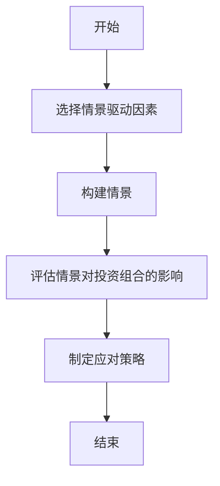
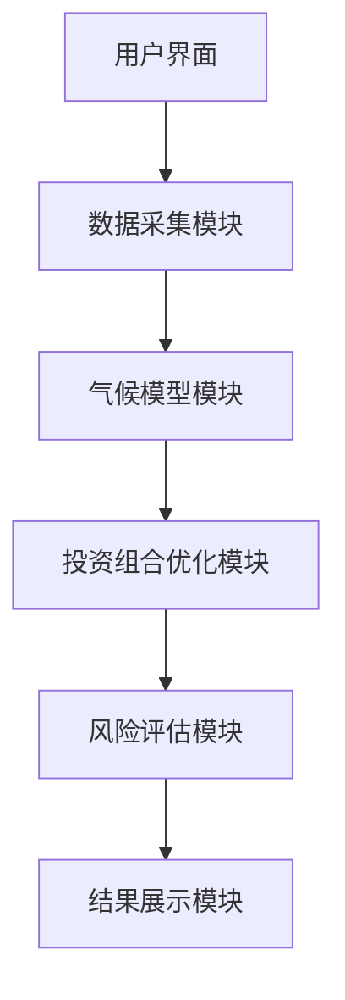

                 


# 气候变化情景分析在投资组合管理中的应用

> 关键词：气候变化情景分析，投资组合管理，风险管理，数学模型，系统架构设计

> 摘要：本文详细探讨了气候变化情景分析在投资组合管理中的应用，从基本概念、方法论到实际应用，结合数学模型和系统架构设计，提供了全面的分析和解决方案。文章通过案例分析和项目实战，展示了如何将气候变化情景分析整合到投资组合管理中，以应对气候变化带来的金融风险。

---

# 第一部分: 气候变化情景分析与投资组合管理概述

## 第1章: 气候变化情景分析概述

### 1.1 气候变化的定义与影响

#### 1.1.1 气候变化的基本概念

气候变化是指全球气候系统的长期变化，包括温度、降水模式、极端天气事件频率等方面的改变。这些变化对全球经济、生态系统和社会稳定性产生深远影响。

#### 1.1.2 气候变化对全球经济的影响

气候变化可能导致资源短缺、农业生产下降、自然灾害频发等问题，从而影响经济增长和金融市场稳定性。例如，极端天气事件可能造成企业损失和供应链中断，进而影响投资组合的收益。

#### 1.1.3 气候变化对金融市场的潜在风险

气候变化可能引发新的金融风险，如资产贬值、信用风险增加等。投资者需要考虑气候变化对资产价格的长期影响，并采取相应的风险管理策略。

---

### 1.2 投资组合管理的基本原理

#### 1.2.1 投资组合管理的定义

投资组合管理是指通过科学配置资产，以实现风险与收益的最佳平衡。它旨在在不同资产之间分散风险，优化投资回报。

#### 1.2.2 投资组合管理的目标与原则

投资组合管理的目标是在可控风险下实现最大收益。其基本原则包括分散化、风险与收益匹配、持续优化等。

#### 1.2.3 投资组合管理中的风险与收益平衡

投资者需要在高风险高收益和低风险低收益之间找到平衡点，以应对市场的不确定性和波动性。

---

### 1.3 气候变化情景分析的必要性

#### 1.3.1 气候变化对投资组合风险的影响

气候变化可能导致某些资产的价值下降，同时增加某些行业的投资机会。投资者需要评估这些变化对投资组合的影响。

#### 1.3.2 情景分析在风险管理中的作用

情景分析可以帮助投资者预测不同气候变化情况下的市场反应，从而制定应对策略。

#### 1.3.3 气候变化情景分析的现状与挑战

尽管气候变化情景分析的重要性逐渐被认识到，但其实际应用仍面临数据不足、模型复杂等问题。

---

## 第2章: 气候变化情景分析的方法论

### 2.1 情景分析的基本框架

#### 2.1.1 情景分析的定义

情景分析是一种通过构建不同假设场景来评估可能结果的方法。它常用于风险管理、战略规划等领域。

#### 2.1.2 情景分析的核心步骤

1. 确定情景的驱动因素。
2. 构建情景。
3. 分析情景对目标的影响。
4. 制定应对策略。

#### 2.1.3 情景分析的分类与特点

情景分析可以分为历史情景、假设情景和预测情景。每种情景都有其适用范围和特点。

---

### 2.2 气候变化情景的主要类型

#### 2.2.1 不同排放路径下的气候变化情景

不同排放路径（如RCP 2.6、RCP 4.5、RCP 6.0、RCP 8.5）对应不同的气候变化情景。

#### 2.2.2 情景的强度与概率特征

情景的强度指其影响程度，概率特征则反映情景发生的可能性。

#### 2.2.3 情景的时间跨度与地理范围

情景分析可以针对不同时间跨度（如短期、中期、长期）和地理范围（如地区、全球）进行。

---

### 2.3 气候变化情景分析的建模方法

#### 2.3.1 气候模型的基本原理

气候模型通过数学方程模拟大气、海洋等系统的相互作用，预测气候变化趋势。

#### 2.3.2 经济-气候综合模型的应用

综合模型结合气候和经济变量，评估气候变化对经济活动的影响。

#### 2.3.3 情景分析的不确定性与敏感性分析

情景分析需考虑模型参数的不确定性，并通过敏感性分析确定关键因素。

---

## 第3章: 投资组合管理中的风险评估

### 3.1 投资组合风险的分类

#### 3.1.1 市场风险

市场风险指市场波动对资产价格的影响，包括股票、债券等资产的风险。

#### 3.1.2 信用风险

信用风险是指债券发行人违约的可能性。

#### 3.1.3 操作风险与流动性风险

操作风险指交易过程中的失误或欺诈行为，流动性风险指资产快速变现的能力。

---

### 3.2 气候相关风险的识别与量化

#### 3.2.1 气候风险的识别方法

通过分析行业敏感性和地理位置，识别哪些资产受气候变化影响较大。

#### 3.2.2 气候风险的量化模型

利用回归分析、蒙特卡洛模拟等方法量化气候变化对资产价值的影响。

#### 3.2.3 气候风险与投资组合收益的关系

气候变化可能导致收益波动，投资者需平衡风险与收益。

---

### 3.3 投资组合风险的管理策略

#### 3.3.1 风险分散化策略

通过配置不同资产类别和行业分散气候风险。

#### 3.3.2 风险对冲工具的应用

使用衍生品（如期货、期权）对冲特定风险。

#### 3.3.3 风险承受能力的评估

根据投资者的风险承受能力调整投资组合配置。

---

## 第4章: 气候变化情景分析在投资组合管理中的应用框架

### 4.1 情景分析与投资组合管理的结合

#### 4.1.1 情景分析在投资组合风险管理中的作用

通过情景分析预测不同气候变化情况下的市场反应，制定应对策略。

#### 4.1.2 气候变化情景对投资组合的影响路径

气候变化可能通过影响企业利润、资产价值等方面影响投资组合。

#### 4.1.3 情景分析在投资组合优化中的应用

利用情景分析优化资产配置，降低风险。

---

### 4.2 投资组合管理中的情景分析流程

#### 4.2.1 情景设定与选择

根据投资目标和市场环境选择合适的情景。

#### 4.2.2 投资组合在不同情景下的表现评估

评估投资组合在不同情景下的收益和风险。

#### 4.2.3 情景分析结果对投资策略的指导作用

根据分析结果调整投资策略，优化投资组合。

---

## 第5章: 气候变化情景分析的数学模型与算法

### 5.1 气候变化情景分析的数学基础

#### 5.1.1 概率论与统计学基础

概率论用于分析情景发生的可能性，统计学用于处理数据。

#### 5.1.2 优化理论与动态规划

优化理论用于寻找最优投资组合配置，动态规划用于处理多阶段决策问题。

#### 5.1.3 时间序列分析与预测模型

时间序列分析用于预测气候变化和市场趋势。

---

### 5.2 气候变化情景分析的算法步骤



---

## 第6章: 系统架构设计与实现

### 6.1 系统架构设计



---

## 第7章: 项目实战与案例分析

### 7.1 项目实战环境安装

安装必要的Python库（如NumPy、Pandas、Scikit-learn）。

---

### 7.2 核心实现代码

```python
import numpy as np
import pandas as pd

def climate_scenario_analysis(data):
    # 数据预处理
    data_processed = data.dropna()
    # 计算情景影响
    scenario_impact = data_processed.mean() * np.random.normal(0, 0.1, len(data_processed))
    return scenario_impact

# 示例数据
data = pd.DataFrame(np.random.rand(100, 5), columns=['Asset1', 'Asset2', 'Asset3', 'Asset4', 'Asset5'])
result = climate_scenario_analysis(data)
print(result)
```

---

### 7.3 案例分析与结果解读

分析不同情景对投资组合的影响，优化资产配置。

---

## 第8章: 最佳实践与未来展望

### 8.1 最佳实践 tips

1. 定期更新情景分析，适应市场变化。
2. 结合其他风险管理工具，增强投资组合的稳定性。

### 8.2 未来展望

随着技术进步，气候变化情景分析将更加精准，投资组合管理将更加智能化。

---

# 结语

气候变化情景分析在投资组合管理中的应用是一个复杂但重要的领域。通过科学的方法和工具，投资者可以更好地应对气候变化带来的风险，实现稳健的投资回报。

