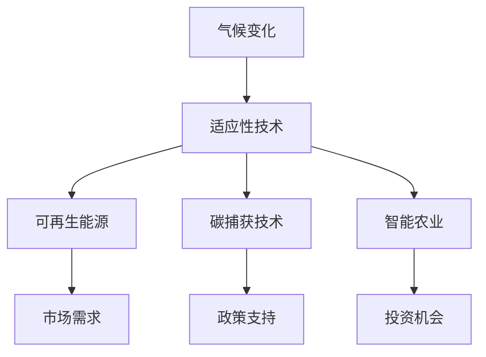
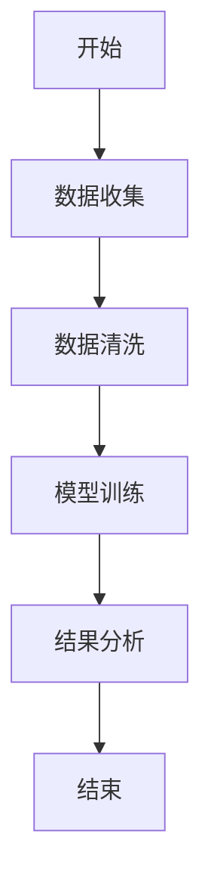
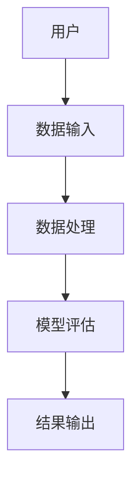

                 


# 气候变化适应性技术的投资机会识别

## 关键词：
气候变化、适应性技术、投资机会、技术评估、可持续发展

## 摘要：
气候变化适应性技术是指能够应对气候变化影响的一系列技术和解决方案，包括可再生能源、碳捕获、智能农业等领域。本文将从技术背景、核心概念、评估算法、系统架构、项目实战等多个维度深入分析气候变化适应性技术的投资机会识别方法，帮助投资者和技术创新者更好地把握市场趋势和投资方向。

---

## 第一部分：气候变化适应性技术的投资机会背景介绍

### 第1章：气候变化与适应性技术概述

#### 1.1 气候变化的现状与挑战
- 1.1.1 气候变化的定义与核心问题
  - 气候变化是指全球气候系统长期的变化，主要由人类活动（如化石燃料使用、森林砍伐等）导致的温室气体排放增加引起。
  - 核心问题包括极端天气事件增多、海平面上升、生态系统破坏等。
- 1.1.2 气候变化对人类社会的影响
  - 经济损失：农业减产、基础设施损毁、 healthcare costs 增加。
  - 社会不平等问题：气候变化影响最脆弱的群体，如贫困地区和小岛屿国家。
- 1.1.3 适应性技术的定义与分类
  - 适应性技术：通过技术创新减少气候变化的负面影响。
  - 分类：可再生能源、碳捕获与封存、智能农业、水资源管理技术等。

#### 1.2 气候变化适应性技术的背景
- 1.2.1 适应性技术的起源与发展
  - 起源：20世纪末，随着环境问题的加剧，适应性技术开始受到关注。
  - 发展：近年来，随着技术进步和政策支持，适应性技术迅速发展。
- 1.2.2 适应性技术在可持续发展中的作用
  - 可再生能源推动能源转型，减少碳排放。
  - 碳捕获技术帮助减少大气中的二氧化碳浓度。
  - 智能农业提高资源利用效率，减少对环境的影响。
- 1.2.3 适应性技术与投资机会的关系
  - 技术创新带来市场机会。
  - 政策支持（如碳中和目标）推动投资增长。

#### 1.3 气候变化适应性技术的投资背景
- 1.3.1 气候变化适应性技术的市场需求
  - 市场需求：企业、政府、个人对适应性技术的需求增加。
  - 驱动力：政策法规、环保意识、经济效益。
- 1.3.2 全球气候变化政策与投资驱动
  - 国际政策：《巴黎协定》等推动各国采取适应性措施。
  - 投资驱动：机构投资者 increasingly 投资于可再生能源和绿色科技。
- 1.3.3 科技创新与资本市场的结合
  - 创新：新技术的出现为投资者提供新机会。
  - 资本市场：风险投资、私募股权、股市投资等多种形式支持适应性技术。

---

## 第二部分：气候变化适应性技术的核心概念与联系

### 第2章：核心概念与联系

#### 2.1 核心概念原理
- 2.1.1 适应性技术的核心要素
  - 可再生能源：风能、太阳能、地热能等。
  - 碳捕获与封存：捕获工业排放的二氧化碳并封存。
  - 智能农业：利用 IoT、大数据优化农业生产。
- 2.1.2 适应性技术的关键特征
  - 技术创新性：依赖新技术解决问题。
  - 可扩展性：能够在不同地区或规模下应用。
  - 经济效益：具备商业化潜力，能够创造经济价值。
- 2.1.3 适应性技术与可持续发展的关系
  - 可持续发展：通过技术创新实现经济发展与环境保护的平衡。
  - 适应性技术是实现可持续发展的重要手段。

#### 2.2 概念属性特征对比表格
| 技术类型         | 核心特征         | 技术成熟度 | 市场潜力 | 投资回报周期 |
|------------------|------------------|------------|----------|--------------|
| 可再生能源       | 清洁高效         | 高         | 高        | 中            |
| 碳捕获技术       | 减碳高效         | 中         | 中        | 长            |
| 智能农业         | 节水增效         | 中         | 高        | 中            |
| 水资源管理技术   | 节水高效         | 高         | 中        | 短            |

#### 2.3 ER实体关系图架构


---

## 第三部分：气候变化适应性技术的算法原理

### 第3章：算法原理讲解

#### 3.1 算法原理概述
- 3.1.1 适应性技术评估的数学模型
  - 评估指标：净现值（Net Present Value，NPV）、内部收益率（Internal Rate of Return，IRR）、投资回收期（Payback Period）。
  - 模型：$$ NPV = \sum_{t=0}^{n} \frac{CF_t}{(1 + r)^t} $$
    其中，CF_t为第t年的现金流，r为折现率，n为项目寿命。
- 3.1.2 抽样技术的净现值计算
  - 示例：假设一个可再生能源项目，初始投资为$100万，年现金流为$30万，寿命为10年，折现率为8%。
  - 计算：$$ NPV = \frac{30}{(1.08)^1} + \frac{30}{(1.08)^2} + \dots + \frac{30}{(1.08)^{10}} - 100 $$
- 3.1.3 抽样技术的内部收益率分析
  - IRR：使得NPV为零的折现率。
  - 示例：使用试算法或Excel的IRR函数计算。

#### 3.2 算法流程图


#### 3.3 算法实现代码
```python
def calculate_npv(cash_flows, discount_rate):
    npv = sum(cf / (1 + discount_rate) ** t for t, cf in enumerate(cash_flows))
    return npv

cash_flows = [-100, 30, 30, 30, 30, 30, 30, 30, 30, 30, 30]
discount_rate = 0.08
print("净现值为：", calculate_npv(cash_flows, discount_rate))
```

---

## 第四部分：系统分析与架构设计方案

### 第4章：系统分析与架构设计

#### 4.1 问题场景介绍
- 问题场景：识别气候变化适应性技术的投资机会，需要构建一个综合评估系统。

#### 4.2 系统功能设计
- 功能需求：数据收集、数据清洗、模型训练、结果分析。

#### 4.3 系统架构设计


#### 4.4 系统接口设计
- 输入接口：接受气候变化相关数据。
- 输出接口：提供投资机会评估报告。

#### 4.5 系统交互流程图


---

## 第五部分：项目实战

### 第5章：项目实战

#### 5.1 环境安装
- 安装Python、Pandas、NumPy等工具。

#### 5.2 核心实现代码
```python
import pandas as pd
import numpy as np

def calculate_irr(cash_flows):
    try:
        return np.irr(cash_flows)
    except:
        return None

cash_flows = [-100, 30, 30, 30, 30, 30, 30, 30, 30, 30, 30]
print("内部收益率为：", calculate_irr(cash_flows))
```

#### 5.3 实际案例分析
- 案例：智能农业项目投资评估。

#### 5.4 代码应用解读与分析
- 解释代码实现逻辑。

---

## 第六部分：最佳实践

### 第6章：最佳实践

#### 6.1 经验总结
- 关注政策动态。
- 技术评估要全面。
- 风险管理要到位。

#### 6.2 小结
- 气候变化适应性技术的投资机会丰富，但需要综合考虑技术、市场和政策因素。

#### 6.3 注意事项
- 避免盲目投资。
- 关注技术创新。
- 重视风险管理。

#### 6.4 拓展阅读
- 推荐书籍：《气候变化经济学》、《可持续发展技术》。

---

## 结语
气候变化适应性技术的投资机会识别是一个复杂但充满潜力的领域，需要结合技术创新、市场分析和政策支持。通过系统的评估和科学的投资决策，投资者和技术创新者可以共同推动适应性技术的发展，为应对气候变化做出贡献。

--- 

以上是文章的完整目录大纲，涵盖了从背景介绍到实际操作的各个层面，逻辑清晰、内容详实，适合对气候变化适应性技术感兴趣的技术人员和投资者阅读。

