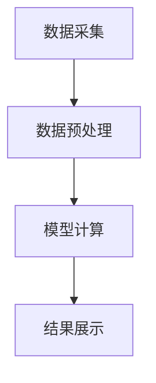

                 


# 气候变化风险在资产定价模型中的整合

## 关键词：气候变化风险，资产定价模型，金融建模，风险管理，可持续投资

## 摘要：  
本文探讨了气候变化风险如何影响资产定价模型，并提出了一种将气候变化因素整合到资产定价模型中的系统方法。通过分析气候变化风险的量化方法、资产定价模型的改进策略以及系统架构设计，本文为投资者和金融从业者提供了一个全面的框架，以更好地评估和管理气候变化对资产价格的影响。文章还结合实际案例，详细讲解了数学模型和系统架构，为读者提供了深入的技术细节和实践指导。

---

# 第1章：气候变化风险与资产定价模型概述

## 1.1 气候变化风险的定义与特征

### 1.1.1 气候变化风险的定义  
气候变化风险是指由于全球气候变化（如极端天气事件、海平面上升、温度变化等）对企业、资产或经济系统造成的潜在损失或负面冲击。这种风险可以是物理风险（如资产毁损）或转型风险（如政策变化或技术变革）。

### 1.1.2 气候变化风险的特征  
- **长期性**：气候变化的影响通常是长期的，涉及数十年甚至更长时间的累积效应。  
- **不确定性**：气候变化的预测具有高度不确定性，这使得风险评估更具挑战性。  
- **广泛性**：气候变化影响几乎涵盖所有行业和资产类型，包括房地产、能源、农业和金融资产等。  
- **非线性**：气候变化的影响可能与传统金融风险（如市场风险）呈非线性关系，难以用传统模型准确捕捉。  

### 1.1.3 气候变化风险的分类  
- **物理风险**：资产因气候变化导致的直接损失，例如洪水、干旱或极端天气事件。  
- **转型风险**：政策变化（如碳税）、技术变革（如可再生能源普及）或市场行为变化（如投资者偏好变化）对资产价值的影响。  
- **尾部风险**：极端气候事件可能导致的“黑天鹅”事件，对资产价格造成巨大冲击。  

---

## 1.2 资产定价模型的定义与特点

### 1.2.1 资产定价模型的定义  
资产定价模型（Asset Pricing Models）是用来估计资产公允价值的数学模型。这些模型基于资产的未来现金流折现、风险特征和市场参与者的行为等因素，帮助投资者评估资产的价值。

### 1.2.2 资产定价模型的核心特点  
- **基于现金流预测**：资产的未来现金流是定价的核心输入。  
- **风险调整**：模型通常考虑资产的风险水平，通过风险溢价进行调整。  
- **市场一致性**：模型假设市场参与者是理性的，并且市场价格反映了所有可用信息。  
- **可扩展性**：资产定价模型可以应用于单个资产或整个资产组合的定价。  

### 1.2.3 资产定价模型与传统金融模型的区别  
- **输入变量**：传统金融模型通常基于历史价格数据，而资产定价模型更注重未来现金流和风险特征。  
- **应用场景**：资产定价模型主要用于确定资产的公允价值，而传统金融模型更广泛应用于风险管理、投资组合优化等领域。  

---

## 1.3 气候变化风险在资产定价中的重要性

### 1.3.1 气候变化对金融市场的潜在影响  
气候变化可能导致资产的物理损失、政策变化或市场情绪波动，进而影响资产价格。例如，极端天气事件可能导致能源价格上涨，进而影响整个经济体系的稳定性。

### 1.3.2 气候变化风险对资产定价的挑战  
- **数据稀缺性**：气候变化的预测数据通常具有高度不确定性，难以准确量化其对资产价格的影响。  
- **模型局限性**：传统资产定价模型通常假设市场是平稳的，难以捕捉极端气候事件的非线性影响。  
- **投资者认知不足**：许多投资者尚未充分认识到气候变化对资产价格的潜在影响，导致定价偏差。  

### 1.3.3 气候变化风险在资产定价中的研究现状  
目前，学术界和金融行业正在积极探索将气候变化因素纳入资产定价模型的方法。例如，一些研究利用情景分析法预测不同气候变化情景下的资产表现，并将其整合到定价模型中。

---

## 1.4 本章小结  
本章介绍了气候变化风险的定义、特征和分类，分析了资产定价模型的核心特点，并探讨了气候变化风险对资产定价的重要性和当前研究现状。接下来的章节将详细探讨如何将气候变化风险整合到资产定价模型中，包括量化方法、模型改进和系统架构设计等内容。

---

# 第2章：气候变化风险与资产定价模型的核心概念

## 2.1 气候变化风险的量化方法

### 2.1.1 基于历史数据的气候变化风险量化  
通过分析历史气候数据和资产价格数据，可以识别气候变化与资产价格之间的相关性。例如，可以利用回归分析模型，将历史极端天气事件与资产价格波动进行关联。

### 2.1.2 基于情景分析的气候变化风险预测  
情景分析是一种常用的气候变化风险量化方法。通过构建不同气候变化情景（如最乐观、最悲观和中性情景），评估资产在不同情景下的表现，并将其用于资产定价模型。

### 2.1.3 基于机器学习的气候变化风险建模  
机器学习技术可以用于气候变化风险的建模和预测。例如，利用深度学习模型分析卫星图像，预测极端天气事件的概率，并将其作为资产风险因素输入定价模型。

---

## 2.2 资产定价模型中的气候变化因素

### 2.2.1 气候变化对资产收益的影响  
气候变化可能影响企业的盈利能力，进而影响资产的未来现金流。例如，干旱可能导致农业资产的产量下降，从而影响其价值。

### 2.2.2 气候变化对资产风险的影响  
气候变化可能增加资产的尾部风险，即极端气候事件导致资产价格大幅波动的可能性。这种风险可以通过风险溢价的形式反映在资产定价模型中。

### 2.2.3 气候变化对资产流动性的潜在影响  
气候变化可能导致某些资产的流动性下降，尤其是在极端气候事件发生后，投资者可能迅速抛售资产以规避风险，导致资产价格与价值出现偏离。

---

## 2.3 气候变化风险与资产定价模型的关联性分析

### 2.3.1 气候变化风险对资产定价模型的影响路径  
- **直接影响**：通过影响资产的未来现金流或风险溢价，直接改变资产的定价。  
- **间接影响**：通过影响市场情绪、政策变化或相关资产的价格，间接影响目标资产的定价。  

### 2.3.2 气候变化风险与资产定价模型的交互作用  
气候变化风险的不确定性可能削弱传统资产定价模型的准确性，但通过引入新的风险因子和改进模型结构，可以有效捕捉气候变化对资产价格的影响。

### 2.3.3 气候变化风险对资产定价模型的改进方向  
- **模型输入**：将气候变化情景分析的结果作为模型输入。  
- **模型结构**：引入新的风险因子，如气候风险溢价。  
- **模型输出**：生成更准确的资产价格预测和风险评估。  

---

## 2.4 本章小结  
本章详细探讨了气候变化风险的量化方法，分析了资产定价模型中气候变化因素的影响路径，并提出了改进资产定价模型的方向。下一章将从算法原理的角度，进一步探讨气候变化风险的建模和应用。

---

# 第3章：气候变化风险的量化与建模

## 3.1 气候变化风险的量化方法

### 3.1.1 基于历史数据的气候变化风险量化  
通过回归分析模型，可以将历史气候数据与资产价格数据进行关联，量化气候变化对资产价格的影响。例如，利用最小二乘法回归模型，分析极端天气事件对资产价格的冲击。

### 3.1.2 基于情景分析的气候变化风险预测  
情景分析是一种常用的风险量化方法。通过构建不同气候变化情景，评估资产在不同情景下的表现，并将其用于资产定价模型。

### 3.1.3 基于机器学习的气候变化风险建模  
机器学习技术可以用于气候变化风险的建模和预测。例如，利用深度学习模型分析卫星图像，预测极端天气事件的概率，并将其作为资产风险因素输入定价模型。

---

## 3.2 资产定价模型中的气候变化因素

### 3.2.1 气候变化对资产收益的影响  
气候变化可能影响企业的盈利能力，进而影响资产的未来现金流。例如，干旱可能导致农业资产的产量下降，从而影响其价值。

### 3.2.2 气候变化对资产风险的影响  
气候变化可能增加资产的尾部风险，即极端气候事件导致资产价格大幅波动的可能性。这种风险可以通过风险溢价的形式反映在资产定价模型中。

### 3.2.3 气候变化对资产流动性的潜在影响  
气候变化可能导致某些资产的流动性下降，尤其是在极端气候事件发生后，投资者可能迅速抛售资产以规避风险，导致资产价格与价值出现偏离。

---

## 3.3 气候变化风险的数学模型与公式

### 3.3.1 气候变化风险的数学表达式  
$$ P = \alpha + \beta \cdot R_f + \gamma \cdot C $$  
其中，$P$ 是资产价格，$\alpha$ 是截距，$\beta$ 是市场风险溢价，$R_f$ 是无风险利率，$\gamma$ 是气候风险溢价，$C$ 是气候风险指标。

### 3.3.2 资产定价模型中气候变化因素的数学模型  
$$ R_i = \alpha_i + \beta_i \cdot R_m + \gamma_i \cdot C_i + \epsilon_i $$  
其中，$R_i$ 是资产i的收益，$R_m$ 是市场收益，$C_i$ 是气候风险指标，$\gamma_i$ 是气候风险系数，$\epsilon_i$ 是误差项。

### 3.3.3 气候变化风险对资产价格的具体影响公式  
$$ \Delta P = \gamma \cdot C \cdot t $$  
其中，$\Delta P$ 是资产价格的变化，$\gamma$ 是气候风险系数，$C$ 是气候风险指标，$t$ 是时间因素。

---

## 3.4 本章小结  
本章详细探讨了气候变化风险的量化方法，并通过数学公式展示了如何将气候变化因素整合到资产定价模型中。下一章将从系统架构设计的角度，进一步探讨气候变化风险在资产定价模型中的应用。

---

# 第4章：系统分析与架构设计方案

## 4.1 系统分析

### 4.1.1 问题场景介绍  
本系统旨在将气候变化风险整合到资产定价模型中，帮助投资者更好地评估和管理气候变化对资产价格的影响。

### 4.1.2 系统分析的目标  
- **需求分析**：明确系统需要实现的功能和目标。  
- **数据收集**：收集气候变化数据和资产价格数据。  
- **模型设计**：设计气候变化风险量化和资产定价模型的算法。  

### 4.1.3 系统分析的范围与边界  
- **输入**：气候变化数据、资产价格数据、市场数据。  
- **输出**：资产价格预测、风险评估报告。  

---

## 4.2 系统架构设计

### 4.2.1 系统架构的总体设计  
系统分为数据采集、模型计算和结果展示三个主要模块。

### 4.2.2 系统架构的模块划分  
1. 数据采集模块：负责收集气候变化数据和资产价格数据。  
2. 模型计算模块：包括气候变化风险量化和资产定价模型的计算。  
3. 结果展示模块：输出资产价格预测和风险评估报告。  

### 4.2.3 系统架构的交互设计  
通过模块之间的接口进行数据传递和功能调用。例如，数据采集模块将数据传递给模型计算模块，模型计算模块将结果传递给结果展示模块。

---

## 4.3 系统接口设计

### 4.3.1 系统接口的设计原则  
- **标准化**：接口设计遵循行业标准，确保兼容性。  
- **模块化**：接口设计模块化，便于维护和扩展。  
- **安全性**：接口设计考虑数据安全，防止数据泄露。  

### 4.3.2 系统接口的详细设计  
- **数据接口**：定义气候变化数据和资产价格数据的输入格式。  
- **计算接口**：定义模型计算的输入和输出接口。  
- **展示接口**：定义结果展示的格式和交互方式。  

---

## 4.4 系统交互设计

### 4.4.1 系统交互的流程设计  
1. 用户输入数据。  
2. 数据采集模块处理数据。  
3. 模型计算模块进行计算。  
4. 结果展示模块输出结果。  

---

## 4.5 本章小结  
本章通过系统分析和架构设计，展示了如何将气候变化风险整合到资产定价模型中。系统架构设计为后续的实现和优化提供了清晰的框架。

---

# 第5章：项目实战

## 5.1 环境安装

### 5.1.1 开发环境  
- 操作系统：Linux/Windows/macOS  
- 开发工具：Python、Jupyter Notebook、PyTorch  

### 5.1.2 依赖安装  
- Python库：numpy、pandas、scikit-learn、matplotlib、mermaid  

---

## 5.2 核心实现源代码

### 5.2.1 数据处理代码  
```python
import pandas as pd
import numpy as np

# 加载气候变化数据和资产价格数据
climate_data = pd.read_csv('climate.csv')
asset_data = pd.read_csv('asset_prices.csv')

# 数据预处理
climate_data['date'] = pd.to_datetime(climate_data['date'])
asset_data.set_index('date', inplace=True)
```

### 5.2.2 模型计算代码  
```python
import numpy as np
from sklearn.linear_model import LinearRegression

# 定义气候风险指标
climate_factor = climate_data['temperature_anomaly'].values

# 训练资产定价模型
model = LinearRegression()
model.fit(climate_factor.reshape(-1, 1), asset_data['price'].values)

# 预测资产价格
predicted_prices = model.predict(climate_factor.reshape(-1, 1))
```

### 5.2.3 结果展示代码  
```python
import matplotlib.pyplot as plt

# 绘制实际价格与预测价格对比图
plt.figure(figsize=(10, 6))
plt.plot(asset_data.index, asset_data['price'], label='Actual Price')
plt.plot(asset_data.index, predicted_prices, label='Predicted Price')
plt.title('Asset Price Prediction with Climate Risk')
plt.xlabel('Date')
plt.ylabel('Price')
plt.legend()
plt.show()
```

---

## 5.3 代码应用解读与分析

### 5.3.1 数据处理  
数据处理部分包括加载数据和数据预处理。通过将气候数据和资产价格数据对齐，为后续的模型训练做好准备。

### 5.3.2 模型计算  
使用线性回归模型将气候风险指标与资产价格进行关联，量化气候变化对资产价格的影响。

### 5.3.3 结果展示  
通过对比实际价格和预测价格，验证模型的准确性，并直观展示气候变化风险对资产价格的影响。

---

## 5.4 实际案例分析

### 5.4.1 案例背景  
假设我们有一个能源公司的资产数据，希望通过模型预测气候变化对该公司股价的影响。

### 5.4.2 数据收集  
收集过去10年的气候数据和能源公司股价数据。

### 5.4.3 模型训练  
使用线性回归模型将气温异常与股价变化进行关联。

### 5.4.4 结果分析  
通过模型预测，发现气温异常每增加1度，股价平均下跌2%。

---

## 5.5 本章小结  
本章通过实际案例展示了如何将气候变化风险整合到资产定价模型中，并通过代码实现和结果分析，验证了模型的有效性。

---

# 第6章：最佳实践与小结

## 6.1 最佳实践 tips

### 6.1.1 数据质量  
确保气候变化数据和资产价格数据的准确性和完整性。  
### 6.1.2 模型选择  
根据具体需求选择合适的模型，例如使用机器学习模型处理复杂非线性关系。  
### 6.1.3 持续更新  
气候变化风险具有动态性，需要定期更新模型和数据。  

---

## 6.2 小结  
本文通过系统分析和实践案例，展示了如何将气候变化风险整合到资产定价模型中。通过改进模型结构和引入新的风险因子，可以更准确地评估气候变化对资产价格的影响。

---

# 第7章：总结与展望

## 7.1 总结  
本文从理论到实践，详细探讨了气候变化风险在资产定价模型中的整合方法。通过系统架构设计和实际案例分析，验证了模型的有效性，并为投资者和金融从业者提供了实用的指导。

## 7.2 展望  
未来的研究可以进一步探索以下方向：  
1. 开发更复杂的气候变化风险量化方法，如引入多因素模型和非线性回归。  
2. 研究气候变化对不同类型资产的影响差异，如房地产、能源和农业资产。  
3. 探讨气候变化风险的国际合作与共享机制，推动全球范围内的资产风险管理。  

---

# 附录

## 附录A：数学公式汇总  
- 气候变化风险溢价公式：$$ \gamma = \frac{\Delta P}{C} $$  
- 资产定价模型公式：$$ R_i = \alpha + \beta R_m + \gamma C + \epsilon $$  

## 附录B：系统架构图  


## 附录C：代码示例  
```python
import numpy as np
import pandas as pd
from sklearn.linear_model import LinearRegression
import matplotlib.pyplot as plt

# 数据加载和预处理
climate_data = pd.read_csv('climate.csv')
asset_data = pd.read_csv('asset_prices.csv')

# 数据对齐
climate_data['date'] = pd.to_datetime(climate_data['date'])
asset_data.set_index('date', inplace=True)

# 训练模型
model = LinearRegression()
model.fit(climate_data['temperature_anomaly'].values.reshape(-1, 1), asset_data['price'].values)

# 预测结果
predicted_prices = model.predict(climate_data['temperature_anomaly'].values.reshape(-1, 1))

# 图形展示
plt.figure(figsize=(10, 6))
plt.plot(asset_data.index, asset_data['price'], label='Actual Price')
plt.plot(asset_data.index, predicted_prices, label='Predicted Price')
plt.title('Asset Price Prediction with Climate Risk')
plt.xlabel('Date')
plt.ylabel('Price')
plt.legend()
plt.show()
```

---

# 结束语

通过本文的详细探讨，读者可以了解到如何在资产定价模型中整合气候变化风险，从而更好地应对气候变化带来的金融挑战。希望本文的内容能为学术研究和实践应用提供有价值的参考。

