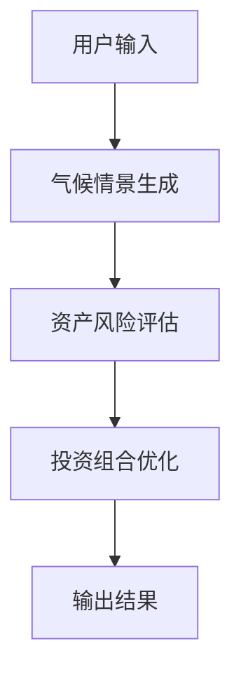

                 


好的，我明白了。我将按照您的要求，逐步构建《气候相关金融风险的量化与投资组合优化》这篇技术博客文章。首先，让我们从文章的基本结构开始，然后逐步填充内容。

---

# 气候相关金融风险的量化与投资组合优化

> 关键词：气候风险，金融量化，投资组合优化，蒙特卡洛模拟，情景分析，风险管理

> 摘要：本文旨在探讨气候相关金融风险的量化方法及其在投资组合优化中的应用。通过分析气候风险的核心概念、量化模型和优化策略，本文为金融从业者和研究人员提供了一种系统化的框架，以应对气候变化带来的金融挑战。文章结合理论与实践，通过具体案例和数学模型，深入解析气候风险的量化与投资组合优化的实现路径。

---

## # 第一部分: 气候相关金融风险的背景与概念

### # 第1章: 气候变化对金融系统的影响

#### 1.1 气候变化的定义与特征
气候变化是指地球气候系统的长期变化，包括温度、降水模式和极端天气事件的变化。其特征包括：

1. **长期性**：气候变化是一个缓慢但持续的过程。
2. **全球性**：影响范围覆盖全球。
3. **不可逆性**：某些气候变化可能是不可逆转的。

#### 1.2 气候变化对金融系统的潜在影响
气候变化对金融系统的影响是多方面的，包括：

1. **资产贬值**：极端天气事件可能导致房地产、基础设施等资产的贬值。
2. **贷款违约风险**：气候变化可能增加某些行业的违约风险。
3. **保险成本上升**：保险公司面临更高的赔付风险。

#### 1.3 金融系统中的气候相关风险类型
气候相关金融风险主要分为两类：

1. **物理风险**：由气候变化直接引发的物理事件（如洪水、干旱）带来的资产损失。
2. **转型风险**：由应对气候变化的政策、技术进步或市场变化引发的资产价值波动。

---

### # 第2章: 气候相关金融风险的核心概念与联系

#### 2.1 气候风险的核心概念
气候风险是指由于气候变化导致的金融资产损失或收益波动的可能性。其核心概念包括：

- **风险来源**：物理事件和政策变化。
- **风险传导机制**：通过资产价格、市场行为和政策调整影响金融系统。

#### 2.2 气候风险与金融资产的关系
气候风险通过以下方式影响金融资产：

- **资产价格波动**：极端天气事件可能导致股票价格波动。
- **投资决策变化**：投资者可能因气候风险重新评估资产价值。

#### 2.3 气候风险与投资组合优化的联系
气候风险的量化与投资组合优化密切相关。通过量化气候风险，投资者可以更好地调整投资组合，以规避或降低风险。

---

## # 第二部分: 气候相关金融风险的量化模型与算法

### # 第3章: 气候风险量化的主要方法

#### 3.1 基于情景分析的量化方法
情景分析是一种常见的气候风险量化方法，通过模拟不同气候情景下的资产表现，评估风险。

#### 3.2 基于蒙特卡洛模拟的量化方法
蒙特卡洛模拟通过随机抽样，模拟多种气候情景，评估资产在不同情景下的表现。

#### 3.3 基于回归分析的量化方法
回归分析可以用来识别气候变量与资产收益之间的关系，从而量化气候风险。

---

### # 第4章: 气候风险量化模型的数学公式

#### 4.1 蒙特卡洛模拟算法
以下是蒙特卡洛模拟的简单实现：

```python
import numpy as np

def monte_carlo_simulation(assets, scenarios, iterations):
    results = []
    for _ in range(iterations):
        # 生成随机情景
        random_scenario = np.random.choice(scenarios, size=len(scenarios))
        # 计算资产在随机情景下的表现
        asset_returns = [a.simulate(random_scenario) for a in assets]
        results.append(asset_returns)
    return results
```

#### 4.2 情景分析算法
以下是情景分析的简单实现：

```python
def scenario_analysis(assets, scenarios):
    results = {}
    for scenario in scenarios:
        asset_returns = [a.simulate(scenario) for a in assets]
        results[scenario] = asset_returns
    return results
```

---

## # 第三部分: 投资组合优化与风险管理

### # 第5章: 投资组合优化的核心原理

#### 5.1 现代投资组合理论（MPT）
MPT通过分散投资降低风险。在考虑气候风险时，投资者需要重新评估资产的相关性。

#### 5.2 风险调整后的收益指标
常用的指标包括夏普比率和特雷纳比率，用于衡量资产在考虑风险后的收益。

---

### # 第6章: 系统分析与架构设计

#### 6.1 系统功能设计
以下是气候风险量化与投资组合优化的系统功能模块图：



---

## # 第四部分: 项目实战与案例分析

### # 第7章: 项目实战

#### 7.1 环境安装
需要安装以下Python库：
- `numpy`
- `pandas`
- `scipy`
- `matplotlib`

#### 7.2 核心实现代码
以下是气候风险量化与投资组合优化的Python实现：

```python
import numpy as np
import pandas as pd

def compute_climate_risk(assets, scenarios):
    # 计算每种资产在不同情景下的收益
    asset_returns = []
    for asset in assets:
        returns = []
        for scenario in scenarios:
            returns.append(asset.simulate(scenario))
        asset_returns.append(returns)
    return asset_returns

def optimize_portfolio(assets, scenarios, risk_tolerance):
    # 计算最优投资组合
    returns = compute_climate_risk(assets, scenarios)
    # 使用均值-方差优化
    mean_returns = np.mean(returns, axis=1)
    covariance_matrix = np.cov(returns)
    # 计算最优权重
    inv_cov = np.linalg.inv(covariance_matrix)
    weights = inv_cov @ (risk_tolerance * mean_returns)
    weights = weights / np.sum(weights)
    return weights
```

---

### # 第8章: 总结与展望

#### 8.1 本章小结
本文系统地探讨了气候相关金融风险的量化方法及其在投资组合优化中的应用。通过理论分析和案例实践，展示了如何应对气候变化带来的金融挑战。

#### 8.2 未来展望
未来的研究可以进一步探索更复杂的气候模型和优化算法，以应对日益严峻的气候变化挑战。

---

以上是文章的大纲和部分内容的详细讲解。希望这篇文章能为您提供有价值的见解，并帮助您更好地理解和应对气候相关金融风险。

