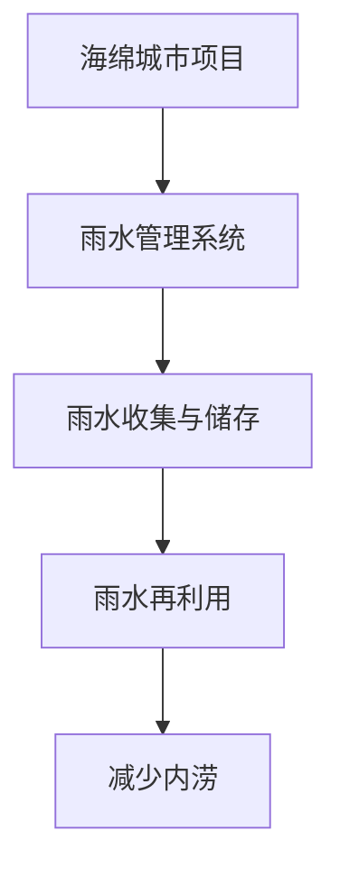

                 


# 气候适应性基础设施的投资需求与机遇

## 关键词：气候适应性基础设施，投资需求，气候适应性，气候变化，可持续发展，韧性城市，可再生能源

## 摘要：随着全球气候变化的加剧，气候适应性基础设施的投资需求日益增长。本文探讨了气候适应性基础设施的核心概念、关键组成部分、系统架构设计以及实际案例分析。通过对比分析和数学模型，阐述了气候适应性基础设施的投资回报与风险评估。最后，总结了最佳实践和未来的发展趋势，强调了投资气候适应性基础设施的重要性和机遇。

---

# 第一部分: 气候适应性基础设施的背景与概念

## 第1章: 气候变化的现状与挑战

### 1.1 气候变化的定义与影响
气候变化是指全球气候系统的长期变化，主要表现为温度升高、极端天气事件增多、海平面上升等。这些变化对基础设施的稳定性和安全性构成了重大威胁。例如，极端降雨事件可能导致城市内涝，洪水泛滥，造成财产损失和人员伤亡。

### 1.2 基础设施在气候变化中的角色
基础设施是社会经济活动的基石，包括交通、能源、水利、通信等领域。气候变化直接影响基础设施的运行，如极端天气可能导致电力中断、交通瘫痪等。因此，建设气候适应性基础设施是应对气候变化的关键举措。

### 1.3 气候适应性基础设施的核心目标
气候适应性基础设施的目标是通过设计和建设能够抵御和适应气候变化影响的设施，减少灾害风险，提高社会韧性。这包括提升基础设施的耐久性、灵活性和适应性，以应对各种极端气候事件。

---

## 第2章: 气候适应性基础设施的核心要素

### 2.1 气候适应性基础设施的关键组成部分
气候适应性基础设施包括多个关键组成部分，如防洪系统、可再生能源设施、智慧城市技术等。这些部分共同构成了适应气候变化的核心能力。

#### 2.1.1 防洪系统
防洪系统是气候适应性基础设施的重要组成部分。通过建设防洪堤、雨水管理系统等设施，可以有效减少洪水对城市和居民的影响。

#### 2.1.2 可再生能源设施
可再生能源设施，如太阳能电站、风力发电场等，能够减少对化石能源的依赖，降低碳排放，从而减缓气候变化的影响。

#### 2.1.3 智慧城市技术
智慧城市技术通过物联网、大数据和人工智能等手段，优化城市基础设施的运行效率，提高应对气候变化的能力。

### 2.2 气候适应性基础设施的属性特征对比
以下是气候适应性基础设施与传统基础设施在属性特征上的对比：

| 属性         | 气候适应性基础设施      | 传统基础设施      |
|--------------|-----------------------|------------------|
| 灵活性         | 高                   | 低               |
| 适应性         | 强                   | 弱               |
| 耐久性         | 长                   | 中               |
| 经济性         | 中高                  | 低               |
| 社会效益       | 高                   | 中               |
| 环境效益       | 高                   | 中               |

### 2.3 气候适应性基础设施的ER实体关系图
以下是气候适应性基础设施的ER实体关系图：

```mermaid
er
  actor: 投资者
  actor: 政府机构
  actor: 基础设施运营商

  infrastructure: 基础设施
    - 防洪系统
    - 可再生能源设施
    - 智慧城市技术

  climate: 气候变化
    - 极端天气事件
    - 海平面上升
    - 暖化效应

  investment: 投资
    - 资金来源
    - 投资回报率
    - 风险评估

  outcome: 项目成果
    - 社会效益
    - 环境效益
    - 经济效益
```

---

# 第二部分: 气候适应性基础设施的投资需求与机遇

## 第3章: 投资需求的分析与评估

### 3.1 气候适应性基础设施的投资需求
气候适应性基础设施的投资需求主要集中在以下几个方面：
1. **防洪系统**：建设防洪堤、雨水管理系统等设施，提升城市防洪能力。
2. **可再生能源设施**：投资太阳能、风能等可再生能源项目，减少碳排放。
3. **智慧城市技术**：部署物联网、大数据等技术，优化城市基础设施的运行效率。

### 3.2 投资回报与风险评估
气候适应性基础设施的投资回报可以通过以下模型进行评估：

$$ ROI = \frac{净收益}{投资成本} \times 100\% $$

其中，净收益可以通过以下公式计算：

$$ 净收益 = 收益 - 成本 $$

风险评估可以通过概率分析模型进行：

$$ P = \frac{成功案例数}{总案例数} \times 100\% $$

以下是风险评估的Python代码实现：

```python
import numpy as np

# 定义概率分析函数
def probability_analysis(success_cases, total_cases):
    return (success_cases / total_cases) * 100

# 示例数据
success_cases = 80
total_cases = 100

# 计算概率
risk = probability_analysis(success_cases, total_cases)
print(f"投资成功的概率为：{risk}%")
```

---

## 第4章: 机遇与挑战

### 4.1 气候适应性基础设施的投资机遇
1. **政策支持**：许多国家和地区出台了一系列政策，鼓励投资气候适应性基础设施。
2. **市场需求**：随着气候变化的加剧，市场对气候适应性基础设施的需求不断增加。
3. **技术创新**：新技术的应用为气候适应性基础设施的投资提供了更多可能性。

### 4.2 挑战与应对策略
1. **资金不足**：气候适应性基础设施的投资成本较高，需要多渠道融资。
2. **技术障碍**：部分技术尚不成熟，需要加大研发投入。
3. **协调困难**：跨部门、跨地区的协调难度较大，需要建立有效的合作机制。

---

## 第5章: 实际案例分析

### 5.1 海绵城市项目
海绵城市是一种典型的气候适应性基础设施项目，通过吸收、储存和利用雨水，减少城市内涝的风险。以下是海绵城市项目的系统架构图：



---

## 第6章: 总结与展望

### 6.1 总结
气候适应性基础设施的投资需求与机遇密切相关。通过建设气候适应性基础设施，可以有效应对气候变化的挑战，提升社会的韧性和可持续发展能力。

### 6.2 展望
未来，随着技术的进步和政策的支持，气候适应性基础设施的投资需求将进一步增加。同时，技术创新和国际合作将为气候适应性基础设施的发展提供更多机遇。

---

通过以上分析，我们可以看到，气候适应性基础设施的投资需求与机遇是一个复杂但充满潜力的领域。投资者和社会各界应共同努力，抓住机遇，应对挑战，推动气候适应性基础设施的发展。

