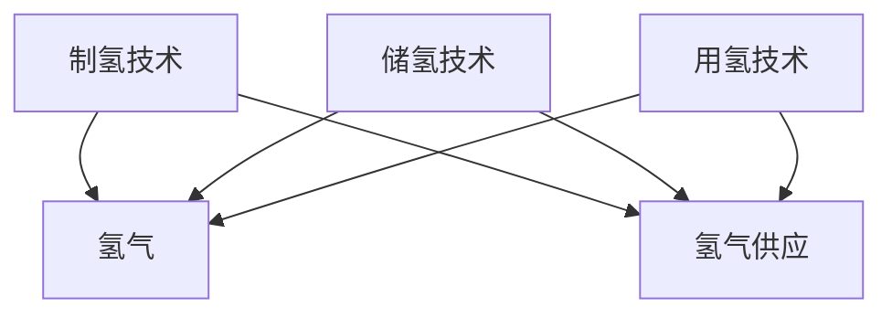
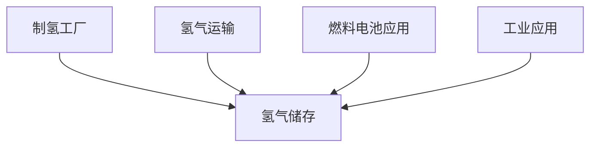

                 

# 氢能源经济的发展前景与投资策略

> 关键词：氢能源经济、制氢技术、氢能储存、氢能应用、投资策略、可持续发展

> 摘要：氢能源作为一种清洁、高效、可持续的能源形式，近年来在全球范围内得到了广泛关注。本文将从氢能源经济的核心概念、技术原理、市场分析、投资策略等方面进行详细探讨，帮助读者全面了解氢能源经济的发展前景和投资机会。

---

## 第一部分：氢能源经济的背景与核心概念

### 第1章：氢能源经济的背景与现状

#### 1.1 氢能源的基本概念
氢能是一种通过氢气（H₂）燃烧或反应释放能量的能源形式。与传统化石能源相比，氢能具有以下特点：
- **清洁性**：氢气燃烧仅生成水，无二氧化碳或其他污染物排放。
- **高效性**：氢能的热值高，能量密度大。
- **可再生性**：氢气可以通过电解水、生物质发酵等多种方式制取，具有可再生潜力。

氢能的应用领域广泛，主要包括：
- **交通领域**：氢燃料电池汽车。
- **工业领域**：氢气用于炼钢、化工生产等。
- **能源领域**：氢气用于发电和储能。

#### 1.2 氢能源经济的发展现状
目前，全球氢能源经济的发展呈现出以下特点：
- **技术进步**：电解水制氢、燃料电池等技术逐步成熟。
- **政策支持**：各国政府纷纷出台政策支持氢能源发展，例如欧盟的“绿色氢”计划、中国的“氢走廊”建设。
- **成本下降**：随着技术进步，制氢成本逐步降低。

#### 1.3 氢能经济面临的挑战与机遇
氢能经济的发展面临以下挑战：
- **技术瓶颈**：制氢成本高，储存与运输技术尚不完善。
- **基础设施**：氢气的储存、运输和加注设施尚未大规模建设。
- **政策不确定性**：氢能政策的不稳定可能影响投资信心。

同时，氢能经济也面临巨大机遇：
- **市场需求**：全球对清洁能源的需求日益增长。
- **技术突破**：新型制氢技术和燃料电池技术不断涌现。
- **成本下降**：随着规模化生产，氢能的成本有望进一步降低。

### 第2章：氢能源经济的核心概念与联系

#### 2.1 氢能经济的核心原理
氢能经济的核心在于通过制氢、储氢、运氢和用氢四个环节形成一个完整的产业链。其中：
- **制氢**：通过电解水、天然气 reforming 等技术制取氢气。
- **储氢**：通过高压储氢、低温液化等方式储存氢气。
- **运氢**：通过管道、液化罐等方式运输氢气。
- **用氢**：将氢气用于燃料电池发电或工业生产。

#### 2.2 氢能经济的核心概念对比
以下是氢能经济中几个核心概念的对比：

| 比较维度 | 制氢技术 | 储氢技术 | 用氢技术 |
|----------|----------|----------|----------|
| 代表技术 | 电解水、天然气 reforming | 高压储氢、低温液化 | 燃料电池、氢气发电 |
| 成本 | 高 | 中 | 低 |
| 效率 | 中 | 高 | 高 |
| 技术成熟度 | 高 | 中 | 高 |

#### 2.3 氢能经济的实体关系图
以下是氢能经济的实体关系图：

### 第3章：氢能源经济的技术分析与数学模型

#### 3.1 制氢技术的数学模型
制氢技术的成本是氢能经济的核心因素之一。以下是电解水制氢的成本模型：

$$ \text{制氢成本} = \text{电费} + \text{设备折旧} + \text{维护成本} $$

其中，电费是制氢成本的主要组成部分，公式为：

$$ \text{电费} = P \times Q \times t $$

- \( P \)：电价（元/kWh）
- \( Q \)：电解水设备的电流（A）
- \( t \)：时间（小时）

#### 3.2 氢能储存与运输的经济成本
氢能储存的成本主要取决于储存方式和技术。以下是高压储氢的经济模型：

$$ \text{储存成本} = \text{设备成本} + \text{压缩成本} + \text{维护成本} $$

#### 3.3 氢能应用的市场价值
氢能应用的市场价值取决于其应用场景和规模。以下是氢燃料电池汽车的经济模型：

$$ \text{燃料电池成本} = \text{催化剂成本} + \text{膜成本} + \text{其他部件成本} $$

---

## 第二部分：氢能源经济的市场分析与投资策略

### 第4章：氢能源市场的分析与预测

#### 4.1 全球氢能源市场现状
目前，全球氢能源市场主要集中在交通和工业领域。以下是主要国家的氢能源市场占比：

| 国家/地区 | 市场占比（%） |
|------------|--------------|
| 中国       | 35           |
| 欧盟       | 30           |
| 日本       | 20           |
| 美国       | 10           |
| 其他       | 5            |

#### 4.2 区域市场分析
- **中国市场**：政策支持强烈，燃料电池汽车和工业应用快速发展。
- **欧洲市场**：注重绿色氢的生产，政策驱动明显。
- **北美市场**：技术领先，氢气用于发电和交通领域。

### 第5章：氢能源经济的投资策略

#### 5.1 投资关键因素
以下是氢能源经济投资的关键因素：

| 关键因素 | 描述 |
|----------|------|
| 技术门槛 | 制氢和储氢技术的成熟度 |
| 政策支持 | 各国政府的氢能政策 |
| 市场需求 | 清洁能源需求的增长 |

#### 5.2 投资风险评估
氢能经济的投资风险主要体现在以下方面：
- **技术风险**：制氢和储氢技术尚未完全成熟。
- **政策风险**：政策变化可能影响投资收益。
- **市场风险**：市场需求可能不及预期。

#### 5.3 投资策略建议
- **技术驱动型投资**：重点投资制氢和储氢技术的研发和产业化。
- **政策导向型投资**：关注政府政策支持的领域，如绿色氢的生产。
- **市场多元化投资**：布局交通、工业和能源多个应用场景。

---

## 第三部分：氢能源经济的系统架构与项目实战

### 第6章：氢能源经济的系统架构设计

#### 6.1 系统架构图
以下是氢能源经济的系统架构图：

#### 6.2 核心功能模块
- **制氢模块**：负责氢气的生产。
- **储存模块**：负责氢气的储存。
- **运输模块**：负责氢气的运输。
- **应用模块**：负责氢气的最终应用。

### 第7章：氢能源经济的项目实战

#### 7.1 项目背景
某公司计划投资建设一个氢燃料电池汽车项目，目标是通过氢燃料电池技术实现清洁能源的应用。

#### 7.2 项目实施
- **制氢阶段**：采用电解水制氢技术，设备成本为1000万元，年电费为500万元。
- **储氢阶段**：采用高压储氢技术，储氢设备成本为200万元，年维护成本为50万元。
- **应用阶段**：氢燃料电池汽车的年销量目标为1000辆，每辆车的燃料电池成本为50万元。

#### 7.3 项目小结
通过该项目，公司可以实现年收入5亿元，投资回收期为5年，具有较高的经济效益。

---

## 第四部分：氢能源经济的最佳实践与未来展望

### 第8章：氢能源经济的最佳实践

#### 8.1 投资建议
- **关注技术突破**：重点投资制氢和储氢技术的研发。
- **政策导向**：关注政府政策，选择政策支持的领域。
- **市场多元化**：布局多个应用场景，降低投资风险。

#### 8.2 未来展望
随着技术进步和政策支持，氢能源经济有望在未来十年内实现大规模商业化。预计到2030年，全球氢能源市场规模将达到1万亿美元。

### 第9章：总结与注意事项

#### 9.1 总结
氢能源经济作为一种清洁、高效、可持续的能源形式，具有广阔的发展前景。通过技术创新、政策支持和市场布局，投资者可以抓住氢能源经济的投资机会。

#### 9.2 注意事项
- **技术风险**：制氢和储氢技术尚未完全成熟。
- **政策风险**：政策变化可能影响投资收益。
- **市场风险**：市场需求可能不及预期。

---

通过以上分析，我们可以看到氢能源经济的发展前景广阔，但也面临诸多挑战。投资者需要结合技术、政策和市场多重因素，制定合理的投资策略。未来，随着技术进步和政策支持，氢能源经济有望在全球范围内实现大规模应用，成为清洁能源的重要组成部分。

