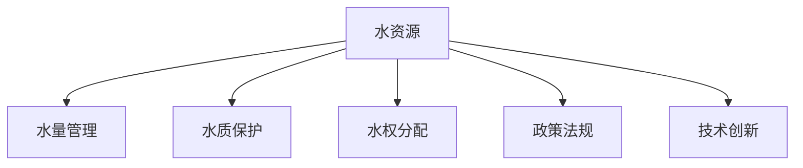
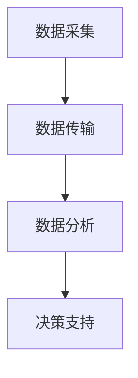

                 

# 水资源管理相关企业的投资前景分析

## 关键词：水资源管理，投资前景，智慧水务，环保技术，市场竞争，风险评估

## 摘要：本文从水资源管理的核心概念出发，分析了当前水资源管理行业的现状与挑战，详细探讨了智慧水务、环保技术等技术应用，以及市场与竞争格局。结合投资策略与风险评估，本文为投资者提供了全面的投资前景分析和实用建议。

---

## 第一部分: 水资源管理相关企业的投资前景概述

### 第1章: 水资源管理与投资前景的背景介绍

#### 1.1 水资源管理的核心概念

##### 1.1.1 问题背景与问题描述
水资源是人类生存和发展的基础，但随着人口增长、工业化和城市化进程的加快，水资源短缺和污染问题日益严重。根据联合国数据，全球约8.84亿人缺乏基本的用水卫生设施，水资源管理已成为全球关注的焦点。

##### 1.1.2 水资源管理的核心要素与概念结构
水资源管理涉及多个要素，包括水量管理、水质保护、水权分配等。通过概念结构图（下图），我们可以清晰地看到各要素之间的关系。

##### 1.1.3 水资源管理的边界与外延
水资源管理不仅关注供水和排水，还包括雨水管理、洪水防治等领域。其外延涉及农业、工业和居民用水等多个方面。

#### 1.2 投资前景分析的驱动因素

##### 1.2.1 行业需求与市场潜力
随着全球水资源短缺问题加剧，市场对高效节水技术、污水处理设备的需求持续增长。根据统计，全球水务市场规模预计在未来五年内年均增长5%以上。

##### 1.2.2 技术进步与创新
智慧水务、物联网技术的应用正在改变传统的水资源管理模式。例如，通过智能传感器和数据分析，可以实现水资源的实时监控和优化配置。

##### 1.2.3 政策支持与法规环境
各国政府纷纷出台相关政策，鼓励节水技术和环保产业的发展。例如，中国提出“十四五”规划，将水资源管理作为重点任务之一。

#### 1.3 本章小结
本章通过分析水资源管理的核心概念和投资驱动因素，为后续的分析奠定了基础。

---

## 第二部分: 水资源管理相关企业的现状分析

### 第2章: 水资源管理行业的现状与挑战

#### 2.1 水资源管理行业的现状分析

##### 2.1.1 全球水资源管理行业的现状
全球范围内，水资源管理行业呈现出区域差异化的特征。发达国家在技术和管理经验上较为领先，而发展中国家则面临更大的挑战。

##### 2.1.2 中国水资源管理行业的现状
中国水资源短缺问题突出，但近年来在政策支持和技术进步的推动下，水资源管理行业取得了显著进展。

##### 2.1.3 区域性差异与发展趋势
不同地区的水资源禀赋和经济发展水平差异较大，导致水资源管理的模式和重点也有所不同。

#### 2.2 水资源管理行业的主要挑战

##### 2.2.1 水资源短缺与污染问题
水资源短缺和水质污染是当前面临的主要挑战。根据世界银行的数据，全球每年因水污染导致的经济损失高达数万亿美元。

##### 2.2.2 技术瓶颈与创新能力不足
部分地区的水资源管理技术较为落后，创新能力不足，难以应对复杂的水资源问题。

##### 2.2.3 市场竞争与政策不确定性
市场竞争加剧和政策变化的不确定性给企业带来了较大的压力。

#### 2.3 本章小结
本章分析了水资源管理行业的现状和主要挑战，为后续的投资分析提供了背景支持。

---

## 第三部分: 水资源管理相关企业的技术与市场分析

### 第3章: 水资源管理行业的技术应用分析

#### 3.1 智慧水务与数字化技术

##### 3.1.1 智慧水务的概念与技术架构
智慧水务通过物联网、大数据等技术实现水资源的智能化管理。其技术架构包括数据采集、传输、分析和决策支持等模块。

##### 3.1.2 数字化技术在水资源管理中的应用
数字化技术可以实现水资源的实时监控和优化配置。例如，通过智能传感器监测水质和水位，及时发现和处理问题。

##### 3.1.3 智慧水务系统的实现方案
智慧水务系统的实现方案包括硬件设备的部署、数据平台的搭建和应用软件的开发。

#### 3.2 环保技术与水资源保护

##### 3.2.1 污水处理技术的发展
污水处理技术不断创新，从传统的物理处理到生物处理，再到先进的膜分离技术，处理效果显著提升。

##### 3.2.2 水质监测技术的应用
水质监测技术通过在线监测设备实时掌握水质状况，为水资源保护提供数据支持。

##### 3.2.3 循环经济与水资源再利用
循环经济模式下，水资源的再利用已成为重要的节水途径。例如，工业废水经过处理后用于农业灌溉。

#### 3.3 本章小结
本章详细分析了智慧水务和环保技术在水资源管理中的应用，展示了技术进步对行业发展的推动作用。

### 第4章: 水资源管理行业的市场与竞争分析

#### 4.1 市场需求分析

##### 4.1.1 行业市场规模与增长预测
根据市场研究机构的数据，全球水资源管理市场规模预计将以年均复合增长率6%的速度增长，到2025年市场规模将突破万亿元。

##### 4.1.2 主要细分市场分析
水资源管理行业的主要细分市场包括水务基础设施建设、污水处理设备制造、智慧水务系统集成等。

##### 4.1.3 消费者行为与需求变化
消费者对水质要求的提高和环保意识的增强推动了高端水务设备的需求。

#### 4.2 行业竞争格局分析

##### 4.2.1 主要企业与市场份额
行业内主要企业包括GE、西门子、威立雅等国际巨头，以及中国本土企业如碧水源、北控水务等。

##### 4.2.2 行业集中度与竞争态势
行业集中度较高，头部企业占据大部分市场份额，竞争主要集中在技术创新和成本控制方面。

##### 4.2.3 新进入者与市场机会
新进入者面临较高的市场壁垒，但在细分市场和新兴领域仍存在一定的机会。

#### 4.3 本章小结
本章分析了水资源管理行业的市场现状和竞争格局，为投资分析提供了重要的参考信息。

---

## 第四部分: 水资源管理相关企业的投资策略与风险评估

### 第5章: 水资源管理企业的投资策略分析

#### 5.1 投资策略的制定原则

##### 5.1.1 投资目标与财务可行性
投资策略应以实现财务回报为目标，同时考虑项目的可行性和风险。

##### 5.1.2 投资周期与风险控制
根据项目的周期特点制定投资策略，同时注重风险控制，避免过度风险暴露。

##### 5.1.3 投资组合与资产配置
通过合理的资产配置和投资组合分散风险，提高整体投资回报。

#### 5.2 投资策略的具体实施路径

##### 5.2.1 项目选择与评估
在选择投资项目时，应注重项目的市场需求、技术可行性、财务回报等多个维度的评估。

##### 5.2.2 投资回报预测与财务模型
通过建立财务模型预测项目的投资回报，确保投资决策的科学性和准确性。

##### 5.2.3 投资风险的识别与管理
识别投资项目中的潜在风险，并制定相应的管理策略，降低风险对投资的影响。

#### 5.3 本章小结
本章从投资策略的制定原则和具体实施路径两个方面，为投资者提供了实用的指导。

### 第6章: 水资源管理行业的风险评估与应对策略

#### 6.1 行业风险的主要来源

##### 6.1.1 政策风险
政策变化可能对行业产生重大影响，尤其是在环保法规和市场准入方面。

##### 6.1.2 市场风险
市场需求的变化和价格竞争可能影响企业的盈利能力。

##### 6.1.3 技术风险
技术进步的不确定性可能导致现有技术快速被淘汰。

#### 6.2 风险评估方法与工具

##### 6.2.1 风险矩阵分析
通过风险矩阵分析，可以将风险分为高、中、低三个等级，并制定相应的应对策略。

##### 6.2.2 情景分析法
情景分析法通过构建不同的市场和政策情景，评估项目在不同情况下的表现。

##### 6.2.3 蒙特卡洛模拟
蒙特卡洛模拟是一种通过多次随机抽样来评估项目不确定性的方法，常用于财务模型中。

#### 6.3 风险应对策略

##### 6.3.1 政策风险应对
密切关注政策变化，加强与政府机构的沟通，积极参与政策制定。

##### 6.3.2 市场风险应对
通过市场调研和竞争分析，制定灵活的市场策略，增强市场竞争力。

##### 6.3.3 技术风险应对
加大研发投入，注重技术创新，保持技术领先地位。

#### 6.4 本章小结
本章分析了水资源管理行业的主要风险，并提出了相应的应对策略，帮助投资者更好地应对潜在风险。

---

## 附录: 水资源管理相关企业的投资前景分析总结

通过本文的分析，我们可以得出以下结论：

1. 水资源管理行业具有广阔的投资前景，但同时也面临诸多挑战。
2. 技术创新是推动行业发展的关键，智慧水务和环保技术的应用将带来更多的投资机会。
3. 投资者在制定投资策略时，应充分考虑政策、市场和技术等多重因素，制定科学的风险管理策略。

总之，水资源管理行业的投资前景光明，但需要投资者具备敏锐的洞察力和较强的风险管理能力，才能在激烈的市场竞争中脱颖而出。

---

以上是《水资源管理相关企业的投资前景分析》的完整目录和内容概述，希望对您有所帮助！如果需要进一步的详细内容或调整，请随时告知。

