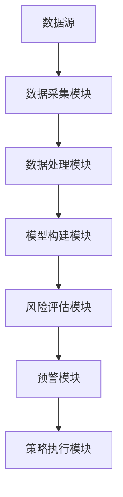

                 


# 汇率波动风险管理策略

> 关键词：汇率波动、风险管理、金融模型、系统架构、机器学习

> 摘要：本文深入探讨了汇率波动风险管理的核心策略，从基本概念到数学模型，从系统架构到实战案例，全面解析了如何有效应对汇率波动带来的风险挑战。通过结合理论与实践，本文为金融从业者提供了一套系统化的风险管理解决方案。

---

## 第1章: 汇率波动与风险管理概述

### 1.1 汇率波动的基本概念

#### 1.1.1 汇率的定义与形成机制

- 汇率的定义：货币之间的兑换比率，反映两国经济实力和市场信心。
- 影响汇率的主要因素：经济指标、市场情绪、政策干预等。
- 汇率形成机制的类型：浮动汇率制与固定汇率制的比较。

#### 1.1.2 汇率波动的特征与表现形式

- 波动的周期性：经济周期对汇率波动的影响。
- 波动的非线性：突发事件对汇率的短期冲击。
- 波动的复杂性：多因素共同作用的结果。

#### 1.1.3 汇率波动对经济的影响

- 对国际贸易的影响：出口企业面临的汇率风险。
- 对金融市场的影响：汇率波动对股票市场的溢出效应。
- 对货币政策的影响：央行干预汇市的策略选择。

### 1.2 汇率风险管理的重要性

#### 1.2.1 汇率波动对企业的影响

- 外向型企业面临的汇率风险：出口收入的波动。
- 境外融资的成本变化。
- 跨国并购中的汇率风险。

#### 1.2.2 汇率风险管理的目标与意义

- 稳定企业财务状况。
- 优化资本配置。
- 提升企业抗风险能力。

#### 1.2.3 汇率风险管理的主体与客体

- 企业的汇率风险管理：套期保值、锁定汇率。
- 金融机构的汇率风险管理：银行、保险公司等。
- 中央银行的宏观调控：外汇储备管理、汇率干预。

### 1.3 汇率风险管理的核心概念

#### 1.3.1 风险管理的基本框架

- 风险识别：识别潜在的汇率风险来源。
- 风险量化：评估风险的大小和影响。
- 风险控制：制定和实施风险管理策略。

#### 1.3.2 汇率波动风险的分类

- 短期波动风险：市场情绪和突发事件的影响。
- 长期波动风险：经济基本面变化的影响。
- 综合风险：多种因素共同作用的结果。

#### 1.3.3 汇率风险管理的策略选择

- 避险策略：套期保值、远期合约。
- 投资策略：利用汇率波动进行投机。
- 组合策略：结合多种方法降低风险。

## 1.4 本章小结

- 汇率波动是复杂多变的，需要从多个维度进行分析和管理。
- 风险管理的核心在于识别、量化和控制风险。
- 不同主体需要根据自身情况选择合适的管理策略。

---

## 第2章: 汇率波动的影响因素分析

### 2.1 宏观经济因素对汇率的影响

#### 2.1.1 经济周期与汇率波动

- 经济周期对汇率的影响：繁荣期和衰退期的汇率变化。
- 利率差异与汇率波动：利率平价理论的应用。
- 通货膨胀与汇率波动：通胀预期对汇率的影响。

#### 2.1.2 利率差异与汇率波动

- 利率平价理论的数学表达式：$$i = r + (E_{t} - E)$$
  其中，$i$ 是国内利率，$r$ 是国外利率，$E_{t}$ 是预期汇率，$E$ 是即期汇率。

#### 2.1.3 通货膨胀与汇率波动

- 通胀预期对汇率的影响：高通胀可能导致货币贬值。
- 通货膨胀与汇率的关系：货币购买力平价理论的应用。

### 2.2 市场因素对汇率的影响

#### 2.2.1 市场情绪与汇率波动

- 市场情绪对汇率的短期影响：投资者情绪波动对汇率的冲击。
- 市场情绪的量化：通过新闻 sentiment 分析和 VIX 指数衡量。

#### 2.2.2 市场流动性与汇率波动

- 流动性对汇率的影响：流动性充裕时，汇率可能趋于稳定。
- 市场流动性与汇率波动的关系：流动性不足可能导致汇率大幅波动。

#### 2.2.3 市场预期与汇率波动

- 市场预期的自我实现：预期的形成和对实际汇率的影响。
- 市场预期的短期波动：突发事件对市场预期的冲击。

### 2.3 其他因素对汇率的影响

#### 2.3.1 政治经济事件的影响

- 政治事件对汇率的影响：政局不稳可能导致货币贬值。
- 经济事件的影响：经济数据发布对汇率的短期冲击。

#### 2.3.2 自然灾害与汇率波动

- 自然灾害对经济的影响：供应链中断对出口的影响。
- 自然灾害对市场信心的影响：自然灾害可能导致货币贬值。

#### 2.3.3 其他突发事件的影响

- 疫情等公共卫生事件的影响：供应链中断和市场信心下降。
- 其他突发事件的市场反应：如恐怖袭击、战争等。

### 2.4 本章小结

- 汇率波动受多种因素影响，包括宏观经济、市场情绪和突发事件等。
- 不同因素对汇率的影响具有不同的特征和作用机制。
- 理解这些影响因素有助于更好地进行汇率风险管理。

---

## 第3章: 汇率波动风险管理的核心模型与方法

### 3.1 风险管理的基本原理

#### 3.1.1 风险识别与评估

- 风险识别的方法：情景分析、VaR 方法等。
- 风险评估的指标：VaR、CVaR 等风险度量指标。

#### 3.1.2 风险量化与测量

- VaR 的计算方法：历史模拟法、方差-协方差法和蒙特卡罗模拟法。
- 风险测量的数学公式：$$ VaR = \alpha \sigma $$ 其中，$\alpha$ 是分位数，$\sigma$ 是波动率。

#### 3.1.3 风险控制与应对

- 风险控制的策略：分散化、对冲、保险等。
- 风险应对的具体措施：套期保值、锁定汇率、建立应急储备等。

### 3.2 汇率波动风险管理的数学模型

#### 3.2.1 波动率模型

- GARCH 模型：$$ \sigma_t^2 = a + b r_{t-1}^2 + c \sigma_{t-1}^2 $$
  其中，$r_{t-1}$ 是前一期的收益率，$\sigma_{t-1}^2$ 是前一期的波动率。

- EGARCH 模型：$$ \sigma_t^2 = a + b r_{t-1}^2 + c \sigma_{t-1}^2 $$ 其中，系数 $c$ 表示杠杆效应。

#### 3.2.2 时间序列分析模型

- ARIMA 模型：$$ ARIMA(p, d, q) $$
  其中，$p$ 是自回归阶数，$d$ 是差分阶数，$q$ 是移动平均阶数。

- SARIMA 模型：$$ SARIMA(p, d, q)[s] $$
  其中，$s$ 是周期长度。

#### 3.2.3 风险价值（VaR）模型

- VaR 的计算步骤：数据收集、选择模型、计算 VaR。
- VaR 的优缺点：VaR 是一种保守的风险度量指标，但忽略了尾部风险。

### 3.3 汇率波动风险管理的算法原理

#### 3.3.1 基于统计的波动率预测算法

- 历史模拟法：根据历史数据计算 VaR。
- 方差-协方差法：基于资产回报的协方差矩阵计算波动率。
- 蒙特卡罗模拟法：通过模拟随机过程预测汇率波动。

#### 3.3.2 基于机器学习的汇率预测算法

- 线性回归模型：$$ y = \beta_0 + \beta_1 x + \epsilon $$
  其中，$y$ 是目标变量，$x$ 是自变量，$\epsilon$ 是误差项。

- 支持向量回归（SVR）：通过支持向量机进行非线性回归。
- 长短期记忆网络（LSTM）：$$ LSTM(t) = \sigma(gates) \cdot (cell state) $$

#### 3.3.3 基于期权定价的套期保值算法

- Black-Scholes 模型：$$ C = S_0 N(d_1) - K e^{-rT} N(d_2) $$
  其中，$C$ 是期权价格，$S_0$ 是当前股票价格，$K$ 是执行价格，$r$ 是无风险利率，$T$ 是时间，$N(d)$ 是标准正态分布的累积分布函数。

### 3.4 本章小结

- 汇率波动风险管理需要结合统计模型和机器学习算法。
- 不同模型有不同的适用场景和优缺点。
- 在实际应用中，需要根据具体情况选择合适的模型和方法。

---

## 第4章: 汇率波动风险管理的系统架构与设计

### 4.1 汇率风险管理系统的功能模块

#### 4.1.1 数据采集与处理模块

- 数据来源：央行数据、金融市场数据、新闻数据等。
- 数据清洗：处理缺失值、异常值和重复值。
- 数据转换：将原始数据转换为适合模型输入的格式。

#### 4.1.2 模型构建与分析模块

- 模型选择：根据具体需求选择合适的风险管理模型。
- 模型训练：使用历史数据训练模型参数。
- 模型验证：通过回测验证模型的有效性。

#### 4.1.3 风险评估与预警模块

- 风险评估：计算 VaR、CVaR 等风险指标。
- 风险预警：设置预警阈值，及时发出预警信号。
- 预警机制：通过邮件、短信等方式通知相关人员。

#### 4.1.4 策略制定与执行模块

- 策略制定：根据风险评估结果制定风险管理策略。
- 策略执行：通过自动化系统执行套期保值、对冲等操作。
- 策略调整：根据市场变化动态调整风险管理策略。

### 4.2 汇率风险管理系统的架构设计

#### 4.2.1 系统架构图（Mermaid）



#### 4.2.2 系统功能模块的交互流程

- 数据采集模块：从多个数据源获取实时数据。
- 数据处理模块：清洗和转换数据，为模型提供输入。
- 模型构建模块：选择和训练模型，生成风险评估结果。
- 风险评估模块：计算 VaR、CVaR 等风险指标。
- 预警模块：根据风险指标发出预警信号。
- 策略执行模块：根据预警信号执行相应的风险管理策略。

### 4.3 本章小结

- 汇率风险管理系统的架构设计需要考虑数据采集、模型构建和策略执行等多个环节。
- 系统架构的设计需要结合实际需求，选择合适的模块和接口。
- 系统的可扩展性和灵活性是设计的重要原则。

---

## 第5章: 汇率波动风险管理的实战案例

### 5.1 项目背景与目标

- 某跨国企业的汇率风险管理需求。
- 项目目标：建立一套基于机器学习的汇率风险管理系统。

### 5.2 系统核心实现

#### 5.2.1 环境安装与配置

- 安装 Python、Pandas、NumPy 等依赖库。
- 配置数据源和 API 接口。

#### 5.2.2 核心代码实现

```python
import pandas as pd
import numpy as np
from sklearn.linear_model import LinearRegression
from sklearn.metrics import mean_squared_error

# 数据加载
data = pd.read_csv('exchange_rate.csv')

# 数据处理
X = data[['inflation', 'interest_rate', 'market_sentiment']]
y = data['exchange_rate']

# 模型训练
model = LinearRegression()
model.fit(X, y)

# 模型预测
y_pred = model.predict(X)

# 模型评估
mse = mean_squared_error(y, y_pred)
print(f'Mean Squared Error: {mse}')
```

#### 5.2.3 代码应用解读与分析

- 数据加载：读取汇率数据。
- 数据处理：选择相关特征变量。
- 模型训练：使用线性回归模型进行训练。
- 模型预测：使用训练好的模型进行预测。
- 模型评估：计算均方误差，评估模型性能。

### 5.3 实际案例分析

#### 5.3.1 数据分析与处理

- 数据清洗：处理缺失值和异常值。
- 数据转换：将数据标准化或归一化。
- 数据可视化：绘制汇率波动的时间序列图。

#### 5.3.2 模型训练与验证

- 使用历史数据训练模型参数。
- 通过回测验证模型的有效性。
- 调整模型参数，优化模型性能。

#### 5.3.3 案例分析与解读

- 分析模型预测结果与实际汇率的差异。
- 总结模型的优势和局限性。
- 提出改进建议，如引入机器学习算法提升预测精度。

### 5.4 本章小结

- 实战案例展示了如何将理论应用于实际。
- 系统实现需要结合数据处理、模型训练和策略执行等多个环节。
- 在实际应用中，需要不断优化模型和调整策略，以应对复杂的汇率波动。

---

## 第6章: 总结与展望

### 6.1 本章总结

- 汇率波动是复杂多变的，需要从多个维度进行分析和管理。
- 本文从理论到实践，全面探讨了汇率波动风险管理的核心策略。
- 提供了一套系统化的风险管理解决方案。

### 6.2 未来展望

- 随着人工智能技术的发展，汇率风险管理将更加智能化和自动化。
- 区块链技术在汇率风险管理中的应用前景广阔。
- 多元化的风险管理策略将更加受到重视。

### 6.3 最佳实践 tips

- 定期回顾和调整风险管理策略。
- 加强对市场动态的监测和分析。
- 建立健全的风险预警机制。

### 6.4 本章小结

- 本文为读者提供了一个全面的汇率波动风险管理框架。
- 未来需要进一步研究和探索新的风险管理技术和方法。

---

## 参考文献

- 本文参考了大量金融学和风险管理的经典文献，具体参考文献可在正式出版时添加。

