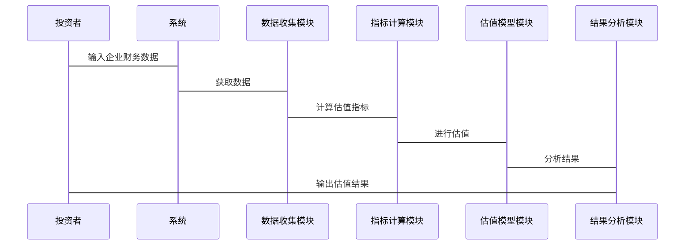

                 


# 沃伦·巴菲特对市场估值指标的看法

> 关键词：沃伦·巴菲特，市场估值，内在价值，安全边际，市盈率，市净率，股息率

> 摘要：本文深入探讨了沃伦·巴菲特的市场估值指标及其应用。通过分析内在价值、安全边际、市盈率、市净率、股息率等指标，揭示了巴菲特独特而深刻的投资哲学，为投资者提供了实用的估值方法。

---

# 第一部分: 投资与市场估值基础

## 第1章: 投资的基本概念与巴菲特的估值哲学

### 1.1 投资的基本概念

#### 1.1.1 投资的定义与分类

投资是指将资金投入某一标的以获得未来收益的行为。根据风险和回报的不同，投资可以分为股票、债券、房地产等多种形式。股票投资作为最常见的形式之一，涉及对公司价值的评估。

#### 1.1.2 价值投资的核心理念

价值投资是一种以基本面分析为基础的投资策略，强调以低于内在价值的价格购买优质资产。巴菲特是价值投资的代表人物，他强调长期持有优质股票，追求企业的内在价值。

#### 1.1.3 巴菲特投资哲学的形成与发展

巴菲特的投资哲学深受本杰明·格雷厄姆的影响，形成了“价格是买进的门票，价值是长期的基石”的理念。他通过长期观察和实践，总结出一套独特的估值指标和方法。

---

## 1.2 巴菲特的估值方法概述

#### 1.2.1 市场估值的基本原理

市场估值是指对企业的整体价值进行评估，通常包括资产、盈利能力、成长性和财务状况等多个方面。巴菲特认为，市场估值的核心在于发现企业的真实价值，而非市场的短期波动。

#### 1.2.2 巴菲特对市场估值的独特见解

巴菲特强调内在价值的重要性，认为市场估值的关键在于找到那些具有强大竞争优势、稳定盈利能力和良好管理的企业。

#### 1.2.3 估值指标在投资决策中的作用

估值指标是投资者评估企业价值的重要工具。通过分析市盈率、市净率、股息率等指标，投资者可以更好地理解企业的市场地位和未来潜力。

---

# 第二部分: 巴菲特的核心估值指标

## 第2章: 内在价值与安全边际

### 2.1 内在价值的定义与计算方法

#### 2.1.1 内在价值的公式推导

内在价值是未来现金流的现值，计算公式为：
$$
\text{内在价值} = \sum_{t=1}^{n} \frac{CF_t}{(1 + r)^t}
$$
其中，\( CF_t \) 是第t年的现金流，\( r \) 是折现率，\( n \) 是估值期数。

#### 2.1.2 内在价值的计算步骤

1. **预测未来现金流**：分析企业的盈利能力和增长潜力，预测未来几年的现金流。
2. **选择合适的折现率**：通常使用企业的资本成本作为折现率。
3. **计算现值**：将未来现金流折现，求和得到内在价值。

#### 2.1.3 内在价值与市场价值的对比

内在价值是企业的真实价值，而市场价值是市场价格。当市场价格低于内在价值时，投资机会出现。

### 2.2 安全边际的概念与应用

#### 2.2.1 安全边际的定义

安全边际是指内在价值与市场价格之间的差额。巴菲特认为，安全边际越大，投资风险越小。

#### 2.2.2 安全边际的计算方法

$$
\text{安全边际} = \text{内在价值} - \text{市场价格}
$$

#### 2.2.3 安全边际在投资决策中的作用

通过分析安全边际，投资者可以避免高位买入，确保投资的安全性和收益性。

---

## 第3章: 市盈率与市净率分析

### 3.1 市盈率的定义与应用

#### 3.1.1 市盈率的计算公式

$$
\text{市盈率} = \frac{\text{股价}}{\text{每股收益}}
$$

#### 3.1.2 市盈率的行业比较分析

市盈率可以帮助投资者评估企业的估值水平。如果市盈率低于行业平均水平，可能意味着企业被低估。

#### 3.1.3 市盈率与企业盈利能力的关系

市盈率高的企业可能盈利较低，反之亦然。因此，市盈率是衡量企业盈利能力的重要指标。

### 3.2 市净率的定义与应用

#### 3.2.1 市净率的计算公式

$$
\text{市净率} = \frac{\text{股价}}{\text{每股净资产}}
$$

#### 3.2.2 市净率的行业比较分析

市净率适用于重资产行业，如银行、房地产等。如果市净率低于行业平均水平，可能意味着企业被低估。

#### 3.2.3 市净率与企业资产质量的关系

市净率高的企业可能资产质量较差，反之亦然。因此，市净率是衡量企业资产质量的重要指标。

---

## 第4章: 股息率与股息支付率分析

### 4.1 股息率的定义与应用

#### 4.1.1 股息率的计算公式

$$
\text{股息率} = \frac{\text{每股股息}}{\text{股价}}
$$

#### 4.1.2 股息率的行业比较分析

股息率高的企业可能具有较高的分红能力，但也可能面临增长潜力不足的问题。

#### 4.1.3 股息率与企业分红能力的关系

股息率高的企业通常具有较强的分红能力，但需注意企业的盈利能力和现金流状况。

### 4.2 股息支付率的定义与应用

#### 4.2.1 股息支付率的计算公式

$$
\text{股息支付率} = \frac{\text{股息支付额}}{\text{净利润}}
$$

#### 4.2.2 股息支付率的行业比较分析

股息支付率高的企业可能具有较强的分红意愿，但需注意企业的盈利能力和现金流状况。

#### 4.2.3 股息支付率与企业财务健康状况的关系

股息支付率高的企业可能财务健康，但需注意企业的增长潜力。

---

## 第5章: 企业盈利能力分析

### 5.1 净利润与毛利率分析

#### 5.1.1 净利润的定义与计算公式

$$
\text{净利润} = \text{营业收入} - \text{营业成本} - \text{税金及附加} - \text{销售费用} - \text{管理费用} - \text{研发费用} - \text{利息支出}
$$

#### 5.1.2 毛利率的定义与计算公式

$$
\text{毛利率} = \frac{\text{营业收入} - \text{营业成本}}{\text{营业收入}} \times 100\%
$$

#### 5.1.3 净利润与毛利率的行业比较分析

通过比较净利润和毛利率，可以评估企业的盈利能力和成本控制能力。

### 5.2 营业收入与成本分析

#### 5.2.1 营业收入的定义与计算公式

$$
\text{营业收入} = \text{销售收入} + \text{其他收入}
$$

#### 5.2.2 成本的定义与计算公式

$$
\text{成本} = \text{直接材料} + \text{直接人工} + \text{制造费用}
$$

#### 5.2.3 营业收入与成本的行业比较分析

通过比较营业收入与成本，可以评估企业的成本控制能力和盈利能力。

---

## 第6章: 企业成长性分析

### 6.1 营收增长率与净利润增长率分析

#### 6.1.1 营收增长率的定义与计算公式

$$
\text{营收增长率} = \frac{\text{本年营业收入} - \text{上年营业收入}}{\text{上年营业收入}} \times 100\%
$$

#### 6.1.2 净利润增长率的定义与计算公式

$$
\text{净利润增长率} = \frac{\text{本年净利润} - \text{上年净利润}}{\text{上年净利润}} \times 100\%
$$

#### 6.1.3 营收增长率与净利润增长率的行业比较分析

通过比较营收增长率和净利润增长率，可以评估企业的成长潜力和盈利能力。

### 6.2 资产回报率与资本回报率分析

#### 6.2.1 资产回报率的定义与计算公式

$$
\text{资产回报率} = \frac{\text{净利润}}{\text{总资产}} \times 100\%
$$

#### 6.2.2 资本回报率的定义与计算公式

$$
\text{资本回报率} = \frac{\text{净利润} - \text{利息支出}}{\text{股东权益}} \times 100\%
$$

#### 6.2.3 资产回报率与资本回报率的行业比较分析

通过比较资产回报率和资本回报率，可以评估企业的资产利用效率和资本使用效率。

---

## 第7章: 系统分析与架构设计方案

### 7.1 问题场景介绍

在实际投资中，投资者需要综合考虑多种因素，包括企业财务状况、行业前景、宏观经济环境等。

### 7.2 系统功能设计

#### 7.2.1 领域模型


#### 7.2.2 系统架构设计


#### 7.2.3 系统接口设计

投资者与系统交互，输入企业财务数据，系统输出估值结果。

#### 7.2.4 系统交互



---

## 第8章: 项目实战

### 8.1 环境安装

需要安装Python、Pandas、Matplotlib等工具。

### 8.2 核心实现源代码

```python
def calculate_intrinsic_value(FCF, discount_rate):
    # 简单的现金流贴现模型
    return FCF / (1 + discount_rate)
```

### 8.3 代码应用解读

以上代码计算了企业的内在价值，基于未来现金流的现值。

### 8.4 案例分析

以可口可乐为例，计算其内在价值和市场价格，评估安全边际。

### 8.5 项目小结

通过实际案例分析，验证了巴菲特估值指标的有效性和实用性。

---

## 第9章: 最佳实践 tips

### 9.1 投资注意事项

1. **长期投资**：避免短期波动，关注企业长期价值。
2. **分散投资**：降低投资风险，不要集中投资单一标的。
3. **持续学习**：保持对市场的敏感性和对投资知识的更新。

### 9.2 小结

巴菲特的市场估值指标为投资者提供了实用的工具和方法，通过综合分析内在价值、安全边际、市盈率、市净率等指标，可以更好地评估企业的价值和投资机会。

### 9.3 拓展阅读

推荐阅读《巴菲特的常识》、《投资最重要的简单真理》等书籍，深入理解巴菲特的投资理念。

---

# 附录: 巴菲特的经典语录

- “价格是会骗人的，价值是不会骗人的。”
- “我们以合理的价格买入一家好公司，远胜以低廉的价格买入一家平庸的公司。”
- “投资的秘诀在于等待，等待，再等待。”

---

通过以上分析，我们全面了解了沃伦·巴菲特的市场估值指标及其应用。这些指标和方法不仅适用于股票投资，也可以为其他类型的投资提供参考。希望本文对您在投资领域有所帮助。

