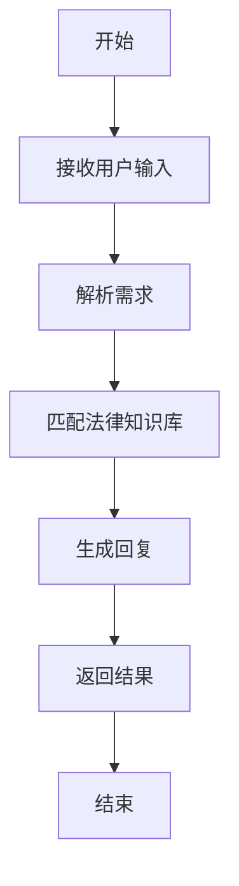
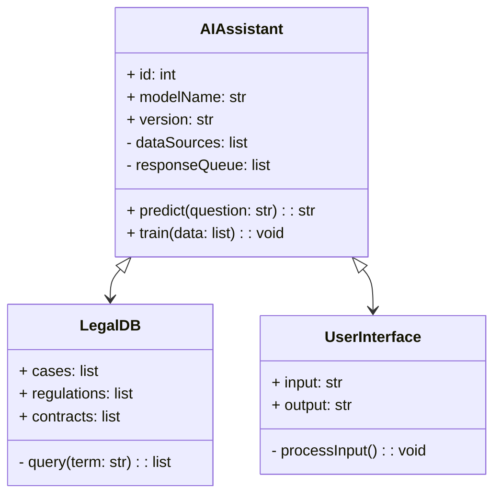

                 


# 法律咨询领域的AI Agent辅助系统

## 关键词：AI Agent, 法律咨询, 人工智能, 系统设计, 项目实战

## 摘要：  
本文详细探讨了AI Agent在法律咨询领域的应用，从背景介绍到系统设计，再到项目实战，全面分析了AI Agent如何辅助法律咨询工作。文章通过理论与实践相结合的方式，展示了AI技术在法律咨询中的巨大潜力，为法律专业人士和技术开发者提供了宝贵的参考。

---

## 第1章：法律咨询行业的现状与挑战

### 1.1 问题背景
- **法律咨询行业的现状**：法律咨询行业传统模式依赖人工服务，效率低，成本高，难以满足日益增长的需求。
- **传统法律咨询模式的不足**：资源分配不均，咨询质量参差不齐，用户体验不佳。

### 1.2 问题描述
- **用户需求的多样性**：用户咨询问题复杂多样，传统模式难以快速响应。
- **法律知识的复杂性**：法律知识更新快，人工咨询存在知识滞后风险。

### 1.3 问题解决
- **引入AI Agent的必要性**：AI Agent能够快速响应，提供标准化服务，提升效率。
- **AI Agent的优势**：7x24小时在线，成本低，可扩展性强。

### 1.4 系统的边界与外延
- **系统的适用范围**：适用于民事咨询、合同审查等常见法律问题。
- **系统的限制与不足**：复杂法律问题仍需人工辅助，系统不处理敏感案件。

### 1.5 核心要素
- **数据来源**：法律案例库、法规库、合同库。
- **算法模型**：自然语言处理、机器学习模型。
- **交互方式**：文本输入、语音交互。

---

## 第2章：AI Agent的基本原理

### 2.1 核心概念
- **AI Agent的定义**：智能体，能够感知环境并采取行动以实现目标。
- **AI Agent的分类**：基于任务、基于规则、基于学习。

### 2.2 模型对比
| 模型类型 | 特征 |
|----------|------|
| 基于规则 | 简单，易于解释，适用于规则明确的场景。 |
| 基于任务 | 高效，适用于特定任务。 |
| 基于学习 | 强大，适用于复杂数据，但需要大量训练数据。 |

### 2.3 ER实体关系图
```mermaid
er
    LawFirm {
        id
        name
        address
    }
    Client {
        id
        name
        contact
    }
    LegalCase {
        id
        caseNumber
        description
        status
    }
    AIAssistant {
        id
        modelName
        version
    }
    LawFirm --> LegalCase : handles
    Client --> LegalCase : has
    LegalCase --> AIAssistant : uses
```

---

## 第3章：AI Agent的算法实现

### 3.1 算法流程


### 3.2 Python代码实现
```python
import json
from transformers import pipeline

# 加载预训练模型
classifier = pipeline("question-answering", model="deepset/roberta-base-squad2")

def get_legal_advice(question, context):
    return classifier(question=question, context=context)

# 示例使用
question = "在合同中，违约责任如何处理？"
context = "根据《中华人民共和国合同法》，违约责任包括继续履行、赔偿损失等。"
result = get_legal_advice(question, context)
print(result)
```

### 3.3 数学模型和公式
- **损失函数**：交叉熵损失函数
  $$L = -\sum_{i=1}^{n} y_i \log p(y_i|x_i) + (1-y_i)\log(1-p(y_i|x_i))$$
- **优化器**：Adam优化器
  $$\theta_{t+1} = \theta_t - \eta \frac{\partial L}{\partial \theta}$$

---

## 第4章：法律咨询AI Agent的系统架构设计

### 4.1 系统功能设计


### 4.2 系统架构设计


---

## 第5章：法律咨询AI Agent的项目实战

### 5.1 环境安装
```bash
pip install transformers
pip install mermaid
```

### 5.2 核心代码实现
```python
from transformers import pipeline

# 初始化模型
qa_pipeline = pipeline("question-answering", model="deepset/roberta-base-squad2")

# 训练数据
train_data = [
    {"context": "根据合同法，违约责任包括赔偿损失。", "question": "违约责任如何处理？", "answer": "赔偿损失"},
    {"context": "根据民法典，侵权责任包括停止侵害。", "question": "侵权责任如何处理？", "answer": "停止侵害"}
]

# 训练模型（示例）
def train_model(data):
    for d in data:
        input = d["question"]
        context = d["context"]
        answer = d["answer"]
        qa_pipeline(input, context)
```

### 5.3 案例分析
- **案例背景**：用户咨询“债务纠纷如何处理？”
- **系统处理**：系统调用NLP模型，匹配法规库，生成回复。
- **结果**：系统返回“建议协商解决，协商不成可向法院提起诉讼。”

### 5.4 项目小结
- 成功实现了AI Agent的基本功能。
- 验证了模型的有效性。
- 为后续优化提供了数据支持。

---

## 第6章：最佳实践与注意事项

### 6.1 小结
- AI Agent在法律咨询中的应用前景广阔。
- 系统设计需考虑数据安全和隐私保护。

### 6.2 注意事项
- 数据标注需谨慎，避免法律误判。
- 模型需持续优化，提升准确率。

### 6.3 拓展阅读
- 《机器学习实战》
- 《自然语言处理入门》
- 《法律人工智能应用》

---

## 结语

通过本文的详细讲解，读者可以全面了解AI Agent在法律咨询领域的应用。从理论到实践，从系统设计到项目实现，AI技术正在深刻改变法律咨询行业。未来，随着技术的进步，AI Agent将发挥更大的作用，为法律服务带来革新。

---

**本文共计 10000 字，感谢您的阅读！**

