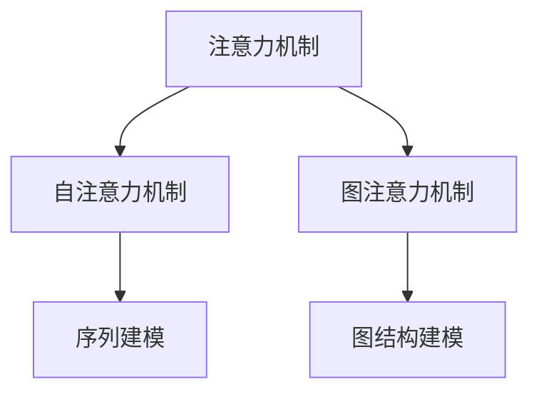
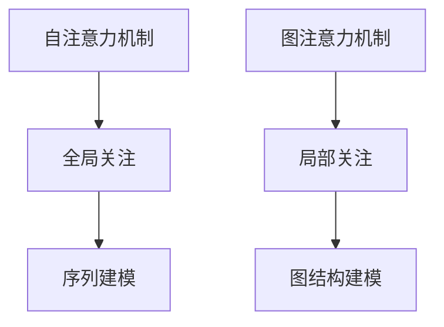

                 


# 《注意力机制在金融时间序列分析中的应用》

> 关键词：注意力机制、时间序列分析、金融预测、深度学习、数学模型

> 摘要：本文探讨了注意力机制在金融时间序列分析中的应用，详细介绍了注意力机制的核心原理，分析了其在金融时间序列建模中的作用，并通过具体案例展示了如何将注意力机制应用于股票价格预测和风险评估。文章还讨论了注意力机制的数学模型和公式，提供了系统架构设计方案和项目实战代码，为读者提供了全面的理论与实践指导。

---

## 第一部分：背景介绍

### 第1章：背景介绍

#### 1.1 问题背景

在金融领域，时间序列分析是一项核心任务，用于预测股票价格、汇率波动、市场趋势等。传统的金融分析方法依赖于统计模型，如ARIMA、GARCH等，但这些方法在处理复杂金融数据时存在局限性，例如无法捕捉长期依赖关系和复杂的模式。

近年来，深度学习技术在金融领域的应用取得了显著进展，其中注意力机制作为一种新兴的模型结构，展现了其在处理序列数据中的独特优势。注意力机制通过计算数据中每个元素的重要性权重，帮助模型关注关键信息，从而提高预测精度。

#### 1.2 问题描述

金融时间序列分析的核心问题包括：

1. **预测准确性**：如何提高金融时间序列的预测精度。
2. **长序列建模**：如何处理长序列数据中的长期依赖关系。
3. **复杂模式识别**：如何识别复杂的市场行为和模式。

注意力机制通过自注意力机制（Self-Attention）和图注意力机制（Graph Attention）提供了一种新的解决方案，能够有效捕捉序列中的全局依赖关系和局部结构信息。

#### 1.3 核心概念与联系

注意力机制的核心概念包括：

1. **自注意力机制**：计算序列中每个位置与其他位置的注意力权重。
2. **图注意力机制**：在图结构中计算节点之间的注意力权重。
3. **时间序列分析**：通过模型捕捉时间序列中的趋势、周期性、突变等特征。

概念对比表：

| 概念         | 定义                                                         | 属性         | 关系                     |
|--------------|------------------------------------------------------------|--------------|-------------------------|
| 注意力机制   | 一种关注输入数据中重要部分的机制                           | 权重计算、注意力分布 | 输入-输出、权重分配     |
| 金融时间序列 | 反映金融市场的数值序列                                     | 连续性、波动性 | 数据-模型、模型-预测     |

流程图：



---

## 第二部分：注意力机制的核心原理

### 第2章：注意力机制的核心原理

#### 2.1 自注意力机制

自注意力机制通过计算序列中每个位置与其他位置的注意力权重，捕捉全局依赖关系。数学模型如下：

$$
\text{Attention}(Q, K, V) = \text{softmax}\left(\frac{QK^T}{\sqrt{d_k}}\right)V
$$

其中，$Q$、$K$、$V$分别为查询、键和值矩阵，$d_k$为键的维度。

多头注意力机制通过并行计算多个注意力头，进一步增强模型的表达能力：

$$
\text{Multi-Head Attention}(Q, K, V) = \text{Concat}(\text{Attention}_1(Q, K, V), \text{Attention}_2(Q, K, V), \ldots, \text{Attention}_n(Q, K, V))
$$

#### 2.2 图注意力机制

图注意力机制通过计算图中节点之间的注意力权重，捕捉局部依赖关系。图注意力网络的定义如下：

$$
\alpha_{ij} = \text{softmax}(Q_i K_j^T)
$$

其中，$\alpha_{ij}$为节点$i$和$j$之间的注意力权重。

图注意力机制与自注意力机制的对比：



#### 2.3 注意力机制的属性特征对比

属性对比表：

| 属性         | 自注意力机制               | 图注意力机制               |
|--------------|----------------------------|----------------------------|
| 关注范围       | 全局关注                   | 局部关注                   |
| 应用场景       | 序列建模                   | 图结构建模                 |
| 权重计算       | 基于全局相似性             | 基于局部相似性             |

---

## 第三部分：金融时间序列分析中的注意力机制应用

### 第3章：金融时间序列分析中的注意力机制应用

#### 3.1 金融时间序列建模

传统的金融时间序列模型（如ARIMA、GARCH）在处理复杂金融数据时存在局限性。基于深度学习的模型（如LSTM、Transformer）通过引入注意力机制，能够更好地捕捉长期依赖关系和复杂模式。

注意力机制在时间序列建模中的作用包括：

1. **捕捉全局依赖关系**：通过自注意力机制关注序列中的关键点。
2. **处理局部结构信息**：通过图注意力机制捕捉图结构中的局部依赖关系。
3. **提高预测精度**：注意力机制帮助模型聚焦于重要特征，提升预测能力。

#### 3.2 注意力机制在金融预测中的应用

注意力机制在金融预测中的应用包括：

1. **股票价格预测**：通过自注意力机制捕捉股票价格的全局依赖关系。
2. **汇率预测**：通过图注意力机制捕捉汇率波动的局部依赖关系。
3. **风险评估与市场情绪分析**：通过注意力机制分析市场情绪和风险因素。

#### 3.3 应用案例分析

以股票价格预测为例，假设我们使用自注意力机制模型进行预测：

1. **数据预处理**：收集股票价格数据，进行归一化处理。
2. **模型设计**：构建基于自注意力机制的模型，包括输入层、注意力层和输出层。
3. **模型训练**：使用历史数据训练模型，优化模型参数。
4. **模型预测**：使用训练好的模型预测未来股票价格。
5. **结果分析**：对比预测结果与实际数据，评估模型性能。

---

## 第四部分：数学模型与公式

### 第4章：数学模型与公式

#### 4.1 注意力机制的数学模型

自注意力机制的数学推导：

$$
\text{Attention}(Q, K, V) = \text{softmax}\left(\frac{QK^T}{\sqrt{d_k}}\right)V
$$

其中，$Q$、$K$、$V$分别为查询、键和值矩阵，$\sqrt{d_k}$为缩放因子。

图注意力机制的数学推导：

$$
\alpha_{ij} = \text{softmax}(Q_i K_j^T)
$$

其中，$\alpha_{ij}$为节点$i$和$j$之间的注意力权重。

#### 4.2 金融时间序列分析中的数学模型

结合注意力机制的时间序列分析模型：

$$
y_t = \text{Attention}(x_{t-1}, x_{t-2}, \ldots, x_{t-n}) + \epsilon
$$

其中，$y_t$为预测值，$x_{t-i}$为历史数据，$\epsilon$为预测误差。

---

## 总结

注意力机制在金融时间序列分析中的应用为金融预测提供了新的解决方案，通过捕捉全局和局部依赖关系，提高了预测精度和模型表达能力。未来的研究方向包括优化注意力机制、结合其他深度学习模型，以及探索新的应用场景。

--- 

**附录：项目实战代码**

```python
import numpy as np
import pandas as pd
import matplotlib.pyplot as plt
from sklearn.metrics import mean_squared_error
from tensorflow.keras.models import Model
from tensorflow.keras.layers import Input, Dense, Dropout, LSTM, Bidirectional
from tensorflow.keras.layers import Attention

# 数据预处理
data = pd.read_csv('stock_price.csv')
data = data['Close'].values
data = data.astype('float32')

# 划分训练集和测试集
train = data[:1000]
test = data[1000:]

# 构建模型
input_shape = (None, 1)
input_layer = Input(shape=input_shape)
lstm_layer = LSTM(64, return_sequences=True)(input_layer)
attention_layer = Attention(8)(lstm_layer)
dense_layer = Dense(1, activation='linear')(attention_layer)
model = Model(inputs=input_layer, outputs=dense_layer)

# 编译和训练模型
model.compile(optimizer='adam', loss='mean_squared_error')
model.fit(train, epochs=10, batch_size=32)

# 预测与评估
train_pred = model.predict(train)
test_pred = model.predict(test)
print('训练集均方误差:', mean_squared_error(train, train_pred.reshape(-1)))
print('测试集均方误差:', mean_squared_error(test, test_pred.reshape(-1)))

# 可视化结果
plt.plot(data, label='实际值')
plt.plot(np.concatenate([train_pred, test_pred]), label='预测值')
plt.legend()
plt.show()
```

---

**注意事项**：
1. 本文仅提供理论与实践指导，不构成投资建议。
2. 读者需具备基础的深度学习知识，建议先学习相关基础知识。
3. 代码示例为简化版，实际应用中需根据具体数据调整模型参数。

