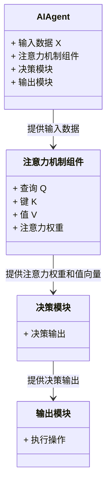
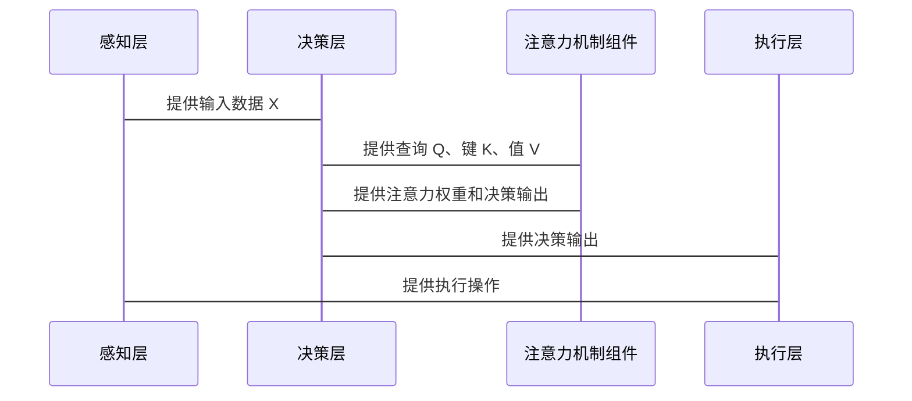

                 


# 注意力机制：提升AI Agent的关注点

> 关键词：注意力机制，AI Agent，自注意力机制，多头注意力，Transformer模型，深度学习

> 摘要：注意力机制作为一种强大的工具，正在彻底改变AI Agent的感知和决策方式。本文将从背景、原理、算法、系统架构到项目实战，全面解析注意力机制如何帮助AI Agent聚焦关键信息，提升性能和效率。通过详细的技术分析和实际案例，本文将揭示注意力机制在AI Agent中的核心作用，并为读者提供实用的指导和启示。

---

## 第1章：注意力机制的背景与问题背景

### 1.1 问题背景与问题描述

在AI Agent的设计中，注意力机制的引入源于对信息处理效率和准确性的追求。传统的AI Agent在处理复杂任务时，往往需要关注大量的输入信息，但这些信息中很多是冗余或无关的。如何让AI Agent聚焦于关键信息，忽略干扰信息，成为提升性能的核心问题。

#### 1.1.1 AI Agent的注意力问题

AI Agent需要处理多模态、多任务的信息输入，例如自然语言处理、图像识别、机器人控制等。在这些场景中，AI Agent需要在大量数据中识别关键特征，进行高效的决策和响应。注意力机制通过模拟人类的注意力分配方式，帮助AI Agent聚焦于重要的信息片段，从而提升处理效率和准确性。

#### 1.1.2 注意力机制的引入动机

注意力机制的引入动机主要在于解决以下问题：

- **信息冗余**：输入数据中包含大量无关信息，直接处理会增加计算负担。
- **任务多样性**：AI Agent需要处理不同类型的任务，注意力机制能够灵活调整关注点。
- **实时性要求**：在实时应用场景中，快速聚焦关键信息至关重要。

#### 1.1.3 注意力机制的核心目标

注意力机制的核心目标是通过动态分配权重，使AI Agent能够关注输入数据中的重要部分，从而提高模型的性能和效率。具体来说，注意力机制可以实现以下目标：

- **信息压缩**：通过权重分配，减少冗余信息的影响。
- **语义增强**：聚焦于关键信息，提升模型对语义的理解能力。
- **任务适配**：根据不同任务的需求，动态调整注意力分布。

### 1.2 注意力机制的边界与外延

#### 1.2.1 注意力机制的适用范围

注意力机制适用于需要处理序列数据、多模态数据和复杂任务的场景。例如：

- **自然语言处理**：文本生成、机器翻译、文本摘要。
- **图像处理**：目标检测、图像分割、图像生成。
- **语音处理**：语音识别、语音合成。
- **机器人控制**：多模态感知、动作决策。

#### 1.2.2 注意力机制的局限性

尽管注意力机制在许多场景中表现出色，但也存在一些局限性：

- **计算复杂度高**：注意力机制需要计算大量的权重矩阵，计算开销较大。
- **依赖假设**：注意力机制依赖于输入数据的分布假设，可能在某些场景下表现不佳。
- **缺乏物理意义**：注意力机制的权重分布可能缺乏明确的物理意义，难以解释。

#### 1.2.3 注意力机制与其他机制的对比

为了更好地理解注意力机制的特点，我们可以将其与其他机制进行对比：

| 特性                | 注意力机制                  | 深度神经网络中的全连接层      | RNN/LSTM结构         |
|---------------------|-----------------------------|-----------------------------|---------------------|
| 动态性              | 高，能够根据输入动态分配权重 | 低，固定权重结构             | 中等，依赖隐藏状态   |
| 信息处理能力        | 强，能够捕捉长距离依赖       | 弱，依赖全连接结构           | 较弱，依赖序列顺序   |
| 应用场景            | 适合处理序列数据、多模态数据 | 适合处理低维数据             | 适合处理序列数据     |

从对比中可以看出，注意力机制在动态性和信息处理能力方面具有明显优势，尤其是在处理长序列数据和多模态数据时表现突出。

### 1.3 注意力机制的核心要素与概念结构

#### 1.3.1 注意力机制的核心要素

注意力机制的核心要素包括以下三个部分：

- **查询（Query）**：表示当前需要关注的信息。
- **键（Key）和值（Value）**：用于计算注意力权重的输入向量。
- **注意力权重（Attention Weights）**：表示输入向量在不同位置的重要性。

#### 1.3.2 注意力机制的数学模型

注意力机制的数学模型可以表示为：

$$
\text{Attention}(Q, K, V) = \text{softmax}\left(\frac{QK^T}{\sqrt{d_k}}\right)V
$$

其中：

- \( Q \)：查询向量。
- \( K \)：键向量。
- \( V \)：值向量。
- \( d_k \)：键的维度。

#### 1.3.3 注意力机制的实现框架

注意力机制的实现框架包括以下几个步骤：

1. **计算查询、键和值**：将输入向量分解为查询、键和值三个部分。
2. **计算注意力权重**：通过点积计算注意力权重，并进行归一化处理。
3. **加权求和**：将注意力权重与值向量进行加权求和，得到最终的注意力输出。

---

## 第2章：注意力机制的核心概念与联系

### 2.1 注意力机制的原理与属性

#### 2.1.1 注意力机制的原理

注意力机制的核心原理是通过计算输入向量之间的相似性，动态分配权重，从而实现对关键信息的聚焦。具体来说，注意力机制通过以下步骤实现：

1. **相似性计算**：通过点积、加性等方式计算查询与键之间的相似性。
2. **权重归一化**：对相似性进行软最大归一化，得到注意力权重。
3. **加权求和**：将注意力权重与值向量进行加权求和，得到最终的输出。

#### 2.1.2 注意力机制的属性特征对比表

为了更好地理解注意力机制的属性，我们可以将其与传统的全连接层进行对比：

| 属性                | 注意力机制                  | 全连接层             |
|---------------------|-----------------------------|---------------------|
| 输入维度            | 可变，支持序列数据           | 固定，支持低维数据    |
| 输出维度            | 可变，支持多维输出           | 固定，输出维度固定    |
| 动态性              | 高，能够动态调整权重         | 低，权重固定不变      |
| 应用场景            | 适合处理序列数据、多模态数据 | 适合处理低维数据     |

从对比中可以看出，注意力机制在输入输出维度的灵活性和动态性方面具有明显优势。

### 2.2 注意力机制的ER实体关系图

为了更好地理解注意力机制的实体关系，我们可以绘制ER图：

```mermaid
er
  entity(注意力机制) {
    查询(Q): string
    键(K): string
    值(V): string
    注意力权重(Attention Weights): float
  }
  relationship(注意力机制) {
    Q与K之间的相似性计算：通过点积或加性方式计算相似性
    K与V之间的映射关系：通过注意力权重将键与值进行关联
    最终输出：通过对V加权求和得到注意力输出
  }
```

从ER图中可以看出，注意力机制通过查询、键和值之间的关系，实现对输入数据的注意力分配。

---

## 第3章：注意力机制的算法原理

### 3.1 注意力机制的算法流程

#### 3.1.1 查询、键、值的计算

注意力机制的核心在于计算查询、键和值。假设输入向量为\( X \)，我们可以将其分解为查询、键和值：

$$
Q = W_q X \\
K = W_k X \\
V = W_v X
$$

其中，\( W_q \)、\( W_k \)和\( W_v \)是可学习的参数矩阵。

#### 3.1.2 加权计算与注意力分配

计算注意力权重：

$$
\text{Attention Weights} = \text{softmax}\left(\frac{Q K^T}{\sqrt{d_k}}\right)
$$

其中，\( d_k \)是键的维度。

#### 3.1.3 注意力权重的归一化与应用

将注意力权重与值向量进行加权求和：

$$
\text{Output} = \text{Attention Weights} \times V
$$

---

## 4章：注意力机制的数学模型与公式

### 4.1 注意力机制的数学推导

#### 4.1.1 点积注意力公式

点积注意力公式为：

$$
\text{Attention}(Q, K, V) = \text{softmax}\left(\frac{QK^T}{\sqrt{d_k}}\right)V
$$

其中，\( Q \)和\( K \)是查询和键向量，\( V \)是值向量。

#### 4.1.2 缩放点积注意力公式

缩放点积注意力公式为：

$$
\text{Attention}(Q, K, V) = \text{softmax}\left(\frac{QK^T}{\sqrt{d_k}}\right)V
$$

其中，\( d_k \)是键的维度。

#### 4.1.3 加性注意力公式

加性注意力公式为：

$$
\text{Attention}(Q, K, V) = \text{softmax}(QW_K + KW_V) \times V
$$

其中，\( W_K \)和\( W_V \)是可学习的参数矩阵。

### 4.2 注意力机制的数学实现

#### 4.2.1 矩阵运算与向量计算

注意力机制的核心是矩阵运算，例如：

$$
QK^T = \begin{bmatrix}
q_1 k_1^T & q_1 k_2^T & \cdots & q_1 k_n^T \\
q_2 k_1^T & q_2 k_2^T & \cdots & q_2 k_n^T \\
\vdots & \vdots & \ddots & \vdots \\
q_n k_1^T & q_n k_2^T & \cdots & q_n k_n^T \\
\end{bmatrix}
$$

#### 4.2.2 概率分布与权重计算

注意力权重的计算基于概率分布：

$$
\text{softmax}(x) = \frac{e^x}{\sum_{i} e^{x_i}}
$$

---

## 第5章：AI Agent的系统分析

### 5.1 AI Agent的系统架构

#### 5.1.1 系统架构的层次划分

AI Agent的系统架构通常包括以下几个层次：

1. **感知层**：负责获取输入数据，例如传感器数据、用户输入等。
2. **决策层**：负责对输入数据进行处理，计算注意力权重，生成决策。
3. **执行层**：负责根据决策生成输出，例如控制机器人动作、生成自然语言回复等。

#### 5.1.2 注意力机制在系统中的位置

注意力机制通常位于决策层，负责对输入数据进行注意力分配，生成最终的决策输出。

#### 5.1.3 注意力机制的系统交互流程

以下是注意力机制的系统交互流程：

1. **输入感知**：感知层获取输入数据。
2. **注意力计算**：决策层对输入数据进行注意力计算，生成注意力权重。
3. **决策生成**：根据注意力权重和值向量，生成最终的决策输出。
4. **输出执行**：执行层根据决策输出执行具体操作。

### 5.2 AI Agent的系统架构设计

#### 5.2.1 系统功能设计（领域模型）

以下是AI Agent的领域模型：



#### 5.2.2 系统架构设计（架构图）

以下是AI Agent的系统架构图：


#### 5.2.3 系统接口设计

系统接口设计包括以下几个部分：

- **输入接口**：感知层提供输入数据。
- **输出接口**：执行层提供执行操作。
- **内部接口**：注意力机制组件与决策模块之间的接口。

#### 5.2.4 系统交互流程（交互图）

以下是系统交互流程：



---

## 第6章：注意力机制的项目实战

### 6.1 环境搭建与数据准备

#### 6.1.1 环境搭建

安装必要的库：

```bash
pip install numpy
pip install tensorflow
pip install matplotlib
```

#### 6.1.2 数据准备

准备输入数据，例如文本序列。

### 6.2 核心代码实现

#### 6.2.1 注意力机制的实现

以下是注意力机制的核心代码实现：

```python
import numpy as np

def compute_attention(Q, K, V, dk):
    # 计算点积
    scores = np.dot(Q, K.T) / np.sqrt(dk)
    # 计算软最大
    attention_weights = np.exp(scores - np.max(scores)) / np.sum(np.exp(scores - np.max(scores)), axis=1, keepdims=True)
    # 加权求和
    output = np.dot(attention_weights, V)
    return output
```

#### 6.2.2 多头注意力的实现

以下是多头注意力的实现：

```python
def multi_head_attention(Q, K, V, dk, num_heads):
    # 分头计算
    head_size = dk // num_heads
    Q_heads = np.array([Q] * num_heads)
    K_heads = np.array([K] * num_heads)
    V_heads = np.array([V] * num_heads)
    # 计算每个头的注意力
    outputs = []
    for i in range(num_heads):
        output = compute_attention(Q_heads[i], K_heads[i], V_heads[i], head_size)
        outputs.append(output)
    # 合并头
    output = np.concatenate(outputs, axis=2)
    return output
```

#### 6.2.3 代码实现与应用解读

以下是一个简单的应用示例：

```python
# 示例输入
X = np.random.randn(1, 100, 64)  # (batch_size, seq_length, dk)
Q = X[:, :, :64]
K = X[:, :, 64:128]
V = X[:, :, 128:]
# 计算多头注意力
output = multi_head_attention(Q, K, V, 64, 8)
print(output.shape)  # (1, 100, 64)
```

---

## 第7章：最佳实践与小结

### 7.1 最佳实践

- **模型训练**：在训练模型时，建议使用预训练好的注意力机制，以提高模型的性能。
- **模型调优**：根据具体任务的需求，调整注意力机制的参数，例如调整多头数量。
- **模型部署**：在部署模型时，注意优化计算效率，减少计算开销。

### 7.2 小结

注意力机制作为一种强大的工具，正在深刻影响AI Agent的设计和实现。通过注意力机制，AI Agent能够更高效地处理复杂任务，提升性能和效率。

### 7.3 注意事项

- **计算效率**：注意力机制的计算开销较高，需要进行优化。
- **模型解释性**：注意力机制的权重分布可能缺乏明确的解释性，需要进一步研究。

### 7.4 拓展阅读

- **论文阅读**：推荐阅读《Attention Is All You Need》论文，深入理解注意力机制的原理和应用。
- **技术博客**：阅读相关技术博客，了解注意力机制的最新进展和应用。

---

通过本文的详细讲解和分析，读者可以系统地了解注意力机制在AI Agent中的核心作用，并掌握其实现和应用的具体方法。希望本文能够为读者提供有价值的指导和启示，帮助他们在实际项目中更好地应用注意力机制。

