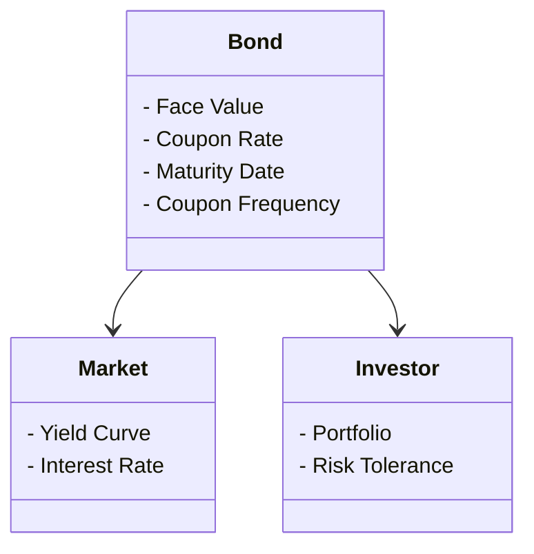
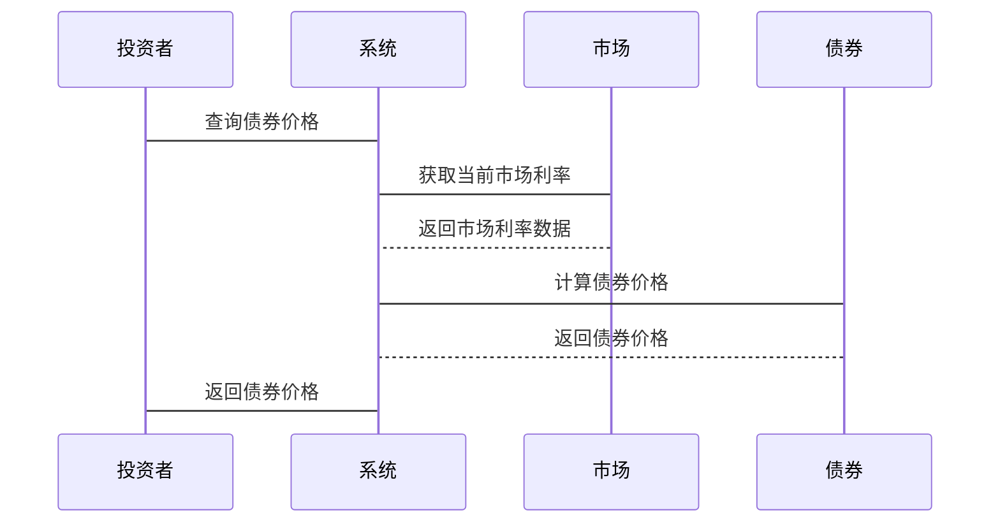

                 


# 浮动利率债券：应对利率上升的投资工具

> 关键词：浮动利率债券，利率上升，投资工具，债券定价，利率风险

> 摘要：本文深入探讨了浮动利率债券的定义、结构、定价原理及其在应对利率上升环境中的优势。通过详细分析浮动利率债券的核心概念、数学模型和系统架构，结合实际案例，为投资者提供科学的投资策略和风险管理方法。

---

# 第一部分：浮动利率债券的背景与重要性

## 第1章：浮动利率债券的背景与定义

### 1.1 利率上升的经济背景

#### 1.1.1 利率波动的经济周期
经济周期的波动直接影响利率水平。在经济复苏期，央行通常会降低基准利率以刺激经济增长；而在经济过热时，加息成为控制通胀的手段。当前全球经济环境下，利率波动尤为频繁，投资者需要寻找能够应对利率上升的有效工具。

#### 1.1.2 利率上升对投资的影响
利率上升会增加债务融资成本，同时影响债券价格。固定利率债券的持有人面临价格下跌的风险，而浮动利率债券的利率调整机制使其能够部分规避这种风险。

#### 1.1.3 浮动利率债券的兴起
随着全球利率环境的不确定性增加，浮动利率债券因其利率调整特性，逐渐成为投资者的热门选择。其结构设计能够在不同经济环境下保持资产的稳定性。

### 1.2 浮动利率债券的定义与特点

#### 1.2.1 浮动利率债券的基本定义
浮动利率债券是指利率根据市场变化定期调整的债券。其票面利率通常与基准利率挂钩，如伦敦银行间同业拆借利率（LIBOR）或国债收益率。

#### 1.2.2 浮动利率债券与固定利率债券的区别
- 利率调整机制：固定利率债券的票面利率固定，而浮动利率债券的票面利率定期调整。
- 利率风险：固定利率债券的利率风险较高，而浮动利率债券的利率风险较低。
- 适合场景：固定利率债券适合利率稳定的环境，而浮动利率债券适合利率上升的环境。

#### 1.2.3 浮动利率债券的优势与劣势
- 优势：利率调整机制使得债券持有人能够分享市场利率变化的收益，降低利率风险。
- 劣势：利率调整的频率和幅度可能影响债券的流动性，且复杂的结构可能导致更高的信用风险。

### 1.3 浮动利率债券的结构与类型

#### 1.3.1 浮动利率债券的结构分析
浮动利率债券的结构包括本金、票面利率、重定价周期和调整机制。其票面利率通常与基准利率挂钩，并定期进行调整。

#### 1.3.2 浮动利率债券的常见类型
- 次级债券：与LIBOR挂钩，常见于银行发行的债券。
- 可调整债券：根据市场指数定期调整票面利率。
- 累积债券：利息累积支付，到期一次性偿还本金和利息。

#### 1.3.3 不同类型浮动利率债券的适用场景
- 适用于短期利率上升的环境：选择与短期基准利率挂钩的浮动利率债券。
- 适用于长期利率上升的环境：选择与长期基准利率挂钩的浮动利率债券。

---

## 第2章：浮动利率债券的核心概念与原理

### 2.1 浮动利率债券的定价原理

#### 2.1.1 债券定价的基本公式
债券的市场价格等于其未来现金流的现值之和。对于浮动利率债券，其票面利率和本金需要根据当前市场利率进行折现。

#### 2.1.2 浮动利率债券的现金流分析
浮动利率债券的现金流包括定期支付的利息和到期偿还的本金。由于票面利率的调整，其利息支付金额会随市场利率变化而变化。

#### 2.1.3 利率变动对债券价格的影响
当市场利率上升时，固定利率债券的价格会下降，而浮动利率债券的票面利率调整机制可以部分抵消这种价格波动。

### 2.2 浮动利率债券的风险分析

#### 2.2.1 利率风险
利率风险是指市场利率变动导致债券价格波动的风险。浮动利率债券的利率调整机制可以降低利率风险。

#### 2.2.2 信用风险
信用风险是指债券发行人无法按时支付利息或偿还本金的风险。浮动利率债券的信用风险与其发行人的信用评级密切相关。

#### 2.2.3 流动性风险
流动性风险是指债券在二级市场中难以以合理价格变现的风险。浮动利率债券的流动性通常较低，尤其是复杂的结构化债券。

### 2.3 浮动利率债券的收益计算

#### 2.3.1 利息计算方法
浮动利率债券的利息计算基于当前市场利率和债券面值。其票面利率通常与基准利率挂钩，并定期进行调整。

#### 2.3.2 债券到期收益率的计算
债券到期收益率是投资者在整个债券持有期内获得的平均收益率。对于浮动利率债券，其到期收益率会随着市场利率的变化而变化。

#### 2.3.3 当前收益率与到期收益率的区别
当前收益率是债券当前市场价格下的收益率，而到期收益率是假设债券持有至到期时的平均收益率。两者在固定利率和浮动利率债券中的计算有所不同。

---

## 第3章：浮动利率债券的数学模型与定价公式

### 3.1 浮动利率债券的定价模型

#### 3.1.1 利率期限结构的假设
利率期限结构描述了不同期限债券的收益率关系。浮动利率债券的定价通常假设利率期限结构是线性的或基于某种收益率曲线模型。

#### 3.1.2 浮动利率债券的定价公式
浮动利率债券的市场价格可以通过以下公式计算：

$$
P = \sum_{t=1}^{n} \frac{C_t}{(1 + r_t)^t} + \frac{F}{(1 + r_n)^n}
$$

其中，\(C_t\) 是第 \(t\) 期的利息支付，\(F\) 是债券面值，\(r_t\) 是第 \(t\) 期的市场利率。

#### 3.1.3 市场利率变动对债券价格的影响
市场利率上升会导致债券价格下降，而浮动利率债券的票面利率调整可以部分抵消这种影响。

### 3.2 利率风险的量化方法

#### 3.2.1 久期的概念与计算
久期衡量了债券价格对利率变动的敏感性。浮动利率债券的久期通常较短，因为其票面利率的调整可以减少价格波动。

#### 3.2.2 凸性的定义与作用
凸性衡量了债券价格对利率变动的非线性反应。浮动利率债券的凸性较高，因为其票面利率的调整可以在利率上升时减少价格下降幅度。

#### 3.2.3 利用久期和凸性进行利率风险分析
通过计算债券的久期和凸性，投资者可以更好地理解和管理浮动利率债券的利率风险。

### 3.3 浮动利率债券的数学模型

#### 3.3.1 债券价格与利率的关系公式
债券价格与利率之间存在反向关系。浮动利率债券的价格波动较小，因为其票面利率的调整可以部分抵消市场利率变化的影响。

#### 3.3.2 久期的计算公式
久期的计算公式为：

$$
\text{久期} = -\frac{P}{\Delta y} \frac{\Delta P}{P}
$$

其中，\(P\) 是债券价格，\(\Delta y\) 是利率变化，\(\Delta P\) 是债券价格的变化。

#### 3.3.3 凸性的计算公式
凸性的计算公式为：

$$
\text{凸性} = \frac{1}{2} \left( \frac{\partial^2 P}{\partial y^2} \right)
$$

凸性反映了债券价格对利率变化的二阶导数，用于衡量债券价格对利率变动的非线性反应。

---

## 第4章：浮动利率债券的系统分析与架构设计

### 4.1 系统功能设计

#### 4.1.1 领域模型


#### 4.1.2 系统架构设计
```mermaid
rect
   分区1: 债券发行方
   分区2: 市场环境
   分区3: 投资者
   分区4: 债券交易市场
    分区1 --> 分区2: 发布债券信息
    分区2 --> 分区3: 提供市场利率数据
    分区3 --> 分区4: 进行债券交易
    分区4 --> 分区1: 更新债券价格
```

### 4.2 系统接口设计

#### 4.2.1 投资者端接口
- 获取当前市场利率
- 计算债券价格
- 下单交易

#### 4.2.2 市场端接口
- 提供市场利率数据
- 更新债券价格
- 处理交易订单

### 4.3 系统交互设计

#### 4.3.1 投资者查询债券价格


---

## 第5章：浮动利率债券的项目实战

### 5.1 环境安装

#### 5.1.1 Python环境安装
安装Python和必要的金融分析库，如Pandas和NumPy。

#### 5.1.2 数据获取
获取历史市场利率数据和债券信息。

### 5.2 核心实现

#### 5.2.1 利率计算
编写Python代码计算浮动利率债券的票面利率和市场价格。

```python
import pandas as pd
import numpy as np

def calculate_float_rate_bond(price, face_value, coupon_frequency, market_rate):
    n_periods = coupon_frequency * face_value
    coupon_payments = [face_value * market_rate / coupon_frequency for _ in range(n_periods)]
    coupon_payments.append(face_value)
    present_value = np.npv(market_rate / coupon_frequency, coupon_payments)
    return present_value

# 示例计算
face_value = 1000
coupon_frequency = 2  # 每年付息两次
market_rate = 0.05  # 市场利率为5%

bond_price = calculate_float_rate_bond(1000, face_value, coupon_frequency, market_rate)
print("债券价格为：", bond_price)
```

#### 5.2.2 久期和凸性计算
编写Python代码计算债券的久期和凸性。

```python
def calculate_duration(price, face_value, coupon_rate, market_rate, periods):
    cash_flows = [face_value * coupon_rate / periods for _ in range(periods)]
    cash_flows.append(face_value)
    durations = []
    for t in range(1, periods + 1):
        duration = t * (cash_flows[t] / (1 + market_rate / periods)**t) / price
        durations.append(duration)
    return sum(durations)

def calculate_convexity(price, face_value, coupon_rate, market_rate, periods, delta=0.0001):
    cash_flows = [face_value * coupon_rate / periods for _ in range(periods)]
    cash_flows.append(face_value)
    convexity = 0
    for t in range(1, periods + 1):
       久期变化 = (calculate_duration(price, face_value, coupon_rate, market_rate + delta, periods) - calculate_duration(price, face_value, coupon_rate, market_rate, periods))
        convexity += (久期变化 / (market_rate**2 * delta**2)) * (cash_flows[t] / (1 + market_rate / periods)**t) / price
    return convexity

# 示例计算
face_value = 1000
coupon_rate = 0.05
market_rate = 0.05
periods = 10

duration = calculate_duration(1000, face_value, coupon_rate, market_rate, periods)
convexity = calculate_convexity(1000, face_value, coupon_rate, market_rate, periods)
print("久期为：", duration)
print("凸性为：", convexity)
```

---

## 第6章：最佳实践与注意事项

### 6.1 投资策略

#### 6.1.1 利率上升环境下的投资策略
- 选择与短期基准利率挂钩的浮动利率债券。
- 分散投资，降低单一债券的风险。

#### 6.1.2 利率下降环境下的投资策略
- 选择与长期基准利率挂钩的浮动利率债券。
- 考虑固定利率债券和浮动利率债券的组合。

### 6.2 风险管理

#### 6.2.1 利率风险管理
- 使用久期和凸性分析工具，量化利率风险。
- 定期调整投资组合，保持合理的久期匹配。

#### 6.2.2 信用风险管理
- 选择高信用评级的浮动利率债券。
- 分散投资于不同发行人的债券，降低信用风险。

### 6.3 操作技巧

#### 6.3.1 定期监控市场利率
- 使用金融数据平台，实时获取市场利率数据。
- 分析利率趋势，调整投资策略。

#### 6.3.2 合理配置资产
- 根据市场环境和个人风险承受能力，合理配置固定利率和浮动利率债券的比例。

### 6.4 小结

通过合理配置浮动利率债券，投资者可以在利率上升的环境中保护资产价值，同时利用利率调整机制获取稳定收益。然而，投资者需要充分了解浮动利率债券的结构和风险，并结合市场环境和个人需求制定科学的投资策略。

### 6.5 注意事项

- 浮动利率债券的流动性通常较低，尤其是在市场波动较大的情况下。
- 投资者需要关注债券发行人的信用评级，避免因发行人违约而造成损失。
- 在选择浮动利率债券时，应充分考虑其与投资目标和风险承受能力的匹配程度。

### 6.6 拓展阅读

- 建议投资者进一步阅读《固定收益证券：工具分析与风险管理》（Bond Markets, Public Finance, and the Macroeconomy）等书籍，深入了解债券市场的运作机制。
- 关注权威金融机构发布的债券市场研究报告，获取最新的市场分析和投资建议。

---

通过以上分析，投资者可以更好地理解浮动利率债券的特性、定价机制和风险管理方法，并能够在实际投资中灵活运用这些知识，应对复杂的市场环境。

