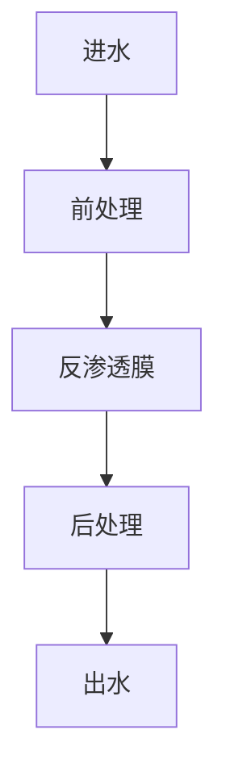
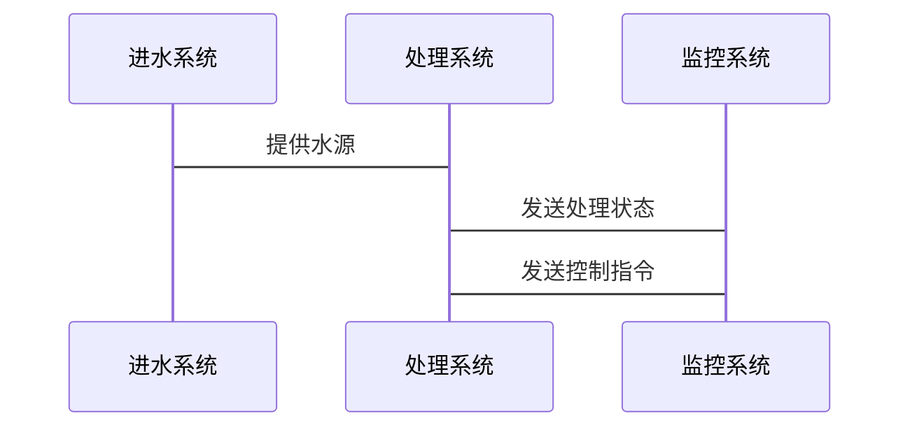

                 


# 海水淡化技术进步与水资源投资机会

## 关键词：海水淡化，水资源，投资机会，反渗透，蒸馏，系统架构

## 摘要：海水淡化技术在解决全球水资源短缺问题中发挥着重要作用。本文详细探讨了海水淡化技术的最新进展，分析了其在水资源管理中的潜力，并为投资者提供了进入该领域的机会。通过分析反渗透和蒸馏技术的核心原理，以及系统架构设计和经济评估，本文为海水淡化的未来发展提供了有价值的见解。

---

# 第1章: 海水淡化技术概述

## 1.1 海水淡化的背景与意义

### 1.1.1 全球水资源短缺现状

全球水资源分布不均，淡水仅占约2.5%。随着人口增长和工业发展，淡水需求急剧上升，导致许多地区面临水资源短缺问题。海水作为地球最丰富的水源，通过海水淡化技术可以为人类提供可靠的水资源。

### 1.1.2 海水淡化的定义与目标

海水淡化是指从海水中去除盐分和其他杂质，生产出可饮用水的过程。其目标是通过技术创新降低成本，提高效率，使海水淡化的水能够经济可行地供给人类使用。

### 1.1.3 海水淡化的社会与经济价值

海水淡化技术可以缓解水资源短缺，支持农业、工业和生活用水需求，特别是在干旱和半干旱地区具有重要意义。此外，海水淡化还可以促进经济发展，创造就业机会，并提升国家水资源安全。

---

## 1.2 海水淡化的技术路线

### 1.2.1 反渗透技术

反渗透（RO）是当前最常用的海水淡化技术之一。通过半透膜过滤，反渗透可以有效去除水中的盐分和杂质。其优点是成本低、能耗相对较低，适合大规模应用。

### 1.2.2 蒸馏技术

蒸馏技术通过加热海水产生水蒸气，再冷凝成水。其优点是处理后的水纯度高，但能耗较高，适合用于需要高纯水的场景。

### 1.2.3 电渗析技术

电渗析通过电场作用，利用离子交换膜分离盐分和水。其优点是能耗较低，适合处理低盐度的海水。

---

## 1.3 海水淡化技术的发展趋势

### 1.3.1 技术创新方向

未来，海水淡化技术将朝着更加高效、低能耗的方向发展。例如，新型膜材料和能量回收技术的应用将显著降低运行成本。

### 1.3.2 成本下降趋势

随着技术的进步和规模化生产，海水淡化的成本正在逐步下降，使其在经济上更具竞争力。

### 1.3.3 市场需求预测

预计未来几年，全球海水淡化市场的年复合增长率将保持在较高水平，特别是在中东、北非和亚洲地区。

---

## 1.4 本章小结

本章介绍了海水淡化的背景和意义，分析了主要技术路线及其特点，探讨了未来的技术发展趋势和市场需求。海水淡化技术的进步将为解决全球水资源短缺问题提供重要支持。

---

# 第2章: 海水淡化技术的核心原理

## 2.1 海水淡化的物理化学基础

### 2.1.1 水分子的渗透特性

水分子具有渗透性，能够通过半透膜从低浓度溶液流向高浓度溶液。反渗透技术利用这一特性，通过施加压力迫使水分子穿过膜，从而去除盐分。

### 2.1.2 盐分的分离机制

盐分的分离主要依赖于膜的孔径大小和电化学特性。反渗透膜的孔径足够小，能够阻止盐分通过，从而实现脱盐。

---

## 2.2 反渗透技术的数学模型

### 2.2.1 反渗透过程的数学表达

反渗透的渗透通量（flux）可以通过以下公式计算：

$$ J = -A \cdot \ln\left(1 + \frac{C_s}{C_0}\right) $$

其中，$A$ 是通量系数，$C_s$ 是盐水侧的盐浓度，$C_0$ 是进水侧的盐浓度。

### 2.2.2 流动效率的计算公式

反渗透系统的流动效率可以通过以下公式表示：

$$ Q = A \cdot \Delta P $$

其中，$Q$ 是流量，$A$ 是面积，$\Delta P$ 是压力差。

---

## 2.3 蒸馏技术的能量转换

### 2.3.1 蒸馏过程中的能量损失

蒸馏过程中，水需要加热到沸点，产生水蒸气，再冷凝成水。这一过程中的能量损失主要来自于热量散失和过程中的摩擦损失。

### 2.3.2 能量利用效率的提升方法

通过优化加热和冷凝过程，使用高效换热器和绝热技术，可以显著提高能量利用效率。

---

## 2.4 技术对比分析

### 2.4.1 不同技术的成本对比

| 技术类型 | 初始成本 | 运行成本 |
|----------|----------|----------|
| 反渗透   | 中等      | 较低      |
| 蒸馏     | 较高      | 较高      |
| 电渗析   | 较低      | 中等      |

### 2.4.2 技术优缺点对比表格

| 技术类型 | 优点                     | 缺点                     |
|----------|--------------------------|--------------------------|
| 反渗透   | 成本低，效率高             | 易受污染，维护成本高       |
| 蒸馏     | 出水纯度高                 | 能耗高，设备复杂           |
| 电渗析   | 节能，适合低盐度海水       | 适用于特定场景             |

---

## 2.5 本章小结

本章详细讲解了海水淡化的物理化学基础，分析了反渗透和蒸馏技术的核心原理，并通过对比分析展示了不同技术的优缺点。理解这些原理有助于更好地选择和优化海水淡化技术。

---

# 第3章: 海水淡化系统的架构设计

## 3.1 系统功能模块

### 3.1.1 前处理模块

前处理模块包括过滤、沉淀等步骤，用于去除海水中的悬浮颗粒和其他杂质。

### 3.1.2 处理核心模块

处理核心模块是系统的核心，包括反渗透膜或蒸馏装置，负责去除盐分和杂质。

### 3.1.3 后处理模块

后处理模块用于对处理后的水进行进一步净化和调节，确保出水符合水质要求。

---

## 3.2 系统架构设计

### 3.2.1 概念结构图



### 3.2.2 实体关系图

```mermaid
erd
    海水淡化工厂 --| 拥有 |--> 处理系统
    处理系统 --| 包含 |--> 反渗透膜
    处理系统 --| 包含 |--> 蒸馏装置
```

---

## 3.3 接口设计

### 3.3.1 进水与出水接口

进水接口负责接收海水，出水接口负责输出淡化水。

### 3.3.2 控制系统的接口

控制系统通过传感器和执行器与处理系统交互，实现自动化控制。

---

## 3.4 交互设计

### 3.4.1 系统流程图


### 3.4.2 系统序列图



---

## 3.5 本章小结

本章通过系统架构设计，展示了海水淡化系统的整体结构和各模块的功能关系。通过概念图、实体关系图和交互设计，明确了系统的各个部分及其相互关系。

---

# 第4章: 海水淡化技术的经济分析

## 4.1 投资成本分析

### 4.1.1 初始投资

初始投资包括设备采购、设施建设和其他前期费用。反渗透技术的初始投资相对较低，而蒸馏技术的初始投资较高。

### 4.1.2 运行维护成本

运行维护成本包括能源消耗、化学品费用和设备维护费用。反渗透技术的运行成本较低，但维护费用较高。

---

## 4.2 经济效益评估

### 4.2.1 水价模型

水价模型可以根据成本和市场需求进行调整：

$$ \text{水价} = \frac{\text{总成本}}{\text{水量}} + \text{利润} $$

### 4.2.2 投资回报率

投资回报率（ROI）可以通过以下公式计算：

$$ ROI = \frac{\text{净利润}}{\text{初始投资}} \times 100\% $$

---

## 4.3 本章小结

本章通过经济分析，探讨了海水淡化技术的投资成本和经济效益。水价模型和投资回报率的计算为投资者提供了决策依据。

---

# 第5章: 项目实战——建设一个海水淡化厂

## 5.1 环境要求

### 5.1.1 地理位置选择

选择靠近水源且电力供应充足的地点。

### 5.1.2 设备选型

根据需求选择合适的反渗透或蒸馏设备。

---

## 5.2 核心代码实现

### 5.2.1 进水处理代码

```python
def preprocess_water(in_water):
    # 过滤悬浮颗粒
    filtered = filter悬浮颗粒(in_water)
    # 沉淀处理
    settled = settle(filtered)
    return settled
```

### 5.2.2 处理核心代码

```python
def reverse_osmosis(filtered_water):
    # 施加压力
    pressurized = apply_pressure(filtered_water)
    # 通过反渗透膜
    permeate = pass_through_membrane(pressurized)
    return permeate
```

### 5.2.3 后处理代码

```python
def postprocess(permeate):
    # 调节pH值
    adjusted = adjust_ph(permeate)
    # 加药处理
    treated = add chemicals(adjusted)
    return treated
```

---

## 5.3 案例分析

### 5.3.1 项目背景

某海岛地区缺水严重，决定建设一个反渗透海水淡化厂。

### 5.3.2 实施过程

包括设备采购、设施建设、调试运行等步骤。

### 5.3.3 经验总结

通过项目实施，验证了反渗透技术的可行性和经济性。

---

## 5.4 本章小结

本章通过一个实际案例，详细讲解了海水淡化厂的建设过程。核心代码和案例分析为读者提供了实践指导。

---

# 第6章: 最佳实践与投资机会

## 6.1 投资机会分析

### 6.1.1 市场需求

随着水资源短缺问题加剧，海水淡化市场前景广阔。

### 6.1.2 技术选择

根据具体需求选择合适的技术，反渗透适用于大规模应用，蒸馏适用于高纯水需求。

---

## 6.2 小结

总结全文，强调海水淡化技术的重要性和投资机会。

## 6.3 注意事项

### 6.3.1 技术风险

技术更新快，需及时跟进最新进展。

### 6.3.2 经济风险

成本和能源价格波动可能影响盈利能力。

---

## 6.4 拓展阅读

推荐相关书籍和研究报告，供读者深入学习。

---

# 结语

海水淡化技术的进步为解决全球水资源短缺问题提供了重要途径。通过技术创新和经济分析，海水淡化技术的投资价值日益凸显。未来，随着技术的进一步发展，海水淡化将在更多领域得到应用，为人类可持续发展做出贡献。

---

# 参考文献

（此处列出相关参考文献）

